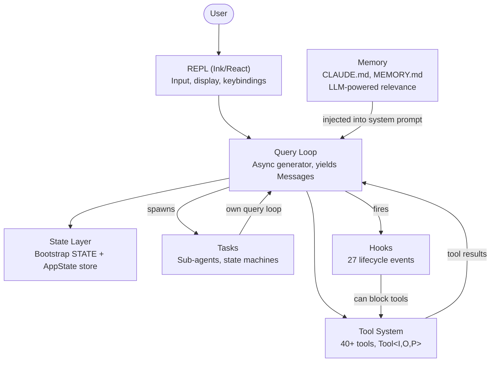
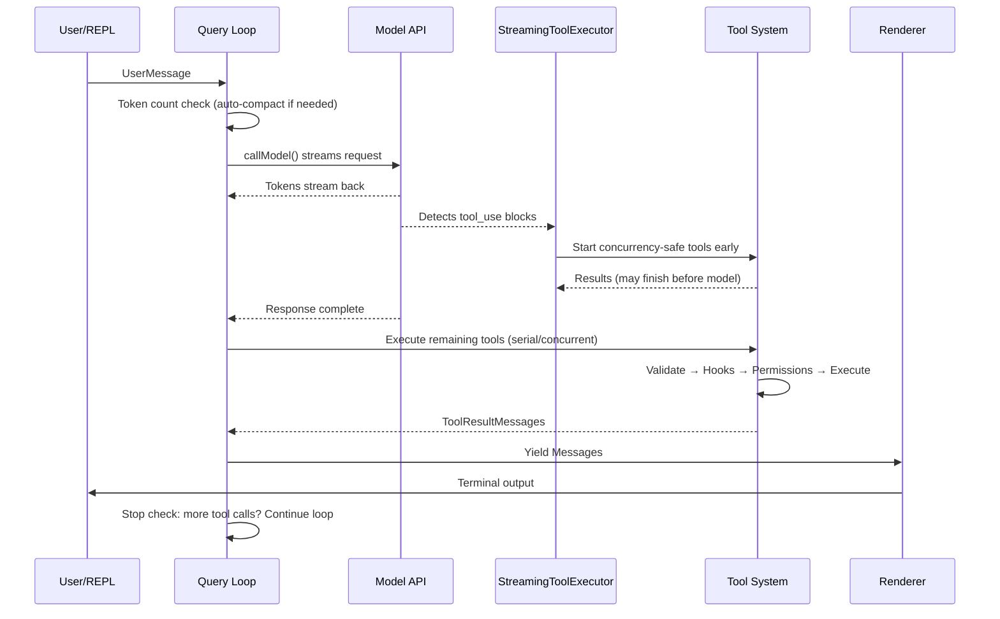
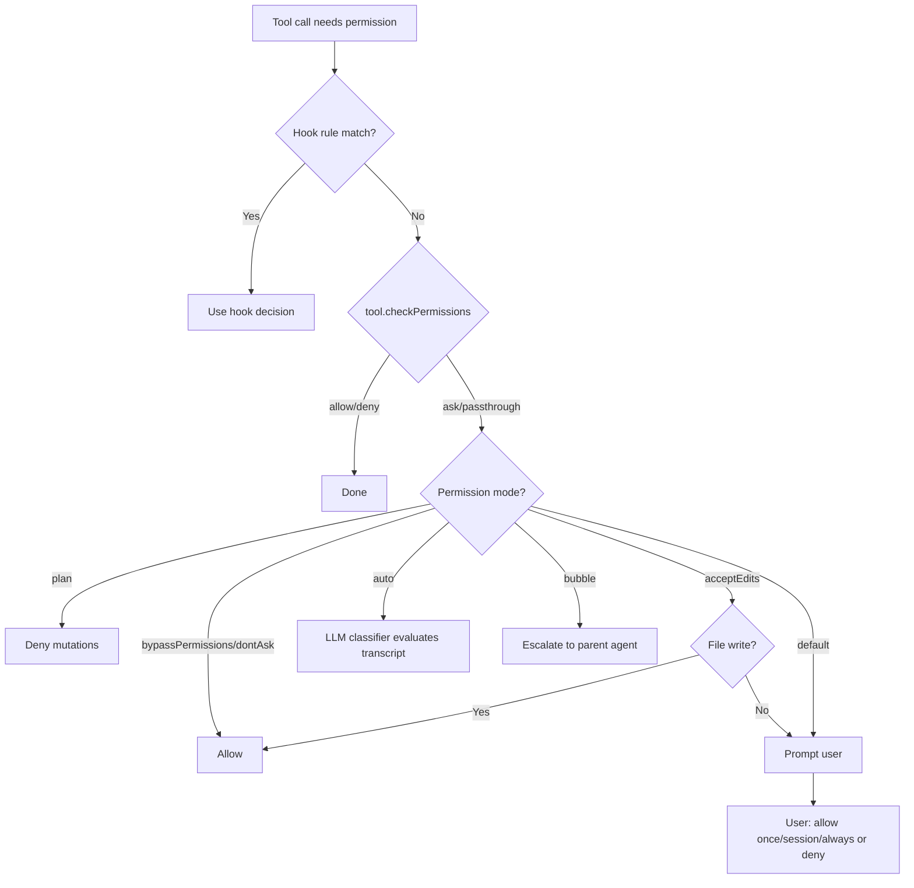
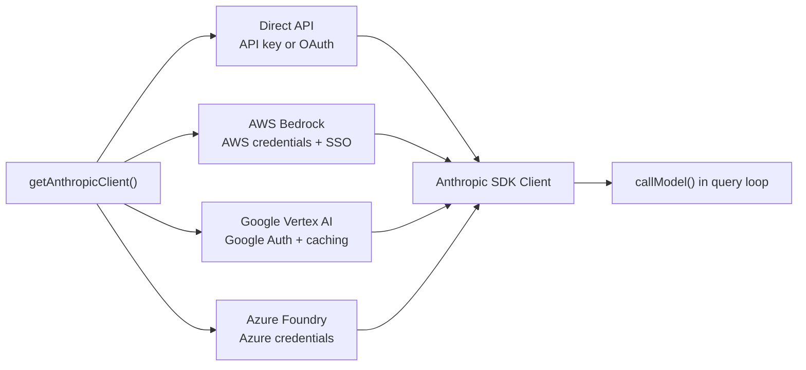
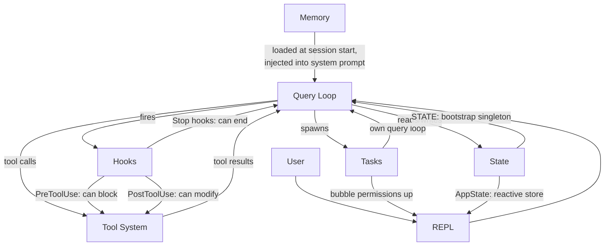

# 第 1 章：AI Agent 的架构

## 你眼前的是什么

一个传统的 CLI 是一个函数。它接受参数，做工作，然后退出。`grep` 不会决定也去运行 `sed`。`curl` 不会打开一个文件并根据它下载的内容修改它。契约很简单：一个命令，一个动作，确定性输出。

一个 agentic CLI 打破了这个契约的每一个部分。它接受自然语言 prompt，决定使用哪些工具，按情况需要的任意顺序执行它们，评估结果，然后循环直到任务完成或用户停止。这个"程序"不是一个固定的指令序列——它是一个围绕语言模型的循环，该模型在运行时生成自己的指令序列。工具调用是副作用。模型的推理是控制流。

Claude Code 是 Anthropic 对这个想法的生产级实现：一个接近两千个文件的 TypeScript 单体应用，将终端变成一个由 Claude 驱动的完整开发环境。它已经交付给数十万开发者，这意味着每一个架构决策都承载着真实世界的后果。本章给你心智模型。六个抽象定义了整个系统。一条数据流连接它们。一旦你内化了从按键到最终输出的黄金路径，每一个后续章节都是对这条路径上某一段的放大。

以下是事后的解构——这六个抽象并不是事先在白板上设计出来的。它们是从向大量用户交付一个生产级 agent 的压力中涌现出来的。理解它们本来的样子，而不是它们被计划的样子，为本书的其余部分设定正确的期望。

---

## 六大关键抽象

Claude Code 建立在六个核心抽象之上。其他一切——400+ 的工具文件、fork 后的终端渲染器、vim 模拟、成本追踪器——都为了支持这六个而存在。



以下是每个抽象做什么以及为什么存在。

**1. Query Loop**（`query.ts`，约 1,700 行）。一个 async generator（异步生成器），是整个系统的心跳。它流式接收模型响应，收集工具调用，执行它们，将结果追加到消息历史，然后循环。每一次交互——REPL、SDK、子 agent、headless `--print`——都流经这个单一函数。它产出 UI 消费的 `Message` 对象。它的返回类型是一个称为 `Terminal` 的 discriminated union（可辨识联合类型），精确编码了循环停止的原因：正常完成、用户中止、token 预算耗尽、stop hook 干预、达到最大轮次或不可恢复错误。Generator 模式——而不是回调或事件发射器——提供了自然的 backpressure（背压，即消费者按自己的速度拉取数据）、干净的取消和类型化的终端状态。第 5 章完整覆盖循环的内部机制。

**2. Tool System**（`Tool.ts`、`tools.ts`、`services/tools/`）。工具是 agent 可以在世界中做的任何事情：读文件、运行 shell 命令、编辑代码、搜索网络。那个简单的目的背后隐藏着大量的机制。每个工具实现了一个丰富的接口，涵盖身份、schema、执行、权限和渲染。工具不只是函数——它们携带自己的权限逻辑、并发声明、进度报告和 UI 渲染。系统将工具调用划分为并发和串行批次，并且流式执行器在模型完成响应之前就启动并发安全的工具。第 6 章覆盖完整的工具接口和执行流水线。

**3. Tasks**（`Task.ts`、`tasks/`）。任务是后台工作单元——主要是子 agent。它们遵循一个状态机：`pending -> running -> completed | failed | killed`。`AgentTool` 生成一个新的 `query()` generator，带有自己的消息历史、工具集和权限模式。Tasks 给予 Claude Code 递归能力：一个 agent 可以委托给子 agent，子 agent 可以进一步委托。

**4. State**（两层）。系统在两个层面上维护状态。一个可变单例（`STATE`）持有约 80 个字段的会话级基础设施：工作目录、模型配置、成本追踪、遥测计数器、会话 ID。它在启动时设置一次并直接修改——没有响应性。一个最小化的响应式 store（34 行，Zustand 风格）驱动 UI：消息、输入模式、工具审批、进度指示器。分离是有意的：基础设施状态不常变化且不需要触发重新渲染；UI 状态不断变化且必须触发。第 3 章深入覆盖双层架构。

**5. Memory**（`memdir/`）。agent 跨会话的持久化上下文。三层：项目级（仓库中的 `CLAUDE.md` 文件）、用户级（`~/.claude/MEMORY.md`）和团队级（通过符号链接共享）。在会话开始时，系统扫描所有记忆文件，解析 frontmatter，LLM 选择哪些记忆与当前对话相关。Memory 是 Claude Code 如何"记住"你的代码库约定、架构决策和调试历史。

**6. Hooks**（`hooks/`、`utils/hooks/`）。用户定义的生命周期拦截器，在 27 个不同事件上触发，涵盖 4 种执行类型：shell 命令、单次 LLM prompt、多轮 agent 对话和 HTTP webhooks。Hooks 可以阻止工具执行、修改输入、注入额外上下文或短路整个查询循环。权限系统本身部分通过 hooks 实现——`PreToolUse` hooks 可以在交互式权限提示触发之前就拒绝工具调用。

---

## 黄金路径：从按键到输出

追踪一次请求穿过整个系统。用户输入"给 login 函数加错误处理"并按回车。



关于这个流程有三点值得注意。

第一，查询循环是一个 generator，不是回调链。REPL 通过 `for await` 从中拉取消息，这意味着背压是自然的——如果 UI 跟不上，generator 暂停。这是相对于事件发射器或可观察流的有意选择。

第二，工具执行与模型流式输出重叠。`StreamingToolExecutor` 不会等模型完成才开始执行并发安全的工具。一个 `Read` 调用可以在模型还在生成剩余响应时就完成并返回结果。这是 speculative execution（推测执行）——如果模型的最终输出使工具调用无效（罕见但可能），结果会被丢弃。

第三，整个循环是 re-entrant（可重入）的。当模型进行工具调用时，结果被追加到消息历史中，循环再次调用模型，使用更新后的上下文。没有单独的"工具结果处理"阶段——全在一个循环里。模型通过简单地不再进行任何工具调用来决定何时完成。也就是说，同一个 `query()` 函数被反复调用，每次传入更新后的消息历史，直到模型不再返回 tool_use。

---

## 权限系统

Claude Code 在你的机器上运行任意 shell 命令。它编辑你的文件。它可以生成子进程、发出网络请求并修改你的 git 历史。没有权限系统，这就是一场安全灾难。

系统定义了七种权限模式，按从最宽松到最严格排序：

| 模式 | 行为 |
|------|------|
| `bypassPermissions` | 一切允许。无检查。仅内部/测试使用。 |
| `dontAsk` | 全部允许，但仍记录日志。无用户提示。 |
| `auto` | 转录分类器（LLM）决定允许/拒绝。 |
| `acceptEdits` | 文件编辑自动批准；所有其他变更操作提示。 |
| `default` | 标准交互模式。用户批准每个操作。 |
| `plan` | 只读。所有变更操作被阻止。 |
| `bubble` | 将决策升级到父 agent（子 agent 模式）。 |

当一个工具调用需要权限时，解析遵循一个严格的链条：



`auto` 模式值得特别关注。它运行一个单独的轻量级 LLM 调用，根据对话转录对工具调用进行分类。分类器看到工具输入的紧凑表示，并判断操作是否与用户要求的一致。这是让 Claude Code 能够半自主工作的模式——在标记任何看起来偏离用户意图的操作的同时，批准常规操作。

子 agent 默认为 `bubble` 模式，这意味着它们不能批准自己的危险操作。权限请求向上传播到父 agent 或最终到达用户。这防止了子 agent 在没有用户看到的情况下静默运行破坏性命令。

---

## 多 Provider 架构

Claude Code 通过四条不同的基础设施路径与 Claude 通信，对系统的其余部分完全透明。



关键的洞察是 Anthropic SDK 为每个云 provider 提供了包装类，呈现与直接 API 客户端相同的接口。`getAnthropicClient()` 工厂读取环境变量和配置以确定使用哪个 provider，构造相应的客户端并返回它。从那一刻起，`callModel()` 和所有其他消费者将其视为通用的 Anthropic 客户端。

Provider 选择在启动时确定并存储在 `STATE` 中。查询循环从不检查哪个 provider 处于活跃状态。这意味着从 Direct API 切换到 Bedrock 是一个配置变更，而不是代码变更——agent loop、工具系统和权限模型完全是 provider 无关的。

---

## 构建系统

Claude Code 同时作为 Anthropic 内部工具和公共 npm 包发布。同一份代码库服务两者，通过编译时 feature flags 控制包含哪些内容。

```typescript
// Conditional imports guarded by feature flags
const reactiveCompact = feature('REACTIVE_COMPACT')
  ? require('./services/compact/reactiveCompact.js')
  : null
```

`feature()` 函数来自 `bun:bundle`，即 Bun 的内置打包器 API。在构建时，每个 feature flag 解析为一个布尔字面量。然后打包器的dead code elimination（死代码消除）在 flag 为 false 时完全去除 `require()` 调用——该模块从不加载，从不包含在 bundle 中，也不发布。

模式是一致的：顶层 `feature()` 守卫包裹一个 `require()` 调用。使用 `require()` 而不是 `import` 是因为动态 `require()` 可以在守卫为 false 时被打包器完全消除，而动态 `import()` 不能（它返回一个 Promise，打包器必须保留）。

有一个值得注意的讽刺。早期 npm 发布中发布的 source maps 包含了 `sourcesContent`——完整的原始 TypeScript 源码，包括仅内部使用的代码路径。Feature flags 成功地在运行时去除了代码，但在 source maps 中留下了源码。这就是 Claude Code 源码变得可以公开阅读的原因。

---

## 各部分如何连接

六个抽象形成一个依赖图：



Memory 作为系统提示的一部分注入到查询循环中。查询循环驱动工具执行。工具结果作为消息反馈回查询循环。Tasks 是具有隔离消息历史的递归查询循环。Hooks 在定义的点上拦截查询循环。State 被一切读取和写入，响应式 store 桥接到 UI。

查询循环和工具系统之间的循环依赖是系统的定义性特征。模型生成工具调用。工具执行并产生结果。结果被追加到消息历史。模型看到结果并决定下一步做什么。这个循环持续直到模型停止生成工具调用，或者外部约束（token 预算、最大轮次、用户中止）终止它。

以下是它们如何连接到后续章节：从输入到输出的黄金路径是贯穿整本书的主线。第 2 章追踪系统如何启动到可以使这条路径执行的时刻。第 3 章解释这条路径读取和写入的双层状态架构。第 4 章覆盖查询循环调用的 API 层。每个后续章节放大了你刚刚端到端看到的路径上的某一段。

---

## Apply This

如果你正在构建一个 agentic 系统——任何由 LLM 在运行时决定采取什么行动的系统——以下是来自 Claude Code 架构的可转移模式。

**Generator 循环模式。** 使用 async generator 作为你的 agent loop，而不是回调或事件发射器。Generator 给你自然的背压（消费者按自己的节奏拉取）、干净的取消（generator 上的 `.return()`）以及终端状态的类型化返回值。它解决的问题：在基于回调的 agent loop 中，很难知道循环何时"完成"以及为什么。Generator 使终止成为类型系统的一等公民。

**自我描述的工具接口。** 每个工具应该声明自己的并发安全性、权限要求和渲染行为。不要把这个逻辑放在一个中心编排器中，让它"知道"每个工具。它解决的问题：中心编排器成为一个每次添加工具都必须更新的上帝对象。自我描述的工具线性扩展——添加第 N+1 个工具不需要对现有代码做任何更改。

**将基础设施状态与响应式状态分离。** 并非所有状态都需要触发 UI 更新。会话配置、成本追踪和遥测放在一个普通的可变对象中。消息历史、进度指示器和审批队列放在响应式 store 中。它解决的问题：让一切都响应式会向启动时设置一次、读取一千次的状态添加订阅开销和复杂性。两层匹配两种访问模式。

**权限模式，而非权限检查。** 定义一小组命名模式（plan、default、auto、bypass），并通过模式解析每个权限决策。不要把 `if (isAllowed)` 检查分散在工具实现中。它解决的问题：不一致的权限执行。当每个工具都经过相同的基于模式的解析链时，你可以通过知道哪个模式处于活跃状态来推理系统的安全态势。

**通过 Tasks 的递归 agent 架构。** 子 agent 应该是相同 agent loop 的新实例，拥有自己的消息历史，而不是特殊情况的代码路径。权限升级通过 `bubble` 模式向上流动。它解决的问题：子 agent 逻辑与主 agent loop 分叉，导致行为和错误处理的微妙差异。如果子 agent 是相同的 loop，它继承所有相同的保证。
