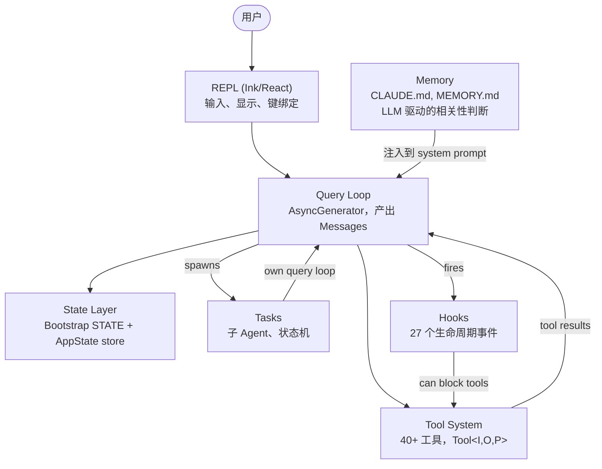
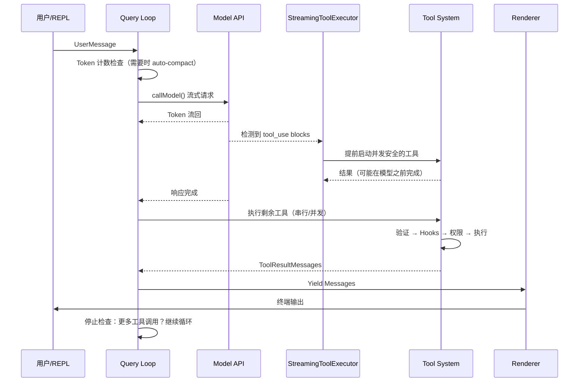

# 第 1 章：AI Agent 的架构

## 你看到的是什么

传统 CLI 是一个函数。它接受参数，做工作，然后退出。`grep` 不会决定也去运行 `sed`。`curl` 不会打开一个文件并根据下载的内容修改它。契约很简单：一个命令，一个动作，确定性输出。

Agentic CLI 打破了这个契约的每一个部分。它接受自然语言 prompt，决定使用哪些工具，按情况需要的任何顺序执行它们，评估结果，然后循环直到任务完成或用户停止它。"程序"不是一个固定的指令序列——它是一个围绕语言模型的循环，模型在运行时生成自己的指令序列。工具调用是副作用。模型的推理是控制流。

Claude Code 是 Anthropic 对这个想法的生产级实现：一个近两千个文件的 TypeScript 单体应用，将终端变成了一个由 Claude 驱动的完整开发环境。它已经交付给数十万开发者，这意味着每个架构决策都有真实的后果。本章给你心智模型。六个抽象定义了整个系统。一条数据流连接它们。一旦你内化了从按键到最终输出的黄金路径，每一个后续章节都是对这条路径的某一段进行放大。

## 六大关键抽象

Claude Code 建立在六个核心抽象之上。其他一切——400+ 工具文件、fork 的终端渲染器、vim 模拟、成本追踪器——都为了支持这六个。

**1. Query Loop**（`query.ts`，约 1,700 行）。一个 async generator，是整个系统的心跳。它流式接收模型响应，收集工具调用，执行它们，将结果追加到消息历史，然后循环。每次交互——REPL、SDK、子 agent、headless `--print`——都流经这个单一函数。它产出 UI 消费的 `Message` 对象。它的返回类型是一个称为 `Terminal` 的可辨识联合类型（discriminated union），精确编码了循环停止的原因：正常完成、用户中止、token 预算耗尽、stop hook 干预、达到最大轮次、或不可恢复错误。

**2. Tool System**（`Tool.ts`、`tools.ts`、`services/tools/`）。工具是 agent 可以在世界中做的任何事情：读文件、运行 shell 命令、编辑代码、搜索网页。每个工具实现一个丰富的接口，涵盖身份、schema、执行、权限和渲染。工具不只是函数——它们携带自己的权限逻辑、并发声明、进度报告和 UI 渲染。

**3. Tasks**（`Task.ts`、`tasks/`）。任务是后台工作单元——主要是子 agent。它们遵循状态机：`pending -> running -> completed | failed | killed`。`AgentTool` 生成一个带有自己消息历史、工具集和权限模式的新 `query()` generator。

**4. State**（两层）。系统在两个层面上维护状态。一个可变单例（`STATE`）持有约 80 个字段的会话级基础设施。一个最小化的响应式 store（34 行，Zustand 风格的）驱动 UI。

**5. Memory**（`memdir/`）。agent 跨会话的持久化上下文。三层：项目级（仓库中的 `CLAUDE.md` 文件）、用户级（`~/.claude/MEMORY.md`）和团队级（通过符号链接共享）。

**6. Hooks**（`hooks/`、`utils/hooks/`）。用户定义的生命周期拦截器，在 27 个不同事件上触发，涵盖 4 种执行类型：shell 命令、单次 LLM prompt、多轮 agent 对话和 HTTP webhooks。Hooks 可以阻止工具执行、修改输入、注入额外上下文或短路整个查询循环。

## 黄金路径：从按键到输出

追踪单次请求通过系统。用户输入"给 login 函数加错误处理"并按回车。

三个要注意的点。第一，查询循环是 generator，不是回调链。REPL 通过 `for await` 从中拉取消息，这意味着背压是自然的。第二，工具执行可以在模型完成响应之前开始。这是推测执行（speculative execution）。第三，权限检查发生在工具执行之前，而不是之后。

## Apply This

**1. 用一个 generator 函数作为 agent loop。** 不要用回调。Generator 提供自然的背压、干净的取消和类型化终端状态。回调架构会把这些逻辑分散到十几个文件中。

**2. 工具应该自我描述。** 每个工具携带自己的名称、描述、schema 和执行逻辑。工具系统的工作不是向模型描述工具——而是让工具描述自己。

**3. 状态分为基础设施层和 UI 层。** 基础设施状态变化不频繁，不需要触发重新渲染。UI 状态变化频繁，必须触发。将它们分开。

**4. 内存应该在会话之间持久化。** 基于文件的方案在透明性和简单性上胜出。LLM 驱动的召回比嵌入相似度更精确。

**5. Hooks 应该作为外部进程运行。** 进程隔离意味着 hook 崩溃不会搞垮主机。stdin/stdout/exit code 是自 1971 年以来就稳定的协议。
