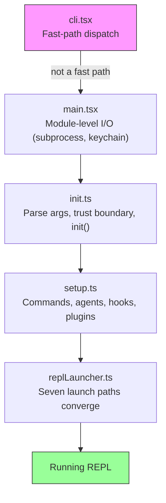
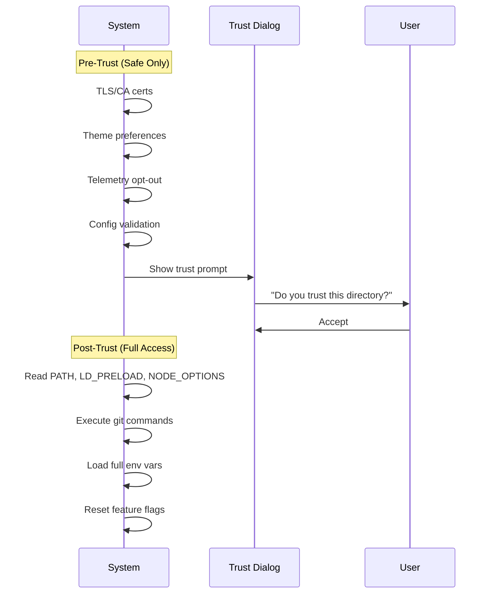

# 第 2 章：快速启动 — Bootstrap 流水线

如果第 1 章给了你 Claude Code 架构的地图，本章给你它达到工作状态的路线。六大抽象的每一个组件——查询循环、工具系统、状态层、hooks、memory——必须在用户看到光标之前初始化完毕。全部预算：300 毫秒。

三百毫秒是人类将工具感知为即时的阈值。超过它，CLI 就感觉迟钝。差得远了，开发者就不再使用它。本章中的一切都为了保持在这条线之下而存在。

Bootstrap 必须完成四件事：验证环境、建立安全边界、配置通信层，以及渲染 UI。它必须在 300ms 以内完成全部四件事。架构洞察在于这四个工作可以部分重叠、仔细排序和积极裁剪，以适应对于这样一个复杂系统来说感觉不可能的时间预算。

关于方法论的说明：本章中的时间戳是近似的，源自代码库自身的性能剖析检查点。它们代表现代硬件上典型的热启动计时。冷启动更慢。绝对数字不如相对结构重要：哪些操作重叠，哪些阻塞，哪些被推迟。

---

## 流水线的形状

启动流水线存在于五个文件中，按顺序执行。每个文件缩小系统接下来需要做的事情的范围：



每个文件在将控制权传递给下一个之前做最少必要的工作。`cli.tsx` 尝试在导入任何重量级东西之前退出。`main.tsx` 在 import 评估期间作为副作用触发慢操作。`init.ts` 解析配置并建立信任边界。`setup.ts` 注册能力。`replLauncher.ts` 选择正确的入口点并启动 UI。

三种并行策略使其快速：

1. **模块级子进程分发。** 在 *import 评估期间*作为副作用触发 keychain 和 MDM 读取。子进程在剩余约 135ms 的静态 import 加载期间运行。
2. **Setup 中的 Promise 并行。** Socket 绑定、hook 快照、命令加载和 agent 定义加载全部并发运行。
3. **渲染后延迟预取。** 用户在输入第一条消息之前不需要的一切——git status、模型能力、AWS 凭证——在提示可见后运行。

第四种策略不那么可见但同样重要：**动态 import 推迟模块加载**。代码库至少在十几个地方使用 `await import('./module.js')` 来避免在需要之前加载代码。OpenTelemetry（400KB + 700KB gRPC）仅在遥测初始化时加载。React 组件仅在渲染时加载。每个动态 import 用冷路径延迟（首次使用时才触发 module evaluation）换取热路径速度（启动时不为可能永远不使用的模块付费）。

---

## 阶段 0：快速路径分发（cli.tsx）

进程进入的第一个文件 `cli.tsx` 只有一个工作：确定是否根本需要完整的 bootstrap 流水线。许多调用——`claude --version`、`claude --help`、`claude mcp list`——只需要一个特定答案，不需要其他。加载 React、初始化遥测、读取 keychain 和设置工具系统都是纯粹的浪费。

模式是：检查 `argv`，只动态 import 你需要的 handler，在系统其余部分加载之前退出。

```typescript
// Pseudocode for the fast-path pattern
if (args.length === 1 && args[0] === '--version') {
  const { printVersion } = await import('./commands/version.js')
  await printVersion()
  process.exit(0)
}
```

大约有十几个快速路径，覆盖版本、帮助、配置、MCP 服务器管理和更新检查。具体细节不重要——模式重要。每条路径动态 import 恰好一个模块，调用一个函数，然后退出。代码库的其余部分从不加载。

这是贯穿整个 bootstrap 的一个原则的首次实例：**通过更了解意图来做更少的事**。argv 数组揭示了用户的意图。如果意图是窄的，执行路径也应该是窄的。

如果没有快速路径匹配，`cli.tsx` 落入完整的 `main.tsx` import，真正的启动开始了。

---

## 阶段 1：模块级 I/O（main.tsx）

当 `main.tsx` 被 import 时，它的模块级副作用在评估期间触发——在文件中的任何函数被调用之前。这是整个 bootstrap 中最关键的性能技术：

```typescript
// These run at import time, not at call time
const mdmPromise = startMDMSubprocess()
const keychainPromise = readKeychainCredentials()
```

当 JavaScript 引擎在执行 `main.tsx` 的其余部分及其传递 import 时（约 138ms 的 module evaluation，即 JS 引擎加载、解析并执行模块代码的过程），这两个 promise 已经在飞行中了。MDM（Mobile Device Management）子进程检查组织安全策略。Keychain 读取获取存储的凭证。两者都是 I/O-bound 操作，否则会在关键路径上串行执行。

洞察：模块加载不是空闲时间——它是你可以与 I/O 重叠的时间。当 `main.tsx` 的导出函数第一次被调用时，这些 promise 通常已经解析完毕。

这种技术需要在相关文件中抑制 ESLint 的 top-level-await 和 side-effect-in-module-scope 规则。代码库有一个专门的定制 ESLint 规则，专门针对 `process.env` 访问模式，允许模块作用域中的受控副作用，同时防止其他地方的未受控副作用。

---

## 阶段 2：解析与信任（init.ts）

`init()` 函数被 memoize 了——多次调用是安全的，返回相同的结果。这很重要，因为多个入口点（REPL、print 模式、SDK 模式）可能各自调用 `init()`，memoization 保证它恰好运行一次。

该函数通过 Commander 解析命令行参数，从多个来源（全局设置、项目设置、环境变量）加载配置，然后接触到流水线中最重要的边界。

### 信任边界

在信任边界之前，系统在受限模式下运行。之后，完整能力可用。边界存在是因为 Claude Code 读取环境变量——而环境变量可以被投毒。



信任边界不是关于用户信任 Claude Code。而是关于 Claude Code 信任*环境*。一个恶意的 `.bashrc` 可以设置 `LD_PRELOAD` 向每个子进程注入代码。信任对话框确保用户明确同意在一个可能已被其他人配置的目录中操作。

系统有十个不同的信任敏感操作。在用户接受信任对话框之前，只有安全操作运行：TLS 证书配置、主题偏好、遥测退出。信任之后，系统读取潜在危险的环境变量（PATH、LD_PRELOAD、NODE_OPTIONS），执行 git 命令，并应用完整的环境配置。

### preAction Hook

Commander 的 `preAction` hook 是架构的枢纽。Commander 解析命令结构（标志、子命令、位置参数）*而不*执行任何东西。`preAction` hook 在解析之后但在匹配的命令 handler 运行之前触发：

```typescript
program.hook('preAction', async (thisCommand) => {
  await init(thisCommand)
})
```

这种分离意味着快速路径命令（在 Commander 加载之前在 `cli.tsx` 中处理）从不支付 `init()` 成本。只有需要完整环境的命令才触发初始化。

---

## 阶段 3：Setup（setup.ts）

在 `init()` 完成后，`setup()` 注册系统需要的所有能力：

```mermaid
gantt
    title Phase 3: Parallel Setup
    dateFormat X
    axisFormat %Lms

    section Sequential
    Commands registration   :0, 5
    section Parallel
    Agent definitions      :5, 15
    Hook registration      :5, 12
    Plugin initialization  :5, 20
    MCP server connections :5, 25
```



命令、agent 定义、hook、插件全部尽可能并行注册。Setup 阶段是系统从"我知道我的配置"过渡到"我拥有我的全部能力"的地方。Setup 之后，每个工具都已注册，每个 hook 都已连接，系统准备好处理用户输入。

Setup 还处理安全 hook 快照。Hook 配置从磁盘读取一次，冻结为不可变快照，用于会话的其余部分。之后对磁盘上 hook 配置文件的修改被忽略。这防止攻击者在会话开始后修改 hook 规则——冻结的快照是权限决策的唯一真相来源。

---

## 阶段 4：Launch（replLauncher.ts）

七条不同的代码路径汇聚在 `replLauncher.ts`：交互式 REPL、print 模式（`--print`）、SDK 模式、resume（`--resume`）、continue（`--continue`）、pipe 模式和 headless。启动器检查 `init()` 产生的配置并分发到正确的入口点。

两个例子说明范围：

**交互式 REPL**——标准情况。启动器挂载 React/Ink 组件树，启动终端渲染器，进入事件循环。用户看到提示并可以开始输入。

**Print 模式**（`--print`）——来自 argv 的单个 prompt。启动器创建一个没有 React 树的 headless 查询循环，运行到完成，将输出流式传输到 stdout，然后退出。相同的 agent loop，不同的呈现方式。

重要细节：所有七条路径最终都调用 `query()`——第 1 章中的同一 agent loop。启动路径决定循环*如何*呈现（交互式终端、单次、SDK 协议），而不是它*做什么*。这种收敛是使架构可测试和可预测的原因：无论用户如何调用 Claude Code，核心行为是相同的。

---

## 启动时间线

以下是完整流水线在时间上的样子：

```mermaid
gantt
    title Bootstrap Timeline (~240ms)
    dateFormat X
    axisFormat %Lms

    section Phase 0
    Fast-path check          :0, 5

    section Phase 1
    Module evaluation        :5, 143
    MDM subprocess (parallel) :8, 60
    Keychain read (parallel)  :8, 50

    section Phase 2
    Commander parse          :143, 146
    init()                   :146, 160
    Trust boundary           :160, 175

    section Phase 3
    setup() + parallel registration :175, 210

    section Phase 4
    Launch path selection    :210, 215
    First render             :215, 240
```



关键路径经过模块加载（单次最长阶段，约 138ms），然后是 Commander 解析、init 和 setup。并行 I/O 操作（MDM、keychain）与模块加载重叠，通常在需要之前已经解析。

### 性能预算

| 阶段 | 时间 | 做什么 |
|------|------|--------|
| 快速路径检查 | ~5ms | 检查 argv，可能提前退出 |
| 模块加载 | ~138ms | Import 树，触发并行 I/O |
| Commander 解析 | ~3ms | 解析标志和子命令 |
| init() | ~14ms | 配置解析，信任边界 |
| setup() | ~35ms | 命令、agent、hooks、插件 |
| Launch + 首次渲染 | ~25ms | 选择路径，挂载 React，首次绘制 |
| **总计** | **~240ms** | 低于 300ms 预算 |

在现代机器上总计约 240ms——在 300ms 预算下还有 60ms 的余量。冷启动（重启后首次运行，OS 缓存为空）可能将模块加载推至 200ms+，使总时间接近极限。

---

## Migration 系统

简要提及在 init 期间运行的一个子系统：schema migration。Claude Code 将配置和会话数据存储在本地文件和目录中。当格式在版本之间变化时，migration 在启动时自动运行。

每个 migration 是一个带有版本号的函数。系统检查当前 schema 版本与最高 migration 版本，按顺序运行待处理的 migration，并更新版本号。Migration 是idempotent（幂等的）且快速的（操作小型本地文件而非数据库）。整个 migration 过程通常在 5ms 以内完成。如果 migration 失败，它记录错误并继续——对于本地配置，可用性胜过严格一致性。

> 💡 **译注**：这里的 Migration 指的是数据迁移（schema migration），不是进程迁移。Claude Code 把用户配置和会话数据存在 `~/.claude/` 等本地目录的 JSON/YAML 文件中。当版本升级导致数据格式变化时（比如 v2.0 把配置文件从扁平结构改成嵌套结构），启动时自动把旧格式转成新格式。这跟数据库的 schema migration 概念一样，只是操作对象是本地文件。每个 migration 有一个版本号，按版本号顺序执行，且设计为幂等（重复执行不会出错）——比如迁移前先检查"是不是已经做过了"。500 万次启动里偶尔失败一两次没关系，只要不阻塞用户使用。

---

## 启动关于系统设计的启示

Bootstrap 流水线是对缩小范围的研究。每个阶段减少可能性的空间：

- 阶段 0 从"任何 CLI 调用"缩小到"需要完整 bootstrap"
- 阶段 1 从"一切必须加载"缩小到"与 I/O 并行加载"
- 阶段 2 从"未知环境"缩小到"可信、已配置的环境"
- 阶段 3 从"无能力"缩小到"完全注册"
- 阶段 4 从"七种可能模式"缩小到"一个具体的启动路径"

到 REPL 渲染时，每个决策都已做出。查询循环接收到一个完全配置的环境，不存在关于它处于什么模式、哪些工具可用或什么权限适用的歧义。300ms 预算不仅仅是一个性能目标——它是一个强制函数，防止 bootstrap 变成一个惰性初始化系统，其中决策被推迟并分散在整个代码库中。

---

## Apply This

**用 I/O 重叠初始化。** 在模块加载时触发慢操作（子进程生成、凭证读取、网络检查），在需要它们之前。JavaScript 引擎反正在做同步工作——利用那段时间做并行 I/O。模式：文件顶部的 `const promise = startSlowThing()`，使用点处 `await promise`。

**尽早缩小范围。** Bootstrap 流水线的五个文件形成一个漏斗：每个阶段消除后续阶段不需要做的工作。快速路径分发是最具戏剧性的例子，但原则适用于所有地方。如果你能在解析时确定一个代码路径不需要，就跳过它。

**显式建立信任边界。** 如果你的应用从一个不受它控制的环境中读取（环境变量、配置文件、shell 设置），在"在用户同意之前可以安全读取"和"仅在同意后读取"之间画一条明确的线。信任边界防止了一类攻击，其中恶意环境在用户有机会评估它之前就毒害了应用。

**Memoize 你的 init 函数。** 使初始化幂等——调用两次产生相同的结果。这消除了多个入口点可能各自触发初始化时的排序 bug。Memoization 模式很平凡但消除了一整类双重初始化 bug。

**在让出控制之前捕获早期输入。** 在事件驱动系统中，初始化期间到达的用户输入可能丢失。Claude Code 在任何异步工作开始之前从 argv 捕获初始 prompt，确保如果初始化耗时超过预期，`claude "fix the bug"` 不会丢弃 prompt。
