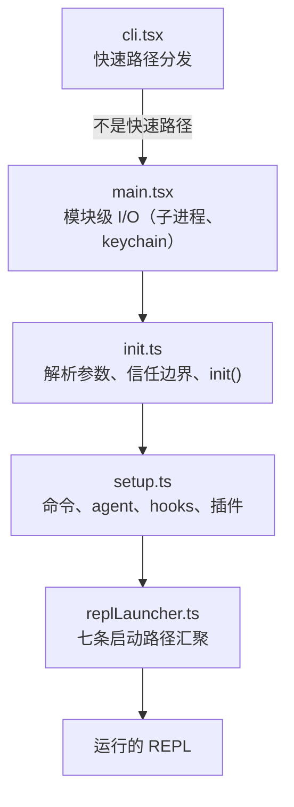
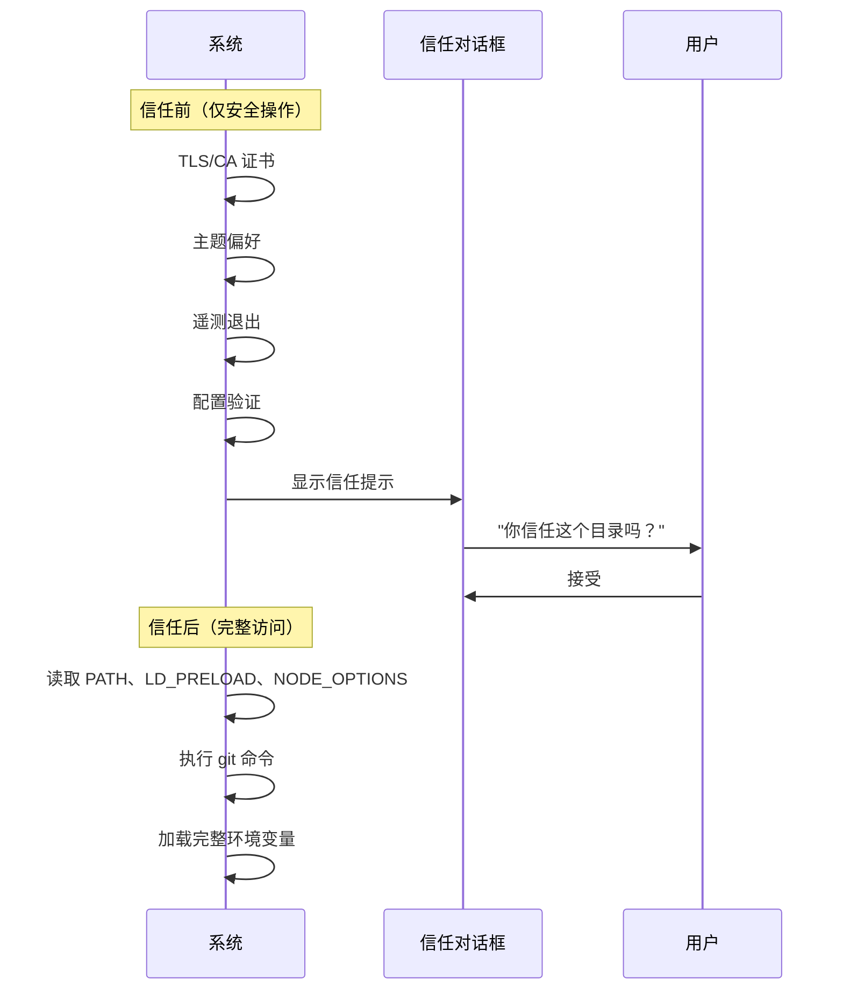

# 第 2 章：快速启动 — Bootstrap 流水线

## 300 毫秒的预算

如果第 1 章给了你 Claude Code 架构的地图，本章给你达到工作状态的路线。六大抽象的每个组件——查询循环、工具系统、状态层、hooks、内存——必须在用户看到光标之前初始化完毕。全部预算：300 毫秒。

Bootstrap 必须完成四件事：验证环境、建立安全边界、配置通信层和渲染 UI。架构洞察是这四件事可以部分重叠、精心排序和积极裁剪以适应一个对于如此复杂系统来说看似不可能的时间预算。

## 流水线的形状

启动流水线存在于五个文件中，按顺序执行：



三种并行策略使其快速：

1. **模块级子进程分发。** 在 import 评估期间作为副作用触发 keychain 和 MDM 读取。子进程在剩余约 135ms 的静态 import 期间并行运行。
2. **Setup 中的 Promise 并行。** Socket 绑定、hook 快照、命令加载和 agent 定义加载全部并发运行。
3. **渲染后延迟预取。** 用户在输入第一条消息之前不需要的一切——git status、模型能力、AWS 凭证——在 prompt 可见后运行。

第四种策略是动态 import（`await import('./module.js')`）在至少十几个地方使用，将代码加载推迟到实际需要时。

## 阶段 0：快速路径分发（cli.tsx）

`cli.tsx` 的工作：确定是否需要完整的 bootstrap 流水线。许多调用——`claude --version`、`claude --help`、`claude mcp list`——只需要特定答案。加载 React、初始化遥测、读取 keychain、设置工具系统都是纯粹的浪费。

模式：检查 `argv`，只动态 import 你需要的 handler，在系统其余部分加载之前退出。

## 阶段 1：模块级 I/O（main.tsx）

当 `main.tsx` 被 import 时，它的模块级副作用在评估期间触发——在文件中任何函数被调用之前。这是整个 bootstrap 中最关键的性能技巧：

```typescript
// 这些在 import 时运行，不是在调用时
const mdmPromise = startMDMSubprocess()
const keychainPromise = readKeychainCredentials()
```

当 JavaScript 引擎评估 `main.tsx` 的其余部分和传递 import 时，这两个 Promise 已经在飞行中。

## 阶段 2：解析与信任（init.ts）

### 信任边界

在信任边界之前，系统在受限模式下运行。之后，全部能力可用。这个边界存在是因为 Claude Code 读取环境变量——而环境变量可以被投毒。



信任边界不是关于用户信任 Claude Code。而是关于 Claude Code 信任*环境*。恶意 `.bashrc` 可以设置 `LD_PRELOAD` 向每个子进程注入代码。

## 阶段 3-4：Setup 和 Launch

`setup()` 注册所有能力——命令、agent 定义、hook 注册、插件初始化、MCP 服务器连接——全部并行。

`replLauncher.ts`：七条不同的代码路径汇聚于此（交互式 REPL、print 模式、SDK 模式、resume、continue、pipe 模式、headless）。所有七条路径最终都调用 `query()`。

## 启动时间线

| 阶段 | 时间 | 做什么 |
|------|------|--------|
| 快速路径检查 | ~5ms | 检查 argv，可能提前退出 |
| 模块评估 | ~138ms | Import 树，触发并行 I/O |
| Commander 解析 | ~3ms | 解析标志和子命令 |
| init() | ~14ms | 配置解析，信任边界 |
| setup() | ~35ms | 命令、agent、hooks、插件 |
| 启动 + 首次渲染 | ~25ms | 选择路径，挂载 React，首次绘制 |
| **总计** | **~240ms** | 低于 300ms 预算 |

## Apply This

**1. 用并行 I/O 重叠初始化。** 在模块评估时触发慢操作（子进程、凭证读取）。当 JavaScript 引擎在做同步工作时，利用那段时间做并行 I/O。

**2. 尽早缩小范围。** Bootstrap 流水线的五个文件形成一个漏斗：每个阶段消除后续阶段不需要做的工作。

**3. 显式建立信任边界。** 如果你的应用从不受控制的环境读取，在用户同意之前只运行安全操作。

**4. 缓存 init 函数。** 使初始化幂等——多次调用产生相同结果。消除双重初始化 bug。

**5. 在让出控制权之前捕获早期输入。** 在事件驱动系统中，初始化期间到达的用户输入可能会丢失。在任何异步工作开始之前捕获初始 prompt。
