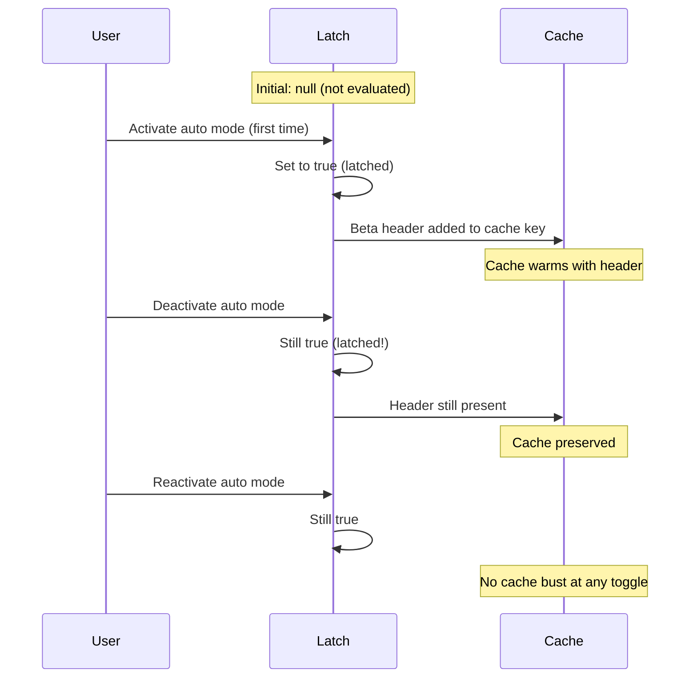
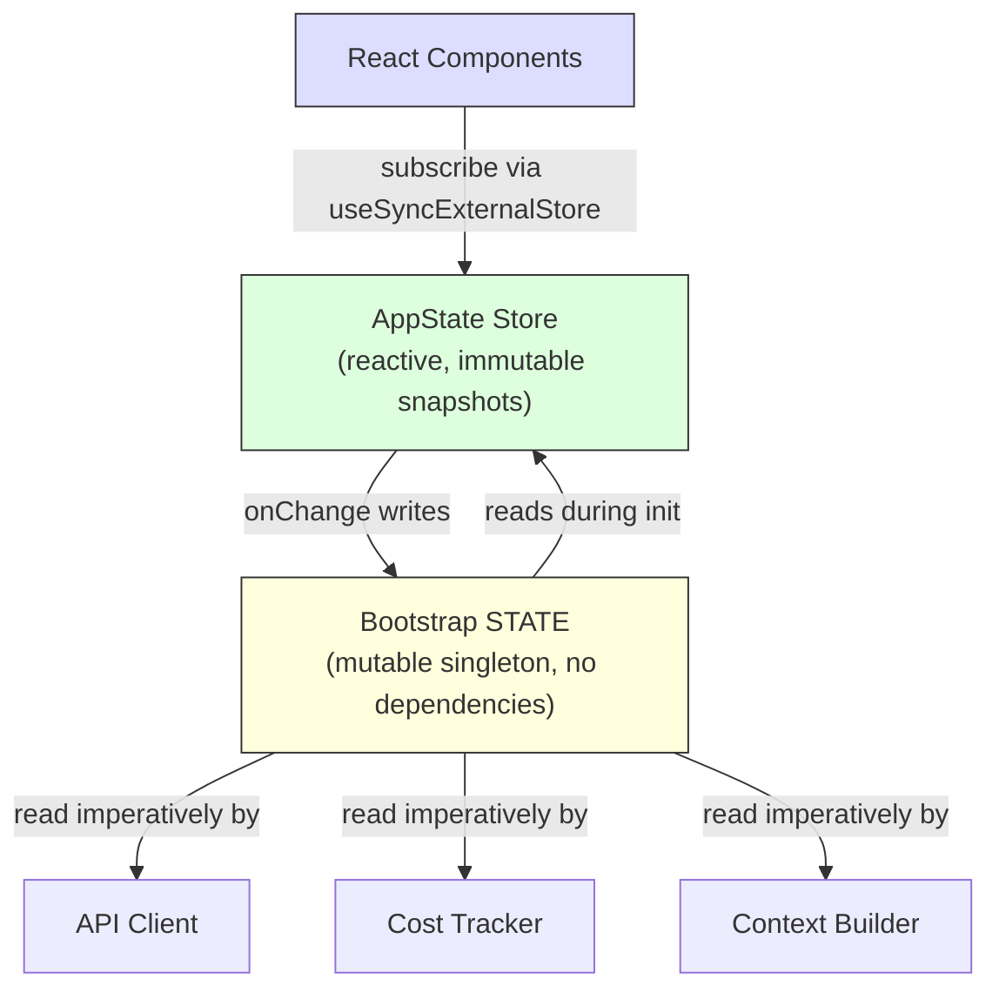

# 第 3 章：状态 — 双层架构

第 2 章追踪了从进程启动到首次渲染的 bootstrap 流水线。到最后，系统有了一个完全配置的环境。但是用*什么*配置的？会话 ID 在哪里？当前模型？消息历史？成本追踪器？权限模式？状态到底存在哪里，为什么在那里？

每个长时间运行的应用最终都会面对这个问题。对于简单的 CLI 工具，答案是平凡的——`main()` 里的几个变量。但 Claude Code 不是一个简单的 CLI 工具。它是一个通过 Ink 渲染的 React 应用，进程生命周期跨越数小时，插件系统在任意时间加载，API 层必须从缓存的上下文中构造 prompt，成本追踪器在进程重启后仍然存活，数十个基础设施模块需要在不相互 import 的情况下读写共享数据。

天真的方法——单一全局 store——会立刻失败。原因是：如果成本追踪器更新了驱动 React 重渲染的同一个 store，每次 API 调用都会触发完整的组件树 reconciliation（协调——React 对比新旧虚拟 DOM 并更新实际 DOM 的过程）。基础设施模块（bootstrap、上下文构建、成本追踪、遥测）不能 import React。它们在 React 挂载之前运行、在 React 卸载之后运行、在根本没有组件树存在的上下文中运行。把所有东西放进一个 React-aware store 会在整个 import 图中创建循环依赖，导致启动序列无法正常工作。

Claude Code 用双层架构解决这个问题：一个可变进程单例用于基础设施状态，一个最小化的响应式 store 用于 UI 状态。本章解释这两层、桥接它们的副作用系统，以及依赖这个基础的支持性子系统。每一个后续章节都假设你理解了状态在哪里以及为什么在那里。

---

## 3.1 Bootstrap State — 进程单例

### 为什么是可变单例

Bootstrap state 模块（`bootstrap/state.ts`）是一个在进程启动时创建一次的单一可变对象：

```typescript
const STATE: State = getInitialState()
```

这行上方的注释写着：`AND ESPECIALLY HERE`（特别是这里）。类型定义上方两行写着：`DO NOT ADD MORE STATE HERE - BE JUDICIOUS WITH GLOBAL STATE`（不要在这里加更多状态——对全局状态要慎之又慎）。这些注释带着工程师从惨痛经验中学到不受控全局对象代价的语气。

可变单例在这里是正确的选择，原因有三个。第一，bootstrap state 必须在任何框架初始化之前可用——在 React 挂载之前、在 store 创建之前、在插件加载之前。模块作用域初始化是唯一保证 import 时可用的机制。第二，数据本质上是进程作用域的：会话 ID、遥测计数器、成本累加器、缓存路径。没有有意义的"先前状态"来对比，没有需要通知的订阅者，没有撤销历史。第三，该模块必须是 import 依赖图中的叶子节点——如果它 import 了 React、store 或任何服务模块，会创建打破第 2 章描述的 bootstrap 序列的循环依赖。通过只依赖工具类型和 `node:crypto`，它保持可从任何地方 import。

> 💡 **译注**："叶子节点"指的是 import 依赖图中的最底层模块。想象一棵倒置的树：根部的 `main.tsx` import 了很多模块，这些模块又 import 了其他模块。依赖关系是单向的——"上层 import 下层"。`state.ts` 必须是最底层的叶子——它不 import 任何其他模块，但任何其他模块都可以安全地 import 它。如果它反过来 import 了 React 或其他业务模块，就会产生循环依赖，导致第 2 章的 bootstrap 顺序被破坏。

### 约 80 个字段

`State` 类型包含大约 80 个字段。一个抽样揭示了其广度：

**身份和路径** — `originalCwd`、`projectRoot`、`cwd`、`sessionId`、`parentSessionId`。`originalCwd` 通过 `realpathSync` 和 NFC 规范化在进程启动时解析，且永不改变。

**成本和指标** — `totalCostUSD`、`totalAPIDuration`、`totalLinesAdded`、`totalLinesRemoved`。这些在整个会话中单调累积，并在退出时持久化到磁盘。

**Telemetry（遥测）** — `meter`、`sessionCounter`、`costCounter`、`tokenCounter`。这些都是 OpenTelemetry 的句柄，全部可为 null（在遥测初始化之前为 null）。

> 💡 **译注**：Telemetry（遥测）在这里指的是 OpenTelemetry——一个开源的可观测性框架，用于收集性能指标、追踪请求链路和记录日志。Claude Code 内部集成了 OpenTelemetry，用来监控 API 调用的延迟、token 消耗、错误率等指标。对于 Anthropic 来说，这些数据是判断"系统是否健康"的关键——数十万用户的每次 API 调用都被采样（0.5%）并上报，帮助团队发现性能回退或异常行为。它是非侵入式的，不影响核心功能。

**模型配置** — `mainLoopModelOverride`、`initialMainLoopModel`。当用户在会话中途更改模型时设置 override。

**会话标志** — `isInteractive`、`kairosActive`、`sessionTrustAccepted`、`hasExitedPlanMode`。在会话期间门控行为的布尔值。

**缓存优化** — `promptCache1hAllowlist`、`promptCache1hEligible`、`systemPromptSectionCache`、`cachedClaudeMdContent`。这些存在是为了防止冗余计算和 prompt cache 破坏。

### Getter/Setter 模式

`STATE` 对象从不直接导出。所有访问都经过大约 100 个独立的 getter 和 setter 函数：

```typescript
// Pseudocode — illustrates the pattern
export function getProjectRoot(): string {
  return STATE.projectRoot
}

export function setProjectRoot(dir: string): void {
  STATE.projectRoot = dir.normalize('NFC')  // NFC normalization on every path setter
}
```

这个模式强制了封装、每个路径 setter 上的 NFC 规范化（防止 macOS 上的 Unicode 不匹配）、类型收窄以及 bootstrap 隔离。代价是冗长——80 个字段对应一百个函数。但在一个杂散修改可能破坏数万 token 的 prompt cache 的代码库中，明确性胜出。

> 💡 **译注**："50000 token prompt cache"是什么意思？Claude Code 的 system prompt（系统提示词）大约有 50,000 token 的规模——包含了核心指令、skill 元数据、memory 上下文、工具定义等。API 的 prompt caching 机制会缓存这个巨大的前缀。如果 STATE 中某个字段的错误修改导致 system prompt 中哪怕一个字节发生变化，整个 50,000 token 的缓存就失效了。一次缓存失效意味着下一次 API 调用要多花大量token处理成本。所以 100 个 getter/setter 函数虽然啰嗦，但可以防止"不小心直接改了 STATE 里的值"导致的经济损失。

### Signal 模式

Bootstrap 不能 import 监听器（它是 DAG 叶子节点），所以它使用一个叫 `createSignal` 的最小化发布/订阅原语。例如 `sessionSwitched` signal 只有一个消费者：`concurrentSessions.ts`，它负责保持 PID 文件同步。Signal 通过 `onSessionSwitch = sessionSwitched.subscribe` 暴露，让调用者注册自己而 bootstrap 不知道它们是谁。

> 💡 **译注**：简单理解 Signal——就是一个"通知铃"。bootstrap/state.ts 提供 `sessionSwitched.subscribe(callback)`，任何模块都可以订阅这个通知。当会话切换发生时，bootstrap 只负责"摇铃"——调用所有订阅了的 callback。bootstrap 不需要知道谁在听、听了之后做什么。这种"我通知你，但不需要知道你是谁"的模式保持了依赖图的单向性。整个系统中大约有 6 个这样的 signal，每个都只有一个特定的订阅者——桥接确实是"窄"的（narrow），因为每个 signal 只解决一个具体的同步问题。

### 五个 Sticky Latches

Bootstrap state 中最微妙的字段是五个布尔 latch，遵循相同的模式：一旦某个功能在会话中首次被激活，对应的标志在剩余会话中保持 `true`。它们全部存在的原因只有一个：preserve prompt cache（保护 prompt 缓存）。



Claude API 支持服务端 prompt caching。当连续请求共享相同的 system prompt 前缀时，服务端复用缓存的计算。但缓存键包括 HTTP headers 和请求体字段。如果一个 beta header 出现在请求 N 中但不在请求 N+1 中，缓存就被破坏了——即使 prompt 内容完全一致。对于超过 50,000 token 的 system prompt，一次缓存未命中代价高昂。

> 💡 **译注**：Sticky latch（粘性锁存）用一个类比来理解。你去酒店入住，前台给你一张房卡。你进出房间 50 次，每次都刷卡。如果你一次刷了房卡、下一次用拳头敲门，门禁系统就会认为"这个客人变了"，需要重新验证你的身份。Sticky latch 的作用是：一旦你第一次刷了卡，之后无论你怎么做（刷不刷卡、敲不敲门），系统都认为"这个客人已经用卡验证过了"，保持门禁状态一致。在 Claude Code 中，"刷卡"就是"激活某个 beta 功能"，"门禁系统"就是"prompt cache"。一旦启用过某个功能，对应的 HTTP header 就永久保留在后续请求中，确保缓存键不变化。

五个 latch：

| Latch | 防止什么 |
|-------|---------|
| `afkModeHeaderLatched` | Shift+Tab 自动模式切换导致 AFK beta header 反复变化 |
| `fastModeHeaderLatched` | Fast mode 冷却期进入/退出导致 fast mode header 切换 |
| `cacheEditingHeaderLatched` | 远程 feature flag 变化破坏每个活跃用户的缓存 |
| `thinkingClearLatched` | 在确认缓存未命中（>1h 空闲）后触发。防止重新启用 thinking blocks 破坏刚预热好的缓存 |
| `pendingPostCompaction` | 遥测用的一次性标志：区分压缩引起的缓存未命中和 TTL 过期引起的未命中 |

所有五个使用三态类型：`boolean | null`。`null` 初始值表示"尚未评估"。`true` 表示"已锁存开启"。一旦设置为 `true`，它们永远不会回到 `null` 或 `false`。这就是 latch 的定义性属性。

实现模式：

```typescript
function shouldSendBetaHeader(featureCurrentlyActive: boolean): boolean {
  const latched = getAfkModeHeaderLatched()
  if (latched === true) return true       // 已经锁存 — 始终发送
  if (featureCurrentlyActive) {
    setAfkModeHeaderLatched(true)          // 首次激活 — 锁存它
    return true
  }
  return false                             // 从未激活 — 不发送
}
```

为什么不总是发送所有 beta headers？因为 headers 是缓存键的一部分。发送一个未被识别的 header 会创建不同的缓存命名空间。Latch 确保你只在真正需要时才进入一个缓存命名空间，然后保持在里面。

---

## 3.2 AppState — 响应式 Store

### 34 行实现

这是真实的源码（`state/store.ts`），完整 34 行：

```typescript
type Listener = () => void
type OnChange<T> = (args: { newState: T; oldState: T }) => void

export type Store<T> = {
  getState: () => T
  setState: (updater: (prev: T) => T) => void
  subscribe: (listener: Listener) => () => void
}

export function createStore<T>(
  initialState: T,
  onChange?: OnChange<T>,
): Store<T> {
  let state = initialState
  const listeners = new Set<Listener>()

  return {
    getState: () => state,

    setState: (updater: (prev: T) => T) => {
      const prev = state
      const next = updater(prev)
      if (Object.is(next, prev)) return   // 引用相同 → 不更新，不触发
      state = next
      onChange?.({ newState: next, oldState: prev })  // 副作用先
      for (const listener of listeners) listener()     // React 重渲染后
    },

    subscribe: (listener: Listener) => {
      listeners.add(listener)
      return () => listeners.delete(listener)
    },
  }
}
```

34 行。没有中间件、没有 devtools、没有时间旅行调试、没有 action 类型。三件事：getState 读、setState 写（带 `Object.is` 保护）、subscribe 订阅。加上一个 `onChange` 回调用于副作用。这就是不用 Zustand 库但实现了 Zustand 等价功能。

> 💡 **译注**：Zustand 是一个轻量级 React 状态管理库，核心理念和这里的实现一样——不用 Redux 的 action/reducer 样板，而是直接用一个 store 函数，组件通过 selector 订阅自己需要的部分状态。Claude Code 没有装 Zustand 这个 npm 包，但手动实现了 34 行等价逻辑。为什么？因为当你的需求就是"get、set、subscribe"三个操作时，自己写的 34 行代码比引入一个依赖更可控——你能读懂每一行，出bug能找到根因，不需要等第三方库修。

值得审视的设计决策：

**Updater 函数模式。** 没有 `setState(newValue)`——只有 `setState((prev) => next)`。每次修改都接收当前状态并必须产生下一个状态，消除了并发修改导致的 stale-state bug。

**`Object.is` 相等性检查。** 如果 updater 返回相同的引用，修改是 no-op。没有监听器触发。没有副作用运行。对性能至关重要——展开后设置但没有改变值的组件不会产生重渲染。

**`onChange` 在监听器之前触发。** 可选的 `onChange` 回调接收旧状态和新状态，并在任何订阅者被通知之前同步触发。这用于必须在 UI 重渲染之前完成的副作用。

**没有中间件，没有 devtools。** 这不是疏忽。当你的 store 只需要恰好三个操作（get、set、subscribe）、一个 `Object.is` 相等性检查和一个同步 `onChange` hook 时，你拥有的 34 行代码比一个依赖更好。你控制确切的语义。你可以在三十秒内读完整个实现。

### AppState 类型

`AppState` 类型约 452 行，包含了 UI 渲染所需的一切。大多数字段被包裹在 `DeepImmutable<>` 中，对包含函数类型的字段有显式的豁免：

```typescript
export type AppState = DeepImmutable<{
  settings: SettingsJson
  verbose: boolean
  // ... ~150 more fields
}> & {
  tasks: { [taskId: string]: TaskState }  // Contains abort controllers
  agentNameRegistry: Map<string, AgentId>
}
```

交集类型让大多数字段成为深度不可变的，同时豁免持有函数、Map 和可变引用的字段。完全不可变是默认的，带有精确的逃生舱口以适应运行时语义。

### React 集成

store 通过 `useSyncExternalStore` 与 React 集成：

```typescript
export function useAppState<T>(selector: (state: AppState) => T): T {
  const store = useContext(AppStoreContext)
  return useSyncExternalStore(
    store.subscribe,
    () => selector(store.getState()),
  )
}
```

selector 必须返回已有的子对象引用（而非新构造的对象）才能使 `Object.is` 比较防止不必要的重渲染。如果你写 `useAppState(s => ({ a: s.a, b: s.b }))`，每次渲染都产生一个新对象引用，组件会在每次状态变化时重渲染。这是 Zustand 用户面临的相同约束——更便宜的比较，但 selector 作者必须理解引用身份。

---

## 3.3 两层之间的关系

两层通过显式的、窄的接口通信。



Bootstrap state 在初始化期间流入 AppState：`getDefaultAppState()` 从磁盘读取设置（bootstrap 帮助定位的）、检查 feature flags（bootstrap 评估的），并设置初始模型（bootstrap 从 CLI 参数和设置中解析的）。

AppState 通过副作用流回 bootstrap state：当用户更改模型时，`onChangeAppState` 在 bootstrap 中调用 `setMainLoopModelOverride()`。当设置更改时，bootstrap 中的凭证缓存被清除。

但两层从不共享引用。import bootstrap state 的模块不需要了解 React。读取 AppState 的组件不需要了解进程单例。

一个具体例子说明数据流。当用户输入 `/model claude-sonnet-4`：

1. 命令 handler 调用 `store.setState(prev => ({ ...prev, mainLoopModel: 'claude-sonnet-4' }))`
2. store 的 `Object.is` 检查检测到变化
3. `onChangeAppState` 触发，检测到模型变化，调用 `setMainLoopModelOverride()`（更新 bootstrap）和 `updateSettingsForSource()`（持久化到磁盘）
4. 所有 store 订阅者触发——React 组件重渲染以显示新模型名称
5. 下一次 API 调用从 bootstrap state 的 `getMainLoopModelOverride()` 读取模型

步骤 1-4 是同步的。步骤 5 的 API 客户端可能在数秒后运行。但它从 bootstrap state（在步骤 3 中更新）读取，而不是从 AppState。这就是双层交接：UI store 是"用户选择了什么"的真相来源，但 bootstrap state 是"API 客户端使用什么"的真相来源。

DAG 属性——bootstrap 不依赖任何东西，AppState 依赖 bootstrap 进行初始化，React 依赖 AppState——由一个 ESLint 规则强制执行，该规则防止 `bootstrap/state.ts` import 其允许集之外的模块。

---

## 3.4 副作用：onChangeAppState

每次 `store.setState()` 调用都会触发 `onChangeAppState` 回调。它不是事件监听器——它是一个集中化的 diff handler，比较新旧状态并决定触发哪些外部效果。这是真正的源码（`state/onChangeAppState.ts`）：

```typescript
export function onChangeAppState({
  newState, oldState,
}: { newState: AppState; oldState: AppState }) {

  // === 权限模式同步 ===
  const prevMode = oldState.toolPermissionContext.mode
  const newMode = newState.toolPermissionContext.mode
  if (prevMode !== newMode) {
    // 同步到远程会话 CCR 和 SDK 状态流
    notifyPermissionModeChanged(newMode)
  }

  // === 模型变化 → 同步到 bootstrap + 持久化到磁盘 ===
  if (newState.mainLoopModel !== oldState.mainLoopModel) {
    if (newState.mainLoopModel !== null) {
      updateSettingsForSource('userSettings', { model: newState.mainLoopModel })
      setMainLoopModelOverride(newState.mainLoopModel)
    }
  }

  // === 设置变化 → 清除认证缓存 ===
  if (newState.settings !== oldState.settings) {
    clearApiKeyHelperCache()
    clearAwsCredentialsCache()
    clearGcpCredentialsCache()
  }
}
```

### 为什么集中化：8 个路径中 6 个被破坏

源码注释（`onChangeAppState.ts` 顶部）记录了为什么这个集中化是必要的：

```
// 在此之前，权限模式变更只通过 8+ 个 mutation 路径中的 2 个
// 同步到 CCR（远程会话）：
//   1) print.ts 中的一个特设 setAppState wrapper（仅 headless/SDK 模式）
//   2) set_permission_mode handler 中的一个手动 notify
//
// 其他 6 个路径：
//   - Shift+Tab 循环切换
//   - ExitPlanModePermissionRequest 对话框选项
//   - /plan slash 命令
//   - rewind
//   - REPL bridge 的 onSetPermissionMode
//   — 全部修改了 AppState 但没有告诉 CCR，
//     导致 external_metadata.permission_mode 过时，
//     Web UI 与 CLI 实际模式不同步。
//
// 在这里 hook diff 意味着：任何 setAppState 调用改变了 mode
// → 自动同步到 CCR 和 SDK。上面的散落调用点需要零改变。
```

> 💡 **译注**：这段注释来自真实源码。8 个修改权限模式的地方，只有 2 个记得同步到远程会话，剩下 6 个都忘了。结果就是：CLI 里的权限模式已经变了，但 claude.ai 网页端的 Web UI 还显示旧状态。修复方式不是去那 6 个地方补通知代码——那迟早还会漏。而是在 store 的 `onChange` 里集中监听：只要 `oldState.mode !== newState.mode`，不管哪个路径改的，自动同步。这就是"结构性覆盖"——覆盖率由代码结构保证，而不是靠开发者记住在每个 mutation 点手动通知。

### 如何处理副作用

`createStore` 的第二个参数就是 `onChange` 回调（`state/store.ts`，34 行中的关键 4 行）：

```typescript
setState: (updater: (prev: T) => T) => {
  const prev = state
  const next = updater(prev)
  if (Object.is(next, prev)) return  // 引用相同 → 无变化，跳过
  state = next
  onChange?.({ newState: next, oldState: prev })  // ← 集中化的 diff handler
  for (const listener of listeners) listener()     // ← 通知 React 重渲染
}
```

顺序很重要：`onChange`（副作用 handler）在 `listeners`（React 重渲染）之前执行。这确保 bootstrap state（API 客户端读取的层）在 UI 重渲染之前已经更新。如果顺序反了——React 先重渲染，副作用后执行——可能在过渡帧中 UI 显示新模型但 API 客户端仍使用旧模型。

---

## 3.5 上下文构建

`context.ts` 中三个 memoized（缓存化）的异步函数构建追加到每次对话的 system prompt 上下文。每个函数以会话（session）为粒度计算一次，而非每轮（turn）都重新计算。

`getGitStatus` 并行运行五个 git 命令（`Promise.all`），生成包含当前分支、默认分支、最近提交和工作树状态的块。`--no-optional-locks` 标志防止 git 获取可能干扰另一个终端中并发 git 操作的写锁。

`getUserContext` 加载 CLAUDE.md 内容并通过 `setCachedClaudeMdContent` 缓存在 bootstrap state 中。这个缓存打破了一个循环依赖：自动模式分类器需要 CLAUDE.md 内容，但 CLAUDE.md 加载经过文件系统，文件系统经过权限，权限调用分类器。通过在 bootstrap state（DAG 叶子节点）中缓存，循环被打破。

所有三个上下文函数使用 Lodash 的 `memoize`（计算一次，永久缓存）而非基于 TTL 的缓存。原因：如果每 5 分钟重新计算 git status，变化会破坏服务端 prompt cache。System prompt 甚至告诉模型："这是对话开始时的 git status。注意这个状态是某个时间点的快照。"

---

## 3.6 成本追踪

每次 API 响应都流经 `addToTotalSessionCost`，它累积每模型使用量、更新 bootstrap state、向 OpenTelemetry 报告，并递归处理 advisor 工具使用量（响应中的嵌套模型调用）。

成本状态通过保存和恢复到项目配置文件来在进程重启后存活。会话 ID 被用作守卫——只有当持久化的会话 ID 与正在恢复的会话匹配时才恢复成本。

直方图使用 reservoir sampling（蓄水池抽样，Algorithm R）在保持有界内存的同时准确表示分布。1,024 条目的蓄水池产生 p50、p95 和 p99 百分位数。为什么不使用简单的移动平均？因为平均值隐藏了分布形状。一个 95% 的 API 调用花费 200ms 而 5% 花费 10 秒的会话，与所有调用都花费 690ms 的会话具有相同的平均值，但用户体验截然不同。

> 💡 **译注**：成本追踪器中的"启发式方法估算"指的是：API 在流式响应完成之前不报告实际成本。所以追踪器在收到响应时先用 token 计数估算成本（启发式），等实际成本数据到达后再修正。至于 reservoir sampling（蓄水池抽样），可以这样理解：你要从一条无限流淌的河中取样，但你只有 1024 个瓶子的空间。你接满前 1024 瓶后，第 1025 个样本有 1024/1025 的概率替换掉已存的一个瓶子。数学上这保证每个样本被选中的概率相等——不管河流流了多久。

---

## 3.7 经验教训

代码库从一个简单的 CLI 成长为一个拥有约 450 行状态类型定义、约 80 个进程状态字段、一个副作用系统、多个持久化边界和缓存优化 latches 的系统。这些都不是预先设计的。Sticky latches 是当 cache busting 成为可测量的成本问题时添加的。`onChange` handler 是在发现 8 个权限同步路径中有 6 个被破坏时集中化的。CLAUDE.md 缓存是在循环依赖出现时添加的。

这是复杂应用程序中状态的自然增长模式。双层架构提供了足够的结构来遏制增长——新的 bootstrap 字段不影响 React 渲染，新的 AppState 字段不创建 import 循环——同时保持足够的灵活性以容纳原始设计中未预计到的模式。

---

## 3.8 状态架构总结

| 属性 | Bootstrap State | AppState |
|---|---|---|
| **位置** | 模块作用域单例 | React context |
| **可变性** | 通过 setter 可变 | 通过 updater 产生不可变快照 |
| **订阅者** | Signal（pub/sub）用于特定事件 | `useSyncExternalStore` 用于 React |
| **可用性** | Import 时（在 React 之前） | Provider 挂载后 |
| **持久化** | 进程退出 handlers | 通过 onChange 写入磁盘 |
| **相等性** | N/A（命令式读取） | `Object.is` 引用检查 |
| **依赖** | DAG 叶子节点（不 import 任何东西） | 从代码库各处 import 类型 |
| **测试重置** | `resetStateForTests()` | 创建新 store 实例 |
| **主要消费者** | API 客户端、成本追踪器、上下文构建器 | React 组件、副作用处理 |

---

## Apply This

**按访问模式而非领域分离状态。** 会话 ID 属于单例不是因为它抽象上是"基础设施"，而是因为它必须在 React 挂载之前可读、在没有通知订阅者的情况下可写。权限模式属于响应式 store 因为改变它必须触发重渲染和副作用。让访问模式驱动层的选择，架构自然就位。

**Sticky latch 模式。** 任何与缓存（prompt cache、CDN、查询缓存）交互的系统都面临相同的问题：会话中途改变缓存键的 feature toggle 导致缓存失效。一旦功能被激活，其缓存键贡献在会话期间保持活跃。三态类型（`boolean | null`，表示"未评估 / 开启 / 永不关闭"）使意图自文档化。当缓存不受你控制时特别有价值。

**在状态 diff 上集中化副作用。** 当多个代码路径可以改变相同状态时，不要将通知散落在变更点之间。Hook store 的 `onChange` 回调并检测哪些字段变化了。覆盖率变为结构性的（任何变更触发效果）而非手动的（每个变更点必须记得通知）。

**宁要你拥有的 34 行，不要你不拥有的库。** 当你的需求恰好是 get、set、subscribe 和一个 change callback 时，最小化实现给你对语义的完全控制。在一个状态管理 bug 可能造成真实金钱损失的系统里，透明性有价值。关键洞察是识别你*不*需要库的时候。

**使用进程退出作为持久化边界，但有意图地使用。** 多个子系统在进程退出时持久化状态。代价是明确的：非优雅终止（SIGKILL、OOM）丢失累积数据。这是可以接受的，因为数据是诊断性的而非事务性的，而且在每次状态变化时写入磁盘对于每次会话递增数百次的计数器来说代价太高。

---

本章建立的双层架构——基础设施用 bootstrap 单例，UI 用响应式 store，副作用桥接两者——是每个后续章节的基础。对话循环（第 4 章）从 memoized 构建器读取上下文。工具系统（第 5 章）从 AppState 检查权限。Agent 系统（第 8 章）在 AppState 中创建 task 条目同时在 bootstrap state 中跟踪成本。理解状态在哪里以及为什么，是理解任何这些系统如何工作的先决条件。
