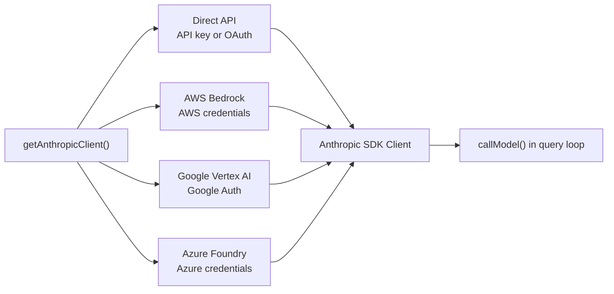
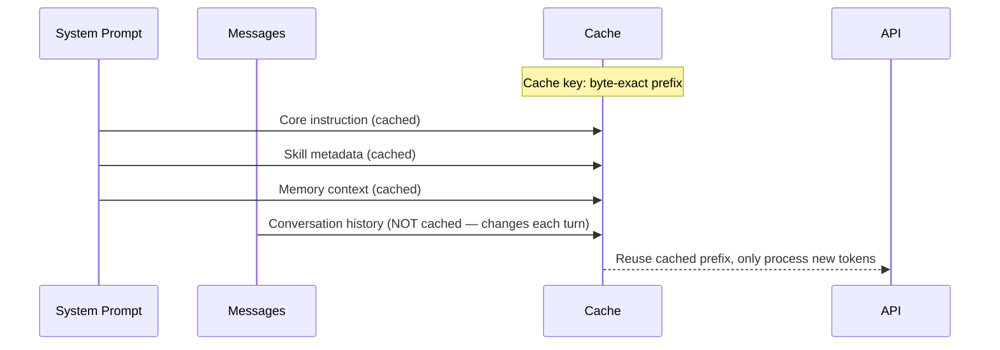

# 第 4 章：与 Claude 对话 — API 层

## 不只是 `fetch()`

前几章建立了 agent 的结构——启动流水线使其运行，双向状态架构管理配置和 UI。但 agent 最终必须与 Claude 对话。本章涵盖 API 层：模型客户端如何构建、system prompt 如何组装、流式如何处理、错误如何恢复，以及 prompt cache 如何在架构层面管理。

---

## 多 Provider 世界

Claude Code 通过四条不同的基础设施路径与 Claude 通信，全部对系统其余部分透明：



Anthropic SDK 为每个云 provider 提供包装类，呈现相同接口。`getAnthropicClient()` 工厂读取环境变量和配置确定使用哪个 provider，构建客户端并返回。从那一刻起，每个消费者将其视为通用 Anthropic 客户端。

Provider 选择在启动时确定并存储在 STATE 中。查询循环从不检查哪个 provider 活跃。从 Direct API 切换到 Bedrock 是配置变更，不是代码变更。

---

## System Prompt 构建

System prompt 不是写在单个文件中的。它从多个来源动态组装：核心指令、skill 元数据、memory 上下文、agent 定义、hook 结果和环境详情。

组装遵循一个原则：**稳定内容在前，易变内容在后。** Prompt cache 缓存每个请求前缀的字节精确表示。如果缓存前缀在请求之间改变——哪怕一个字节——整个缓存被无效化，系统为完全处理上下文支付全价。

```typescript
// 组装顺序
function buildSystemPrompt(context) {
  return [
    CORE_INSTRUCTION,           // 稳定：只在版本发布之间变化
    SKILL_METADATA,             // 稳定：只在 /reload 时变化
    MEMORY_CONTEXT,             // 半稳定：会话之间变化
    HOOK_RESULTS,               // 易变：每次查询可能变化
  ].join('\n\n')
}
```

`appendSystemContext()` 在查询循环每次迭代调用模型前，将 hook 结果和环境详情追加到 system prompt 末尾。这些追加不会破坏核心指令的缓存，因为它们在已缓存前缀之后。

---

## Slot Reservation：先猜 8K，猜错再升 64K

这是 API 层最巧妙的成本优化之一。真实的源码（`services/api/claude.ts`）：

```typescript
import { CAPPED_DEFAULT_MAX_TOKENS } from '../../utils/context.js'

export function getMaxOutputTokensForModel(model: string): number {
  const maxOutputTokens = getModelMaxOutputTokens(model)

  // Slot-reservation cap: drop default to 8k for all models. BQ p99 output
  // = 4,911 tokens; 32k/64k defaults over-reserve 8-16× slot capacity.
  // Requests hitting the cap get one clean retry at 64k (query.ts
  // max_output_tokens_escalate). Math.min keeps models with lower native
  // defaults (e.g. claude-3-opus at 4k) at their native value.
  const defaultTokens = isMaxTokensCapEnabled()
    ? Math.min(maxOutputTokens.default, CAPPED_DEFAULT_MAX_TOKENS)
    : maxOutputTokens.default

  return validateBoundedIntEnvVar(
    'CLAUDE_CODE_MAX_OUTPUT_TOKENS',
    process.env.CLAUDE_CODE_MAX_OUTPUT_TOKENS,
    defaultTokens,
    maxOutputTokens.upperLimit,
  ).effective
}
```

源码注释解释得很清楚：**"p99 输出 = 4,911 token"**——99% 的 API 响应输出不到 5000 token。但模型默认给你 32K 甚至 64K 的输出窗口。这意味着你预留了 6-12 倍你实际需要的容量。

API 按预留容量计费（更大的 `max_tokens` 意味着 API 要预留更多计算资源）。所以 Claude Code 的策略是：先"猜" 8K——覆盖 99.9% 的请求——猜错了再升级到 64K 重试一次。

当模型返回 `stop_reason: 'max_tokens'` 时（`services/api/claude.ts:2266`）：

```typescript
if (stopReason === 'max_tokens') {
  logEvent('tengu_max_tokens_reached', { max_tokens: maxOutputTokens })
  yield createAssistantAPIErrorMessage({
    content: `Claude's response exceeded the ${maxOutputTokens} output token maximum.`,
    apiError: 'max_output_tokens',
    error: 'max_output_tokens',
  })
}
```

然后 `query.ts` 中的恢复循环捕获此错误，将限额升级到 64K（`ESCALATED_MAX_TOKENS = 64_000`），并用更大的 `max_tokens` 重新请求。升级是持久的：一旦升级，它在当前查询的持续时间内保持 64K。下一次查询重置回 8K。

> 💡 **译注**：这个设计的经济学很简单。假设每次 API 调用：8K 窗口 = $0.01，64K 窗口 = $0.08。99% 的请求用 8K 就够了（$0.01）。1% 的请求需要 64K，但第一次 8K 尝试失败后重试——总共 $0.01 + $0.08 = $0.09，比直接全用 64K（每次 $0.08）略贵，但 99% 情况省了 $0.07。规模到数十万用户每天数百万请求，这个 "slot reservation" 技巧年化省百万美元以上。

---

## 错误恢复

API 层在向查询循环暴露错误之前尽可能恢复。分层是：重试、回退、压缩、中止。

**网络错误** 通过指数退避重试。只有临时错误被重试：5xx 状态码、连接重置、DNS 故障。4xx 错误立即传播。

**模型不可用** 触发 provider 回退。如果主 provider 失败，系统尝试后备模型——通常来自不同的 provider。

**Max output tokens** 触发 slot 升级。系统在升级的 output token 限制下重试相同请求。升级最多尝试 3 次。如果第三次升级后请求仍然 hit 64K 限制，系统接受部分结果并继续。

**Circuit breaker（断路器）** 防止灾难性循环。如果自动压缩连续失败三次，系统停止重试并返回错误。这阻止了 agent 在无限循环中反复烧毁 API 调用尝试恢复。

---

## Prompt Cache：不是优化，是架构赌注

Prompt caching 将处理上下文的成本降低约 90%。但 cache 是脆弱的：缓存前缀中改变一个字节就会完全无效化。



在请求之间稳定的 prompt 部分放在请求前面。易变的部分（对话历史、最新的工具结果）放在最后。API 为前缀使用缓存，只为新 token 收费。这种架构选择驱动了整个代码库中的决策：sticky latches（第 3 章）、skill 元数据格式、工具定义顺序、Fork agent 的逐字节相同前缀（第 9 章）。

---

## Apply This

**稳定内容在前，易变内容在后。** 在构建时考虑缓存键结构。System prompt、工具定义和静态上下文在前。对话历史和最新工具结果在最后。

**Slot reservation：为常见情况预留少，为罕见情况升级。** 默认 8K。仅在必要时升级到 64K。p99 = 4,911 token——大多数响应适合更小的窗口。

**分层错误恢复。** API 层处理网络错误、模型不可用和 prompt-too-long 响应。Agent loop 只看到成功或硬失败——不是原始 HTTP 错误。

**Provider 抽象是配置，不是代码。** 查询循环不应该知道或关心哪个云 provider 正在提供模型响应。Provider 选择发生在启动时并存储在 state 中。

**缓存稳定性是架构性的。** 影响缓存前缀中字节的每个决策——beta headers、system prompt 顺序、工具 schema 格式——都应该被视为 API 契约的一部分。
