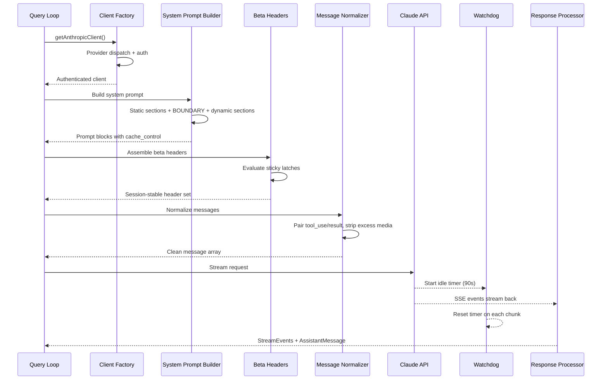
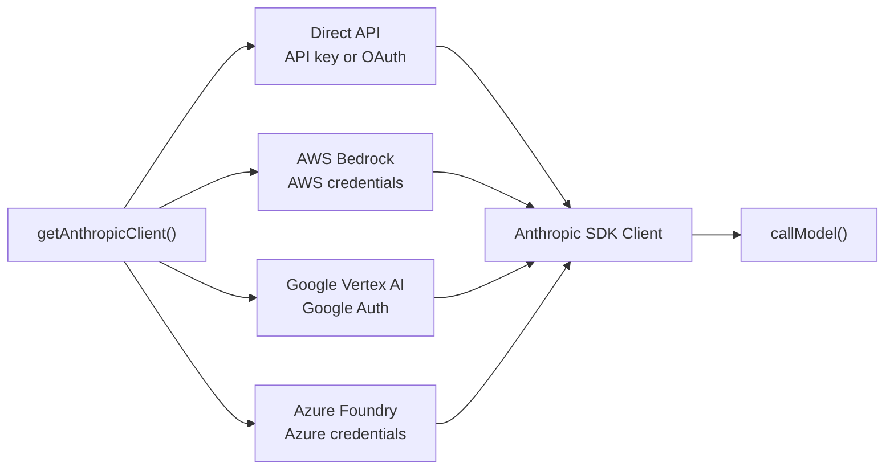
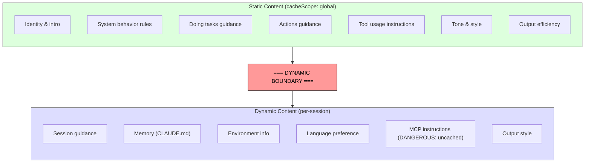

# 第 4 章：与 Claude 对话 — API 层

第 3 章建立了状态在哪以及两层如何通信。现在我们追踪当状态被投入使用时发生什么：系统需要与语言模型对话。Claude Code 中的一切——bootstrap 序列、状态系统、权限框架——都为了服务这一刻而存在。

这一层处理的故障模式比系统任何其他部分都多。它必须通过单一透明接口路由四个云 provider。它必须以逐字节意识到服务器 prompt cache 如何工作的方式构建 system prompt，因为一个放错位置的部分就会破坏价值 50,000+ token 的缓存。它必须用活跃故障检测流式处理响应，因为 TCP 连接可能静默断开。它必须维护会话稳定的不变量，以便会话中途的 feature flag 变化不会造成不可见的性能断崖。

让我们从头到尾追踪一次 API 调用。



---

## Multi-Provider 客户端工厂

`getAnthropicClient()` 函数是所有模型通信的单一工厂。它返回一个 Anthropic SDK 客户端，配置好目标部署的 provider：



分发完全由环境变量驱动，按固定优先级顺序评估。源码中的注释坦诚得令人耳目一新："我们一直在对返回类型撒谎"——所有四个 provider 特定的 SDK 类通过 `as unknown as Anthropic` 转换。这种有意的类型擦除意味着每个消费者看到统一的接口。代码库其余部分从不分支于 provider。

每个 provider SDK 是动态 import 的——`AnthropicBedrock`、`AnthropicFoundry`、`AnthropicVertex` 是带有自己依赖树的重型模块。动态 import 确保未使用的 provider 从不加载。Provider 选择在启动时确定并存储在 STATE 中。查询循环从不检查哪个 provider 活跃。

---

## System Prompt 构建

System prompt 是整个系统中最缓存敏感的工作。Claude API 提供服务端 prompt caching：跨请求相同 prompt 前缀可被缓存，既节省延迟又节省成本。

### Dynamic Boundary Marker

Prompt 被构建为一个带有关键分界线的字符串部分数组：



边界之前的一切跨会话、用户和组织相同——它获得最高级别服务端缓存。边界之后包含用户特定内容，降级到每会话缓存。节的命名约定故意很响亮。添加新节需要在 `systemPromptSection`（安全、缓存）和 `DANGEROUS_uncachedSystemPromptSection`（破坏缓存，需要理由字符串）之间选择。`_reason` 参数在运行时未使用，但作为强制性文档——每个破坏缓存的节都在源码中带有其理由。

### 2^N 问题

`prompts.ts` 中的注释解释了为什么条件节必须在边界之后：

> 这里的每个条件都是运行时的位，否则会使 Blake2b 前缀哈希变体相乘（2^N）。

边界之前的每个布尔条件都会使唯一全局缓存条目的数量翻倍。三个条件创建 8 个变体；五个创建 32 个。静态节是有意无条件的。编译时 feature flags（由打包器解析）在边界之前可以接受。运行时检查（这是 Haiku 吗？用户有 auto mode 吗？）必须放在边界之后。

这是一种直到你违反它才会注意到的约束。一个好意的工程师在边界之前添加一个用户设置门控的节，可能静默地碎片化全局缓存，并使机群的 prompt 处理成本翻倍。

> 💡 **译注**：理解 2^N 问题——假设 prompt 中有 3 个布尔条件："是否启用了 auto mode？"、"是否是 Pro 用户？"、"是否激活了 KAIROS？"。每个条件产生 2 个变体（true/false），组合后共有 2³=8 个不同的 prompt 前缀变体。每个变体需要自己的缓存条目。如果有 5 个条件，就有 2⁵=32 个变体。现在想象整个用户群的缓存被碎片化到 32 个不同的缓存键中——缓存命中率从 90% 可能跌到 50%。这就是为什么条件节必须放在边界之后——边界之后的内容不在全局缓存中，条件不会碎片化缓存。

---

## Slot Reservation

这是 API 层最巧妙的成本优化。真实源码（`services/api/claude.ts`）：

```typescript
export function getMaxOutputTokensForModel(model: string): number {
  const maxOutputTokens = getModelMaxOutputTokens(model)

  // Slot-reservation cap: drop default to 8k for all models. BQ p99 output
  // = 4,911 tokens; 32k/64k defaults over-reserve 8-16× slot capacity.
  // Requests hitting the cap get one clean retry at 64k (query.ts
  // max_output_tokens_escalate).
  const defaultTokens = isMaxTokensCapEnabled()
    ? Math.min(maxOutputTokens.default, CAPPED_DEFAULT_MAX_TOKENS)
    : maxOutputTokens.default

  return validateBoundedIntEnvVar(
    'CLAUDE_CODE_MAX_OUTPUT_TOKENS',
    process.env.CLAUDE_CODE_MAX_OUTPUT_TOKENS,
    defaultTokens,
    maxOutputTokens.upperLimit,
  ).effective
}
```

源码注释："p99 输出 = 4,911 token"——99% 的 API 响应少于 5000 token。但默认 max_tokens 是 32K-64K。预留你实际需要的 6-12 倍容量会产生不必要的 API 成本（更大的 `max_tokens` = API 预留更多计算资源）。策略：先猜 8K（覆盖 99.9%），猜错升级到 64K 重试一次。

当模型返回 `stop_reason: 'max_tokens'` 时：

```typescript
if (stopReason === 'max_tokens') {
  logEvent('tengu_max_tokens_reached', { max_tokens: maxOutputTokens })
  yield createAssistantAPIErrorMessage({
    content: `Claude's response exceeded the ${maxOutputTokens} output token maximum.`,
    apiError: 'max_output_tokens',
    error: 'max_output_tokens',
  })
}
```

然后在 `query.ts` 中，恢复循环捕获此错误，升级限额到 `ESCALATED_MAX_TOKENS = 64_000`，重新请求。升级在查询持续时间内持久，下一次查询重置回 8K。

---

## 流式处理

### 原始 SSE 而非 SDK 抽象

流式实现使用原始 `Stream<BetaRawMessageStreamEvent>` 而非 SDK 的 `BetaMessageStream`。原因：`BetaMessageStream` 在每个 `input_json_delta` 事件上调用 `partialParse()`。对于大型 JSON 输入的工具调用（数百行的文件编辑），这会在每个 chunk 上从头重新解析增长的 JSON 字符串——O(n²) 行为。Claude Code 自己处理工具输入累积，所以部分解析是纯粹的浪费。

### Idle Watchdog

TCP 连接可能静默死亡。SDK 的超时只覆盖初始 fetch——一旦 HTTP 200 到达，超时就被满足了。如果流式 body 停止，没有东西捕获它。

Watchdog：一个 `setTimeout`，在每个接收到的 chunk 上重置。如果 90 秒内没有 chunk 到达，流被中止，系统回退到非流式重试。在 45 秒标记触发警告。

### 非流式后备

当流式在中途失败（网络错误、停滞、截断），系统回退到同步 `messages.create()` 调用。这处理代理失败（代理返回 HTTP 200 但 body 不是 SSE，或截断了 SSE 流）。

---

## Prompt Cache 系统

Prompt caching 将处理上下文的成本降低约 90%。Cache 是脆弱的：缓存前缀中改变一个字节就完全无效化它。稳定内容在请求之间稳定的 prompt 部分放在前面。易变部分（对话历史、最新工具结果）放在最后。这种架构选择驱动了整个代码库中的决策：sticky latches（第 3 章）、skill 元数据格式、工具定义顺序、Fork agent 的逐字节相同前缀（第 9 章）。

---

## 错误恢复

**网络错误** 通过指数退避重试。只有临时错误（5xx、连接重置、DNS 故障）被重试。**模型不可用** 触发 provider 回退到后备模型。**Max output tokens** 触发 slot 升级（8K→64K，最多 3 次）。**Circuit breaker（断路器）** 防止自动压缩连续失败三次后的无限循环。

---

## Apply This

**稳定内容在前，易变内容在后。** 在构建时考虑缓存键结构。2^N 问题是真实存在的——边界之前的每个布尔条件翻倍全局缓存条目。

**Slot reservation：为常见情况预留少，为罕见情况升级。** p99 = 4,911 token。默认 8K。仅在模型命中上限时升级到 64K。

**流式处理需要活跃故障检测。** TCP 连接静默死亡。90 秒 idle watchdog + 非流式后备确保请求不会无限挂起。

**Provider 抽象是配置，而不是代码。** 查询循环不应该知道或关心哪个云 provider 正在提供模型响应。类型擦除使这个隔离成为可能。

**缓存稳定性是架构性的。** `DANGEROUS_uncachedSystemPromptSection` 的命名约定通过使成本可见来执行纪律。
