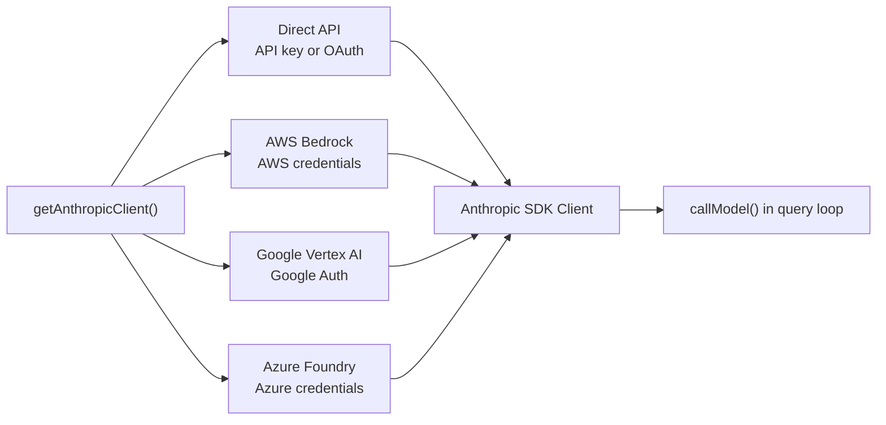
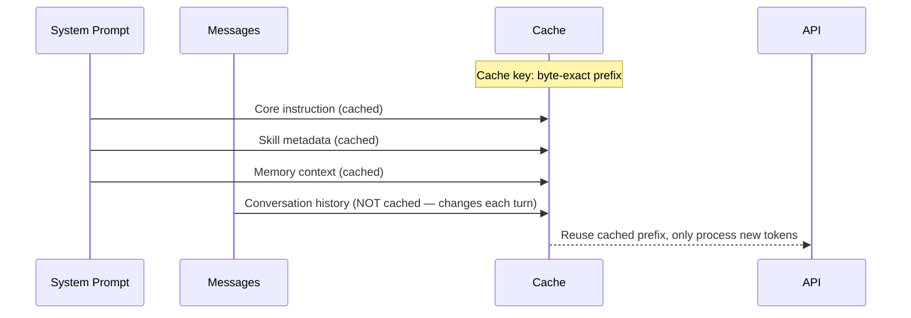

# 第 4 章：与 Claude 对话 — API 层

## 不只是 `fetch()`

前几章建立了 agent 的结构——启动流水线使其运行，以及双层状态架构。但 agent 最终必须与 Claude 对话。本章涵盖 API 层：模型客户端是如何构建的、system prompts 是如何组装的、流式是如何处理的、错误是如何恢复的，以及 prompt cache 是如何在整个架构中管理的。

---

## 模型客户端

### 多 Provider 世界

Claude Code 通过四条不同的基础设施路径与 Claude 通信，全部对系统的其余部分透明：



Anthropic SDK 为每个云 provider 提供包装类，呈现相同的接口。`getAnthropicClient()` 工厂读取环境变量和配置来确定使用哪个 provider，构建客户端，并返回它。从那一刻起，每个消费者都将其视为一个通用的 Anthropic 客户端。

Provider 选择在启动时确定并存储在 `STATE` 中。查询循环从不检查哪个 provider 处于活跃状态。从 Direct API 切换到 Bedrock 是一个配置变更，而不是代码变更。

### 模型选择

模型选择发生在两个层面。系统为每个功能维护一个默认模型：主循环模型、子 agent 模型、advisor 模型、compact 模型。用户可以通过 CLI 标志覆盖主循环模型。子 agent 可以通过 agent 定义覆盖其模型。覆盖瀑布式向下：agent 特定 → CLI 标志 → 系统默认。

模型字符串是 provider 无关的——如 `claude-sonnet-4-6`。API 层在构建请求参数时将逻辑名称映射到 provider 特定的模型 ID。

---

## System Prompt 构建

System prompt 不是在单个文件中编写的。它是从多个来源动态组装的：核心指令、skill 元数据、memory 上下文、agent 定义、hook 结果和环境详情。

组装遵循一个原则：稳定内容在前，易变内容在后。为什么？Prompt cache。Claude API 缓存每个请求前缀的字节精确表示。如果缓存前缀在请求之间改变——哪怕一个字节——整个缓存被无效化，系统为完全处理上下文支付全部 token 成本。

```typescript
// Pseudocode — prompt assembly order
function buildSystemPrompt(context) {
  return [
    CORE_INSTRUCTION,           // Stable: changes only between releases
    SKILL_METADATA,             // Stable: changes only on /reload
    MEMORY_CONTEXT,             // Semi-stable: changes between sessions
    HOOK_RESULTS,               // Volatile: changes per query
  ].join('\n\n')
}
```

核心指令和 skill 元数据几乎从不改变——它们是缓存前缀的主要受益者。memory 上下文在会话之间改变，但在会话期间稳定。Hook 结果可能每个查询都改变——它们去到最后面。

`appendSystemContext()` 函数在查询循环每次迭代时，在调用模型之前立即将 hook 结果和环境详情追加到 system prompt 上。这些追加不会破坏核心指令的缓存，因为它们在前缀之后。

---

## 流式处理

### AsyncGenerator 管道

查询循环调用 `callModel()`，它返回一个 `AsyncGenerator<StreamEvent>`。generator 产出解析后的流式事件：`text_delta`、`tool_use`、`thinking_delta`、`error`。

```typescript
// Pseudocode — streaming loop
for await (const event of callModel(params)) {
  switch (event.type) {
    case 'text_delta':
      buffer += event.text
      yield { type: 'text', text: event.text }
      break
    case 'tool_use':
      toolUseBlocks.push(event)
      needsFollowUp = true
      break
    case 'thinking_delta':
      thinking += event.thinking
      break
  }
}
```

generator 模式允许消费者以自己的速度拉取事件。如果 REPL 的 React 渲染器忙，generator 自然暂停——没有缓冲区溢出，没有丢失消息。

### Slot 预留

一个巧妙的优化：最大 output token 数默认为 8K。如果模型命中该限制（由 `stop_reason: 'max_tokens'` 指示），系统在后续请求中将限制升级到 64K。这在 99% 的请求中节省了上下文——大多数响应适合 8K，没必要为不需要的容量预留空间。

升级是持久的：一旦升级，它在当前查询的持续时间内保持 64K。下一次查询重置回 8K。

---

## 错误恢复

API 层在向查询循环公开错误之前尽可能恢复。分层是：重试、回退、压缩、中止。

**网络错误** 通过指数退避进行重试。第一次重试在 1 秒后，第二次在 2 秒后，第三次在 4 秒后——最多重试 3 次。只有临时错误被重试：5xx 状态码、连接重置、DNS 故障。4xx 错误（认证、权限、格式错误）立即传播。

**模型不可用**（503、超时）触发 provider 回退。如果主 provider 失败，系统尝试后备模型——通常来自不同的 provider。后备在 `QueryParams` 中配置，并且可以禁用。

**Prompt too long**（413 或 API 错误代码）触发响应式压缩。系统捕获错误，运行压缩循环，用压缩后的上下文重试原始请求。如果压缩不能在限制内充分减少上下文，错误传播给用户。

**Max output tokens** 触发 slot 升级。系统在升级的 output token 限制下重试相同请求。升级最多尝试 3 次。如果第三次升级后请求仍然 hit 64K 限制，系统接受部分结果并继续。

**Circuit breaker** 防止灾难性循环。如果自动压缩连续失败三次，系统停止重试并返回错误。这阻止了 agent 在无限循环中反复烧毁 API 调用尝试恢复。

---

## Prompt Cache

Prompt caching 不是优化——它是使 agent 经济可行的架构赌注。cache 将处理上下文的成本降低约 90%。但 cache 是脆弱的：缓存前缀中改变一个字节就会无效化整个 cache。



在请求之间稳定的 prompt 部分在请求中放在前面。易变的部分（对话历史、最新的工具结果）放在最后。API 为前缀使用缓存，只为新 token 收费。

这种架构选择驱动了整个代码库中的决策：sticky latches、skill 元数据格式、memory context 注入的顺序、工具描述中的 prompt 结构。Cache 稳定性是一个架构关注点——不是可选的优化。

---

## Apply This

**稳定内容在前，易变内容在后。** 如果你的 agent 使用带有 prompt caching 的 API，在构建时考虑缓存键结构。System prompt、工具定义和静态上下文在前。对话历史和最新工具结果在最后。

**Slot 预留：为常见情况预留少，为罕见情况升级。** 默认输出上限为 8K。仅在必要时升级。大多数响应适合较小的窗口——为它们付费是浪费。

**分层错误恢复。** 不要在查询循环中散布重试逻辑。API 层应在到达 agent loop 之前处理网络错误、model 不可用和 prompt-too-long 响应。Agent loop 应该看到成功或明确的失败——而不是原始 HTTP 错误。

**Provider 抽象是配置，不是代码。** 查询循环不应该知道或关心哪个云 provider 正在提供模型响应。provider 选择发生在启动时并存储在 state 中。Agent loop 对其他一切使用通用客户端。

**缓存稳定性是架构性的。** 影响缓存前缀中字节的每个决策——beta headers、system prompt 顺序、工具 schema 格式——都应该被视为 API 契约的一部分。一个字节的变化可以花费真实的金钱。
