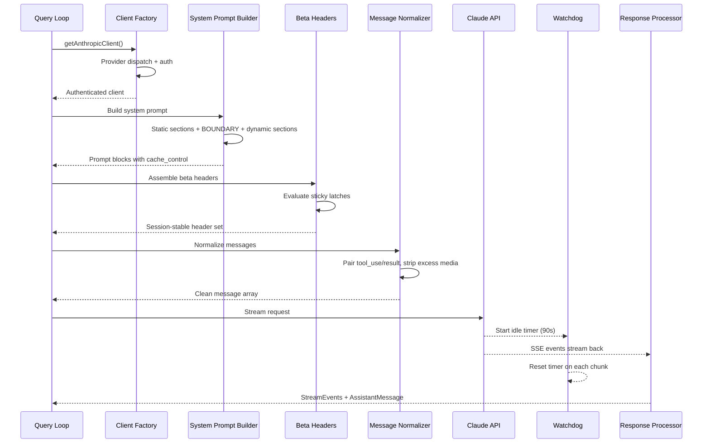
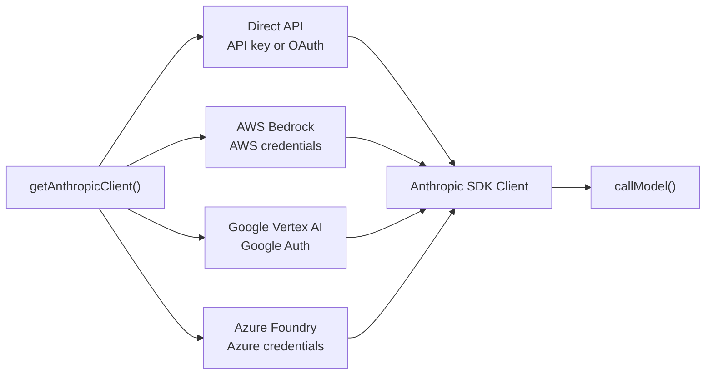
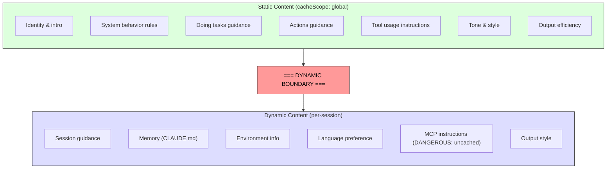

# 第 4 章：与 Claude 对话 — API 层

第 3 章建立了状态在哪以及两层如何通信。现在我们追踪当状态被投入使用时发生什么：系统需要与语言模型对话。Claude Code 中的一切——bootstrap 序列、状态系统、权限框架——都为了服务这一刻而存在。

这一层处理的故障模式比系统任何其他部分都多。它必须通过单一透明接口路由四个云 provider。它必须以逐字节意识到服务器 prompt cache 如何工作的方式构建 system prompt，因为一个放错位置的部分就会破坏价值 50,000+ token 的缓存。它必须用活跃故障检测流式处理响应，因为 TCP 连接可能静默断开。它必须维护会话稳定的不变量，以便会话中途的 feature flag 变化不会造成不可见的性能断崖。

让我们从头到尾追踪一次 API 调用。



---

## Multi-Provider 客户端工厂

`getAnthropicClient()` 函数是所有模型通信的单一工厂。它返回一个 Anthropic SDK 客户端，配置好目标部署的 provider：



分发完全由环境变量驱动，按固定优先级顺序评估。所有四个 provider 特定的 SDK 类通过 `as unknown as Anthropic` 转换。源码中的注释坦诚得令人耳目一新："我们一直在对返回类型撒谎"（"we have always been lying about the return type"）。这种有意的类型擦除意味着每个消费者看到统一的接口。代码库其余部分从不分支于 provider。

每个 provider SDK 是动态 import 的——`AnthropicBedrock`、`AnthropicFoundry`、`AnthropicVertex` 是带有自己依赖树的重型模块。动态 import 确保未使用的 provider 从不加载。

Provider 选择在启动时确定并存储在 bootstrap `STATE` 中。查询循环从不检查哪个 provider 活跃。从 Direct API 切换到 Bedrock 是配置变更，而非代码变更。

### buildFetch 包装器

每个出站 fetch 被包装以注入 `x-client-request-id` 头——每个请求生成的 UUID。当请求超时时，服务器从不为响应分配请求 ID。没有客户端 ID，API 团队无法将超时与服务端日志关联。此头填补了这一空白。它仅发送到 Anthropic 一方 endpoint——第三方 provider 可能拒绝未知头。

> 💡 **译注**：这看起来是个小细节，但对线上排障至关重要。Claude Code 的日志系统在整个请求链路中携带 `x-client-request-id`：API 层发起请求时生成 UUID 注入 header → 如果超时或出错，watchdog 触发时携带此 ID → 日志和遥测将该 ID 与服务端报告关联。没有这个 ID，生产环境中"某次请求为什么超时了"是无法回答的。

---

## System Prompt 构建

System prompt 是整个系统中最缓存敏感的工件。Claude API 提供服务端 prompt caching：跨请求相同 prompt 前缀可被缓存，既节省延迟又节省成本。一个 200K-token 对话可能有 50-70K token 与前一轮相同。破坏该缓存迫使服务器重新处理全部内容。

> 💡 **译注：Prompt Cache 是怎么工作的？** 先理解缓存机制，后面的边界和 2^N 问题才能看懂。
>
> Anthropic 的服务端缓存是这样运作的：API 收到请求后，对 system prompt + tools + messages 拼成的完整 prompt 计算一个 Blake2b 哈希。如果这个哈希的前缀（从第一个字节开始）和之前某个请求的完全一致，就命中缓存——相同的 token 不再重新计算，直接复用结果，给 **90% 折扣**。
>
> 关键是"前缀"二字。缓存只匹配**从开头到某个点为止**的连续内容。举个例子：
>
> ```
> 请求 A: [System Prompt 的 4000 tokens] [用户对话 5000 tokens]
> 请求 B: [System Prompt 的 4000 tokens] [用户对话 8000 tokens]  ← 前 4000 tokens 和 A 一样，命中缓存
> 请求 C: [不同的 System Prompt] [用户对话 5000 tokens]           ← 第一个 token 就不同，全未命中
> ```
>
> 所以 prompt 的顺序极其重要：**相同的内容放前面，不同的放后面**。前面的命中缓存，后面的按新内容处理。这就是为什么 static 内容（对所有人都相同）必须放在 dynamic 内容（每人每会话不同）之前。

### Dynamic Boundary Marker

有了上面这个前提，Dynamic Boundary Marker 的设计就清楚了。Prompt 被构建为一个带有关键分界线的字符串部分数组：



边界之前的一切跨会话、用户和组织相同——它获得最高级别服务端缓存。边界之后包含用户特定内容，降级到每会话缓存。

节的命名约定故意很响亮。添加新节需要在 `systemPromptSection`（安全，可缓存）和 `DANGEROUS_uncachedSystemPromptSection`（破坏缓存，需要理由字符串）之间选择。`_reason` 参数在运行时未使用，但作为强制性文档——每个破坏缓存的节都在源码中带有其理由。

### 2^N 问题

`prompts.ts` 中的注释解释了为什么条件节必须在边界之后：

> 这里的每个条件都是运行时的位，否则会使 Blake2b 前缀哈希变体相乘（2^N）。

理解 2^N 问题需要一个具体场景。假设在边界*之前*（global cache 区域）有三个条件节：

```
"你是 Haiku 模型吗？"     → 是/否 = 2 种 prompt
"用户开了 auto mode 吗？" → 是/否 = 2 种 prompt  
"用户是 Pro 订阅吗？"     → 是/否 = 2 种 prompt
```

每个条件产生 2 个 prompt 变体（条件插入不同的文本）。组合起来不是 2+2+2=6，而是 **2×2×2=8** 个不同的 prompt 前缀。每个前缀需要自己的缓存条目。

```
用户 A: Haiku=是, auto=否, Pro=否 → prompt 前缀变体 #1 → 缓存条目 #1
用户 B: Haiku=否, auto=是, Pro=是 → prompt 前缀变体 #8 → 缓存条目 #8
```

如果有 5 个条件，就是 2⁵=32 个变体。现在想象 100 万用户——他们的请求分散到 32 个不同的缓存键上。原本可以 90% 命中的缓存，命中率可能掉到 30%。每个条件单独看都无害，但组合起来就是**缓存碎片化**。

这就是为什么"静态节是有意无条件的"——边界之前的 section 不能包含 `if (isHaiku)` 或 `if (userHasAutoMode)` 这种运行时分支。编译时 feature flags（打包时就确定的，运行时不变）可以放前面。运行时检查（依赖用户状态、会话状态）必须放边界之后——边界之后的内容不在 global cache 里，条件不会碎片化全局缓存。

> 💡 **译注**：这是一个"直到你违反它才会注意到的约束"。一个工程师在边界之前加了一个"如果是 Pro 用户就加这段提示"的条件节，代码 review 看不出来问题——逻辑上完全正确。但上线后，全局缓存命中率从 85% 掉到 70%，乘以数百万用户，每个 API 调用多处理 20K token。没有人报 bug，没有一个测试会失败，但账单翻了一倍。这就是所谓"静默碎片化"——成本增加你看不见。

---

## 流式处理

### 原始 SSE 而非 SDK 抽象

流式实现使用原始 `Stream<BetaRawMessageStreamEvent>` 而非 SDK 高层的 `BetaMessageStream`。原因：`BetaMessageStream` 在每个 `input_json_delta` 事件上调用 `partialParse()`。对于大型 JSON 输入的工具调用（数百行的文件编辑），这会在每个 chunk 上从头重新解析增长的 JSON 字符串——O(n²) 行为。Claude Code 自己处理工具输入累积，所以部分解析是纯粹的浪费。

### Idle Watchdog

TCP 连接可能静默死亡。服务器可能崩溃，负载均衡器可能静默断开连接，或企业代理可能超时。SDK 的请求超时只覆盖初始 fetch——一旦 HTTP 200 到达，超时就被满足了。如果流式 body 停止，没有东西捕获它。

Watchdog：一个 `setTimeout`，在每个接收到的 chunk 上重置。如果 90 秒内没有 chunk 到达，流被中止，系统回退到非流式重试。在 45 秒标记触发警告。当 watchdog 触发时，它用客户端请求 ID 记录事件以便关联。

### 非流式后备

当流式在中途失败（网络错误、停滞、截断），系统回退到同步 `messages.create()` 调用。这处理代理失败（代理返回 HTTP 200 但 body 不是 SSE，或截断了 SSE 流）。

当流式工具执行活跃时，可以禁用 fallback，因为 fallback 会重新执行整个请求并可能运行工具两次。

---

## Prompt Cache 系统

### 三个层级

Prompt caching 在三个层级运作：

**Ephemeral cache**（默认）：按会话缓存，服务器定义的 TTL（~5 分钟）。所有用户获得此级别。

**1 小时 TTL**：符合条件的用户获得扩展缓存。资格由订阅状态确定并锁定在 bootstrap state 中——第 3 章的 `promptCache1hEligible` sticky latch 确保会话中途的额度翻转不会改变 TTL。

**Global scope**：System prompt 缓存条目获得跨会话、跨组织共享。Prompt 的静态部分对所有 Claude Code 用户相同，因此单个缓存副本服务所有人。当 MCP 工具存在时，Global scope 被禁用，因为 MCP 工具定义是用户特定的，会将缓存碎片化为数百万个唯一前缀。

### Sticky Latches 的实际运作

第 3 章的五个 sticky latch 在此处、在请求构建期间被评估。每个 latch 从 `null` 开始，一旦设置为 `true`，在整个会话中保持 `true`。latch 块上方的注释精确表述："用于动态 beta 头的 Sticky-on latch。每个头，一旦首次发送，在会话其余时间持续发送，以便会话中途的切换不会改变服务端缓存键并破坏约 50-70K token。"

参见第 3 章 3.1 节了解 latch 模式、五个具体 latch 的完整解释，以及为什么 always-send-all-headers 不是正确的解决方案。

---

## queryModel Generator

`queryModel()` 函数是一个编排整个 API 调用生命周期的 async generator（约 700 行）。它产出 `StreamEvent`、`AssistantMessage` 和 `SystemAPIErrorMessage` 对象。

请求组装遵循精心排序的序列：

1. **Kill switch 检查**——最昂贵模型层级的安全阀
2. **Beta header 组装**——模型特定，应用 sticky latch
3. **工具 schema 构建**——通过 `Promise.all()` 并行，延迟工具在发现前排除
4. **消息规范化**——修复孤立的 tool_use/tool_result 不匹配、剥离多余媒体、移除过期块
5. **System prompt 块构建**——在动态边界处分割，分配缓存范围
6. **带重试包装的流式处理**——处理 529（过载）、模型 fallback、thinking 降级、OAuth 刷新

### Output Token 上限

默认 output 上限是 8,000 token，而非典型的 32K 或 64K。生产数据表明 p99 输出 = 4,911 token——标准限制超额预留 8-16 倍。当响应命中上限时（<1% 请求），获得一次干净的 64K 重试。这在机群规模上节省了大量成本。

### 错误处理和重试

`withRetry()` 函数本身是一个产出 `SystemAPIErrorMessage` 事件的 async generator，以便 UI 可以显示重试状态。重试策略：

- **529（过载）**：等待并重试，可选降级 fast mode
- **模型 fallback**：主模型失败，尝试 fallback（例如 Opus 到 Sonnet）
- **Thinking 降级**：上下文窗口溢出触发减少 thinking 预算
- **OAuth 401**：刷新 token 并重试一次

Generator 模式意味着重试进度（"服务器过载，5 秒后重试……"）作为事件流的自然部分出现，而非侧通道通知。

> 💡 **译注**：`withRetry()` 是一个 generator 包装器——它不是抛出异常然后被上层捕获，而是 yield `SystemAPIErrorMessage` 事件。这带来两个好处：(1) UI 可以即时显示重试状态而不需要额外的通知通道；(2) 调用者通过 `for await` 循环自然接收重试进度，不需要 try-catch 嵌套。

---

## Apply This

**将 prompt caching 视为架构约束，而非功能开关。** 大多数 LLM 应用"开启"缓存。Claude Code 将其视为塑造 prompt 排序、节 memoization、header latching 和配置管理的设计约束。结构良好的 prompt（50K token 缓存命中）与结构不良的 prompt（每轮完整重新处理）之间的差异，是系统中最大的成本杠杆。

**对代价高昂的逃生口使用 DANGEROUS 命名约定。** 当代码库有一个容易意外违反的不变量时，用响亮的前缀命名逃生口做三件事：使违规在代码审查中可见、强制文档（必需的 reason 参数）、并创造朝向安全默认值的心理摩擦。这适用于超出缓存的任何具有不可见成本的操作。

**构建流式处理时使用 watchdog，而不仅仅是超时。** SDK 的请求超时在 HTTP 200 时就被满足了，但响应 body 可能在任何时刻停止到达。一个在每个 chunk 上重置的 `setTimeout` 捕获这种情况。非流式 fallback 处理代理故障模式（HTTP 200 但非 SSE body、中间截断的 SSE 流），这些在企业环境中比你预期的更常见。

**使重试策略基于 yield 而非基于异常。** 通过使重试包装器成为产出状态事件的 async generator，调用者将重试进度显示为事件流的自然部分。模型 fallback 模式（Opus 失败，尝试 Sonnet）对生产韧性特别有用。

**将快速路径与完整流水线分开。** 并非每个 API 调用都需要工具搜索、advisor 集成、thinking 预算和流式基础设施。Claude Code 的 `queryHaiku()` 函数为内部操作（压缩、分类）提供了精简路径，跳过了所有 agentic 关注点。一个带有简化接口的单独函数防止意外的复杂性泄漏。

---

## 展望

API 层位于后续一切的基础之上。第 5 章将展示查询循环如何使用流式响应驱动工具执行——包括工具在模型完成响应之前就开始执行。第 6 章将解释压缩系统如何在对话接近上下文限制时保持缓存效率。第 7 章将展示每个 agent 线程如何获得自己的消息数组和请求链。

所有这些系统都继承了此处建立的约束：缓存稳定性作为架构不变量、通过客户端工厂实现 provider 透明性、以及通过 latch 系统实现会话稳定配置。API 层不仅仅发送请求——它定义了所有其他系统运作的规则。
