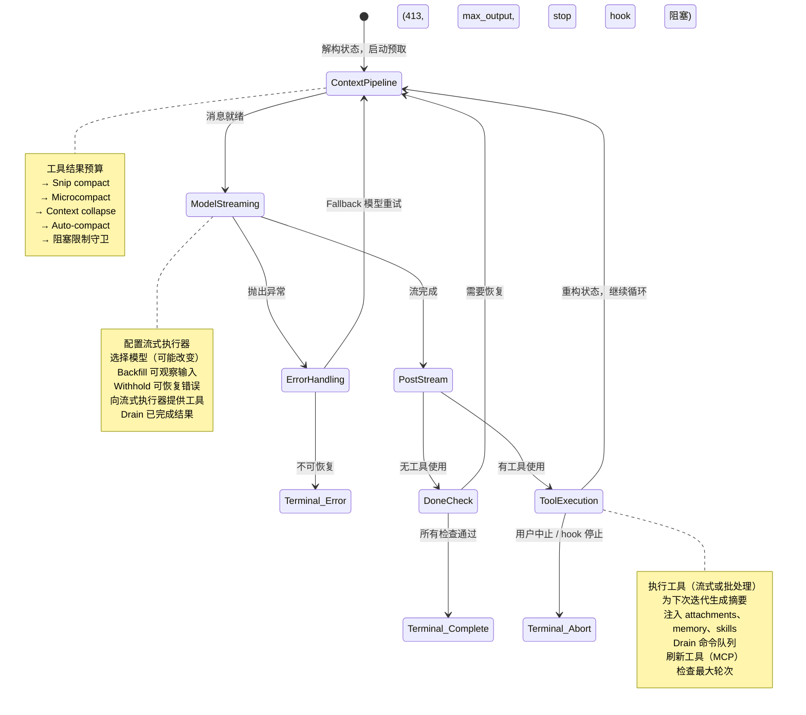
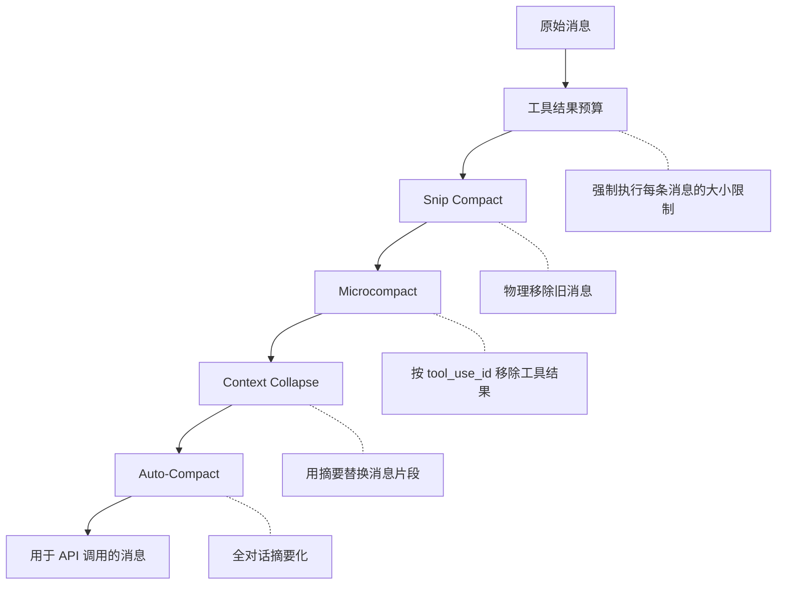
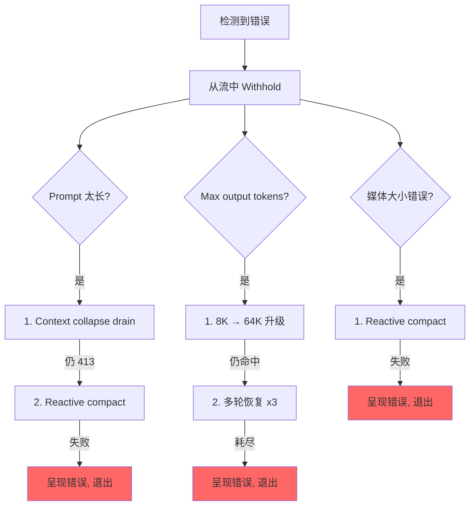

# 第 5 章：Agent 循环

## 跳动的心脏

第 4 章展示了 API 层如何将配置转换为流式 HTTP 请求——客户端如何构建、system prompt 如何组装、响应如何作为 server-sent events 到达。该层处理与模型*对话的机制*。但单次 API 调用不是 agent。Agent 是一个循环：调用模型，执行工具，将结果反馈回去，再次调用模型，直到工作完成。

每个系统都有一个重心。在数据库中，是存储引擎。在编译器中，是中间表示。在 Claude Code 中，是 `query.ts`——一个 1,730 行的文件，包含运行每次交互的 async generator，从 REPL 的第一次按键到 headless `--print` 调用的最后一次工具调用。

这不是夸张。存在且仅存在一个代码路径与模型对话、执行工具、管理上下文、从错误中恢复并决定何时停止。那个代码路径就是 `query()` 函数。REPL 调用它。SDK 调用它。子 agent 调用它。Headless runner 调用它。如果你在使用 Claude Code，你就在 `query()` 里面。

这个文件是密集的，但它的复杂不像纠缠的继承层次那样复杂。它像潜艇一样复杂：一个单一的船体，带有很多冗余系统，每一个都因为海洋找到了一条进来的路而添加。每个 `if` 分支都有一个故事。每个被 withhold 的错误消息代表一个真实的 bug，其中某个 SDK 消费者在恢复中途断开连接。每个 circuit breaker 阈值都是根据真实会话调整的，那些会话在无限循环中烧毁了数千次 API 调用。

本章从头到尾追踪整个循环。到最后，你不仅会理解发生了什么，还会理解为什么每个机制存在以及没有它什么会崩溃。

---

## 为什么是 Async Generator

第一个架构问题：为什么 agent loop 是 generator 而不是基于回调的事件发射器？

```typescript
// 简化版——展示概念，而非精确类型
async function* agentLoop(params: LoopParams): AsyncGenerator<Message | Event, TerminalReason>
```

实际签名产出多种消息和事件类型，并返回一个编码了循环为何停止的可辨识联合类型。

三个原因，按重要性排列。

**背压（Backpressure）。** 事件发射器不管消费者是否准备好就触发。Generator 只在消费者调用 `.next()` 时才产出。当 REPL 的 React 渲染器正忙于绘制前一帧时，generator 自然暂停。当 SDK 消费者正在处理工具结果时，generator 等待。没有缓冲区溢出，没有丢失的消息，没有"快生产者/慢消费者"问题。

**返回值语义。** Generator 的返回类型是 `Terminal`——一个可辨识联合类型，精确编码循环为何停止。是正常完成？用户中止？token 预算耗尽？stop hook 介入？达到最大轮次限制？不可恢复的模型错误？一共有 10 种不同的终端状态。调用者不需要订阅"结束"事件并祈祷 payload 包含原因。他们从 `for await...of` 或 `yield*` 获得类型化的返回值。

**通过 `yield*` 的可组合性。** 外部 `query()` 函数通过 `yield*` 委托给 `queryLoop()`，透明转发每个产出值和最终返回。子 generator 如 `handleStopHooks()` 使用相同的模式。这创建了一个清晰的职责链，没有回调，没有嵌套 promise，没有事件转发样板代码。

这个选择有代价——JavaScript 中的 async generator 不能被"倒回"或 fork。但 agent loop 两者都不需要。它是一个严格向前移动的状态机。

还有一个微妙之处：`function*` 语法使函数*惰性*。函数体在第一次 `.next()` 调用前不执行。这意味着 `query()` 立即返回——所有重量级初始化（配置快照、memory 预取、budget tracker）只在消费者开始拉取值时才发生。在 REPL 中，这意味着 React 渲染管道在循环第一行运行前就已就绪。

---

## 调用者提供什么

在追踪循环之前，了解输入是有帮助的：

```typescript
// 简化版——展示关键字段
type LoopParams = {
  messages: Message[]
  prompt: SystemPrompt
  permissionCheck: CanUseToolFn
  context: ToolUseContext
  source: QuerySource         // 'repl', 'sdk', 'agent:xyz', 'compact' 等
  maxTurns?: number
  budget?: { total: number }  // API 级 task budget
  deps?: LoopDeps             // 为测试注入
}
```

值得注意的字段：

- **`querySource`**：一个字符串鉴别器，如 `'repl_main_thread'`、`'sdk'`、`'agent:xyz'`、`'compact'` 或 `'session_memory'`。许多条件分支依赖此字段。Compact agent 使用 `querySource: 'compact'` 以使阻塞限制守卫不死锁（compact agent 需要运行来*减少* token 计数）。

- **`taskBudget`**：API 级的 task budget（`output_config.task_budget`）。与 `+500k` 的 auto-continue token 预算功能不同。`total` 是整个 agentic turn 的预算，`remaining` 是根据累积 API 使用量每迭代计算的，并跨 compaction 边界调整。

- **`deps`**：可选的依赖注入。默认为 `productionDeps()`。这是测试替换假模型调用、假压缩和确定性 UUID 的接缝。

- **`canUseTool`**：一个返回给定工具是否被允许的函数。这是权限层——它检查信任设置、hook 决策和当前权限模式。

---

## 两层入口点

公共 API 是围绕真实循环的一个薄包装：

```typescript
// 伪代码——展示两层结构
export async function* query(params: QueryParams): AsyncGenerator<...> {
  const consumed = []
  const terminal = yield* queryLoop(params, consumed)
  for (const cmd of consumed) {
    notifyCommandLifecycle(cmd, 'completed')
  }
  return terminal
}
```

外部函数包装内部循环，跟踪在 turn 期间消费了哪些排队命令。内部循环完成后，消费的命令被标记为 `'completed'`。在 turn 期间排队的命令（通过 `/` 斜杠命令或任务通知）在循环内被标记为 `'started'`，在包装器中标记为 `'completed'`。如果循环抛出或 generator 通过 `.return()` 关闭，完成通知永远不会触发——这是故意的——一个失败的 turn 不应该将命令标记为成功处理。

---

## 状态对象

循环将状态携带在单一类型化对象中：

```typescript
// 简化版——展示关键字段
type LoopState = {
  messages: Message[]
  context: ToolUseContext
  turnCount: number
  transition: Continue | undefined
  // ... 加上恢复计数器、压缩跟踪、pending 摘要等
}
```

十个字段。每个都有其存在的理由：

| 字段 | 为何存在 |
|------|----------|
| `messages` | 对话历史，每次迭代增长 |
| `toolUseContext` | 可变上下文：工具、中止控制器、agent 状态、选项 |
| `autoCompactTracking` | 跟踪压缩状态：turn 计数器、turn ID、连续失败次数、是否已压缩 |
| `maxOutputTokensRecoveryCount` | 对 output token 限制的多轮恢复尝试次数（最多 3 次） |
| `hasAttemptedReactiveCompact` | 一次性守卫，防止无限 reactive compact 循环 |
| `maxOutputTokensOverride` | 升级时设为 64K，之后清除 |
| `pendingToolUseSummary` | 来自上一轮迭代的 Haiku 摘要 promise，在当前流式期间 resolve |
| `stopHookActive` | 防止在阻塞重试后重新运行 stop hooks |
| `turnCount` | 单调计数器，对照 `maxTurns` 检查 |
| `transition` | 上一轮迭代为何继续——首次迭代时为 `undefined` |

### 可变循环中的不可变转换

以下是循环中每个 `continue` 语句处出现的模式：

```typescript
const next: State = {
  messages: [...messagesForQuery, ...assistantMessages, ...toolResults],
  toolUseContext: toolUseContextWithQueryTracking,
  autoCompactTracking: tracking,
  turnCount: nextTurnCount,
  maxOutputTokensRecoveryCount: 0,
  hasAttemptedReactiveCompact: false,
  pendingToolUseSummary: nextPendingToolUseSummary,
  maxOutputTokensOverride: undefined,
  stopHookActive,
  transition: { reason: 'next_turn' },
}
state = next
```

每个 continue 点构造一个完整的全新 `State` 对象。不是 `state.messages = newMessages`，不是 `state.turnCount++`。完整的重建。好处是每个转换都是自文档化的。你可以阅读任何 `continue` 点，准确看到哪些字段变化、哪些保持不变。新状态的 `transition` 字段记录了循环*为何*继续——测试对此进行断言以验证正确的恢复路径被触发。

---

## 循环体

以下是单次迭代的完整执行流程，压缩为骨架：



这就是整个循环。Claude Code 中的每个功能——从 memory 到子 agent 到错误恢复——都馈入或消费自这个单一的迭代结构。

---

## 上下文管理：四层压缩

在每次 API 调用之前，消息历史经过最多四个上下文管理阶段。它们按特定顺序运行，这个顺序很重要。



### 第 0 层：工具结果预算

在任何压缩之前，`applyToolResultBudget()` 对工具结果强制执行每条消息的大小限制。没有有限 `maxResultSizeChars` 的工具被豁免。

### 第 1 层：Snip Compact

最轻量的操作。Snip 物理移除消息数组中的旧消息，产出一个边界消息向 UI 标记移除。它报告释放了多少 token，该数字被传递给 auto-compact 的阈值检查。

### 第 2 层：Microcompact

Microcompact 移除不再需要的工具结果，按 `tool_use_id` 识别。对于缓存的 microcompact（编辑 API 缓存的），边界消息推迟到 API 响应之后。原因是：客户端 token 估算不可靠。API 响应中的实际 `cache_deleted_input_tokens` 能告诉你真正释放了什么。

### 第 3 层：Context Collapse

Context collapse 用摘要替换对话片段。它在 auto-compact 之前运行，这个顺序是故意的：如果 collapse 将上下文降低到 auto-compact 阈值以下，auto-compact 变成空操作。这保留了细粒度的上下文，而不是用单一的整体摘要替换一切。

### 第 4 层：Auto-Compact

最重量级的操作：它 fork 整个 Claude 对话来摘要化历史。实现有一个 circuit breaker——连续 3 次失败后，停止尝试。这防止了生产中观察到的噩梦场景：在上下文限制之上的会话在无限的 compact-fail-retry 循环中每天烧毁 250K API 调用。

### Auto-Compact 阈值

阈值从模型的上下文窗口派生：

```
effectiveContextWindow = contextWindow - min(modelMaxOutput, 20000)

阈值（相对于 effectiveContextWindow）：
  Auto-compact 触发:      effectiveWindow - 13,000
  阻塞限制（硬限制）:      effectiveWindow - 3,000
```

| 常量 | 值 | 用途 |
|------|-----|------|
| `AUTOCOMPACT_BUFFER_TOKENS` | 13,000 | auto-compact 触发器在有效窗口以下的余量 |
| `MANUAL_COMPACT_BUFFER_TOKENS` | 3,000 | 保留空间以便 `/compact` 仍能工作 |
| `MAX_CONSECUTIVE_AUTOCOMPACT_FAILURES` | 3 | Circuit breaker 阈值 |

13,000-token 缓冲区意味着 auto-compact 远在硬限制之前触发。auto-compact 阈值和阻塞限制之间的间隙是 reactive compact 操作的地方——如果主动 auto-compact 失败或被禁用，reactive compact 捕获 413 错误并按需压缩。

### Token 计数

规范函数 `tokenCountWithEstimation` 结合了权威的 API 报告 token 计数（来自最近响应）和针对该响应后添加的消息的粗略估算。近似是保守的——它倾向于更高的计数，这意味着 auto-compact 略微提前触发而不是略微延迟。

---

## 模型流式处理

### callModel() 循环

API 调用发生在一个启用模型 fallback 的 `while(attemptWithFallback)` 循环内：

```typescript
let attemptWithFallback = true
while (attemptWithFallback) {
  attemptWithFallback = false
  try {
    for await (const message of deps.callModel({ messages, systemPrompt, tools, signal })) {
      // 处理每个流式消息
    }
  } catch (innerError) {
    if (innerError instanceof FallbackTriggeredError && fallbackModel) {
      currentModel = fallbackModel
      attemptWithFallback = true
      continue
    }
    throw innerError
  }
}
```

启用时，一个 `StreamingToolExecutor` 在流式处理期间一旦 `tool_use` 块到达就开始执行工具——而不是在完整响应完成后。工具如何编排为并发批次是第 7 章的主题。

### Withholding 模式

这是文件中最重要的模式之一。可恢复错误被抑制，不产到 yield 流中：

```typescript
let withheld = false
if (contextCollapse?.isWithheldPromptTooLong(message)) withheld = true
if (reactiveCompact?.isWithheldPromptTooLong(message)) withheld = true
if (isWithheldMaxOutputTokens(message)) withheld = true
if (!withheld) yield yieldMessage
```

为什么 withhold？因为 SDK 消费者——Cowork、桌面应用——在任何带有 `error` 字段的消息上终止会话。如果你 yield 一个 prompt-too-long 错误然后通过 reactive compaction 成功恢复，消费者已经断开连接了。恢复循环继续运行，但没人在监听。所以错误被 withhold，推送到 `assistantMessages` 以便下游恢复检查能找到它。如果所有恢复路径都失败，被 withhold 的消息最终被呈现出来。

### 模型 Fallback

当捕获到 `FallbackTriggeredError`（主模型高负载）时，循环切换模型并重试。但 thinking 签名是模型绑定的——将一个模型的 protected-thinking 块重放到不同的 fallback 模型会导致 400 错误。代码在重试前剥离签名块。失败尝试中的所有孤立 assistant 消息被 tombstone 处理，以便 UI 移除它们。

---

## 错误恢复：升级阶梯

query.ts 中的错误恢复不是单一策略。它是一个越来越激进的干预阶梯，每个在前一个失败时触发。



### 死亡螺旋守卫

最危险的故障模式是无限循环。代码有多重守卫：

1. **`hasAttemptedReactiveCompact`**：一次性标志。Reactive compact 每种错误类型只触发一次。
2. **`MAX_OUTPUT_TOKENS_RECOVERY_LIMIT = 3`**：多轮恢复尝试的硬上限。
3. **Auto-compact 的 circuit breaker**：连续 3 次失败后，auto-compact 完全停止尝试。
4. **错误响应不触发 stop hooks**：当最后一条消息是 API 错误时，代码显式在到达 stop hooks 之前返回。注释解释："error -> hook blocking -> retry -> error -> ...（hook 每个周期注入更多 token）。"
5. **跨 stop hook 重试保留 `hasAttemptedReactiveCompact`**：当 stop hook 返回阻塞错误并强制重试时，reactive compact 守卫被保留。注释记录了该 bug："在此处重置为 false 导致了烧毁数千次 API 调用的无限循环。"

这些守卫中的每一个都是因为有人在生产中遇到了故障模式而添加的。

---

## 实例演示："修复 auth.ts 中的 Bug"

为了让循环具体化，让我们追踪一个真实的交互，经过三次迭代。

**用户输入：** `Fix the null pointer bug in src/auth/validate.ts`

**迭代 1：模型读取文件。**

循环进入。上下文管理运行（不需要压缩——对话很短）。模型流式输出响应："让我看看这个文件。"它发出一个 `tool_use` 块：`Read({ file_path: "src/auth/validate.ts" })`。流式执行器看到一个并发安全的工具并立即启动它。当模型完成响应文本时，文件内容已经在内存中了。

流后处理：模型使用了工具，所以我们进入 tool-use 路径。Read 结果（带行号的文件内容）被推送到 `toolResults`。一个 Haiku 摘要 promise 在后台启动。状态用新消息重构，`transition: { reason: 'next_turn' }`，循环继续。

**迭代 2：模型编辑文件。**

上下文管理再次运行（仍低于阈值）。模型流式输出："我看到第 42 行的 bug——`userId` 可能为 null。"它发出 `Edit({ file_path: "src/auth/validate.ts", old_string: "const user = getUser(userId)", new_string: "if (!userId) return { error: 'unauthorized' }\nconst user = getUser(userId)" })`。

Edit 不是并发安全的，所以流式执行器将其排队直到响应完成。然后 14 步执行流水线启动：Zod 验证通过，input backfill 展开路径，PreToolUse hook 检查权限（用户批准），编辑被应用。迭代 1 的 pending Haiku 摘要在流式期间 resolve——其结果作为 `ToolUseSummaryMessage` 产出。状态重构，循环继续。

**迭代 3：模型声明完成。**

模型流式输出："我已通过添加 guard clause 修复了 null pointer bug。"没有 `tool_use` 块。我们进入"完成"路径。Prompt-too-long 恢复？不需要。Max output tokens？否。Stop hooks 运行——没有阻塞错误。Token 预算检查通过。循环返回 `{ reason: 'completed' }`。

总计：三次 API 调用，两次工具执行，一次用户权限提示。循环处理了流式工具执行、与 API 调用重叠的 Haiku 摘要化，以及完整的权限流水线——全部通过同一个 `while(true)` 结构。

---

## Token 预算

用户可以为一次 turn 请求 token 预算（例如 `+500k`）。预算系统决定模型完成响应后是继续还是停止。

`checkTokenBudget` 用三条规则做出二元继续/停止决策：

1. **子 agent 总是停止。** 预算仅是顶层的概念。
2. **完成阈值在 90%。** 如果 `turnTokens < budget * 0.9`，继续。
3. **收益递减检测。** 3 次以上继续后，如果当前和上一次增量都低于 500 token，提前停止。模型每次继续产生的输出越来越少。

当决策是"继续"时，注入一条 nudge 消息告诉模型还有多少预算剩余。

---

## Stop Hooks：强制模型继续工作

Stop hooks 在模型完成但没有请求任何工具使用时运行——它认为它完成了。Hooks 评估它是否*真的*完成了。

流水线运行模板任务分类，启动后台任务（prompt suggestion、memory extraction），然后执行 stop hooks 本体。当 stop hook 返回阻塞错误时——"你说你完成了，但 linter 发现了 3 个错误"——错误被追加到消息历史，循环以 `stopHookActive: true` 继续。此标志防止在重试时重新运行相同的 hooks。

当 stop hook 发出 `preventContinuation` 信号时，循环立即以 `{ reason: 'stop_hook_prevented' }` 退出。

---

## 状态转换：完整目录

循环的每次退出是两种类型之一：`Terminal`（循环返回）或 `Continue`（循环迭代）。

### 终端状态（10 种原因）

| 原因 | 触发器 |
|------|--------|
| `blocking_limit` | Token 计数在硬限制，auto-compact 关闭 |
| `image_error` | ImageSizeError、ImageResizeError 或不可恢复的媒体错误 |
| `model_error` | 不可恢复的 API/模型异常 |
| `aborted_streaming` | 模型流式输出期间用户中止 |
| `prompt_too_long` | 所有恢复耗尽后被 withhold 的 413 |
| `completed` | 正常完成（无工具使用、预算耗尽或 API 错误） |
| `stop_hook_prevented` | Stop hook 显式阻止继续 |
| `aborted_tools` | 工具执行期间用户中止 |
| `hook_stopped` | PreToolUse hook 停止了继续 |
| `max_turns` | 达到 `maxTurns` 限制 |

### 继续状态（7 种原因）

| 原因 | 触发器 |
|------|--------|
| `collapse_drain_retry` | Context collapse 在 413 时排空了分阶段的 collapse |
| `reactive_compact_retry` | Reactive compact 在 413 或媒体错误后成功 |
| `max_output_tokens_escalate` | 8K 上限命中，升级到 64K |
| `max_output_tokens_recovery` | 64K 仍命中，多轮恢复（最多 3 次尝试） |
| `stop_hook_blocking` | Stop hook 返回阻塞错误，必须重试 |
| `token_budget_continuation` | Token 预算未耗尽，注入 nudge 消息 |
| `next_turn` | 正常的 tool-use 继续 |

---

## 孤儿工具结果：协议安全网

API 协议要求每个 `tool_use` 块后跟一个 `tool_result`。函数 `yieldMissingToolResultBlocks` 为模型发出但从未获得对应结果的每个 `tool_use` 块创建错误 `tool_result` 消息。没有这个安全网，流式处理期间的崩溃会留下孤立的 `tool_use` 块，在下一次 API 调用时导致协议错误。

它在三个地方触发：外部错误处理器（模型崩溃）、fallback 处理器（流中途模型切换）和中止处理器（用户中断）。每个路径有不同的错误消息，但机制是相同的。

---

## 中止处理：两条路径

中止可以在两个点发生：流式处理期间和工具执行期间。每个有不同的行为。

**流式处理期间中止**：流式执行器（如果活跃）drain 剩余结果，为排队的工具生成合成的 `tool_results`。没有执行器时，`yieldMissingToolResultBlocks` 填补空白。`signal.reason` 检查区分硬中止（Ctrl+C）和 submit-interrupt（用户输入了新消息）——submit-interrupt 跳过中断消息，因为排队的用户消息已经提供了上下文。

**工具执行期间中止**：类似的逻辑，中断消息上的 `toolUse: true` 参数向 UI 标记工具正在执行中。

---

## Thinking 规则

Claude 的 thinking/redacted_thinking 块有三条不可违反的规则：

1. 包含 thinking 块的消息必须属于查询中 `max_thinking_length > 0` 的查询
2. Thinking 块不能是消息中的最后一个块
3. Thinking 块必须在 assistant 轨迹的持续时间内被保留

违反这些中的任何一条会产生不透明的 API 错误。代码在多个地方处理它们：fallback 处理器剥离签名块（它们是模型绑定的），compaction 流水线保留受保护的尾部，microcompact 层永不触碰 thinking 块。

---

## 依赖注入

`QueryDeps` 类型故意是狭窄的——四个依赖，不是四十个：

```typescript
// 伪代码——展示依赖注入接缝
type QueryDeps = {
  callModel: typeof callModel
  autocompact: typeof autocompact
  microcompact: typeof microcompact
  uuid: typeof crypto.randomUUID
}
```

四个注入的依赖：模型调用者、压缩器、微压缩器和 UUID 生成器。测试将 `deps` 传入循环参数以直接注入假实现。使用 `typeof fn` 进行类型定义使签名自动保持同步。除了可变的 `State` 和可注入的 `QueryDeps`，一个不可变的 `QueryConfig` 在 `query()` 入口处快照一次——feature flags、会话状态和环境变量捕获一次且永不重新读取。三方分离（可变状态、不可变配置、可注入依赖）使循环可测试，并使最终重构为纯 `step(state, event, config)` reducer 变得简单。

---

## Apply This：构建你自己的 Agent Loop

**使用 generator，而非回调。** 背压是免费的。返回值语义是免费的。通过 `yield*` 的可组合性是免费的。Agent loop 严格向前移动——你永远不需要倒回或 fork。

**使状态转换显式。** 在每个 `continue` 点重建完整的状态对象。冗长就是特性——它防止部分更新 bug 并使每次转换自文档化。

**Withhold 可恢复错误。** 如果你的消费者在错误时断开连接，在你知道恢复已失败之前不要 yield 错误。将它们推送到内部缓冲区，尝试恢复，仅在耗尽时才呈现。

**分层你的上下文管理。** 轻量操作在先（移除），重量操作在后（摘要化）。这保留了可能的细粒度上下文，仅在必要时回退到整体摘要。

**为每次重试添加 circuit breaker。** `query.ts` 中的每个恢复机制都有显式限制：3 次 auto-compact 失败、3 次 max-output 恢复尝试、1 次 reactive compact 尝试。没有这些限制，第一个触发重试失败循环的生产会话将在一夜之间烧毁你的 API 预算。

从头开始的最小 agent loop 骨架：

```typescript
async function* agentLoop(params) {
  let state = initState(params)
  while (true) {
    const context = compressIfNeeded(state.messages)
    const response = await callModel(context)
    if (response.error) {
      if (canRecover(response.error, state)) { state = recoverState(state); continue }
      return { reason: 'error' }
    }
    if (!response.toolCalls.length) return { reason: 'completed' }
    const results = await executeTools(response.toolCalls)
    state = { ...state, messages: [...context, response.message, ...results] }
  }
}
```

Claude Code 循环中的每个功能都是这些步骤之一的详细展开。四层压缩详细展开了步骤 3（compress）。Withholding 模式详细展开了模型调用。升级阶梯详细展开了错误恢复。Stop hooks 详细展开了"无工具使用"出口。从这个骨架开始。仅当你遇到它解决的问题时才添加每个细节。

---

## 总结

Agent 循环是 1,730 行的一个 `while(true)`，完成一切。它流式接收模型响应，并发执行工具，通过四层压缩上下文，从五类错误中恢复，用收益递减检测跟踪 token 预算，运行可以强制模型继续工作的 stop hooks，管理 memory 和 skills 的预取流水线，并产生一个精确编码为何停止的类型化可辨识联合类型。

它是系统中最重要的文件，因为它是触碰所有其他子系统的唯一文件。上下文流水线馈入它。工具系统从中馈出。错误恢复围绕它。Hooks 拦截它。状态层通过它持久化。UI 从中渲染。

如果你理解 `query()`，你就理解 Claude Code。其他一切都是外围。
