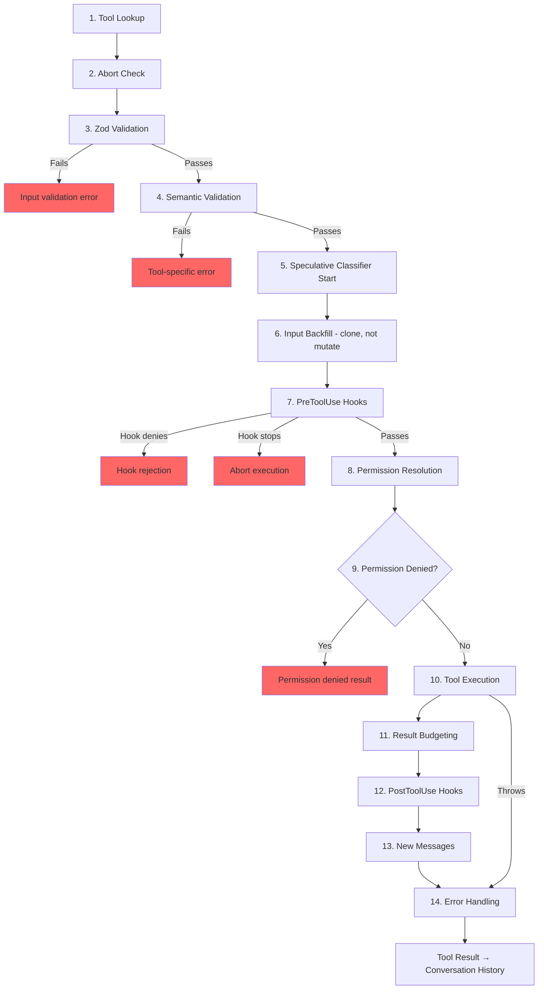

# 第 6 章：工具 — 从定义到执行

## 神经系统

第 5 章向你展示了 agent loop — 流式接收模型响应、收集工具调用并将结果反馈回去的 `while(true)`。循环是心跳。但如果没有将"模型想要运行 `git status`"翻译为实际 shell 命令（带权限检查、结果预算和错误处理）的神经系统，心跳就毫无意义。

工具系统就是那个神经系统。它横跨 40+ 个工具实现、一个带 feature-flag 门控的集中注册表、一个 14 步执行流水线、一个带七种模式的权限解析器，以及一个在模型完成响应之前就启动工具的流式执行器。

Claude Code 中的每次工具调用——每次文件读取、每次 shell 命令、每次 grep、每次子 agent 分发——都流经相同的流水线。一致性是关键：工具是内置 Bash 执行器还是第三方 MCP 服务器，它都获得相同的验证、相同的权限检查、相同的结果预算和相同的错误分类。

`Tool` 接口大约有 45 个成员。这听起来难以承受，但只有五个对于理解系统如何工作至关重要：

1. **`call()`** — 执行工具
2. **`inputSchema`** — 验证和解析输入
3. **`isConcurrencySafe()`** — 这可以并行运行吗？
4. **`checkPermissions()`** — 允许吗？
5. **`validateInput()`** — 这个输入在语义上有意义吗？

其他一切——12 个渲染方法、分析 hooks、搜索提示——是为了支持 UI 和遥测层而存在的。从这五个开始，其余的自然就位。

---

## Tool 接口

### 三个类型参数

每个工具参数化于三个类型：

```typescript
Tool<Input extends AnyObject, Output, P extends ToolProgressData>
```

`Input` 是一个 Zod 对象 schema，具有双重职责：它生成发送给 API 的 JSON Schema（以便模型知道要提供什么参数），并且通过 `safeParse` 在运行时验证模型的响应。`Output` 是工具结果的 TypeScript 类型。`P` 是工具运行时发出的进度事件类型——BashTool 发出 stdout 块，GrepTool 发出匹配计数，AgentTool 发出子 agent 转录。

### buildTool() 和 Fail-Closed 默认值

没有工具定义直接构造 `Tool` 对象。每个工具都通过 `buildTool()`，一个在工具特定定义下展开默认对象的工厂：

```typescript
// Pseudocode — illustrates the fail-closed defaults pattern
const SAFE_DEFAULTS = {
  isEnabled:         () => true,
  isParallelSafe:    () => false,   // Fail-closed: new tools run serially
  isReadOnly:        () => false,   // Fail-closed: treated as writes
  isDestructive:     () => false,
  checkPermissions:  (input) => ({ behavior: 'allow', updatedInput: input }),
}

function buildTool(definition) {
  return { ...SAFE_DEFAULTS, ...definition }  // Definition overrides defaults
}
```

默认值在安全关键的地方有意 fail-closed（故障关闭，即"不确定时宁可保守"）。忘记实现 `isConcurrencySafe` 的新工具默认为 `false` — 它串行运行，绝不并行。忘记 `isReadOnly` 的工具默认为 `false` — 系统将其视为写操作。忘记 `toAutoClassifierInput` 的工具返回空字符串 — 自动模式安全分类器跳过它，这意味着通用权限系统处理它，而不是自动化绕过。

> 💡 **译注**：fail-closed（故障关闭）是安全工程的核心原则，与之对应的是 fail-open（故障开放）。举个例子：你家小区的门禁系统，断电时如果门自动锁死，这是 fail-closed（宁可把你关外面也不让陌生人进来）；如果断电时门自动打开，这是 fail-open（消防需求，宁可让陌生人进来也不能把你困在里面烧死）。在 Agent 工具系统中，默认值是"这个新工具不能并行（可能不安全）、可能是写操作（可能破坏数据）、不信任自动审批"。新工具的作者必须显式声明"我的工具是安全的"才能解锁相应权限。这种设计防止了"忘记配置安全策略"导致的漏洞。

一个*不是* fail-closed 的默认值是 `checkPermissions`，它返回 `allow`。这看起来是反向的，直到你理解了分层权限模型：`checkPermissions` 是在通用权限系统已经评估了规则、hooks 和基于模式的策略*之后*运行的工具特定逻辑。工具从 `checkPermissions` 返回 `allow` 是在说"我没有工具特定的反对意见"——它不是授予一揽子访问权限。

### 并发是输入依赖的

签名 `isConcurrencySafe(input: z.infer<Input>): boolean` 接受已解析的输入，因为同一工具对某些输入安全而对其他输入不安全。BashTool 是典型例子：`ls -la` 是只读且并发安全的，但 `rm -rf /tmp/build` 不是。该工具解析命令，根据已知安全集对每个子命令进行分类，仅当每个非中性部分都是搜索或读取操作时才返回 `true`。

### ToolResult 返回类型

每个 `call()` 返回一个 `ToolResult<T>`：

```typescript
type ToolResult<T> = {
  data: T
  newMessages?: (UserMessage | AssistantMessage | AttachmentMessage | SystemMessage)[]
  contextModifier?: (context: ToolUseContext) => ToolUseContext
}
```

`data` 是被序列化到 API 的 `tool_result` 内容块中的类型化输出。`newMessages` 让工具向对话中注入额外消息——AgentTool 使用它来追加子 agent 转录。`contextModifier` 是一个改变后续工具的 `ToolUseContext` 的函数——这就是 `EnterPlanMode` 如何切换权限模式的。上下文修改器仅对非并发安全工具有效；如果你的工具并行运行，其修改器排队直到批次完成。

---

## ToolUseContext：上帝对象

`ToolUseContext` 是贯穿每个工具调用的巨大上下文袋。它大约有 40 个字段。根据任何合理的定义，它是一个上帝对象。它存在是因为替代方案更糟。

像 BashTool 这样的工具需要 abort 控制器、文件状态缓存、应用状态、消息历史、工具集、MCP 连接和半打 UI 回调。将它们作为单独参数传递会产生 15+ 个参数的函数签名。务实的解决方案是一个按关注点分组的单一上下文对象：

**配置**（`options` 子对象）：工具集、模型名称、MCP 连接、调试标志。在查询开始时设置一次，基本不可变。

**执行状态**：用于取消的 `abortController`，用于 LRU 文件缓存的 `readFileState`，用于完整对话历史的 `messages`。这些在执行期间变化。

**UI 回调**：`setToolJSX`、`addNotification`、`requestPrompt`。仅在交互式（REPL）上下文中接线。SDK 和 headless 模式保持它们未定义。

**Agent 上下文**：`agentId`、`renderedSystemPrompt`（为 fork 子 agent 冻结的父级 prompt——重新渲染可能因 feature flag 预热而发散并破坏缓存）。

子 agent 的 `ToolUseContext` 变体特别有揭示性。当 `createSubagentContext()` 为子 agent 构建上下文时，它对哪些字段共享和哪些隔离做出深思熟虑的选择：`setAppState` 对异步 agent 变成 no-op，`localDenialTracking` 获得一个新鲜对象，`contentReplacementState` 从父级克隆。每个选择都编码了从生产 bug 中学到的教训。

---

## 注册表

### getAllBaseTools()：单一真相来源

函数 `getAllBaseTools()` 返回在当前进程中可能存在的每个工具的详尽列表。始终存在的工具在前，然后是由 feature flags 门控的条件性包含的工具：

```typescript
const SleepTool = feature('PROACTIVE') || feature('KAIROS')
  ? require('./tools/SleepTool/SleepTool.js').SleepTool
  : null
```

来自 `bun:bundle` 的 `feature()` import 在打包时解析。当 `feature('AGENT_TRIGGERS')` 静态为 false 时，打包器消除整个 `require()` 调用——保持二进制文件小巧的dead code elimination（死代码消除）。

### assembleToolPool()：合并内置和 MCP 工具

到达模型的最终工具集来自 `assembleToolPool()`：

1. 获取内置工具（经过拒绝规则过滤、REPL 模式隐藏和 `isEnabled()` 检查）
2. 按拒绝规则过滤 MCP 工具
3. 按名称字母顺序排序每个分区
4. 连接内置工具（前缀）+ MCP 工具（后缀）

排序然后连接的方法不是审美偏好。API 服务器在最后一个内置工具之后放置一个 prompt-cache 断点。对所有工具进行平坦排序会将 MCP 工具穿插到内置列表中，添加或移除 MCP 工具会移动内置工具位置，使缓存无效。

---

## 14 步执行流水线

函数 `checkPermissionsAndCallTool()` 是意图变为行动的地方。每个工具调用经过这 14 步。



### 步骤 1-4：验证

**Tool Lookup** 对别名匹配回退到 `getAllBaseTools()`，处理来自工具被重命名的旧会话的转录。**Abort Check** 防止在 Ctrl+C 传播前排队的工具调用上的浪费计算。**Zod Validation** 捕获类型不匹配；对于延迟加载的工具，错误附加调用 ToolSearch 的提示。**Semantic Validation** 超越 schema 一致性 — FileEditTool 拒绝无操作编辑，BashTool 在 MonitorTool 可用时阻止独立的 `sleep`。

### 步骤 5-6：准备

**Speculative Classifier Start** 对 Bash 命令并行启动自动模式安全分类器，从常见路径中节省数百毫秒。**Input Backfill** 克隆已解析的输入并为 hooks 和权限添加派生字段（将 `~/foo.txt` 展开为绝对路径），保留原始输入以保证转录稳定性。

### 步骤 7-9：权限

**PreToolUse Hooks** 是扩展机制 — 它们可以做出权限决策、修改输入、注入上下文或完全停止执行。**Permission Resolution** 桥接 hooks 和通用权限系统：如果 hook 已经决定，那就是最终的；否则 `canUseTool()` 触发规则匹配、工具特定检查、基于模式的默认值和交互式提示。**Permission Denied Handling** 构建错误消息并执行 `PermissionDenied` hooks。

### 步骤 10-14：执行和清理

**Tool Execution** 使用原始输入运行实际的 `call()`。**Result Budgeting** 将超大输出持久化到 `~/.claude/tool-results/{hash}.txt` 并用预览替换它。**PostToolUse Hooks** 可以修改 MCP 输出或阻止继续。**New Messages** 被追加（子 agent 转录、系统提醒）。**Error Handling** 为遥测分类错误，从可能损坏的名称中提取安全字符串，并发出 OTel 事件。

---

## 权限系统

### 七种模式

| 模式 | 行为 |
|------|------|
| `default` | 工具特定检查；对未识别的操作提示用户 |
| `acceptEdits` | 自动允许文件编辑；对其他操作提示 |
| `plan` | 只读 — 拒绝所有写操作 |
| `dontAsk` | 自动拒绝任何通常会提示的操作（后台 agent） |
| `bypassPermissions` | 允许一切而不提示 |
| `auto` | 使用转录分类器决定（feature-flagged） |
| `bubble` | 子 agent 的内部模式，升级到父级 |

### 解析链

当工具调用到达权限解析时：

1. **Hook 决策**：如果 PreToolUse hook 已经返回 `allow` 或 `deny`，那就是最终的。
2. **规则匹配**：三个规则集 — `alwaysAllowRules`、`alwaysDenyRules`、`alwaysAskRules` — 匹配工具名称和可选的内容模式。`Bash(git *)` 匹配任何以 `git` 开头的 Bash 命令。
3. **工具特定检查**：工具的 `checkPermissions()` 方法。大多数返回 `passthrough`。
4. **基于模式的默认值**：`bypassPermissions` 允许一切。`plan` 拒绝写入。`dontAsk` 拒绝提示。
5. **交互式提示**：在 `default` 和 `acceptEdits` 模式下，未解决的决策显示提示。
6. **自动模式分类器**：一个两阶段分类器（快速模型，然后对模糊情况进行扩展思考）。

`safetyCheck` 变体有一个 `classifierApprovable` 布尔值：`.claude/` 和 `.git/` 编辑是 `classifierApprovable: true`（不寻常但有时合理），而 Windows 路径绕过尝试是 `classifierApprovable: false`（几乎总是不利的）。

### Bubble Mode 用于子 Agent

协调器-工人模式中的子 agent 不能显示权限提示 — 它们没有终端。`bubble` 模式使权限请求向上传播到父上下文。协调器 agent 运行在主线程中，有终端访问，处理提示并向下发送决策。

---

## 工具延迟加载

`shouldDefer: true` 的工具被发送到 API 时带有 `defer_loading: true` — 名称和描述但不带完整的参数 schema。这减少了初始 prompt 大小。要使用延迟加载的工具，模型必须首先调用 `ToolSearchTool` 加载其 schema。失败模式具有指导意义：在没有加载的情况下调用延迟加载的工具会导致 Zod 验证失败（所有类型化参数作为字符串到达），系统追加一个定向恢复提示。

延迟加载还提高了缓存命中率：带有 `defer_loading: true` 的工具仅为 prompt 贡献其名称，因此添加或移除延迟加载的 MCP 工具仅改变 prompt 几个 token，而不是几百个。

---

## 结果预算

### 每工具大小限制

每个工具声明 `maxResultSizeChars`：

| 工具 | maxResultSizeChars | 理由 |
|------|-------------------|-----------|
| BashTool | 30,000 | 足以容纳大多数有用输出 |
| FileEditTool | 100,000 | Diff 可能很大但模型需要它们 |
| GrepTool | 100,000 | 带上下文行的搜索结果快速增长 |
| FileReadTool | Infinity | 通过其自己的 token 限制自行约束；持久化会创建循环 Read 循环 |

当结果超过阈值时，完整内容被保存到磁盘并用包含预览和文件路径的 `<persisted-output>` 包装器替换。然后模型可以使用 `Read` 访问完整输出。

### 每对话聚合预算

除了每工具限制，`ContentReplacementState` 跟踪整个对话的聚合预算，防止千刀万剐——许多工具各自返回其单独限制的 90% 仍可能压垮上下文窗口。

---

## 个别工具亮点

### BashTool：最复杂的工具

BashTool 是系统中最复杂的工具。它解析复合命令，将子命令分类为只读或写入，管理后台任务，通过魔数字节检测图像输出，并实现用于安全编辑预览的 sed 模拟。

### FileReadTool：五种输出格式

FileReadTool 有五种不同的结果类型：文本（行号）、图像（base64 带尺寸）、笔记本（Jupyter 单元格数组）、PDF（渲染页面为图像）和 file_unchanged（无变化的 hash 验证结果）。每种格式都有不同的渲染路径。

### AgentTool：元工具

AgentTool 是生成新 `query()` generator 的元工具。它的实现将在第 8 章中详细介绍。作为一个工具，它是系统中唯一产生其他 agent 的工具。

---

## Apply This

**Fail-closed 默认值。** 当有疑问时，工具默认为串行、写操作、需要权限。安全胜过性能。新工具作者应该显式选择并发安全和只读——沉默意味着不安全。

**自我描述的工具。** 每个工具携带自己的名称、描述、schema、prompt 贡献、并发分类和 UI 渲染。工具系统的工作不是向模型描述工具——而是让工具描述自己。

**为常见的读取路径进行推测。** 对 Bash 命令并行运行自动模式安全分类器。在流式输出期间启动并发安全的工具。为常见情况做提前工作，为罕见情况支付边缘延迟成本。

**分离内置和外部工具。** 内置工具在前，MCP 工具在后。这保持 prompt cache 稳定——添加或移除 MCP 工具不会移动内置工具的位置。

**结果预算是防御性的。** 超大输出被持久化到磁盘并用预览替换。模型可以使用 `Read` 获取完整内容。整对话聚合预算防止累积过载。
