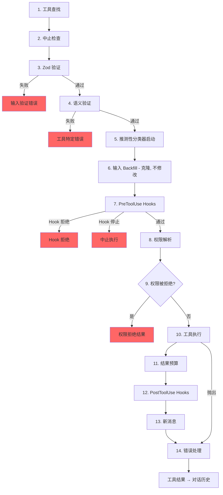

# 第 6 章：工具 — 从定义到执行

## 神经系统

第 5 章向你展示了 agent loop — 流式接收模型响应、收集工具调用并将结果反馈回去的 `while(true)`。循环是心跳。但如果没有将"模型想要运行 `git status`"翻译为实际 shell 命令（带权限检查、结果预算和错误处理）的神经系统，心跳就毫无意义。

工具系统就是那个神经系统。它横跨 40+ 个工具实现、一个带 feature-flag 门控的集中注册表、一个 14 步执行流水线、一个带七种模式的权限解析器，以及一个在模型完成响应之前就启动工具的流式执行器。

Claude Code 中的每次工具调用——每次文件读取、每次 shell 命令、每次 grep、每次子 agent 分发——都流经相同的流水线。一致性是关键：工具是内置 Bash 执行器还是第三方 MCP 服务器，它都获得相同的验证、相同的权限检查、相同的结果预算和相同的错误分类。

`Tool` 接口大约有 45 个成员。这听起来难以承受，但只有五个对于理解系统如何工作至关重要：

1. **`call()`** — 执行工具
2. **`inputSchema`** — 验证和解析输入
3. **`isConcurrencySafe()`** — 这可以并行运行吗？
4. **`checkPermissions()`** — 允许吗？
5. **`validateInput()`** — 这个输入在语义上有意义吗？

其他一切——12 个渲染方法、分析 hooks、搜索提示——是为了支持 UI 和遥测层而存在的。从这五个开始，其余的自然就位。

---

## Tool 接口

### 三个类型参数

每个工具参数化于三个类型：

```typescript
Tool<Input extends AnyObject, Output, P extends ToolProgressData>
```

`Input` 是一个 Zod 对象 schema，具有双重职责：它生成发送给 API 的 JSON Schema（以便模型知道要提供什么参数），并且通过 `safeParse` 在运行时验证模型的响应。`Output` 是工具结果的 TypeScript 类型。`P` 是工具运行时发出的进度事件类型——BashTool 发出 stdout 块，GrepTool 发出匹配计数，AgentTool 发出子 agent 转录。

### buildTool() 和 Fail-Closed 默认值

没有工具定义直接构造 `Tool` 对象。每个工具都通过 `buildTool()`——一个在工具特定定义之下展开默认值对象的工厂：

```typescript
// 伪代码——展示 fail-closed 默认值模式
const SAFE_DEFAULTS = {
  isEnabled:         () => true,
  isParallelSafe:    () => false,   // Fail-closed：新工具串行运行
  isReadOnly:        () => false,   // Fail-closed：被视为写操作
  isDestructive:     () => false,
  checkPermissions:  (input) => ({ behavior: 'allow', updatedInput: input }),
}

function buildTool(definition) {
  return { ...SAFE_DEFAULTS, ...definition }  // 定义覆盖默认值
}
```

默认值在安全重要的地方故意 fail-closed。忘记实现 `isConcurrencySafe` 的新工具默认为 `false`——串行运行，绝不并行。忘记 `isReadOnly` 的工具默认为 `false`——系统将其视为写操作。忘记 `toAutoClassifierInput` 的工具返回空字符串——自动模式安全分类器跳过它，这意味着通用权限系统处理它而不是自动绕过。

一个*不是* fail-closed 的默认值是 `checkPermissions`，返回 `allow`。这看起来是反向的，直到你理解了分层权限模型：`checkPermissions` 是在通用权限系统已经评估了规则、hooks 和基于模式的策略*之后*运行的工具特定逻辑。工具从 `checkPermissions` 返回 `allow` 是在说"我没有工具特定的反对意见"——它不是授予一揽子访问权限。

> 💡 **译注**：fail-closed 是安全工程核心原则。门禁系统断电锁死 = fail-closed。消防通道断电打开 = fail-open。新工具默认"不能并行、可能是写操作、不信任自动审批"——作者必须显式声明"安全"才能解锁。这种设计意味着你不会因为遗忘而引入安全漏洞。

### 并发是输入依赖的

签名 `isConcurrencySafe(input: z.infer<Input>): boolean` 接受已解析的输入，因为同一工具对某些输入安全而对其他输入不安全。BashTool 是典型例子：`ls -la` 是只读且并发安全的，但 `rm -rf /tmp/build` 不是。该工具解析命令，根据已知安全集对每个子命令进行分类，仅当每个非中性部分都是搜索或读取操作时才返回 `true`。

### ToolResult 返回类型

每个 `call()` 返回一个 `ToolResult<T>`：

```typescript
type ToolResult<T> = {
  data: T
  newMessages?: (UserMessage | AssistantMessage | AttachmentMessage | SystemMessage)[]
  contextModifier?: (context: ToolUseContext) => ToolUseContext
}
```

`data` 是被序列化到 API 的 `tool_result` 内容块中的类型化输出。`newMessages` 让工具向对话中注入额外消息——AgentTool 使用它来追加子 agent 转录。`contextModifier` 是一个改变后续工具的 `ToolUseContext` 的函数——这就是 `EnterPlanMode` 如何切换权限模式的。上下文修改器仅对非并发安全工具有效；如果你的工具并行运行，其修改器排队直到批次完成。

---

## ToolUseContext：上帝对象

`ToolUseContext` 是贯穿每个工具调用的巨大上下文袋。它大约有 40 个字段。根据任何合理的定义，它是一个上帝对象。它存在是因为替代方案更糟。

像 BashTool 这样的工具需要 abort 控制器、文件状态缓存、应用状态、消息历史、工具集、MCP 连接和半打 UI 回调。将它们作为单独参数传递会产生 15+ 个参数的函数签名。务实的解决方案是一个按关注点分组的单一上下文对象：

**配置**（`options` 子对象）：工具集、模型名称、MCP 连接、调试标志。在查询开始时设置一次，基本不可变。

**执行状态**：用于取消的 `abortController`，用于 LRU 文件缓存的 `readFileState`，用于完整对话历史的 `messages`。这些在执行期间变化。

**UI 回调**：`setToolJSX`、`addNotification`、`requestPrompt`。仅在交互式（REPL）上下文中接线。SDK 和 headless 模式保持它们未定义。

**Agent 上下文**：`agentId`、`renderedSystemPrompt`（为 fork 子 agent 冻结的父级 prompt——重新渲染可能因 feature flag 预热而发散并破坏缓存）。

子 agent 的 `ToolUseContext` 变体特别有揭示性。当 `createSubagentContext()` 为子 agent 构建上下文时，它对哪些字段共享和哪些隔离做出深思熟虑的选择：`setAppState` 对异步 agent 变成 no-op，`localDenialTracking` 获得一个新鲜对象，`contentReplacementState` 从父级克隆。每个选择都编码了从生产 bug 中学到的教训。

---

## 注册表

### getAllBaseTools()：单一真相来源

函数 `getAllBaseTools()` 返回在当前进程中可能存在的每个工具的详尽列表。始终存在的工具在前，然后是由 feature flags 门控的条件性包含的工具：

```typescript
const SleepTool = feature('PROACTIVE') || feature('KAIROS')
  ? require('./tools/SleepTool/SleepTool.js').SleepTool
  : null
```

来自 `bun:bundle` 的 `feature()` import 在打包时解析。当 `feature('AGENT_TRIGGERS')` 静态为 false 时，打包器消除整个 `require()` 调用——死代码消除，保持二进制文件小巧。

### assembleToolPool()：合并内置和 MCP 工具

到达模型的最终工具集来自 `assembleToolPool()`：

1. 获取内置工具（经过拒绝规则过滤、REPL 模式隐藏和 `isEnabled()` 检查）
2. 按拒绝规则过滤 MCP 工具
3. 按名称字母顺序排序每个分区
4. 连接内置工具（前缀）+ MCP 工具（后缀）

排序然后连接的方法不是审美偏好。API 服务器在最后一个内置工具之后放置一个 prompt-cache 断点。对所有工具进行平坦排序会将 MCP 工具穿插到内置列表中，添加或移除 MCP 工具会移动内置工具位置，使缓存无效。

---

## 14 步执行流水线

函数 `checkPermissionsAndCallTool()` 是意图变为行动的地方。每个工具调用经过这 14 步。



### 步骤 1-4：验证

**工具查找** 对别名匹配回退到 `getAllBaseTools()`，处理来自工具被重命名的旧会话的转录。**中止检查** 防止在 Ctrl+C 传播前排队的工具调用上的浪费计算。**Zod 验证** 捕获类型不匹配；对于延迟加载的工具，错误附加调用 ToolSearch 的提示。**语义验证** 超越 schema 一致性——FileEditTool 拒绝无操作编辑，BashTool 在 MonitorTool 可用时阻止独立的 `sleep`。

### 步骤 5-6：准备

**推测性分类器启动** 对 Bash 命令并行启动自动模式安全分类器，从常见路径中节省数百毫秒。**Input Backfill** 克隆已解析的输入并为 hooks 和权限添加派生字段（将 `~/foo.txt` 展开为绝对路径），保留原始输入以保证转录稳定性。

### 步骤 7-9：权限

**PreToolUse Hooks** 是扩展机制——它们可以做出权限决策、修改输入、注入上下文或完全停止执行。**权限解析** 桥接 hooks 和通用权限系统：如果 hook 已经决定，那就是最终的；否则 `canUseTool()` 触发规则匹配、工具特定检查、基于模式的默认值和交互式提示。**权限拒绝处理** 构建错误消息并执行 `PermissionDenied` hooks。

### 步骤 10-14：执行和清理

**工具执行** 使用原始输入运行实际的 `call()`。**结果预算** 将超大输出持久化到 `~/.claude/tool-results/{hash}.txt` 并用预览替换它。**PostToolUse Hooks** 可以修改 MCP 输出或阻止继续。**新消息** 被追加（子 agent 转录、系统提醒）。**错误处理** 为遥测分类错误，从可能损坏的名称中提取安全字符串，并发出 OTel 事件。

---

## 权限系统

### 七种模式

| 模式 | 行为 |
|------|------|
| `default` | 工具特定检查；对未识别的操作提示用户 |
| `acceptEdits` | 自动允许文件编辑；对其他操作提示 |
| `plan` | 只读——拒绝所有写操作 |
| `dontAsk` | 自动拒绝任何通常会提示的操作（后台 agent） |
| `bypassPermissions` | 允许一切而不提示 |
| `auto` | 使用转录分类器决定（feature-flagged） |
| `bubble` | 子 agent 的内部模式，升级到父级 |

### 解析链

当工具调用到达权限解析时：

1. **Hook 决策**：如果 PreToolUse hook 已经返回 `allow` 或 `deny`，那就是最终的。
2. **规则匹配**：三个规则集——`alwaysAllowRules`、`alwaysDenyRules`、`alwaysAskRules`——匹配工具名称和可选的内容模式。`Bash(git *)` 匹配任何以 `git` 开头的 Bash 命令。
3. **工具特定检查**：工具的 `checkPermissions()` 方法。大多数返回 `passthrough`。
4. **基于模式的默认值**：`bypassPermissions` 允许一切。`plan` 拒绝写入。`dontAsk` 拒绝提示。
5. **交互式提示**：在 `default` 和 `acceptEdits` 模式下，未解决的决策显示提示。
6. **自动模式分类器**：一个两阶段分类器（快速模型，然后对模糊情况进行扩展思考）。

`safetyCheck` 变体有一个 `classifierApprovable` 布尔值：`.claude/` 和 `.git/` 编辑是 `classifierApprovable: true`（不寻常但有时合理），而 Windows 路径绕过尝试是 `classifierApprovable: false`（几乎总是不利的）。

### 权限规则和匹配

权限规则存储为带有三部分的 `PermissionRule` 对象：`source` 追溯来源（userSettings、projectSettings、localSettings、cliArg、policySettings、session 等），`ruleBehavior`（allow、deny、ask），以及带有工具名称和可选内容模式的 `ruleValue`。

`ruleContent` 字段支持细粒度匹配。`Bash(git *)` 允许任何以 `git` 开头的 Bash 命令。`Edit(/src/**)` 仅允许 `/src` 内的编辑。`Fetch(domain:example.com)` 允许从特定域名获取。没有 `ruleContent` 的规则匹配该工具的所有调用。

BashTool 的权限匹配器通过 `parseForSecurity()`（一个 bash AST 解析器）解析命令，并将复合命令拆分为子命令。如果 AST 解析失败（带有 heredocs 或嵌套子 shell 的复杂语法），匹配器返回 `() => true`——fail-safe，意味着 hook 总是运行。假设是：如果命令太复杂无法解析，它也太复杂无法自信地排除在安全检查之外。

### Bubble Mode 用于子 Agent

协调器-工人模式中的子 agent 不能显示权限提示——它们没有终端。`bubble` 模式使权限请求向上传播到父上下文。协调器 agent 运行在主线程中，有终端访问，处理提示并向下发送决策。

---

## 工具延迟加载

`shouldDefer: true` 的工具被发送到 API 时带有 `defer_loading: true`——名称和描述但不带完整的参数 schema。这减少了初始 prompt 大小。要使用延迟加载的工具，模型必须首先调用 `ToolSearchTool` 加载其 schema。失败模式具有指导意义：在没有加载的情况下调用延迟加载的工具会导致 Zod 验证失败（所有类型化参数作为字符串到达），系统追加一个定向恢复提示。

延迟加载还提高了缓存命中率：带有 `defer_loading: true` 的工具仅为 prompt 贡献其名称，因此添加或移除延迟加载的 MCP 工具仅改变 prompt 几个 token，而不是几百个。

---

## 结果预算

### 每工具大小限制

每个工具声明 `maxResultSizeChars`：

| 工具 | maxResultSizeChars | 理由 |
|------|-------------------|------|
| BashTool | 30,000 | 足以容纳大多数有用输出 |
| FileEditTool | 100,000 | Diff 可能很大但模型需要它们 |
| GrepTool | 100,000 | 带上下文行的搜索结果快速增长 |
| FileReadTool | Infinity | 通过其自己的 token 限制自行约束；持久化会创建循环 Read 循环 |

当结果超过阈值时，完整内容被保存到磁盘并用包含预览和文件路径的 `<persisted-output>` 包装器替换。然后模型可以使用 `Read` 访问完整输出。

### 每对话聚合预算

除了每工具限制，`ContentReplacementState` 跟踪整个对话的聚合预算，防止千刀万剐——许多工具各自返回其单独限制的 90% 仍可能压垮上下文窗口。

---

## 个别工具亮点

### BashTool：最复杂的工具

BashTool 是系统中最复杂的工具。它解析复合命令，将子命令分类为只读或写入，管理后台任务，通过魔数字节检测图像输出，并实现用于安全编辑预览的 sed 模拟。

复合命令解析特别有趣。`splitCommandWithOperators()` 将像 `cd /tmp && mkdir build && ls build` 这样的命令分解为单独的子命令。每个子命令根据已知安全命令集（`BASH_SEARCH_COMMANDS`、`BASH_READ_COMMANDS`、`BASH_LIST_COMMANDS`）进行分类。只有当所有非中性部分都安全时，复合命令才是只读的。中性集（echo、printf）被忽略——它们不使命令成为只读，但也不使其成为只写。

sed 模拟（`_simulatedSedEdit`）值得特别关注。当用户在权限对话框中批准 sed 命令时，系统通过在沙箱中运行 sed 命令并捕获输出来预先计算结果。预先计算的结果作为 `_simulatedSedEdit` 注入到输入中。当 `call()` 执行时，它直接应用编辑，绕过 shell 执行。这保证用户预览的内容就是实际被写入的内容——不是重新执行可能在预览和执行之间产生不同结果的操作。

> 💡 **译注**：sed 模拟是一个巧妙的安全设计。通常的权限模式是"预览→批准→执行"，但批准和执行之间有竞态条件——文件可能在两个步骤之间被修改。Claude Code 的 sed 模拟在预览阶段就完成了实际计算，批准后直接写入结果，消除了竞态窗口。这在真实源码中对应 `_simulatedSedEdit` 参数和 BashTool 中相应的分支逻辑。

### FileEditTool：过期检测

FileEditTool 与 `readFileState`（跨对话维护的文件内容和时间戳的 LRU 缓存）集成。在应用编辑之前，它检查文件自模型上次读取后是否被修改过。如果文件是过期的——被后台进程、另一个工具或用户修改——编辑被拒绝，并附上告诉模型先重新读取文件的消息。

`findActualString()` 中的模糊匹配处理模型在空格上略有偏差的常见情况。它在匹配前规范化空格和引号样式，因此针对带有尾随空格的 `old_string` 的编辑仍然匹配文件的实际内容。`replace_all` 标志支持批量替换；没有它，非唯一匹配被拒绝，要求模型提供足够的上下文以识别单一位置。

### FileReadTool：多功能读取器

FileReadTool 是唯一带有 `maxResultSizeChars: Infinity` 的内置工具。如果 Read 输出被持久化到磁盘，模型将需要 Read 持久化的文件，这可能自身超出限制，创建无限循环。该工具改为通过 token 估算自行约束并在源头截断。

该工具功能多样：它读取带行号的文本文件、图片（返回 base64 多模态内容块）、PDF（通过 `extractPDFPages()`）、Jupyter notebooks（通过 `readNotebook()`）和目录（回退到 `ls`）。它阻止危险的设备路径（`/dev/zero`、`/dev/random`、`/dev/stdin`）并处理 macOS 截屏文件名怪癖（U+202F 窄不间断空格 vs "Screen Shot" 文件名中的常规空格）。

### GrepTool：通过 head_limit 分页

GrepTool 包装 `ripGrep()` 并通过 `head_limit` 添加分页机制。默认值是 250 条——足够用于有用结果但小到避免上下文膨胀。当发生截断时，响应包含 `appliedLimit: 250`，向模型发出信号在下一次调用时使用 `offset` 进行分页。显式的 `head_limit: 0` 完全禁用限制。

GrepTool 自动排除六个 VCS 目录（`.git`、`.svn`、`.hg`、`.bzr`、`.jj`、`.sl`）。搜索 `.git/objects` 内几乎从来不是模型想要的，意外包含二进制 pack 文件会烧穿 token 预算。

### AgentTool 和上下文修改器

AgentTool 生成运行自己查询循环的子 agent。其 `call()` 返回包含子 agent 转录的 `newMessages`，以及可选地将状态变化传播回父级的 `contextModifier`。因为 AgentTool 默认不是并发安全的，单个响应中的多个 Agent 工具调用串行运行——每个子 agent 的上下文修改器在下一个子 agent 启动前被应用。在协调器模式下，模式反转：协调器为独立任务分发子 agent，`isAgentSwarmsEnabled()` 检查解锁并行 agent 执行。

---

## 工具如何与消息历史交互

工具结果不仅仅是向模型返回数据。它们作为结构化消息参与对话。

API 期望工具结果作为引用原始 `tool_use` 块 ID 的 `ToolResultBlockParam` 对象。大多数工具序列化为文本。FileReadTool 可以序列化为图像内容块（base64 编码）用于多模态响应。BashTool 通过检查 stdout 中的魔数字节检测图像输出，并相应切换为图像块。

`ToolResult.newMessages` 是工具扩展对话超越简单调用-响应模式的方式。**Agent 转录**：AgentTool 将子 agent 的消息历史作为 attachment 消息注入。**系统提醒**：Memory 工具注入在工具结果之后出现的系统消息——在下一轮对模型可见，但在 `normalizeMessagesForAPI` 边界处被剥离。**Attachment 消息**：Hook 结果、额外上下文和错误细节携带模型在后续轮次中可引用的结构化元数据。

`contextModifier` 函数是改变执行环境的工具的机制。当 `EnterPlanMode` 执行时，它返回一个将权限模式设置为 `'plan'` 的修改器。当 `ExitWorktree` 执行时，它修改工作目录。这些修改器是工具影响后续工具的唯一方式——直接修改 `ToolUseContext` 是不可能的，因为上下文在每次工具调用前被 spread-copy。串行唯一限制由编排层强制执行：如果两个并发工具都修改工作目录，哪个生效？

---

## Apply This：设计工具系统

**Fail-closed 默认值。** 新工具应该是保守的，直到显式标记为其他。忘记设置标志的开发者得到安全行为，而非危险行为。

**输入依赖的安全性。** `isConcurrencySafe(input)` 和 `isReadOnly(input)` 接受已解析的输入，因为同一工具在不同输入下有不同的安全配置。将 BashTool 标记为"总是串行"的工具注册表是正确的但浪费的。

**分层你的权限。** 工具特定检查、基于规则的匹配、基于模式的默认值、交互式提示和自动分类器各自处理不同情况。没有单一机制是充分的。

**预算结果，而不仅仅是输入。** 对输入进行 token 限制是标准的。但工具结果可以任意大，且跨轮次累积。每工具限制防止单个爆炸。聚合对话限制防止累积溢出。

**让错误分类对遥测安全。** 在压缩构建中，`error.constructor.name` 被损坏。`classifyToolError()` 函数提取可用的最有效安全字符串——遥测安全的消息、errno 代码、稳定的错误名称——而不将原始错误消息记录到分析系统。

---

## 接下来

本章追踪了单个工具调用如何从定义流经验证、权限、执行和结果预算。但模型很少一次只请求一个工具。工具如何编排为并发批次是第 7 章的主题。
