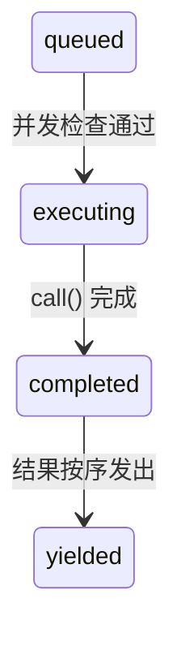

# 第 7 章：并发工具执行

## 等待的代价

第 6 章追踪了单个工具调用的生命周期——从 API 响应中的原始 `tool_use` 块到输入验证、权限检查、执行和结果格式化。那条流水线处理一个工具。但模型很少只请求一个。

一次典型的 Claude Code 交互涉及每次 3 到 5 个工具调用。"读这两个文件，grep 这个模式，然后编辑这个函数。"模型在单次响应中发出所有这些。如果每个工具需要 200 毫秒，串行执行花费一整秒。如果 Read 和 Grep 调用是独立的——它们确实是——并行运行削减到 200 毫秒。五倍提升，免费。

但并非所有工具都是独立的。修改 `config.ts` 的 Edit 不能与另一个修改 `config.ts` 的 Edit 同时运行。创建一个目录的 Bash 命令必须在向其中写入文件的 Bash 命令之前完成。并发不是工具的全局属性。它是特定工具调用、特定输入的属性。

这是驱动整个并发系统的洞察：**安全性是每个调用的（per-call），不是每个工具类型的（per-tool-type）**。`Bash("ls -la")` 可以安全并行化。`Bash("rm -rf build/")` 不行。相同工具，不同输入，不同并发分类。系统必须在决定之前检查输入。

Claude Code 实现了两层并发优化。第一层是**批次编排（batch orchestration）**：在模型响应完全接收后，将工具调用分区为并发和串行组，然后适当地执行每个组。第二层是**推测执行（speculative execution）**：在模型*仍在流式输出其响应时*开始运行工具，在响应甚至完成之前收获结果。这两层机制一起消除了否则将花在等待上的大部分 wall-clock 时间。

> 💡 **译注**：大多数框架的并发模型是声明式的——你写 `tool({ parallelSafe: true })` 就完了。但 Claude Code 把"是否安全"推迟到运行时，根据具体输入判断。同一个 Bash 工具，`ls` 可并行，`rm -rf` 不可并行。这种 per-call 的粒度避免了"为了安全全串行"和"为了性能全并行"两个极端。

---

## 分区算法

入口点是 `toolOrchestration.ts` 中的 `partitionToolCalls()`。它接受一个有序的 `ToolUseBlock` 消息数组，并产生一个批次数组，其中每个批次要么是"全部并发安全"要么是"单个串行工具"。

```typescript
// 伪代码——展示分区算法
type Group = { parallel: boolean; calls: ToolCall[] }

function groupBySafety(calls: ToolCall[], registry: ToolRegistry): Group[] {
  return calls.reduce((groups, call) => {
    const def = registry.lookup(call.name)
    const input = def?.schema.safeParse(call.input)
    // Fail-closed：解析失败或异常 → 串行
    const safe = input?.success
      ? tryCatch(() => def.isParallelSafe(input.data), false)
      : false
    // 将连续安全调用合并为一个组
    if (safe && groups.at(-1)?.parallel) {
      groups.at(-1)!.calls.push(call)
    } else {
      groups.push({ parallel: safe, calls: [call] })
    }
    return groups
  }, [] as Group[])
}
```

算法从左到右遍历数组。对每个工具调用：

1. **按名称查找工具定义**。
2. **使用工具的 Zod schema 通过 `safeParse()` 解析输入**。如果解析失败，工具被保守分类为不并发安全。
3. **在工具定义上调用 `isConcurrencySafe(parsedInput)`**。这是每个输入分类发生的地方。Bash 工具解析命令字符串，检查每个子命令是否只读（`ls`、`grep`、`cat`、`git status`），仅当整个复合命令是纯读取时才返回 `true`。Read 工具总是返回 `true`。Edit 工具总是返回 `false`。调用被包装在 try-catch 中——如果 `isConcurrencySafe` 抛出（比如，Bash 命令字符串无法被 shell-quote 库解析），工具默认串行。
4. **合并或创建批次。** 如果当前工具是并发安全的且最近批次也是并发安全，追加到该批次。否则，启动新批次。

结果是一系列交替并发组和单独串行条目的批次。走过一个具体例子：

```
模型请求：[Read, Read, Grep, Edit, Read]

Step 1: Read  → 并发安全 → 新批次 {safe, [Read]}
Step 2: Read  → 并发安全 → 追加   {safe, [Read, Read]}
Step 3: Grep  → 并发安全 → 追加   {safe, [Read, Read, Grep]}
Step 4: Edit  → 不安全     → 新批次 {serial, [Edit]}
Step 5: Read  → 并发安全 → 新批次 {safe, [Read]}

结果: 3 个批次
  Batch 1: [Read, Read, Grep]  — 并发运行
  Batch 2: [Edit]              — 单独运行
  Batch 3: [Read]              — 并发运行（只有一个工具）
```

分区是贪心且保持顺序的。连续安全工具累积到一个批次。任何不安全工具打破运行并启动新批次。这意味着模型发出工具调用的顺序很重要——如果它在两个 Read 之间交错一个 Write，你会得到三个批次而不是两个。在实践中，模型倾向于将读取聚集在一起，这是算法优化的常见情况。

---

## 批次执行

`runTools()` generator 遍历分区后的批次，将每个分派给适当的执行器。

### 并发批次

对于并发批次，`runToolsConcurrently()` 使用一个 `all()` 工具并行启动所有工具，该工具将活跃 generator 限制在并发限制内：

```typescript
// 伪代码——展示并发分派模式
async function* dispatchParallel(calls, context) {
  yield* boundedAll(
    calls.map(async function* (call) {
      context.markInProgress(call.id)
      yield* executeSingle(call, context)
      context.markComplete(call.id)
    }),
    MAX_CONCURRENCY,  // 默认: 10
  )
}
```

并发限制默认为 10，可通过 `CLAUDE_CODE_MAX_TOOL_USE_CONCURRENCY` 配置。10 是慷慨的——你很少在单次模型响应中看到超过五或六个工具调用。该限制作为病理情况的安全阀存在，而非典型约束。

`all()` 工具是带有有界并发的 `Promise.all` 的 generator 感知变体。它同时启动最多 N 个 generator，从最先完成的任何一个产出结果，并在每个完成时启动下一个排队的 generator。机制类似于信号量保护的任务池，但适用于产出中间结果的 async generator。

**上下文修改器排队** 是微妙的部分。一些工具产生*上下文修改器*——转换后续工具的 `ToolUseContext` 的函数。当工具并发运行时，你不能立即应用这些修改器，因为同一批次中的其他工具正在读取相同的上下文。相反，修改器收集在按工具使用 ID 键控的 map 中：

```typescript
const queuedContextModifiers: Record<
  string,
  ((context: ToolUseContext) => ToolUseContext)[]
> = {}
```

整个并发批次完成后，修改器按工具顺序（而非完成顺序）应用，保持确定性的上下文演化：

```typescript
for (const block of blocks) {
  const modifiers = queuedContextModifiers[block.id]
  if (!modifiers) continue
  for (const modifier of modifiers) {
    currentContext = modifier(currentContext)
  }
}
```

在实践中，当前并发安全工具都不产生上下文修改器——代码库中的注释显式承认了这一点。但基础设施存在是因为工具可以由 MCP 服务器添加，而自定义的只读 MCP 工具可能有合理需求修改上下文（例如，更新"已见文件"集合）。

### 串行批次

串行执行是直接的。每个工具运行，其上下文修改器立即应用，下一个工具看到更新后的上下文：

```typescript
for (const toolUse of toolUseMessages) {
  for await (const update of runToolUse(toolUse, /* ... */)) {
    if (update.contextModifier) {
      currentContext = update.contextModifier.modifyContext(currentContext)
    }
    yield { message: update.message, newContext: currentContext }
  }
}
```

这是关键区别。串行工具可以为后续工具改变世界。一个 Edit 修改文件；下一个 Read 看到修改后的版本。一个 Bash 命令创建目录；下一个 Bash 命令写入其中。上下文修改器是这种依赖关系的形式化：它们让工具说"执行环境已改变，如下"。

---

## 流式工具执行器

批次编排在模型响应*到达后*消除不必要的串行化。但有更大的机会：模型的响应需要时间流式传输。典型的多工具响应可能需要 2-3 秒完全到达。第一个工具调用在 500 毫秒后可解析。为什么要等待剩余的 2 秒？

`StreamingToolExecutor` 类实现推测执行。当模型流式输出其响应时，每个 `tool_use` 块在完全解析的那一刻被交给执行器。执行器立即开始运行它——而模型仍在生成下一个工具调用。当响应完成流式输出时，几个工具可能已经完成。

```mermaid
gantt
    title 串行 vs 流式工具执行
    dateFormat X
    axisFormat %Ls

    section 串行
    模型流式输出响应     :a1, 0, 2500
    工具 1 (0.2s)        :a2, after a1, 200
    工具 2 (0.3s)        :a3, after a2, 300
    工具 3 (0.1s)        :a4, after a3, 100

    section 流式执行器
    模型流式输出响应     :b1, 0, 2500
    工具 1 在 0.5s 启动  :b2, 500, 700
    工具 2 在 1.2s 启动  :b3, 1200, 1500
    工具 3 流后排空      :b4, 2500, 2600
```



串行总计：3.1s。流式总计：2.6s——工具 1 和 2 在流式传输期间完成，节省了 16% 的 wall-clock 时间。

节省是复合的。当模型请求五个只读工具且响应需要 3 秒流式传输时，所有五个工具可以在那 3 秒内启动并完成。流后排空阶段无事可做。用户在模型响应最后一个字符出现后几乎立即看到结果。

### 工具生命周期

执行器跟踪的每个工具经历四个状态：



- **queued**：`tool_use` 块已被解析并注册。等待并发条件允许执行。
- **executing**：工具的 `call()` 函数正在运行。结果累积在缓冲区中。
- **completed**：执行完成。结果准备好被产出到对话中。
- **yielded**：结果已发出。终端状态。

### addTool()：流式期间的排队

```typescript
addTool(block: ToolUseBlock, assistantMessage: AssistantMessage): void
```

由流式响应解析器在每次完整的 `tool_use` 块到达时调用。该方法：

1. 查找工具定义。如果没找到，立即创建一个带有错误消息的 `completed` 条目——排队一个不存在的工具没有意义。
2. 解析输入并使用与 `partitionToolCalls()` 相同的逻辑确定 `isConcurrencySafe`。
3. 推送一个状态为 `'queued'` 的 `TrackedTool`。
4. 调用 `processQueue()`——它可能立即启动该工具。

对 `processQueue()` 的调用是 fire-and-forget（`void this.processQueue()`）。执行器不等待它。这是故意的：`addTool()` 从流式解析器的事件处理器中调用，阻塞那里会停滞响应解析。工具在解析器继续消费流的同时在后台开始执行。

### processQueue()：准入检查

准入检查是一个单一的谓词：

```typescript
// 伪代码——展示互斥规则
canRun = noToolsRunning || (newToolIsSafe && allRunningAreSafe)
```

工具可以开始执行当且仅当：
- **没有工具当前正在执行**（队列为空），或
- **新工具和所有当前执行中的工具都是并发安全的。**

这是一个互斥契约。非并发工具需要独占访问——其他任何东西都不能运行。并发工具可以与其他并发工具共享跑道，但执行集合中的单个非并发工具会阻塞所有人。

`processQueue()` 方法按序遍历所有工具。对每个排队工具，它检查 `canExecuteTool()`。如果工具可以运行，它启动。如果非并发工具还不能运行，循环*中断*——它完全停止检查后续工具，因为非并发工具必须保持顺序。如果并发工具不能运行（被正在执行的非并发工具阻塞），循环*继续*——但在实践中这很少有帮助，因为在非并发阻塞器之后的并发工具通常无论如何都依赖其结果。

### executeTool()：核心执行循环

此方法是真正复杂性所在。它管理 abort 控制器、错误级联、进度报告和上下文修改器。

**子 abort 控制器。** 每个工具获得自己的 `AbortController`，它是共享同级控制器的子级。

层次结构是三层深：查询级控制器（由 REPL 拥有，在用户 Ctrl+C 时触发）→ 同级控制器（由流式执行器拥有，在 Bash 错误时触发）→ 每个工具的独立控制器。中止同级控制器杀死所有运行中的工具。中止工具的独立控制器仅杀死该工具——但如果中止原因不是同级错误，它也会向上冒泡到查询控制器。此冒泡防止系统在例如权限拒绝应结束整个 turn 时静默丢弃执行器。

此冒泡对权限拒绝至关重要。当用户在权限对话框中拒绝工具时，工具的 abort 控制器触发。该信号必须到达查询循环以便它能结束 turn。没有它，查询循环将继续好像什么都没发生，向模型发送一条过时的拒绝消息。

**同级错误级联。** 当工具产生错误结果时，执行器检查是否取消同级工具。规则：**只有 Bash 错误级联。** 当 shell 命令错误时，执行器记录失败，捕获错误工具的描述，并中止同级控制器——取消批次中所有其他运行中的工具。

理由是务实的。Bash 命令通常形成隐式依赖链：`mkdir build && cp src/* build/ && tar -czf dist.tar.gz build/`。如果 `mkdir` 失败，运行 `cp` 和 `tar` 毫无意义。立即取消同级工具节省时间并避免令人困惑的错误消息。

相比之下，Read 和 Grep 错误是独立的。如果一个文件读取因文件被删除而失败，这与搜索不同目录的并发 grep 无关。取消 grep 将毫无理由地浪费工作。

错误级联为同级工具产生合成的错误消息：

```
Cancelled: parallel tool call Bash(mkdir build) errored
```

描述包括错误工具的命令或文件路径的前 40 个字符，给模型足够的上下文理解出了什么问题。

**进度消息** 与结果分开处理。当结果被缓冲并按序产出时，进度消息（状态更新如"正在读取文件……"或"正在搜索……"）进入 `pendingProgress` 数组并通过 `getCompletedResults()` 立即产出。当新进度到达时，一个 resolve 回调唤醒 `getRemainingResults()` 循环，防止 UI 在长时间运行的工具期间看起来冻结。

**队列重新处理。** 每个工具完成后，`processQueue()` 被再次调用：

```typescript
void promise.finally(() => {
  void this.processQueue()
})
```

这就是被并发批次阻塞的串行工具如何开始执行。当最后一个并发工具完成时，后续非并发工具的 `canExecuteTool()` 检查通过，它开始执行。

### 结果收获

流式执行器暴露两个收获方法，为响应生命周期的两个不同阶段设计。

**`getCompletedResults()`——流中收获。** 这是一个在流式 API 响应的块之间调用的同步 generator。它按提交顺序遍历工具数组，为已完成的任何工具产出结果：

`getCompletedResults()` 是一个按提交顺序遍历工具数组的同步 generator。对每个工具，它首先排空任何 pending 的进度消息。如果工具已完成，它产出结果并将其标记为 yielded。关键规则：如果非并发工具仍在执行，遍历**中断**——其后的任何东西都不能被产出，即使后续工具已经完成。串行工具之后的结果可能依赖其上下文修改，所以它们必须等待。对并发工具，此限制不适用；循环跳过执行中的并发工具并继续检查后续条目。

此中断是顺序保持机制。如果非并发工具仍在执行，其后的任何东西都不能被产出——即使后续工具已经完成。串行工具之后的结果可能依赖其上下文修改，所以它们必须等待。对并发工具，此限制不适用；循环跳过执行中的并发工具并继续检查后续条目。

**`getRemainingResults()`——流后排空。** 在模型响应完全接收后调用。此 async generator 循环直到每个工具被产出：

`getRemainingResults()` 是流后排空。它循环直到每个工具被产出。在每次迭代中，它处理队列（启动任何新解锁的工具），通过 `getCompletedResults()` 产出任何已完成结果，然后——如果工具仍在执行但没有任何新东西完成——使用 `Promise.race` 空闲等待最先完成的：任何执行中工具的 promise，或进度可用信号。当没有工具完成且没有新东西可以启动时，执行器等待任何执行中工具完成（或进度到达）。这避免了忙轮询，同时仍然在事情发生时立即唤醒。

### 顺序保持

结果按工具被*接收*的顺序产出，而非它们*完成*的顺序。这是有意为之的设计选择。

考虑一个请求 `[Read("a.ts"), Read("b.ts"), Read("c.ts")]` 的模型响应。三个全部并发启动。`c.ts` 先完成（它更小），然后 `a.ts`，然后 `b.ts`。如果结果按完成顺序产出，对话将显示：

```
Tool result: c.ts contents
Tool result: a.ts contents
Tool result: b.ts contents
```

但模型以 a-b-c 顺序发出它们。对话历史必须匹配模型的期望，否则下一轮将对哪个结果对应哪个请求感到困惑。通过按到达顺序产出，对话保持连贯：

```
Tool result: a.ts contents  (第二个完成，第一个产出)
Tool result: b.ts contents  (第三个完成，第二个产出)
Tool result: c.ts contents  (第一个完成，第三个产出)
```

代价很小：如果工具 1 慢而工具 2-5 快，快速结果在缓冲区中等待直到工具 1 完成。但替代方案——对话不连贯——要糟糕得多。

### discard()：流式 Fallback 逃生舱

当 API 响应流中途失败（网络错误、服务器断开），系统用新的 API 调用重试。但流式执行器可能已经启动了失败尝试中的工具。那些结果现在是孤立的——它们对应一个从未完全接收的响应。

```typescript
discard(): void {
  this.discarded = true
}
```

设置 `discarded = true` 导致：
- `getCompletedResults()` 立即返回，没有结果。
- `getRemainingResults()` 立即返回，没有结果。
- 任何开始执行的工具检查 `getAbortReason()`，看到 `streaming_fallback`，并获得一个合成错误而不是实际运行。

被丢弃的执行器被放弃。为重试尝试创建新的执行器。

---

## 工具并发属性

每个内置工具通过 `isConcurrencySafe()` 方法声明其并发特性。分类不是任意的——它反映工具对共享状态的实际影响。

| 工具 | 并发安全 | 条件 | 理由 |
|------|---------|------|------|
| **Read** | 总是 | -- | 纯读取。无副作用。 |
| **Grep** | 总是 | -- | 纯读取。包装 ripgrep。 |
| **Glob** | 总是 | -- | 纯读取。文件列表。 |
| **Fetch** | 总是 | -- | HTTP GET。无本地副作用。 |
| **WebSearch** | 总是 | -- | 对搜索 provider 的 API 调用。 |
| **Bash** | 有时 | 仅只读命令 | `isReadOnly()` 解析命令并分类子命令。`ls`、`git status`、`cat`、`grep` 安全。`rm`、`mkdir`、`mv` 不安全。 |
| **Edit** | 从不 | -- | 修改文件。两个并发编辑同一文件会损坏它。 |
| **Write** | 从不 | -- | 创建或覆盖文件。同样的损坏风险。 |
| **NotebookEdit** | 从不 | -- | 修改 `.ipynb` 文件。 |

Bash 工具的分类值得展开。它使用 `splitCommandWithOperators()` 分解复合命令（`&&`、`||`、`;`、`|`），然后根据已知安全集分类每个子命令：

- **搜索命令**：`grep`、`rg`、`find`、`fd`、`ag`、`ack`
- **读取命令**：`cat`、`head`、`tail`、`wc`、`jq`、`less`、`file`、`stat`
- **列表命令**：`ls`、`tree`、`du`、`df`
- **中性命令**：`echo`、`printf`（无副作用但不是"读取"）

复合命令是只读的仅当每个非中性子命令都在搜索、读取或列表集合中。`ls -la && cat README.md` 安全。`ls -la && rm -rf build/` 不安全——`rm` 污染了整个命令。

---

## 中断行为契约

当工具正在执行时，用户可以输入新消息。应该发生什么？答案取决于工具。

每个工具声明一个 `interruptBehavior()` 方法，返回 `'cancel'` 或 `'block'`：

- **`'cancel'`**：立即停止工具，丢弃部分结果，处理新用户消息。用于部分执行无害的工具（读取、搜索）。
- **`'block'`**：保持工具运行到完成。用户的新消息等待。用于中断将使系统处于不一致状态的工具（中途的写操作、长时间运行的 bash 命令）。这是默认值。

流式执行器跟踪当前工具集的可中断状态：

可中断状态通过检查所有当前执行中的工具来更新：仅当每个执行中的工具支持取消时，集合才是可中断的。如果即使只有一个工具的中断行为是 `'block'`，整个集合被视为不可中断。

UI 仅在所有执行中的工具支持取消时显示"可中断"指示器。如果即使只有一个工具是 `'block'`，整个集合被视为不可中断。这是保守但正确的：你不能有意义地中断一个某工具无论如何都会继续运行的批次。

当用户确实中断且所有工具可取消时，abort 控制器以 reason `'interrupt'` 触发。执行器的 `getAbortReason()` 方法单独检查每个工具的中断行为——`'cancel'` 工具获得合成的 `user_interrupted` 错误，而 `'block'` 工具（在完全可中断集合中不会存在，但代码处理这种边缘情况）继续运行。

---

## 上下文修改器：串行唯一契约

上下文修改器是类型为 `(context: ToolUseContext) => ToolUseContext` 的函数。它们让工具说"我改变了执行环境的某些东西，后续工具需要知道。"

契约很简单：**上下文修改器仅对串行（非并发安全）工具应用。** 这在源码中明确声明：

```typescript
// 注意：我们目前不支持并发工具的上下文修改器。
//       当前没有活跃使用的，但如果我们想在并发工具中使用它们，
//       我们需要在此处支持。
if (!tool.isConcurrencySafe && contextModifiers.length > 0) {
  for (const modifier of contextModifiers) {
    this.toolUseContext = modifier(this.toolUseContext)
  }
}
```

在批次编排路径（`toolOrchestration.ts`）中，并发批次修改器被收集并在批次完成后按工具提交顺序应用。这意味着并发批次内的工具不能看到彼此的上下文变化，但它们之后的批次可以。

这种不对称是故意的。如果工具 A 修改上下文且工具 B 读取该上下文，它们有数据依赖。数据依赖意味着它们不能并发运行。根据定义，如果两个工具是并发安全的，它们都不应依赖对方的上下文修改。系统通过推迟应用来强制执行这一点。

---

## Apply This

Claude Code 中的并发模式适用于编排多个独立操作的任何系统。三个原则值得提炼。

**按安全性分区，而非按类型。** `isConcurrencySafe(input)` 方法接收已解析的输入，而不仅仅是工具名称。这种 per-invocation 分类比静态的"此工具类型总是安全"声明更精确。在你自己的系统中，在决定是否并行化之前检查操作的参数。数据库读取可以安全并行化；对同一行的数据库写入不行。仅操作类型不足以告诉你。

**在 I/O 等待期间推测执行。** 流式执行器在 API 响应仍在到达时启动工具。同样的模式适用于任何有慢生产者和快消费者的地方：在后面的项仍在生成时开始处理前面的项。HTTP/2 服务器推送、编译器流水线并行和推测性 CPU 执行都共享此结构。关键要求是你可以在完整指令集可用之前识别独立工作。

**在结果中保持提交顺序。** 按完成顺序产出结果是诱人的——它最小化到第一个结果的延迟。但如果消费者（在此情况下是语言模型）期望特定顺序的结果，重新排序它们会造成困惑，解决困惑所花费的时间超过延迟节省。缓冲已完成结果并按请求顺序释放它们。实现成本是简单的数组遍历；正确性收益是绝对的。

流式执行器模式对 agent 系统特别强大。任何时候你的 agent 循环涉及"思考，然后行动"的循环，其中思考阶段产生多个独立行动，你可以将思考尾部与行动开始重叠。节省与思考时间与行动时间的比率成比例。对于语言模型 agent，其中思考时间（API 响应生成）占主导，节省是显著的。

---

## 总结

Claude Code 的并发系统在两个层面运行。分区算法（`partitionToolCalls`）将连续并发安全工具分组为并行运行的批次，同时隔离不安全工具到串行批次中，其中每个工具看到前一个的效果。流式工具执行器（`StreamingToolExecutor`）更进一步，在模型响应流式传输期间推测性地在工具到达时启动它们，将工具执行与响应生成重叠。

安全模型按设计是保守的。并发安全通过检查已解析输入按调用确定。未知工具默认串行。解析失败默认串行。安全检查中的异常默认串行。系统从不猜测某物可以安全并行化——工具必须肯定地声明它。

错误处理遵循工具的依赖结构。Bash 错误级联到同级因为 shell 命令通常形成隐式流水线。Read 和搜索错误是隔离的因为它们是独立操作。abort 控制器层次结构——查询控制器、同级控制器、每个工具控制器——给每个层面取消其范围的能力而不干扰上层。

结果是一个系统从模型的工具请求中提取最大并行度，同时维护对话历史反映连贯、有序操作序列的不变量。模型按请求顺序看到结果。用户看到工具以底层操作允许的最快速度完成。这两者之间的差距——执行速度 vs 呈现顺序——由缓冲桥接，而该缓冲区是整个系统中最简单的部分。
