# 第 8 章：生成子 Agent

## 智能的乘法

单个 agent 是强大的。它可以读文件、编辑代码、运行测试、搜索 web 并推理结果。但一个 agent 在单次对话中能做到的有硬上限：上下文窗口填满，任务分支到需要不同能力的方向，工具执行的串行性质成为瓶颈。解决方案不是更大的模型。是更多的 agent。

Claude Code 的子 agent 系统让模型请求帮助。当父 agent 遇到受益于委托的任务时——不应污染主对话的代码库搜索、要求对抗性思维的验证环节、可以并行运行的一组独立编辑——它调用 `Agent` 工具。该调用生成一个子 agent：带有自己对话循环、自己工具集、自己权限边界和自己 abort 控制器的完全独立 agent。子 agent 做它的工作并返回结果。父 agent 从不看到子 agent 的内部推理，只看到最终输出。

这不是便利功能。它是从并行文件探索到协调器-工人层级到多 agent swarm 团队的一切的架构基础。而它都流经两个文件：定义模型面对接口的 `AgentTool.tsx` 和实现生命周期的 `runAgent.ts`。

设计挑战是显著的。子 agent 需要足够上下文来完成工作，但不能多到在无关信息上浪费 token。它需要足够严格以确保安全但又足够灵活以提供实用性的权限边界。它需要生命周期管理来清理它触及的每个资源，而无需调用者记住清理什么。而所有这些必须适用于一系列 agent 类型——从廉价、快速、只读的 Haiku 搜索器到昂贵、彻底、运行对抗性测试的 Opus 验证 agent。

本章追踪从模型"我需要帮助"到完全运作的子 agent 的路径。我们将检查模型看到的工具定义、创建执行环境的十五步生命周期、六种内置 agent 类型及其各自的优化目标、让用户定义自定义 agent 的 frontmatter 系统，以及从中涌现的设计原则。

术语说明：贯穿本章，"父"指调用 `Agent` 工具的 agent，"子"指被生成的 agent。父通常是（但不总是）顶层 REPL agent。在协调器模式下，协调器生成工人，工人是子。在嵌套场景中，子自身可以生成孙子——同样的生命周期递归适用。

编排层横跨大约 40 个文件，遍布 `tools/AgentTool/`、`tasks/`、`coordinator/`、`tools/SendMessageTool/` 和 `utils/swarm/`。本章聚焦于生成机制——AgentTool 定义和 runAgent 生命周期。下一章覆盖运行时：进度追踪、结果检索和多 agent 协调模式。

---

## AgentTool 定义

`AgentTool` 以名称 `"Agent"` 注册，带有一个为向后兼容旧转录、权限规则和 hook 配置而保留的别名 `"Task"`。它用标准 `buildTool()` 工厂构建，但其 schema 比系统中任何其他工具都更动态。

### 输入 Schema

输入 schema 通过 `lazySchema()` 惰性构建——我们在第 6 章看到的延迟 zod 编译到首次使用的模式。有两个层级：基础 schema 和添加多 agent 及隔离参数的完整 schema。

基础字段始终存在：

| 字段 | 类型 | 必需 | 用途 |
|------|------|------|------|
| `description` | `string` | 是 | 任务的简短 3-5 词摘要 |
| `prompt` | `string` | 是 | agent 的完整任务描述 |
| `subagent_type` | `string` | 否 | 使用哪个专用 agent |
| `model` | `enum('sonnet','opus','haiku')` | 否 | 此 agent 的模型覆盖 |
| `run_in_background` | `boolean` | 否 | 异步启动 |

完整 schema 添加多 agent 参数（当 swarm 功能活跃时）和隔离控制：

| 字段 | 类型 | 用途 |
|------|------|------|
| `name` | `string` | 使 agent 可以通过 `SendMessage({to: name})` 寻址 |
| `team_name` | `string` | 生成的团队上下文 |
| `mode` | `PermissionMode` | 生成队友的权限模式 |
| `isolation` | `enum('worktree','remote')` | 文件系统隔离策略 |
| `cwd` | `string` | 工作目录的绝对路径覆盖 |

多 agent 字段启用第 9 章覆盖的 swarm 模式：可以在并发运行时通过 `SendMessage({to: name})` 相互发送消息的命名 agent。隔离字段启用文件系统安全：worktree 隔离创建临时 git worktree，使 agent 在仓库副本上操作，防止多个 agent 同时在相同代码库上工作时的冲突编辑。

使此 schema 不寻常的是它被 **feature flag 动态塑形**：

```typescript
// 伪代码——展示 feature-gated schema 模式
inputSchema = lazySchema(() => {
  let schema = baseSchema()
  if (!featureEnabled('ASSISTANT_MODE')) schema = schema.omit({ cwd: true })
  if (backgroundDisabled || forkMode)    schema = schema.omit({ run_in_background: true })
  return schema
})
```

当 fork 实验活跃时，`run_in_background` 从 schema 中完全消失，因为所有生成在该路径下强制异步。当后台任务被禁用时（通过 `CLAUDE_CODE_DISABLE_BACKGROUND_TASKS`），该字段也被剥离。当 KAIROS feature flag 关闭时，`cwd` 被省略。模型永远看不到它不能使用的字段。

这是一个微妙但重要的设计选择。Schema 不仅是验证——它是模型的指令手册。Schema 中的每个字段在模型读取的工具定义中都有描述。移除模型不应使用的字段比向 prompt 添加"不要使用此字段"更有效。模型无法误用它看不到的东西。

### 输出 Schema

输出是一个带有两个公共变体的可辨识联合类型：

- `{ status: 'completed', prompt, ...AgentToolResult }`——同步完成，带有 agent 的最终输出
- `{ status: 'async_launched', agentId, description, prompt, outputFile }`——后台启动确认

两个额外的内部变体（`TeammateSpawnedOutput` 和 `RemoteLaunchedOutput`）存在但被排除在导出的 schema 之外，以便在外部构建中实现死代码消除。当相应的 feature flags 被禁用时，打包器剥离这些变体及其关联的代码路径，保持分发的二进制文件更小。

`async_launched` 变体因其包含的内容而值得关注：`outputFile` 路径，agent 完成时结果将写入此处。这让父（或任何其他消费者）可以轮询或监视该文件的结果，提供一个在进程重启后仍能存活的基于文件系统的通信通道。

### 动态 Prompt

`AgentTool` prompt 由 `getPrompt()` 生成，是上下文敏感的。它根据可用 agent（内联列出或作为 attachment 以避免破坏 prompt cache）、fork 是否活跃（添加"何时 fork"指导）、会话是否处于协调器模式（精简 prompt，因为协调器系统 prompt 已经涵盖用法）以及订阅层级进行调整。非 Pro 用户获得关于并发启动多个 agent 的说明。

基于 attachment 的 agent 列表值得强调。代码库注释提到"机群 cache_creation token 的大约 10.2%"由动态工具描述引起。将 agent 列表从工具描述移动到 attachment 消息使工具描述保持静态，因此连接 MCP 服务器或加载插件不会为每个后续 API 调用破坏 prompt cache。

这是一个对于任何使用带有动态内容的工具定义的系统都值得内化的模式。Anthropic API 缓存 prompt 前缀——系统提示、工具定义和对话历史——并为共享相同前缀的后续请求重用缓存的计算。如果工具定义在 API 调用之间变化（因为添加了 agent 或连接了 MCP 服务器），整个缓存失效。将易变内容从工具定义（缓存前缀的一部分）移动到 attachment 消息（追加在缓存部分之后）既保留了缓存又仍将信息传递给模型。

### Feature Gating

子 agent 系统拥有代码库中最复杂的 feature gating。至少十二个 feature flags 和 GrowthBook 实验控制哪些 agent 可用、哪些参数出现在 schema 中以及哪些代码路径被采用：

| Feature Gate | 控制 |
|-------------|------|
| `FORK_SUBAGENT` | Fork agent 路径 |
| `BUILTIN_EXPLORE_PLAN_AGENTS` | Explore 和 Plan agent |
| `VERIFICATION_AGENT` | Verification agent |
| `KAIROS` | `cwd` 覆盖、assistant 强制异步 |
| `TRANSCRIPT_CLASSIFIER` | 移交分类、`auto` 模式覆盖 |
| `PROACTIVE` | 主动模块集成 |

每个 gate 使用来自 Bun 死代码消除系统的 `feature()`（编译时）或来自 GrowthBook 的 `getFeatureValue_CACHED_MAY_BE_STALE()`（运行时 A/B 测试）。编译时 gate 在构建期间被字符串替换——当 `FORK_SUBAGENT` 为 `'ant'` 时，整个 fork 代码路径被包含；当为 `'external'` 时，可能被完全排除。GrowthBook gate 允许实时实验：`tengu_amber_stoat` 实验可以 A/B 测试移除 Explore 和 Plan agent 是否改变用户行为，而无需发布新二进制文件。

### call() 决策树

在 `runAgent()` 被调用之前，`AgentTool.tsx` 中的 `call()` 方法通过决策树路由请求，该树确定要生成*什么类型*的 agent 以及*如何*生成：

```
1. 这是队友生成吗？(team_name + name 均设置)
   是 -> spawnTeammate() -> 返回 teammate_spawned
   否 -> 继续

2. 解析有效 agent 类型
   - 提供了 subagent_type -> 使用它
   - 省略 subagent_type、fork 启用 -> undefined（fork 路径）
   - 省略 subagent_type、fork 禁用 -> "general-purpose"（默认）

3. 这是 fork 路径吗？(effectiveType === undefined)
   是 -> 递归 fork 守卫检查 -> 使用 FORK_AGENT 定义

4. 从 activeAgents 列表解析 agent 定义
   - 按权限拒绝规则过滤
   - 按 allowedAgentTypes 过滤
   - 未找到或被拒绝则抛出

5. 检查必需的 MCP 服务器（等待最多 30 秒 pending）

6. 解析隔离模式（参数覆盖 agent 定义）
   - "remote" -> teleportToRemote() -> 返回 remote_launched
   - "worktree" -> createAgentWorktree()
   - null -> 正常执行

7. 确定同步 vs 异步
   shouldRunAsync = run_in_background || selectedAgent.background ||
                    isCoordinator || forceAsync || isProactiveActive

8. 组装工人工具池

9. 构建系统 prompt 和 prompt 消息

10. 执行（异步 -> registerAsyncAgent + void lifecycle；同步 -> iterate runAgent）
```

步骤 1 到 6 是纯路由——还没有 agent 被创建。实际生命周期从 `runAgent()` 开始，同步路径直接迭代它，异步路径将其包装在 `runAsyncAgentLifecycle()` 中。

路由在 `call()` 而非 `runAgent()` 中完成是有原因的：`runAgent()` 是纯生命周期函数，不知道队友、远程 agent 或 fork 实验。它接收已解析的 agent 定义并执行它。解析哪个定义、如何隔离 agent 以及同步还是异步运行的决策属于上层。这种分离使 `runAgent()` 可测试和可重用——它从正常的 AgentTool 路径和恢复后台 agent 时的异步生命周期包装器都被调用。

步骤 3 的 fork 守卫值得关注。Fork 子在其工具池中保留 `Agent` 工具（为与父的缓存相同工具定义），但递归 fork 将是病态的。两个守卫防止它：`querySource === 'agent:builtin:fork'`（在子上下文选项上设置，在 autocompact 后仍存活）和 `isInForkChild(messages)`（扫描对话历史中的 `<fork-boilerplate>` 标签作为后备）。双重保险——主守卫快速可靠；后备捕获 querySource 未被传递的边缘情况。

---

## runAgent 生命周期

`runAgent.ts` 中的 `runAgent()` 是驱动子 agent 整个生命周期的 async generator。它在 agent 工作时产出 `Message` 对象。每个子 agent——fork、内置、自定义、协调器工人——流经此单一函数。该函数大约 400 行，每行都有其存在的理由。

函数签名揭示了问题的复杂性：

```typescript
export async function* runAgent({
  agentDefinition,       // 什么类型的 agent
  promptMessages,        // 告诉它什么
  toolUseContext,        // 父的执行上下文
  canUseTool,           // 权限回调
  isAsync,              // 后台还是阻塞？
  canShowPermissionPrompts,
  forkContextMessages,  // 父的历史（仅 fork）
  querySource,          // 来源追踪
  override,             // 系统 prompt、abort 控制器、agent ID 覆盖
  model,                // 调用者的模型覆盖
  maxTurns,             // 轮次限制
  availableTools,       // 预组装的工具池
  allowedTools,         // 权限范围
  onCacheSafeParams,    // 后台摘要回调
  useExactTools,        // Fork 路径：使用父的精确工具
  worktreePath,         // 隔离目录
  description,          // 人类可读的任务描述
  // ...
}: { ... }): AsyncGenerator<Message, void>
```

十七个参数。每个代表生命周期必须处理的一个变化维度。这不是过度工程——它是单一函数服务 fork agent、内置 agent、自定义 agent、同步 agent、异步 agent、worktree 隔离 agent 和协调器工人的自然结果。替代方案是具有重复逻辑的七个不同生命周期函数，那更糟。

`override` 对象特别重要——它是 fork agent 和恢复 agent 的逃生口，允许将预计算值（系统 prompt、abort 控制器、agent ID）注入生命周期而无需重新推导。

以下是十五个步骤。

### 步骤 1：模型解析

```typescript
const resolvedAgentModel = getAgentModel(
  agentDefinition.model,                    // Agent 声明的偏好
  toolUseContext.options.mainLoopModel,      // 父的模型
  model,                                    // 调用者的覆盖（来自输入）
  permissionMode,                           // 当前权限模式
)
```

解析链是：**调用者覆盖 > agent 定义 > 父模型 > 默认**。`getAgentModel()` 函数处理像 `'inherit'`（使用父使用的任何模型）这样的特殊值和 GrowthBook 门控的特定 agent 类型覆盖。Explore agent 例如对外部用户默认使用 Haiku——最便宜最快的模型，适合每周运行 3400 万次的只读搜索专家。

为什么这个顺序重要：调用者（父模型）可以通过在工具调用中传递 `model` 参数覆盖 agent 定义的偏好。这让父可以将通常廉价的 agent 提升为更强大的模型用于特别复杂的搜索，或在任务简单时将昂贵的 agent 降级。但 agent 定义的模型是默认值，而非父的——Haiku Explore agent 不应该因为没人指定其他而意外继承父的 Opus 模型。

理解模型解析链很重要，因为它确立了一个贯穿整个生命周期的设计原则：**显式覆盖优先于声明，声明优先于继承，继承优先于默认。** 同样的原则支配权限模式、abort 控制器和系统 prompt。一致性使系统可预测——一旦你理解一个解析链，你就理解了所有。

### 步骤 2：Agent ID 创建

```typescript
const agentId = override?.agentId ? override.agentId : createAgentId()
```

Agent ID 遵循模式 `agent-<hex>`，其中 hex 部分从 `crypto.randomUUID()` 派生。品牌类型 `AgentId` 在类型层面防止意外的字符串混淆。覆盖路径为需要保持原始 ID 以保证转录连续性的恢复 agent 而存在。

### 步骤 3：上下文准备

Fork agent 和全新 agent 在此处分叉：

```typescript
const contextMessages: Message[] = forkContextMessages
  ? filterIncompleteToolCalls(forkContextMessages)
  : []
const initialMessages: Message[] = [...contextMessages, ...promptMessages]

const agentReadFileState = forkContextMessages !== undefined
  ? cloneFileStateCache(toolUseContext.readFileState)
  : createFileStateCacheWithSizeLimit(READ_FILE_STATE_CACHE_SIZE)
```

对于 fork agent，父的整个对话历史被克隆到 `contextMessages`。但有一个关键过滤器：`filterIncompleteToolCalls()` 剥离任何缺少匹配 `tool_result` 块的 `tool_use` 块。没有此过滤器，API 将拒绝格式不正确的对话。这发生在父在 fork 时刻处于工具执行中途——tool_use 已发出但结果尚未到达。

文件状态缓存遵循相同的 fork-or-fresh 模式。Fork 子获得父缓存的克隆（它们已经"知道"哪些文件已被读取）。全新 agent 从空开始。克隆是浅拷贝——文件内容字符串通过引用共享，而非复制。这对内存很重要：带有 50 文件缓存的 fork 子不复制 50 个文件内容，而是复制 50 个指针。LRU 驱逐行为是独立的——每个缓存基于自己的访问模式驱逐。

### 步骤 4：CLAUDE.md 剥离

像 Explore 和 Plan 这样的只读 agent 在其定义中有 `omitClaudeMd: true`：

```typescript
const shouldOmitClaudeMd =
  agentDefinition.omitClaudeMd &&
  !override?.userContext &&
  getFeatureValue_CACHED_MAY_BE_STALE('tengu_slim_subagent_claudemd', true)
const { claudeMd: _omittedClaudeMd, ...userContextNoClaudeMd } = baseUserContext
const resolvedUserContext = shouldOmitClaudeMd
  ? userContextNoClaudeMd
  : baseUserContext
```

CLAUDE.md 文件包含关于提交消息、PR 约定、lint 规则和编码标准的项目特定指令。只读搜索 agent 不需要这些——它不能提交、不能创建 PR、不能编辑文件。父 agent 有完整上下文并将解释搜索结果。在此处丢弃 CLAUDE.md 每周在机群中节省数十亿 token——一种聚合成本减少，证明了条件上下文注入增加的复杂性是合理的。

类似地，Explore 和 Plan agent 从系统上下文中剥离 `gitStatus`。会话开始时拍摄的 git status 快照可能高达 40KB，并且被显式标记为过时的。如果这些 agent 需要 git 信息，它们可以自己运行 `git status` 获得最新数据。

这些不是过早优化。在每周 3400 万 Explore 生成下，每个不必要的 token 累积成可衡量的成本。Kill-switch（`tengu_slim_subagent_claudemd`）默认为 true，但如果剥离导致回归，可以通过 GrowthBook 关闭。

### 步骤 5：权限隔离

这是最复杂的步骤。每个 agent 获得一个自定义 `getAppState()` 包装器，将其权限配置叠加到父状态上：

```typescript
const agentGetAppState = () => {
  const state = toolUseContext.getAppState()
  let toolPermissionContext = state.toolPermissionContext

  // 覆盖模式，除非父处于 bypassPermissions、acceptEdits 或 auto
  if (agentPermissionMode && canOverride) {
    toolPermissionContext = {
      ...toolPermissionContext,
      mode: agentPermissionMode,
    }
  }

  // 对不能显示 UI 的 agent 自动拒绝提示
  const shouldAvoidPrompts =
    canShowPermissionPrompts !== undefined
      ? !canShowPermissionPrompts
      : agentPermissionMode === 'bubble'
        ? false
        : isAsync
  if (shouldAvoidPrompts) {
    toolPermissionContext = {
      ...toolPermissionContext,
      shouldAvoidPermissionPrompts: true,
    }
  }

  // 范围工具允许规则
  if (allowedTools !== undefined) {
    toolPermissionContext = {
      ...toolPermissionContext,
      alwaysAllowRules: {
        cliArg: state.toolPermissionContext.alwaysAllowRules.cliArg,
        session: [...allowedTools],
      },
    }
  }

  return { ...state, toolPermissionContext, effortValue }
}
```

四个不同关注点共同分层：

**权限模式级联。** 如果父处于 `bypassPermissions`、`acceptEdits` 或 `auto` 模式，父的模式总是胜出——agent 定义不能削弱它。否则，应用 agent 定义的 `permissionMode`。这防止自定义 agent 在用户为会话显式设置了宽松模式时降级安全。

**提示避免。** 后台 agent 不能显示权限对话框——没有附加的终端。所以 `shouldAvoidPermissionPrompts` 设置为 `true`，导致权限系统自动拒绝而非阻塞。例外是 `bubble` 模式：这些 agent 将提示浮现到父的终端，所以无论同步/异步状态如何它们总是可以显示提示。

**自动检查排序。** *可以*显示提示的后台 agent（bubble 模式）设置 `awaitAutomatedChecksBeforeDialog`。这意味着分类器和权限 hooks 先运行；用户仅在自动解析失败时才被中断。对于后台工作，为分类器多等一秒是可以的——用户不应该被不必要地中断。

**工具权限范围。** 当提供 `allowedTools` 时，它完全替换会话级允许规则。这防止父的批准泄漏到受限范围的 agent。但 SDK 级权限（来自 `--allowedTools` CLI 标志）被保留——那些代表嵌入应用的显式安全策略，应在各处适用。

### 步骤 6：工具解析

```typescript
const resolvedTools = useExactTools
  ? availableTools
  : resolveAgentTools(agentDefinition, availableTools, isAsync).resolvedTools
```

Fork agent 使用 `useExactTools: true`，将父的工具数组不变地传递。这不仅是为了便利——它是缓存优化。不同的工具定义序列化不同（不同权限模式产生不同工具元数据），工具块中的任何差异都会破坏 prompt cache。Fork 子需要逐字节相同的前缀。

对于正常 agent，`resolveAgentTools()` 应用分层过滤器：
- `tools: ['*']` 表示所有工具；`tools: ['Read', 'Bash']` 表示仅那些
- `disallowedTools: ['Agent', 'FileEdit']` 从池中移除那些
- 内置 agent 和自定义 agent 有不同的基础禁止工具集
- 异步 agent 通过 `ASYNC_AGENT_ALLOWED_TOOLS` 过滤

结果是每种 agent 类型看到恰好它应该拥有的工具。Explore agent 不能调用 FileEdit。Verification agent 不能调用 Agent（不允许从验证器递归生成）。自定义 agent 有比内置更严格的基础拒绝列表。

### 步骤 7：System Prompt

```typescript
const agentSystemPrompt = override?.systemPrompt
  ? override.systemPrompt
  : asSystemPrompt(
      await getAgentSystemPrompt(
        agentDefinition, toolUseContext,
        resolvedAgentModel, additionalWorkingDirectories, resolvedTools
      )
    )
```

Fork agent 通过 `override.systemPrompt` 接收父预渲染的系统 prompt。这从 `toolUseContext.renderedSystemPrompt` 传递——父在其最后一次 API 调用中使用的确切字节。通过 `getSystemPrompt()` 重新计算系统 prompt 可能发散。GrowthBook 功能可能已经在父调用和子调用之间从冷过渡到热。系统 prompt 中的单个字节差异会破坏整个 prompt cache 前缀。

对于正常 agent，`getAgentSystemPrompt()` 调用 agent 定义的 `getSystemPrompt()` 函数，然后用环境细节增强——绝对路径、emoji 指导（Claude 倾向于在某些上下文中过度使用 emoji）和模型特定指令。

### 步骤 8：Abort 控制器隔离

```typescript
const agentAbortController = override?.abortController
  ? override.abortController
  : isAsync
    ? new AbortController()
    : toolUseContext.abortController
```

三行，三种行为：

- **覆盖**：恢复后台 agent 或用于特殊生命周期管理时使用。优先级最高。
- **异步 agent 获得新的、未链接的控制器。** 当用户按 Escape 时，父的 abort 控制器触发。异步 agent 应该在此之后存活——它们是用户选择委托的后台工作。它们的独立控制器意味着它们继续运行。
- **同步 agent 共享父的控制器。** Escape 杀死两者。子正在阻塞父；如果用户想要停止，他们想要停止一切。

这是一个事后看似显而易见但做错将是灾难性的决策。当父中止时中止的异步 agent 将在用户每次按 Escape 问后续问题时丢失所有工作。忽略父中止的同步 agent 将让用户盯着冻结的终端。

### 步骤 9：Hook 注册

```typescript
if (agentDefinition.hooks && hooksAllowedForThisAgent) {
  registerFrontmatterHooks(
    rootSetAppState, agentId, agentDefinition.hooks,
    `agent '${agentDefinition.agentType}'`, true
  )
}
```

Agent 定义可以在 frontmatter 中声明自己的 hooks（PreToolUse、PostToolUse 等）。这些 hooks 通过 `agentId` 限定在 agent 的生命周期内——它们只为此 agent 的工具调用触发，并在 agent 终止时的 `finally` 块中自动清理。

`isAgent: true` 标志（最后的 `true` 参数）将 `Stop` hooks 转换为 `SubagentStop` hooks。子 agent 触发 `SubagentStop` 而非 `Stop`，因此转换确保 hooks 在正确的事件触发。

这里安全很重要。当 hooks 的 `strictPluginOnlyCustomization` 活跃时，只注册插件、内置和策略设置 agent hooks。用户控制的 agent（来自 `.claude/agents/`）的 hooks 被静默跳过。这防止恶意或错误配置的 agent 定义注入绕过安全控制的 hooks。

### 步骤 10：Skill 预加载

```typescript
const skillsToPreload = agentDefinition.skills ?? []
if (skillsToPreload.length > 0) {
  const allSkills = await getSkillToolCommands(getProjectRoot())
  // 解析名称、加载内容、前置到 initialMessages
}
```

Agent 定义可以在其 frontmatter 中指定 `skills: ["my-skill"]`。解析尝试三种策略：精确匹配、用 agent 的插件名前缀（例如 `"my-skill"` 变为 `"plugin:my-skill"`），以及对 `":skillName"` 的后缀匹配用于插件命名空间的 skills。三策略解析确保 skill 引用在工作时无论 agent 作者使用完全限定名、短名还是插件相对名。

加载的 skills 成为前置到 agent 对话的用户消息。这意味着 agent 在看到任务 prompt 之前"读取"其 skill 指令——与主 REPL 中用于斜杠命令相同的机制，重新用于自动化 skill 注入。当指定多个 skills 时，skill 内容通过 `Promise.all()` 并发加载以最小化启动延迟。

### 步骤 11：MCP 初始化

```typescript
const { clients: mergedMcpClients, tools: agentMcpTools, cleanup: mcpCleanup } =
  await initializeAgentMcpServers(agentDefinition, toolUseContext.options.mcpClients)
```

Agent 可以在 frontmatter 中定义自己的 MCP 服务器，累加到父的客户端。支持两种形式：

- **按名称引用**：`"slack"` 查找现有 MCP 配置并获取共享的、memoized 客户端
- **内联定义**：`{ "my-server": { command: "...", args: [...] } }` 创建在 agent 完成时清理的新客户端

仅新创建的（内联）客户端被清理。共享客户端在父级别 memoized 并在 agent 生命周期之后持久存在。此区分防止 agent 意外拆除其他 agent 或父仍在使用的 MCP 连接。

MCP 初始化在 hook 注册和 skill 预加载*之后*但在上下文创建*之前*发生。此顺序很重要：MCP 工具必须在 `createSubagentContext()` 将工具快照到 agent 的选项之前合并到工具池中。重新排序这些步骤将意味着 agent 要么没有 MCP 工具，要么有但它们不在其工具池中。

### 步骤 12：上下文创建

```typescript
const agentToolUseContext = createSubagentContext(toolUseContext, {
  options: agentOptions,
  agentId,
  agentType: agentDefinition.agentType,
  messages: initialMessages,
  readFileState: agentReadFileState,
  abortController: agentAbortController,
  getAppState: agentGetAppState,
  shareSetAppState: !isAsync,
  shareSetResponseLength: true,
  criticalSystemReminder_EXPERIMENTAL:
    agentDefinition.criticalSystemReminder_EXPERIMENTAL,
  contentReplacementState,
})
```

`utils/forkedAgent.ts` 中的 `createSubagentContext()` 组装新的 `ToolUseContext`。关键隔离决策：

- **同步 agent 与父共享 `setAppState`**。状态变化（如权限批准）立即对双方可见。用户看到一个连贯的状态。
- **异步 agent 获得隔离的 `setAppState`**。父的副本对子的写入是 no-op。但 `setAppStateForTasks` 到达根存储——子仍可以更新 UI 观察到的任务状态（进度、完成）。
- **两者共享 `setResponseLength`** 用于响应指标跟踪。
- **Fork agent 继承 `thinkingConfig`** 用于缓存相同的 API 请求。正常 agent 获得 `{ type: 'disabled' }`——thinking（扩展推理 token）被禁用以控制输出成本。父为思考付费；子执行。

`createSubagentContext()` 函数值得检查它*隔离*什么 vs *共享*什么。隔离边界不是全有或全无——它是精心选择的一组共享和隔离通道：

| 关注点 | 同步 Agent | 异步 Agent |
|--------|-----------|-------------|
| `setAppState` | 共享（父看到变化） | 隔离（父的副本是 no-op） |
| `setAppStateForTasks` | 共享 | 共享（任务状态必须到达根） |
| `setResponseLength` | 共享 | 共享（指标需要全局视图） |
| `readFileState` | 自己的缓存 | 自己的缓存 |
| `abortController` | 父的 | 独立的 |
| `thinkingConfig` | Fork：继承 / 正常：禁用 | Fork：继承 / 正常：禁用 |
| `messages` | 自己的数组 | 自己的数组 |

`setAppState`（异步隔离）和 `setAppStateForTasks`（始终共享）之间的不对称是一个关键设计决策。异步 agent 不能将状态变化推送到父的响应式存储——那会导致父的 UI 意外跳动。但 agent 必须仍能更新全局任务注册表，因为那是父如何知道后台 agent 已完成的方式。分离的通道解决了两个需求。

### 步骤 13：缓存安全参数回调

```typescript
if (onCacheSafeParams) {
  onCacheSafeParams({
    systemPrompt: agentSystemPrompt,
    userContext: resolvedUserContext,
    systemContext: resolvedSystemContext,
    toolUseContext: agentToolUseContext,
    forkContextMessages: initialMessages,
  })
}
```

此回调由后台摘要化消费。当异步 agent 运行时，摘要化服务可以 fork agent 的对话——使用这些精确参数构建缓存相同的前缀——并生成定期进度摘要而不干扰主对话。参数是"缓存安全的"，因为它们产生 agent 正在使用的相同 API 请求前缀，最大化缓存命中。

### 步骤 14：查询循环

```typescript
try {
  for await (const message of query({
    messages: initialMessages,
    systemPrompt: agentSystemPrompt,
    userContext: resolvedUserContext,
    systemContext: resolvedSystemContext,
    canUseTool,
    toolUseContext: agentToolUseContext,
    querySource,
    maxTurns: maxTurns ?? agentDefinition.maxTurns,
  })) {
    // 转发 API 请求开始用于指标
    // 产出 attachment 消息
    // 录制到 sidechain 转录
    // 产出可录制消息给调用者
  }
}
```

来自第 5 章的相同 `query()` 函数驱动子 agent 的对话。子 agent 的消息被产出回调用者——对于同步 agent，`AgentTool.call()` 内联迭代 generator；对于异步 agent，`runAsyncAgentLifecycle()` 在分离的异步上下文中消费 generator。

每条产出的消息通过 `recordSidechainTranscript()` 录制到 sidechain 转录——每个 agent 一个追加式 JSONL 文件。这启用恢复：如果会话被中断，agent 可以从其转录重建。录制每条消息是 `O(1)`，仅追加新消息并引用前一个 UUID 以保持链连续性。

### 步骤 15：清理

`finally` 块在正常完成、中止或错误时运行。它是代码库中最全面的清理序列：

```typescript
finally {
  await mcpCleanup()                              // 拆除 agent 特定的 MCP 服务器
  clearSessionHooks(rootSetAppState, agentId)      // 移除 agent 范围的 hooks
  cleanupAgentTracking(agentId)                    // Prompt cache 追踪状态
  agentToolUseContext.readFileState.clear()         // 释放文件状态缓存内存
  initialMessages.length = 0                        // 释放 fork 上下文（GC 提示）
  unregisterPerfettoAgent(agentId)                 // Perfetto 追踪层级
  clearAgentTranscriptSubdir(agentId)              // 转录子目录映射
  rootSetAppState(prev => {                        // 移除 agent 的 todo 条目
    const { [agentId]: _removed, ...todos } = prev.todos
    return { ...prev, todos }
  })
  killShellTasksForAgent(agentId, ...)             // 杀死孤儿 bash 进程
}
```

Agent 在其生命周期中触及的每个子系统都被清理。MCP 连接、hooks、缓存追踪、文件状态、perfetto 追踪、todo 条目和孤儿 shell 进程。关于"鲸鱼会话"生成数百个 agent 的注释很有启发性——没有此清理，每个 agent 将留下微小泄漏，在长会话中累积成可衡量的内存压力。

`initialMessages.length = 0` 行是手动 GC 提示。对于 fork agent，`initialMessages` 包含父的整个对话历史。将长度设为零释放这些引用，使垃圾回收器可以回收内存。在一个带有 200K-token 上下文生成五个 fork 子的会话中，每个子有 1MB 的重复消息对象。

关于长时间运行 agent 系统中的资源管理，这里有一个教训。每个清理步骤解决一种不同类型的泄漏：MCP 连接（文件描述符）、hooks（应用状态存储中的内存）、文件状态缓存（内存中的文件内容）、Perfetto 注册（追踪元数据）、todo 条目（响应式状态键）和 shell 进程（操作系统级进程）。Agent 在其生命周期中与许多子系统交互，当 agent 完成时必须通知每个子系统。`finally` 块是所有通知发生的单一位置，generator 协议保证它运行。这就是为什么基于 generator 的架构不仅是便利——它是正确性要求。

### Generator 链

在检查内置 agent 类型之前，值得退一步看使这一切工作的结构模式。整个子 agent 系统构建在 async generator 之上。链流经：

```mermaid
graph TD
    subgraph Sync Path
        S1[AgentTool.call] -->|内联迭代| S2[runAgent generator]
        S2 -->|yield* query| S3[子查询循环]
        S3 -->|消息| S2
        S2 -->|最终结果| S1
        S1 -->|tool_result| S4[父查询循环]
    end

    subgraph Async Path
        A1[AgentTool.call] -->|分离| A2[runAsyncAgentLifecycle]
        A2 -->|包装| A3[runAgent generator]
        A3 -->|yield* query| A4[子查询循环]
        A1 -->|立即返回| A5[父继续]
        A4 -->|完成| A6[任务通知]
        A6 -->|注入| A5
    end

    subgraph Fork Path
        F1[AgentTool.call] -->|分离, 强制异步| F2[runAsyncAgentLifecycle]
        F2 -->|包装| F3[runAgent generator]
        F3 -->|yield* query with\n逐字节相同前缀| F4[子查询循环]
        F1 -->|立即返回| F5[父继续]
        F4 -->|完成| F6[任务通知]
    end
```



此基于 generator 的架构实现了四种关键能力：

**流式处理。** 消息增量流经系统。父（或异步生命周期包装器）可以观察每条消息的产生——更新进度指示器、转发指标、录制转录——而不缓冲整个对话。

**取消。** 返回 async iterator 触发 `runAgent()` 中的 `finally` 块。十五步清理在 agent 是正常完成、被用户中止还是抛出错误时都运行。JavaScript 的 async generator 协议保证这一点。

**后台化。** 一个正在运行且耗时太长的同步 agent 可以在执行中途被后台化。iterator 从前台（`AgentTool.call()` 正在迭代它）移交给异步上下文（`runAsyncAgentLifecycle()` 接管）。Agent 不重启——它从所在位置继续。

**进度追踪。** 每条产出的消息是一个观察点。异步生命周期包装器使用这些观察点更新任务状态机、计算进度百分比，并在 agent 完成时生成通知。

---

## 内置 Agent 类型

内置 agent 通过 `builtInAgents.ts` 中的 `getBuiltInAgents()` 注册。注册表是动态的——哪些 agent 可用取决于 feature flags、GrowthBook 实验和会话的入口点类型。六个内置 agent 随系统发布，每个针对特定类别的工作优化。

### General-Purpose

省略 `subagent_type` 且 fork 未激活时的默认 agent。完整工具访问，无 CLAUDE.md 省略，模型由 `getDefaultSubagentModel()` 确定。其系统 prompt 将其定位为面向完成的工人："完整地完成任务——不要镀金，但不要半途而废。"它包括搜索策略指导（先广后窄）和文件创建纪律（除非任务需要，永不创建文件）。

这是主力。当模型不知道需要什么类型的 agent 时，它获得一个可以做父能做的一切（除了生成自己的子 agent）的通用 agent。"减去生成"限制很重要：没有它，通用子可以生成自己的子，后者又可以生成它们的子，创建在几秒内烧穿 API 预算的指数级扇出。`Agent` 工具在默认禁止列表中有充分理由。

### Explore

只读搜索专家。使用 Haiku（最便宜、最快的模型）。省略 CLAUDE.md 和 git status。其工具池中移除 `FileEdit`、`FileWrite`、`NotebookEdit` 和 `Agent`，在工具层面和通过其系统 prompt 中的 `=== CRITICAL: READ-ONLY MODE ===` 部分双重强制。

Explore agent 是最激进优化的内置 agent，因为它是最频繁生成的——跨机群每周 3400 万次。它被标记为一次性 agent（`ONE_SHOT_BUILTIN_AGENT_TYPES`），这意味着 agentId、SendMessage 指令和使用尾部从其 prompt 中跳过，每次调用节省约 135 个字符。在 3400 万次调用下，这 135 个字符累积成每周大约 46 亿字符的节省 prompt token。

可用性由 `BUILTIN_EXPLORE_PLAN_AGENTS` feature flag 和 `tengu_amber_stoat` GrowthBook 实验双重门控，后者 A/B 测试移除这些专用 agent 的影响。

### Plan

软件架构师 agent。与 Explore 相同的只读工具集但使用 `'inherit'` 作为模型（与父相同的能力）。其系统 prompt 引导它通过结构化四步流程：理解需求、彻底探索、设计方案、详细计划。必须以"实现的关键文件"列表结束。

Plan agent 继承父的模型，因为架构需要与实现相同的推理能力。你不会想要 Haiku 级模型做 Opus 级模型将不得不执行的设计决策。模型不匹配将产生执行 agent 无法遵循的计划——或更糟的是，计划听起来合理但在只有更强模型才能捕捉的方面有微妙错误。

相同的可用性门控（`BUILTIN_EXPLORE_PLAN_AGENTS` + `tengu_amber_stoat`）。

### Verification

对抗性测试者。只读工具，`'inherit'` 模型，总是在后台运行（`background: true`），在终端中以红色显示。其系统 prompt 是任何内置 agent 中最精心的，约 130 行。

Verification agent 有趣之处在于其反规避编程。Prompt 显式列出模型可能找的借口并指示它"识别它们并做相反的"。每个检查必须包含带有实际终端输出的"Command run"块——不能敷衍了事，不能"这应该可以工作"。Agent 必须包含至少一个对抗性探测（并发、边界、幂等性、孤儿清理）。在报告失败之前，它必须检查行为是否是故意的或在其他地方处理。

`criticalSystemReminder_EXPERIMENTAL` 字段在每次工具结果后注入提醒，强调这是仅验证。这是一个护栏，防止模型从"验证"漂移到"修复"——一种将破坏独立验证环节整个目的的倾向。语言模型有强烈的帮助倾向，在大多数上下文中"帮助"意味着"修复问题"。Verification agent 的整个价值主张取决于抵制这种倾向。

`background: true` 标志意味着 Verification agent 总是异步运行。父不等待验证结果——它在验证器在后台探测时继续工作。当验证器完成时，通知出现并带有结果。这镜像了人类代码审查的工作方式：开发者在审查者阅读其 PR 时不停止编码。

可用性由 `VERIFICATION_AGENT` feature flag 和 `tengu_hive_evidence` GrowthBook 实验门控。

### Claude Code Guide

一个文档获取 agent，用于回答关于 Claude Code 本身、Claude Agent SDK 和 Claude API 的问题。使用 Haiku，以 `dontAsk` 权限模式运行（不需要用户提示——它只读取文档），并有两个硬编码的文档 URL。

其 `getSystemPrompt()` 是独特的，因为它接收 `toolUseContext` 并动态包含关于项目自定义 skills、自定义 agent、配置的 MCP 服务器、插件命令和用户设置的上下文。这让它可以通过知道已经配置了什么来回答"我如何配置 X？"

当入口点是 SDK（TypeScript、Python 或 CLI）时被排除，因为 SDK 用户不是在问 Claude Code 如何使用 Claude Code。他们正在其上构建自己的工具。

Guide agent 是 agent 设计中的一个有趣案例研究，因为它是唯一一个其系统 prompt 以依赖用户项目的方式动态的内置 agent。它需要知道配置了什么才能有效回答"我如何配置 X？"这使其 `getSystemPrompt()` 函数比其他更复杂，但权衡是值得的——不知道用户已经设置了什么的文档 agent 给出的答案比知道的差。

### Statusline Setup

用于配置终端状态行的专用 agent。使用 Sonnet，橙色显示，仅限于 `Read` 和 `Edit` 工具。知道如何将 shell PS1 转义序列转换为 shell 命令、写入 `~/.claude/settings.json`，并处理 `statusLine` 命令的 JSON 输入格式。

这是范围最窄的内置 agent——它存在是因为状态行配置是一个自包含的领域，具有特定的格式化规则，会扰乱通用 agent 的上下文。始终可用，无 feature gate。

Statusline Setup agent 说明了一个重要原则：**有时专用 agent 比带有更多上下文的通用 agent 更好。** 给定状态行文档作为上下文的通用 agent 可能会正确配置它。但它也会更昂贵（更大的模型）、更慢（更多上下文要处理），并且更可能被状态行语法和手头任务之间的交互搞糊涂。带有 Read 和 Edit 工具以及聚焦系统 prompt 的专用 Sonnet agent 更快、更便宜、更可靠地完成工作。

### Worker Agent（协调器模式）

不在 `built-in/` 目录中，但当协调器模式活跃时动态加载：

```typescript
if (isEnvTruthy(process.env.CLAUDE_CODE_COORDINATOR_MODE)) {
  const { getCoordinatorAgents } = require('../../coordinator/workerAgent.js')
  return getCoordinatorAgents()
}
```

Worker agent 在协调器模式下替换所有标准内置 agent。它有单一类型 `"worker"` 和完整工具访问。此简化是故意的——当协调器编排工人时，协调器决定每个工人做什么。工人不需要 Explore 或 Plan 的专门化；它需要灵活性来做协调器分配的任何事情。

---

## Fork Agent

Fork agent——子继承父的完整对话历史、系统 prompt 和工具数组以利用 prompt cache——是第 9 章的主题。当模型在 Agent 工具调用中省略 `subagent_type` 且 fork 实验活跃时触发 fork 路径。Fork 系统中的每个设计决策追溯到单一目标：跨并行子的逐字节相同 API 请求前缀，在共享上下文上实现 90% 缓存折扣。

---

## 来自 Frontmatter 的 Agent 定义

用户和插件可以通过在 `.claude/agents/` 中放置 markdown 文件来定义自定义 agent。Frontmatter schema 支持完整的 agent 配置范围：

```yaml
---
description: "何时使用此 agent"
tools:
  - Read
  - Bash
  - Grep
disallowedTools:
  - FileWrite
model: haiku
permissionMode: dontAsk
maxTurns: 50
skills:
  - my-custom-skill
mcpServers:
  - slack
  - my-inline-server:
      command: node
      args: ["./server.js"]
hooks:
  PreToolUse:
    - command: "echo validating"
      event: PreToolUse
color: blue
background: false
isolation: worktree
effort: high
---

# My Custom Agent

You are a specialized agent for...
```

Markdown body 成为 agent 的系统 prompt。Frontmatter 字段直接映射到 `runAgent()` 消费的 `AgentDefinition` 接口。`loadAgentsDir.ts` 中的加载流水线对照 `AgentJsonSchema` 验证 frontmatter，解析来源（用户、插件或策略），并在可用 agent 列表中注册 agent。

存在四个 agent 定义来源，按优先级顺序：

1. **内置 agent**——TypeScript 硬编码，始终可用（受 feature gates 限制）
2. **用户 agent**——`.claude/agents/` 中的 markdown 文件
3. **插件 agent**——通过 `loadPluginAgents()` 加载
4. **策略 agent**——通过组织策略设置加载

当模型以 `subagent_type` 调用 `Agent` 时，系统根据此组合列表解析名称，按权限规则（`Agent(AgentName)` 的拒绝规则）和工具规范中的 `allowedAgentTypes` 过滤。如果请求的 agent 类型未找到或被拒绝，工具调用失败并报错。

这种设计意味着组织可以通过插件发布自定义 agent（代码审查 agent、安全审计 agent、部署 agent）并使它们与内置 agent 无缝并列出现。模型在相同列表中看到它们，以相同接口使用，以相同方式委托给它们。

Frontmatter 定义的 agent 的强大之处在于它们需要零 TypeScript。想要"PR review" agent 的团队负责人编写带有正确 frontmatter 的 markdown 文件，将其放入 `.claude/agents/`，它就会在每个团队成员的 agent 列表中出现——在他们下次会话时。系统 prompt 是 markdown body。工具限制、模型偏好和权限模式在 YAML 中声明。`runAgent()` 生命周期处理其他一切——相同的十五步、相同的清理、相同的隔离保证。

这也意味着 agent 定义与代码库一起进行版本控制。仓库可以附带为其架构、约定和工具定制的 agent。Agent 随代码演进。当团队采用新的测试框架时，验证 agent 的 prompt 在添加框架依赖的同一提交中更新。

有一个重要的安全考虑：信任边界。用户 agent（来自 `.claude/agents/`）是用户控制的——它们的 hooks、MCP 服务器和工具配置在这些策略活跃时受到 `strictPluginOnlyCustomization` 限制。插件 agent 和策略 agent 是管理员信任的并绕过这些限制。内置 agent 是 Claude Code 二进制文件本身的一部分。系统精确跟踪每个 agent 定义的 `source`，以便安全策略可以区分"用户写了这个"和"组织批准了这个"。

`source` 字段不仅仅是元数据——它门控实际行为。当对 MCP 活跃插件唯一策略时，声明 MCP 服务器的用户 agent frontmatter 被静默跳过（MCP 连接不建立）。当对 hooks 活跃插件唯一策略时，用户 agent frontmatter hooks 不被注册。Agent 仍然运行——只是在其完整能力被策略限制时仍有用。这是优雅降级的原则：agent 即使在其完整能力被策略限制时也是有用的。

---

## Apply This：设计 Agent 类型

内置 agent 展示了 agent 设计的模式语言。如果你在构建生成子 agent 的系统——无论是直接使用 Claude Code 的 AgentTool 还是设计你自己的多 agent 架构——设计空间分解为五个维度。

### 维度 1：它能看到什么？

`omitClaudeMd`、git status 剥离和 skill 预加载的组合控制 agent 的感知。只读 agent 看到更少（它们不需要项目约定）。专用 agent 看到更多（预加载的 skills 注入领域知识）。

关键洞察是上下文不是免费的。系统 prompt、用户上下文或对话历史中的每个 token 都花费金钱并挤占工作记忆。Claude Code 从 Explore agent 剥离 CLAUDE.md 不是因为那些指令有害，而是因为它们无关——而在每周 3400 万生成下的无关性成为基础设施账单上的一个行项目。当设计你自己的 agent 类型时，问："这个 agent 需要知道什么才能完成它的工作？"并剥离其他一切。

### 维度 2：它能做什么？

`tools` 和 `disallowedTools` 字段设置硬边界。Verification agent 不能编辑文件。Explore agent 不能写任何东西。General-Purpose agent 可以做除了生成自己的子 agent 之外的一切。

工具限制服务于两个目的：**安全**（Verification agent 不能意外"修复"它发现的东西，保持其独立性）和**聚焦**（拥有更少工具的 agent 花更少时间决定使用哪个工具）。将工具级限制与系统 prompt 指导结合的模式（Explore 的 `=== CRITICAL: READ-ONLY MODE ===`）是纵深防御——工具机械地执行边界，prompt 解释边界*为何*存在，使模型不会浪费轮次试图绕过它。

### 维度 3：它如何与用户交互？

`permissionMode` 和 `canShowPermissionPrompts` 设置确定 agent 是请求权限、自动拒绝还是将提示冒泡到父的终端。不能中断用户的后台 agent 必须在预批准边界内工作或冒泡。

`awaitAutomatedChecksBeforeDialog` 设置是一个值得理解的细微差别。*可以*显示提示的后台 agent（bubble 模式）在中断用户之前等待分类器和权限 hooks 运行。这意味着用户仅在真正模糊的权限时被中断——不是对自动化系统本可以解决的东西。在五个后台 agent 同时运行的多 agent 系统中，这是可用接口和权限提示轰炸之间的区别。

### 维度 4：它如何与父关联？

同步 agent 阻塞父并共享其状态。异步 agent 以自己的 abort 控制器独立运行。Fork agent 继承完整对话上下文。选择塑造了用户体验（父等待吗？）和系统行为（Escape 杀死子吗？）。

步骤 8 中的 abort 控制器决策凝结了这一点：同步 agent 共享父的控制器（Escape 杀死两者），异步 agent 获得自己的（Escape 留下它们继续运行）。Fork agent 更进一步——它们继承父的系统 prompt、工具数组和消息历史以最大化 prompt cache 共享。每种关系类型有明确的用例：同步用于顺序委托（"做这个然后我继续"），异步用于并行工作（"我做别的事时你做这个"），fork 用于上下文繁重的委托（"你知道我知道的一切，现在去处理这部分"）。

### 维度 5：它有多贵？

模型选择、thinking 配置和上下文大小都贡献成本。Haiku 用于廉价只读工作。Sonnet 用于中等任务。Inherit-from-parent 用于需要父推理能力的任务。Thinking 对非 fork agent 禁用以控制输出 token 成本——父为推理付费；子执行。

经济维度在多 agent 系统设计中常常是事后考虑，但它是 Claude Code 架构的中心。一个使用 Opus 而非 Haiku 的 Explore agent 对任何单个调用都会工作良好。但在每周 3400 万调用下，模型选择是一个乘法成本因子。每次 Explore 调用节省 135 个字符的一次性优化转化为每周 46 亿字符的节省 prompt token。这些不是微优化——它们是可行产品和不可负担产品之间的区别。

### 统一生命周期

`runAgent()` 生命周期通过其十五步实现所有五个维度，从同一套构建块为每种 agent 类型组装独特的执行环境。结果是生成子 agent 不是"运行父的另一个副本"。它是创建一个精确限定范围、资源控制、隔离的执行上下文——为手头工作量身定制，并在工作完成时完全清理。

架构优雅在于统一性。无论 agent 是 Haiku 驱动的只读搜索器还是带有完整工具访问和 bubble 权限的 Opus 驱动 fork 子，它都流经相同的十五步。这些步骤不基于 agent 类型分支——它们参数化。模型解析选择正确的模型。上下文准备选择正确的文件状态。权限隔离选择正确的模式。Agent 类型不编码在控制流中；它编码在配置中。这就是使系统可扩展的原因：添加新 agent 类型意味着编写定义，而非修改生命周期。

### 设计空间总结

六个内置 agent 覆盖了一个谱系：

| Agent | 模型 | 工具 | 上下文 | 同步/异步 | 用途 |
|-------|------|------|--------|-----------|------|
| General-Purpose | 默认 | 全部 | 完整 | 均可 | 主力委托 |
| Explore | Haiku | 只读 | 剥离 | 同步 | 快速、廉价搜索 |
| Plan | 继承 | 只读 | 剥离 | 同步 | 架构设计 |
| Verification | 继承 | 只读 | 完整 | 始终异步 | 对抗性测试 |
| Guide | Haiku | Read + Web | 动态 | 同步 | 文档查找 |
| Statusline | Sonnet | Read + Edit | 最小 | 同步 | 配置任务 |

没有两个 agent 在所有五个维度上做出相同选择。每个针对其特定用例优化。而 `runAgent()` 生命周期通过相同的十五步处理所有，由 agent 定义参数化。这就是架构的力量：生命周期是一台通用机器，而 agent 定义是在其上运行的程序。

下一章深入检查 fork agent——使并行委托在经济上可行的 prompt cache 利用机制。然后第 10 章跟随编排层：异步 agent 如何通过任务状态机报告进度，父如何检索结果，以及协调器模式如何编排数十个朝单一目标工作的 agent。如果本章是关于*创建* agent，第 9 章是关于让它们廉价，第 10 章是关于*管理*它们。
