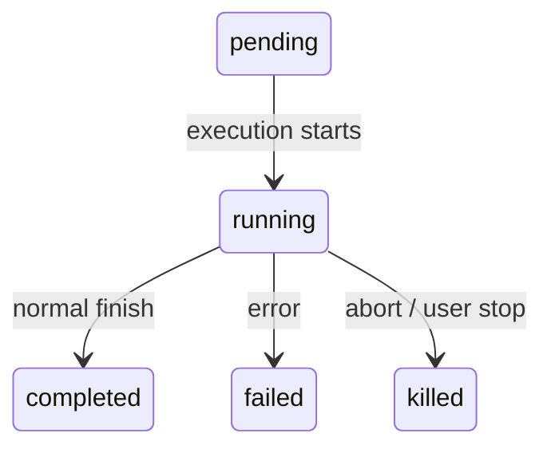

# 第 10 章：任务、协调与 Swarm

## 单线程的限制

第 8 章展示了如何创建一个子 agent——从 agent 定义构建隔离执行上下文的十五步生命周期。第 9 章展示了如何通过 prompt cache 利用使并行生成变得经济。但创建 agent 和管理 agent 是不同的两件事。本章针对的是第二件事。

单个 agent loop——一个模型，一个对话，一次一个工具——可以完成大量工作。但它会碰到一个天花板。

天花板不是智能。是并行和范围。开发者在处理大型重构时需要更新 40 个文件，在每个批次后运行测试，并验证没有东西损坏。代码库迁移同时触及前端、后端和数据库层。彻底的代码审查在后台运行测试套件的同时读取数十个文件。这些不是更难的问题——它们是更宽的问题。它们需要一次做多件事的能力，将工作委托给专家，并协调结果。

Claude Code 对这个问题的答案不是一个机制而是一层分层的编排模式，每种适合不同形状的工作。后台任务用于发射后不管的命令。协调器模式用于管理人员-工人层次结构。Swarm 团队用于对等（peer-to-peer）协作。以及一个统一的通信协议将它们联系在一起。

编排层大约跨越 `tools/AgentTool/`、`tasks/`、`coordinator/`、`tools/SendMessageTool/` 和 `utils/swarm/` 中的 40 个文件。尽管范围广泛，设计被所有模式共享的单一状态机锚定。理解那个状态机——`Task.ts` 中的 `Task` 抽象——是理解其他一切的先决条件。

---

## Task 状态机

Claude Code 中的每个后台操作——shell 命令、子 agent、远程会话、工作流脚本——都被追踪为一个 *task*。Task 抽象位于 `Task.ts` 中，提供编排层其余部分构建的统一状态模型。

### 七种类型

| 类型 | 前缀 | 示例 ID | 描述 |
|------|------|--------|------|
| `local_bash` | `b` | `b4k2m8x1` | 后台 shell 命令 |
| `local_agent` | `a` | `a7j3n9p2` | 后台 子 agent |
| `remote_agent` | `r` | `r1h5q6w4` | 远程会话 |
| `in_process_teammate` | `t` | `t3f8s2v5` | Swarm teammate |
| `local_workflow` | `w` | `w6c9d4y7` | 工作流脚本执行 |
| `monitor_mcp` | `m` | `m2g7k1z8` | MCP 服务器监控 |
| `dream` | `d` | `d5b4n3r6` | 推测性后台思考 |

Task ID 使用单字符前缀后跟 8 个随机字母数字字符，从大小写不敏感安全字母表中抽取（数字加小写字母）。这产生大约 2.8 万亿个组合——足以抵御针对磁盘上 task 输出文件的暴力符号链接攻击。

当你在日志行中看到 `a7j3n9p2` 时，你立即知道这是一个后台 agent。当你看到 `b4k2m8x1` 时，是一个 shell 命令。前缀是对人类读者的微优化，但在可能有数十个并发任务的系统中，这很重要。

### 五种状态

生命周期是一个没有环的简单有向图：



`pending` 是注册和首次执行之间的短暂状态。`running` 表示任务正在活跃工作。三个终端状态是 `completed`（成功）、`failed`（错误）和 `killed`（被用户、协调器或 abort 信号显式停止）。一个辅助函数守卫与死任务的交互：

```typescript
export function isTerminalTaskStatus(status: TaskStatus): boolean {
  return status === 'completed' || status === 'failed' || status === 'killed'
}
```

这个函数出现在各处——消息注入守卫、驱逐逻辑、孤儿清理和决定是否排队消息或恢复死 agent 的 SendMessage 路由中。

### Base State

每个 task 状态扩展 `TaskStateBase`，携带所有七种类型共享的字段：

```typescript
export type TaskStateBase = {
  id: string              // Prefixed random ID
  type: TaskType          // Discriminator
  status: TaskStatus      // Current lifecycle position
  description: string     // Human-readable summary
  toolUseId?: string      // The tool_use block that spawned this task
  startTime: number       // Creation timestamp
  // ... additional shared fields
}
```

---

## 协调器模式

协调器模式实现管理人员-工人拓扑。一个协调器 agent 分析任务，将其分解为子任务，将每个分配给专门的工人 agent，并整合结果。

协调器使用标准的多 agent 原语——生成、send_message、task 状态跟踪——而不是专门化子系统。它与工人通信的方式与其他 agent 完全相同——通过相同的 inbox 系统，使用相同的消息类型。这使得整个编排层可组合：协调器可以管理包含其他协调器的团队。层次结构可以嵌套。相同的模式在不同的抽象级别上工作。

### Inbox 消息

Inbox 是 agent 间通信的基础。每个 agent 有一个 JSONL 收件箱文件。写入是 append-only 的（没有锁，没有写入冲突）。读取是 drain 的（读完清空，没有重复交付）。消息携带类型鉴别器、发送者、内容和时间戳。

五种标准消息类型：`message`（普通文本消息）、`broadcast`（发送给所有 teammate）、`shutdown_request`（请求优雅关闭）、`shutdown_response`（批准或拒绝关闭）和 `plan_approval_response`（批准或拒绝计划）。

---

## Swarm 团队

Swarm 模式启用对等协作：多个 agent 作为平等伙伴同时运行，通过 inbox 消息通信。

### Backend 抽象

Teammate 通过 backend 系统在隔离的终端窗口中运行。System 支持三种 backend：

| Backend | 机制 | 用例 |
|---------|-----|---------|
| iTerm2 Pane | iTerm2 Python API | macOS 开发 |
| Tmux | tmux 控制和脚本 | 跨平台 |
| In-Process | 相同 Node.js 进程 | 无窗口环境 |

Backend 注册表让系统在启动时发现可用的 backend。每个 backend 实现相同的接口：create、send、resize、destroy。编排层不关心使用哪个 backend——它看到的是统一的 teammate 接口。

### Teammate 生命周期

Teammate 比基本的子 agent 更持久。它们被生成，执行初始任务，然后进入空闲状态，轮询 inbox 中的新工作或任务板中未认领的任务。当 60 秒内没有新工作到达时，它们优雅地关闭。

---

## SendMessage 路由

`SendMessageTool` 将消息路由到指定的 agent。当目的地 agent 处于 `running` 或 `idle` 状态时，消息排队到其 inbox。当 agent 处于终端状态时，`SendMessage` 返回一个错误——agent 已经死了，回复没有意义。

当消息到达 idle agent 时，agent 被唤醒。它清空 inbox，将消息注入其对话，并恢复其 agent loop。新的工作异步到达——agent 不需要轮询（尽管它可以，使用 idle loop）。

---

## Apply This

**一个状态机统治一切。** 所有后台操作——shell、agent、workflow——共享相同的生命周期。类型前缀使日志在视觉上可解析。一致的终端状态检查防止与死任务交互。

**协调器是常规 agent + spawn 权限。** 不要为编排构建单独的代码路径。给 agent 生成另一个 agent 的能力。相同的消息原语。相同的 task 跟踪。相同的错误处理。

**通过 inbox 通信。** Append-only JSONL = 零锁并发写入。Drain 读取 = 无重复。文件系统作为消息总线 = 无中间件依赖。

**Backend 抽象用于隔离。** Teammate 可以在 pane、tmux 窗口或进程内运行。编排层看到统一的接口。选择适合部署拓扑的 backend。

**Dream 任务用于推测工作。** 让 agent 在空闲时执行推测性工作。如果用户恢复交互就中止。如果 dream 完成就有免费结果。低风险，潜在高回报。
