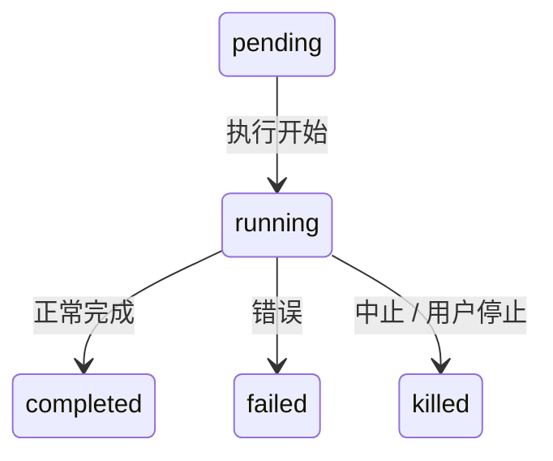

# 第 10 章：任务、协调与 Swarm

## 单线程的限制

单个 agent loop — 一个模型，一个对话，一次一个工具 — 可以完成大量工作。但它会碰到天花板。天花板不是智能。是并行性和范围。Claude Code 对这个问题的答案不是一个机制，而是一层分层的编排模式，每种模式适合不同形状的工作。

编排层大约跨越 40 个文件，包括 `tools/AgentTool/`、`tasks/`、`coordinator/`、`tools/SendMessageTool/` 和 `utils/swarm/`。

## 任务状态机

Claude Code 中的每个后台操作都被追踪为一个 *task*。任务抽象位于 `Task.ts` 中，提供编排层其余部分构建的统一状态模型。

### 七种类型

| 类型 | 前缀 | 示例 ID | 描述 |
|------|------|--------|------|
| `local_bash` | `b` | `b4k2m8x1` | 后台 shell 命令 |
| `local_agent` | `a` | `a7j3n9p2` | 后台 sub-agent |
| `remote_agent` | `r` | `r1h5q6w4` | 远程会话 |
| `in_process_teammate` | `t` | `t3f8s2v5` | Swarm teammate |
| `local_workflow` | `w` | `w6c9d4y7` | 工作流脚本执行 |
| `monitor_mcp` | `m` | `m2g7k1z8` | MCP 服务器监控 |
| `dream` | `d` | `d5b4n3r6` | 推测性后台思考 |

### 五种状态

## 协调器模式

协调器模式实现管理人员-工人（manager-worker）拓扑。一个协调器 agent 分析任务，将其分解为子任务，将每个分配给专门的工人 agent，并整合结果。

协调器使用标准的多 agent 原语（spawn、send_message、task）而非特化子系统。它与 worker 的通信与其他 agent 完全相同——通过相同的 inbox 系统，使用相同的消息类型。

## Swarm 消息

多 agent 通信的核心是 inbox 模式：

- 每个 agent 有一个 JSONL 收件箱文件
- Append-only 写入，drain 读取
- 五种消息类型：`message`、`broadcast`、`shutdown_request`、`shutdown_response`、`plan_approval_response`
- `broadcast` 发送给所有 teammate
- `shutdown_request/response` 协议协商优雅关闭

## Apply This

1. **一个状态机统治一切。** 所有后台操作——shell、agent、workflow——共享相同的 `pending → running → completed|failed|killed` 生命周期。
2. **类型前缀使日志可扫描。** 单字符 ID 前缀（`a`、`b`、`t`）是人类读者的微优化。
3. **协调器是常规 agent + spawn 权限。** 不要为 orchestration 构建单独的代码路径。给 agent spawn 另一个 agent 的能力。
4. **通过文件收件箱通信。** Append-only JSONL = 零锁通信。Drain 读取 = 无重复。无状态中间件。
5. **Dream 任务用于推测工作。** 当 agent idle 时可以启动推测性任务。如果用户恢复输入就中止。如果 Dream 完成就有免费结果。
