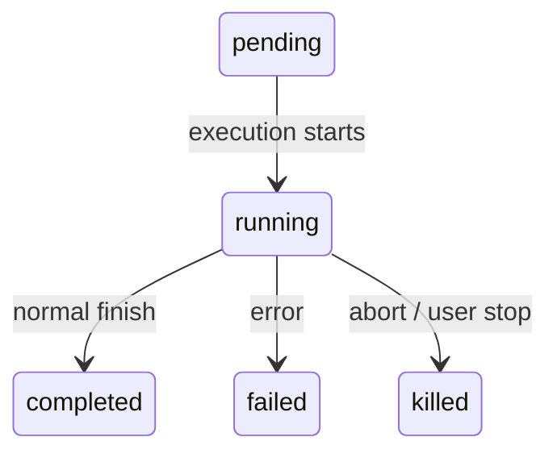

# 第 10 章：任务、协调与 Swarm

## 单线程的天花板

第 8 章展示了如何创建子 agent——15 步生命周期从 agent 定义构建隔离执行上下文。第 9 章展示了如何通过 prompt cache 利用使并行生成变得经济。但创建 agent 和管理 agent 是不同的两件事。本章针对的是第二件事。

单个 agent loop——一个模型、一次对话、一次一个工具——可以完成大量工作。它可以读文件、编辑代码、运行测试、搜索网页，并对复杂问题进行推理。但它会碰到一个天花板。

天花板不是智能。是并行和范围。开发者在处理大型重构时需要更新 40 个文件、在每个批次后运行测试、验证没有东西损坏。代码库迁移同时触及前端、后端和数据库层。彻底的代码审查在后台运行测试套件的同时读取数十个文件。这些不是更难的问题——它们是更宽的问题。它们需要一次做多件事的能力，将工作委托给专家，并协调结果。

Claude Code 对这个问题的答案不是一个机制，而是一层分层的编排模式，每种适合不同形状的工作。后台任务用于"发射后不管"的命令。协调器模式用于管理人员-工人层次结构。Swarm 团队用于对等协作。以及一个统一的通信协议将它们联系在一起。

编排层大约跨越 `tools/AgentTool/`、`tasks/`、`coordinator/`、`tools/SendMessageTool/` 和 `utils/swarm/` 中的 40 个文件。尽管范围广泛，设计被所有模式共享的单一状态机锚定。理解那个状态机——`Task.ts` 中的 `Task` 抽象——是理解其他一切的先决条件。

---

## Task 状态机

Claude Code 中的每个后台操作——shell 命令、子 agent、远程会话、工作流脚本——都被追踪为一个 *task*。Task 抽象位于 `Task.ts` 中，提供编排层其余部分构建的统一状态模型。

### 七种类型

系统定义了七种 task 类型，每种代表不同的执行模型：`local_bash`（后台 shell 命令）、`local_agent`（后台子 agent）、`remote_agent`（远程会话）、`in_process_teammate`（swarm teammate）、`local_workflow`（工作流脚本执行）、`monitor_mcp`（MCP 服务器监控）和 `dream`（推测性后台思考）。

`local_bash` 和 `local_agent` 是主力——分别是后台 shell 命令和后台子 agent。`in_process_teammate` 是 swarm 原语。`remote_agent` 桥接到远程 Claude Code Runtime 环境。`local_workflow` 运行多步骤脚本。`monitor_mcp` 监控 MCP 服务器的健康状态。`dream` 是最不寻常的——一个让 agent 在等待用户输入时进行推测性思考的后台任务。

每种类型都有一个单字符 ID 前缀，用于即时视觉识别：

| 类型 | 前缀 | 示例 ID |
|------|------|--------|
| `local_bash` | `b` | `b4k2m8x1` |
| `local_agent` | `a` | `a7j3n9p2` |
| `remote_agent` | `r` | `r1h5q6w4` |
| `in_process_teammate` | `t` | `t3f8s2v5` |
| `local_workflow` | `w` | `w6c9d4y7` |
| `monitor_mcp` | `m` | `m2g7k1z8` |
| `dream` | `d` | `d5b4n3r6` |

Task ID 使用单字符前缀后跟 8 个随机字母数字字符，从大小写不敏感安全字母表中抽取。这产生大约 2.8 万亿个组合——足以抵御针对磁盘上 task 输出文件的暴力符号链接攻击。

当你在日志行中看到 `a7j3n9p2` 时，你立即知道这是一个后台 agent。`b4k2m8x1` 是一个 shell 命令。前缀是对人类读者的微优化，但在可能有数十个并发 task 的系统中，这很重要。

### 五种状态

生命周期是一个没有环的简单有向图：



`pending` 是注册和首次执行之间的短暂状态。`running` 表示 task 正在活跃工作。三个终端状态是 `completed`（成功）、`failed`（错误）和 `killed`（被用户、协调器或 abort 信号显式停止）。一个辅助函数守卫与死 task 的交互：

```typescript
export function isTerminalTaskStatus(status: TaskStatus): boolean {
  return status === 'completed' || status === 'failed' || status === 'killed'
}
```

这个函数出现在各处——消息注入守卫、驱逐逻辑、孤儿清理，以及 SendMessage 路由中决定是排队消息还是恢复死 agent 的地方。

### Base State

每个 task 状态扩展 `TaskStateBase`，携带所有七种类型共享的字段：

```typescript
export type TaskStateBase = {
  id: string              // Prefixed random ID
  type: TaskType          // Discriminator
  status: TaskStatus      // Current lifecycle position
  description: string     // Human-readable summary
  toolUseId?: string      // The tool_use block that spawned this task
  startTime: number       // Creation timestamp
  endTime?: number        // Terminal-state timestamp
  totalPausedMs?: number  // Accumulated pause time
  outputFile: string      // Disk path for streaming output
  outputOffset: number    // Read cursor for incremental output
  notified: boolean       // Whether completion was reported to parent
}
```

两个字段值得关注。`outputFile` 是异步执行和父 agent 对话之间的桥梁——每个 task 将其输出写入磁盘文件，父 agent 可以通过 `outputOffset` 增量读取。`notified` 防止重复的完成消息；一旦父 agent 被告知 task 完成，标志翻转为 `true`，通知永远不会再次发送。没有这个守卫，一个在父 agent 连续两次轮询通知队列之间完成的任务会产生重复通知，让模型困惑地认为有两个任务完成了而实际上只有一个。

### Agent Task State

`LocalAgentTaskState` 是最复杂的变体，携带管理后台子 agent 完整生命周期所需的一切：

```typescript
export type LocalAgentTaskState = TaskStateBase & {
  type: 'local_agent'
  agentId: string
  prompt: string
  selectedAgent?: AgentDefinition
  agentType: string
  model?: string
  abortController?: AbortController
  pendingMessages: string[]       // Queued via SendMessage
  isBackgrounded: boolean         // Was this originally a foreground agent?
  retain: boolean                 // UI is holding this task
  diskLoaded: boolean             // Sidechain transcript loaded
  evictAfter?: number             // GC deadline
  progress?: AgentProgress
  lastReportedToolCount: number
  lastReportedTokenCount: number
}
```

三个字段揭示了重要的设计决策。`pendingMessages` 是收件箱——当 `SendMessage` 针对一个运行中的 agent 时，消息被排队在这里而不是立即注入。消息在工具轮次边界处被清空，这保持了 agent 的轮次结构。`isBackgrounded` 区分天生异步的 agent 和最初作为前台同步 agent 启动、后来被用户按键转为后台的 agent。`evictAfter` 是垃圾回收机制：未保留的已完成 task 在被驱逐出内存之前获得宽限期。

### Task Registry

每种 task 类型由一个 `Task` 对象支持，具有最小化的接口：

```typescript
export type Task = {
  name: string
  type: TaskType
  kill(taskId: string, setAppState: SetAppState): Promise<void>
}
```

注意条件性包含——`LocalWorkflowTask` 和 `MonitorMcpTask` 是 feature-gated 的，在运行时可能不存在。`Task` 接口故意最小化。早期迭代包含 `spawn()` 和 `render()` 方法，但当明确生成和渲染永远不会被多态调用时，这些被移除了。每种 task 类型有自己的生成逻辑、自己的状态管理和自己的渲染。唯一真正需要按类型分发的操作是 `kill()`，所以这就是接口所需的全部。

这是通过减法进行接口演进的例子。初始设计想象所有 task 类型共享一个共同的生命周期接口。实际上，类型之间的差异足够大，共享接口变成了虚构——shell 命令的 `spawn()` 和进程内 teammate 的 `spawn()` 几乎没有任何共同点。与其维护一个漏水的抽象，团队移除了除了真正受益于多态的这一个方法之外的一切。

---

## 通信模式

一个在后台运行的任务只有在父 agent 能观察其进度并接收其结果时才有用。Claude Code 支持三种通信通道，每种针对不同的访问模式进行优化。

### 前台：Generator 链

当 agent 同步运行时，父 agent 直接迭代其 `runAgent()` async generator，将每条消息 yield 回调用栈。有趣的机制是后台 escape hatch——同步循环在"来自 agent 的下一条消息"和"后台信号"之间竞赛：

```typescript
const agentIterator = runAgent({ ...params })[Symbol.asyncIterator]()

while (true) {
  const nextMessagePromise = agentIterator.next()
  const raceResult = backgroundPromise
    ? await Promise.race([nextMessagePromise.then(...), backgroundPromise])
    : { type: 'message', result: await nextMessagePromise }

  if (raceResult.type === 'background') {
    // User triggered backgrounding -- transition to async
    await agentIterator.return(undefined)
    void runAgent({ ...params, isAsync: true })
    return { data: { status: 'async_launched' } }
  }

  agentMessages.push(message)
}
```

如果用户在执行中途决定将同步 agent 变为后台任务，前台 iterator 被干净地返回（触发其 `finally` 块进行资源清理），agent 以相同的 ID 被重新生成为异步任务。过渡是无缝的——没有工作丢失，agent 从离开的地方继续，使用与父 agent 的 ESC 键解除了链接的异步 abort 控制器。

这是一个真正难以做对的状态转换。前台 agent 共享父 agent 的 abort 控制器（ESC 同时杀掉两者）。后台 agent 需要自己的控制器（ESC 不应该杀掉它）。Agent 的消息需要从前台 generator 流转移到后台通知系统。Task 状态需要翻转 `isBackgrounded`，以便 UI 知道在后台面板中显示它。所有这些必须原子化地发生——过渡中不丢失消息，没有僵尸 iterator 继续运行。下一条消息和后台信号之间的 `Promise.race` 是使其成为可能的机制。

### 后台：三个通道

后台 agent 通过磁盘、通知和排队消息进行通信。

**磁盘输出文件。** 每个 task 写入一个 `outputFile` 路径——指向 agent 转录的符号链接，格式为 JSONL。父 agent（或任何观察者）可以使用 `outputOffset` 增量读取此文件，该偏移量跟踪文件已被消费到多远。`TaskOutputTool` 将其暴露给模型：

```typescript
inputSchema = z.strictObject({
  task_id: z.string(),
  block: z.boolean().default(true),
  timeout: z.number().default(30000),
})
```

当 `block: true` 时，工具轮询直到 task 达到终端状态或超时到期。这是生成工人并等待其结果的协调器的主要机制。

**Task 通知。** 当后台 agent 完成时，系统生成一个 XML 通知并将其入队以投递到父 agent 的对话中：

```xml
<task-notification>
  <task-id>a7j3n9p2</task-id>
  <tool-use-id>toolu_abc123</tool-use-id>
  <output-file>/path/to/output</output-file>
  <status>completed</status>
  <summary>Agent "Investigate auth bug" completed</summary>
  <result>Found null pointer in src/auth/validate.ts:42...</result>
  <usage>
    <total_tokens>15000</total_tokens>
    <tool_uses>8</tool_uses>
    <duration_ms>12000</duration_ms>
  </usage>
</task-notification>
```

通知作为 user-role 消息注入到父 agent 的对话中，这意味着模型在其正常消息流中看到它。它不需要特殊工具来检查完成情况——它们作为上下文到达。`notified` 标志防止重复投递。

**Command queue。** `pendingMessages` 数组是第三个通道。当 `SendMessage` 针对运行中的 agent 时，消息被排队：

```typescript
if (isLocalAgentTask(task) && task.status === 'running') {
  queuePendingMessage(agentId, input.message, setAppState)
  return { data: { success: true, message: 'Message queued...' } }
}
```

这些消息在工具轮次边界处由 `drainPendingMessages()` 清空，并作为用户消息注入到 agent 的对话中。这是一个关键的设计选择——消息在工具轮次之间到达，而不是在执行中间。Agent 完成当前思路，然后接收新信息。没有竞态条件，没有损坏的状态。

### 进度追踪

`ProgressTracker` 提供对 agent 活动的实时可见性。输入 token 和输出 token 追踪之间的区别是刻意的，反映了 API 计费模型的一个微妙之处。输入 token 是每 API 调用累积的，因为完整对话每次都被重新发送——第 15 轮包含前面所有 14 轮，所以 API 报告的输入 token 计数已经反映了总数。保留最新值是正确的聚合。输出 token 是每轮次的——模型每次生成新 token——所以求和是正确的聚合。搞错这一点要么会严重高估（将累积输入 token 求和）要么严重低估（只保留最新输出 token）。

`recentActivities` 数组（上限为 5 个条目）提供 agent 正在做什么的人类可读流。这出现在 VS Code 子 agent 面板和终端的后台任务指示器中，让用户无需阅读完整转录就能看到 agent 的工作。

---

## 协调器模式

协调器模式将 Claude Code 从带有后台助手的单个 agent 转变为一个真正的管理人员-工人架构。

### 它解决的问题

标准的 agent loop 有单一对话和单一上下文窗口。当它生成一个后台 agent 时，后台 agent 独立运行并通过 task 通知报告结果。这对于简单的委托有效——"我继续编辑的时候运行测试"——但对于复杂的多步骤工作流就失效了。

考虑一个代码库迁移。Agent 需要：(1) 理解 200 个文件中的当前模式，(2) 设计迁移策略，(3) 对每个文件应用更改，以及 (4) 验证没有东西损坏。步骤 1 和 3 受益于并行。步骤 2 需要综合步骤 1 的结果。步骤 4 依赖于步骤 3。一个顺序执行这些的 agent 会将其大部分 token 预算花在重新读取文件上。多个没有协调的后台 agent 会产生不一致的更改。

协调器模式通过分离"思考"agent 和"执行"agent 来解决这个问题。协调器处理步骤 1 和 2（分派研究工人，然后综合结果）。工人处理步骤 3 和 4（应用更改，运行测试）。协调器看到全局；工人看到他们的具体任务。

### 工具限制

协调器的力量不是来自拥有更多工具，而是来自拥有更少的工具。在协调器模式中，协调器 agent 恰好获得三个工具：Agent（生成工人）、SendMessage（与现有工人通信）和 TaskStop（终止运行中的工人）。协调器不能读文件、编辑代码或运行 shell 命令。这个限制不是缺陷——它是核心设计原则。

工人反过来获得完整的工具集减去内部协调工具。

---

## Swarm 与 SendMessage

Swarm 模式启用对等协作：多个 agent 作为平等伙伴同时运行。`teammateInit.ts` 为每个 teammate 构建上下文，隔离工作目录和权限。Teammate 通过 inbox 消息通信，使用与其他编排模式相同的 `SendMessageTool`。

`SendMessageRouter` 决定消息的去向：运行中的 agent 收到排队消息；idle agent 被唤醒并注入消息；死的 agent 返回路由错误。

---

## Apply This

**一个状态机统治一切。** 所有后台操作共享相同的生命周期和相同的状态字段。一致的终端状态检查防止与死 task 交互。单字符前缀使得日志可视化可解析。

**通过减法的接口设计。** 当共享接口方法只在某些类型中有意义时，移除它们。一个只有 `kill()` 的 `Task` 接口比一个有虚构的 `spawn()` 方法的接口更好。让每种类型做自己的事，只多态化真正跨类型相同的操作。

**三种通信通道，三种访问模式。** Generator chain 用于同步执行。磁盘 + offset 用于增量读取。通知用于异步完成信号。排队消息用于运行时通信。不要试图让一个通道做所有事。

**协调器通过*少*工具获得力量。** 协调器不能触及代码库。它的工作是思考、分解、综合。工人做工作。分离是刻意的——它强制协调器像架构师一样推理，而不是像实现者。

**Promise.race 用于优雅降级。** 用户中途将同步 agent 变为后台 agent 时，`Promise.race` 使得前台循环能够干净地过渡到后台执行。没有消息丢失。Agent 从中断处继续。
