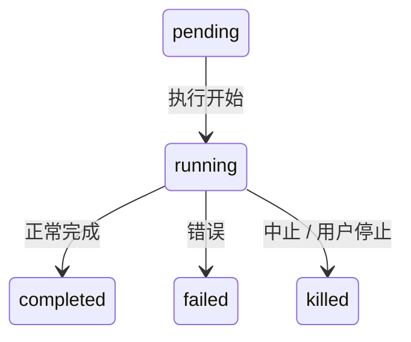
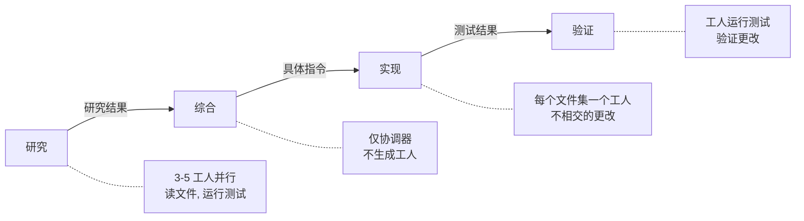
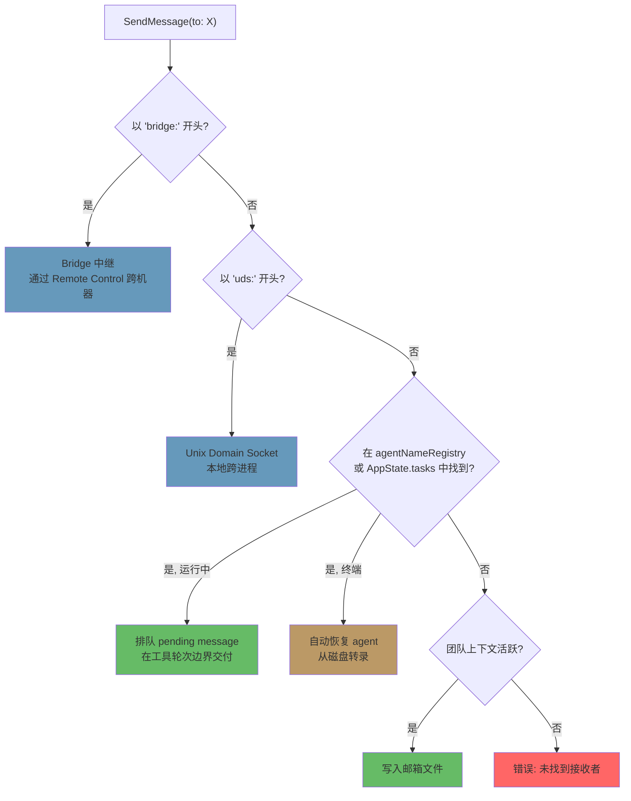

# 第 10 章：任务、协调与 Swarm

## 单线程的天花板

第 8 章展示了如何创建子 agent——15 步生命周期从 agent 定义构建隔离执行上下文。第 9 章展示了如何通过 prompt cache 利用使并行生成变得经济。但创建 agent 和管理 agent 是不同的两件事。本章针对的是第二件事。

单个 agent 循环——一个模型、一个对话、一次一个工具——可以完成大量工作。它可以读文件、编辑代码、运行测试、搜索 web 并推理复杂问题。但它有天花板。

天花板不是智能。是并行性和范围。进行大型重构的开发者需要更新 40 个文件、每批之后运行测试、并验证没有东西损坏。代码库迁移同时涉及前端、后端和数据库层。彻底的代码审查阅读数十个文件同时在后台运行测试套件。这些不是更难的问题——它们是更宽的问题。它们需要同时做多件事的能力、将工作委托给专家、并协调结果。

Claude Code 对此问题的回答不是一个机制而是一组分层的编排模式，每种适合不同形态的工作。后台任务用于即发即忘的命令。协调器模式用于管理者-工人层级。Swarm 团队用于点对点协作。以及将它们联系在一起的统一通信协议。

编排层横跨大约 40 个文件，遍布 `tools/AgentTool/`、`tasks/`、`coordinator/`、`tools/SendMessageTool/` 和 `utils/swarm/`。尽管范围广泛，设计由一个所有模式共享的单一状态机锚定。理解该状态机——`Task.ts` 中的 `Task` 抽象——是理解其他一切的前提。

本章追踪完整堆栈，从基础任务状态机到最复杂的多 agent 拓扑。

---

## Task 状态机

Claude Code 中的每个后台操作——shell 命令、子 agent、远程会话、workflow 脚本——被追踪为 *task*。Task 抽象活在 `Task.ts` 中，提供编排层其余部分构建于其上的统一状态模型。

### 七种类型

系统定义七种 task 类型，每种代表不同的执行模型：

七种 task 类型是：`local_bash`（后台 shell 命令）、`local_agent`（后台子 agent）、`remote_agent`（远程会话）、`in_process_teammate`（swarm 队友）、`local_workflow`（workflow 脚本执行）、`monitor_mcp`（MCP 服务器监控）和 `dream`（推测性后台思考）。

`local_bash` 和 `local_agent` 是主力——分别是后台 shell 命令和后台子 agent。`in_process_teammate` 是 swarm 原语。`remote_agent` 桥接到远程 Claude Code Runtime 环境。`local_workflow` 运行多步脚本。`monitor_mcp` 观察 MCP 服务器健康。`dream` 是最不寻常的——一个让 agent 在等待用户输入时推测性思考的后台任务。

每种类型获得单字符 ID 前缀用于即时视觉识别：

| 类型 | 前缀 | 示例 ID |
|------|------|---------|
| `local_bash` | `b` | `b4k2m8x1` |
| `local_agent` | `a` | `a7j3n9p2` |
| `remote_agent` | `r` | `r1h5q6w4` |
| `in_process_teammate` | `t` | `t3f8s2v5` |
| `local_workflow` | `w` | `w6c9d4y7` |
| `monitor_mcp` | `m` | `m2g7k1z8` |
| `dream` | `d` | `d5b4n3r6` |

Task ID 使用单字符前缀（a 代表 agent，b 代表 bash，t 代表 teammate 等）后跟 8 个从大小写不敏感的字母表（数字加小写字母）中抽取的随机字母数字字符。这产生大约 2.8 万亿种组合——足以抵抗针对磁盘上 task 输出文件的暴力 symlink 攻击。

当你在日志行中看到 `a7j3n9p2`，你立即知道它是一个后台 agent。当你看到 `b4k2m8x1`，一个 shell 命令。前缀是对人类读者的微优化，但在可以有数十个并发 task 的系统中，它很重要。

### 五种状态

生命周期是一个无环的简单有向图：



`pending` 是注册和首次执行之间的短暂状态。`running` 意味着 task 正在主动工作。三种终端状态是 `completed`（成功）、`failed`（错误）和 `killed`（被用户、协调器或中止信号显式停止）。一个辅助函数防止与死亡 task 交互：

```typescript
export function isTerminalTaskStatus(status: TaskStatus): boolean {
  return status === 'completed' || status === 'failed' || status === 'killed'
}
```

此函数出现在各处——在消息注入守卫、驱逐逻辑、孤儿清理和决定是排队消息还是恢复死亡 agent 的 SendMessage 路由中。

### 基础状态

每个 task 状态扩展 `TaskStateBase`，携带所有七种类型共享的字段：

```typescript
export type TaskStateBase = {
  id: string              // 前缀的随机 ID
  type: TaskType          // 鉴别器
  status: TaskStatus      // 当前生命周期位置
  description: string     // 人类可读的摘要
  toolUseId?: string      // 生成此 task 的 tool_use 块
  startTime: number       // 创建时间戳
  endTime?: number        // 终端状态时间戳
  totalPausedMs?: number  // 累积暂停时间
  outputFile: string      // 流式输出的磁盘路径
  outputOffset: number    // 增量输出的读取游标
  notified: boolean       // 完成是否已报告给父
}
```

两个字段值得关注。`outputFile` 是异步执行和父对话之间的桥梁——每个 task 将其输出写入磁盘上的文件，父可以通过 `outputOffset` 增量读取它。`notified` 防止重复完成消息；一旦父被告知 task 完成，标志翻转为 `true` 且通知永不再发送。没有此守卫，在通知队列的两次连续轮询之间完成的 task 将生成重复通知，使模型困惑于以为两个 task 完成而实际只有一个。

### Agent Task 状态

`LocalAgentTaskState` 是最复杂的变体，携带管理后台子 agent 完整生命周期所需的一切：

```typescript
export type LocalAgentTaskState = TaskStateBase & {
  type: 'local_agent'
  agentId: string
  prompt: string
  selectedAgent?: AgentDefinition
  agentType: string
  model?: string
  abortController?: AbortController
  pendingMessages: string[]       // 通过 SendMessage 排队
  isBackgrounded: boolean         // 这最初是前台 agent 吗？
  retain: boolean                 // UI 正在保持此 task
  diskLoaded: boolean             // Sidechain 转录已加载
  evictAfter?: number             // GC 截止时间
  progress?: AgentProgress
  lastReportedToolCount: number
  lastReportedTokenCount: number
  // ... 额外的生命周期字段
}
```

三个字段揭示了重要的设计决策。`pendingMessages` 是收件箱——当 `SendMessage` 针对运行中的 agent 时，消息在此排队而非立即注入。消息在工具轮次边界排空，这保留了 agent 的轮次结构。`isBackgrounded` 区分生来异步的 agent 和那些作为前台同步 agent 开始后来被用户按键后台化的 agent。`evictAfter` 是一个垃圾回收机制：未保持的已完成 task 在状态从内存中清除前获得宽限期。

所有 task 状态存储在 `AppState.tasks` 中作为 `Record<string, TaskState>`，以前缀 ID 键控。这是一个平面 map，不是树——系统不在状态存储中建模父子关系。父子关系隐含在对话流中：父持有生成子的 `toolUseId`。

### Task Registry

每个 task 类型由一个带有最小接口的 `Task` 对象支持：

```typescript
export type Task = {
  name: string
  type: TaskType
  kill(taskId: string, setAppState: SetAppState): Promise<void>
}
```

注册表收集所有 task 实现：

```typescript
export function getAllTasks(): Task[] {
  return [
    LocalShellTask,
    LocalAgentTask,
    RemoteAgentTask,
    DreamTask,
    ...(LocalWorkflowTask ? [LocalWorkflowTask] : []),
    ...(MonitorMcpTask ? [MonitorMcpTask] : []),
  ]
}
```

注意条件包含——`LocalWorkflowTask` 和 `MonitorMcpTask` 是 feature-gated，可能在运行时不存在。`Task` 接口故意是最小化的。早期迭代包含 `spawn()` 和 `render()` 方法，但当清楚生成和渲染从未被多态调用时，这些被移除了。每个 task 类型有自己的生成逻辑、自己的状态管理和自己的渲染。唯一真正需要按类型分派的操作是 `kill()`，因此这就是接口所需的全部。

这是通过减法演进的接口示例。初始设计设想所有 task 类型将共享一个通用生命周期接口。在实践中，类型分叉得足够多以至于共享接口成为虚构——shell 命令的 `spawn()` 和进程内 teammate 的 `spawn()` 几乎没有共同之处。团队没有维护泄漏的抽象，而是移除了除了实际受益于多态的那一个方法之外的一切。

---

## 通信模式

在后台运行的 task 只有在父可以观察其进度并接收其结果时才有用。Claude Code 支持三种通信通道，每种针对不同的访问模式优化。

### 前台：Generator 链

当 agent 同步运行时，父直接迭代其 `runAgent()` async generator，将每条消息产出回调用栈。有趣的机制是后台逃生口——同步循环在"agent 的下一条消息"和"后台信号"之间竞速：

```typescript
const agentIterator = runAgent({ ...params })[Symbol.asyncIterator]()

while (true) {
  const nextMessagePromise = agentIterator.next()
  const raceResult = backgroundPromise
    ? await Promise.race([nextMessagePromise.then(...), backgroundPromise])
    : { type: 'message', result: await nextMessagePromise }

  if (raceResult.type === 'background') {
    // 用户触发后台化——过渡到异步
    await agentIterator.return(undefined)
    void runAgent({ ...params, isAsync: true })
    return { data: { status: 'async_launched' } }
  }

  agentMessages.push(message)
}
```

如果用户在执行中途决定同步 agent 应成为后台 task，前台 iterator 被干净地返回（触发其 `finally` 块进行资源清理），agent 作为带有相同 ID 的异步 task 重新生成。过渡是无缝的——没有工作丢失，agent 从离开的地方继续，使用与父的 ESC 键不链接的异步 abort 控制器。

这是一个真正困难的状态过渡要正确实现。前台 agent 共享父的 abort 控制器（ESC 杀死两者）。后台 agent 需要自己的控制器（ESC 不应杀死它）。Agent 的消息需要从前台 generator 流传输到后台通知系统。Task 状态需要翻转 `isBackgrounded` 以便 UI 知道在后台面板中显示它。而所有这些必须原子地发生——没有消息在过渡中丢失，没有僵尸 iterator 留下继续运行。下一条消息和后台信号之间的 `Promise.race` 是使这成为可能的机制。

### 后台：三个通道

后台 agent 通过磁盘、通知和排队消息进行通信。

**磁盘输出文件。** 每个 task 写入一个 `outputFile` 路径——指向 JSONL 格式 agent 转录的 symlink。父（或任何观察者）可以使用 `outputOffset` 增量读取此文件，它追踪文件已被消费到多远。`TaskOutputTool` 将此暴露给模型：

```typescript
inputSchema = z.strictObject({
  task_id: z.string(),
  block: z.boolean().default(true),
  timeout: z.number().default(30000),
})
```

当 `block: true` 时，工具轮询直到 task 达到终端状态或超时到期。这是生成工人并等待其结果的协调器的主要机制。

**Task 通知。** 当后台 agent 完成时，系统生成 XML 通知并将其排队以交付到父对话中：

```xml
<task-notification>
  <task-id>a7j3n9p2</task-id>
  <tool-use-id>toolu_abc123</tool-use-id>
  <output-file>/path/to/output</output-file>
  <status>completed</status>
  <summary>Agent "Investigate auth bug" completed</summary>
  <result>Found null pointer in src/auth/validate.ts:42...</result>
  <usage>
    <total_tokens>15000</total_tokens>
    <tool_uses>8</tool_uses>
    <duration_ms>12000</duration_ms>
  </usage>
</task-notification>
```

通知作为 user-role 消息注入到父对话中，这意味着模型在其正常消息流中看到它。它不需要特殊工具来检查完成——它们作为上下文到达。Task 状态上的 `notified` 标志防止重复交付。

**命令队列。** `LocalAgentTaskState` 上的 `pendingMessages` 数组是第三个通道。当 `SendMessage` 针对运行中的 agent 时，消息被排队：

```typescript
if (isLocalAgentTask(task) && task.status === 'running') {
  queuePendingMessage(agentId, input.message, setAppState)
  return { data: { success: true, message: 'Message queued...' } }
}
```

这些消息由 `drainPendingMessages()` 在工具轮次边界排空，并作为用户消息注入到 agent 对话中。这是一个关键的设计选择——消息在工具轮次之间到达，而非执行中途。Agent 完成其当前思考，然后接收新信息。无竞态条件，无损坏状态。

### 进度追踪

`ProgressTracker` 提供对 agent 活动的实时可见性：

```typescript
export type ProgressTracker = {
  toolUseCount: number
  latestInputTokens: number        // 累积（最新值，非求和）
  cumulativeOutputTokens: number   // 跨轮次累加
  recentActivities: ToolActivity[] // 最近 5 次工具使用
}
```

输入和输出 token 追踪之间的区分是故意的，反映了 API 计费模型的微妙之处。输入 token 是每次 API 调用累积的，因为完整对话每次重新发送——第 15 轮包含之前所有 14 轮，因此 API 报告的输入 token 计数已经反映总量。保留最新值是正确聚合。输出 token 是每轮的——模型每次生成新 token——因此求和是正确聚合。搞错这点要么会严重高估（对累积输入 token 求和）或严重低估（只保留最新输出 token）。

`recentActivities` 数组（上限 5 条）提供 agent 正在做什么的人类可读流："Read src/auth/validate.ts"、"Bash: npm test"、"Edit src/auth/validate.ts"。这出现在 VS Code 子 agent 面板和终端后台 task 指示器中，给用户对 agent 工作的可见性而不需要阅读完整转录。

对于后台 agent，进度通过 `updateAsyncAgentProgress()` 写入 `AppState` 并通过 `emitTaskProgress()` 作为 SDK 事件发出。VS Code 子 agent 面板消费这些事件来渲染实时进度条、工具计数和活动流。进度追踪不仅是装饰性的——它是告诉用户后台 agent 是在取得进展还是卡在循环中的主要反馈机制。

---

## 协调器模式

协调器模式将 Claude Code 从带有后台助手的单个 agent 转变为真正的管理者-工人架构。它是系统中最有主见的编排模式，其设计揭示了对 LLM 应该如何以及不应该委托工作的深入思考。

### 协调器模式解决的问题

标准 agent 循环有单一对话和单一上下文窗口。当它生成后台 agent 时，后台 agent 独立运行并通过 task 通知报告结果。这对简单委托工作良好——"我继续编辑时运行测试"——但对复杂的多步工作流不足。

考虑代码库迁移。Agent 需要：(1) 理解 200 个文件中的当前模式，(2) 设计迁移策略，(3) 对每个文件应用更改，(4) 验证没有东西损坏。步骤 1 和 3 受益于并行性。步骤 2 需要综合步骤 1 的结果。步骤 4 依赖步骤 3。单个 agent 顺序执行将花费其大部分 token 预算重新读取文件。多个后台 agent 在没有协调的情况下执行将产生不一致的更改。

协调器模式通过将"思考"agent 与"执行"agent 分开解决此问题。协调器处理步骤 1 和 2（分发研究工人，然后综合）。工人处理步骤 3 和 4（应用更改，运行测试）。协调器看到完整画面；工人看到其具体任务。

### 激活

单一环境变量翻转开关：

```typescript
export function isCoordinatorMode(): boolean {
  if (feature('COORDINATOR_MODE')) {
    return isEnvTruthy(process.env.CLAUDE_CODE_COORDINATOR_MODE)
  }
  return false
}
```

在会话恢复时，`matchSessionMode()` 检查恢复会话的已存储模式是否匹配当前环境。如果它们发散，环境变量被翻转以匹配。这防止了协调器会话恢复为常规 agent（失去对其工人的感知）或常规会话恢复为协调器（失去对其工具的访问）的困惑场景。会话的模式是真相来源；环境变量是运行时信号。

### 工具限制

协调器的力量不是来自拥有更多工具，而是来自拥有更少。在协调器模式下，协调器 agent 获得恰好三种工具：

- **Agent** — 生成工人
- **SendMessage** — 与现有工人通信
- **TaskStop** — 终止运行中的工人

仅此而已。不读文件。不编辑代码。不执行 shell 命令。协调器不能直接接触代码库。此限制不是局限——它是核心设计原则。协调器的工作是思考、计划、分解和综合。工人做工作。

工人反之获得完整工具集减去内部协调工具：

```typescript
const INTERNAL_WORKER_TOOLS = new Set([
  TEAM_CREATE_TOOL_NAME,
  TEAM_DELETE_TOOL_NAME,
  SEND_MESSAGE_TOOL_NAME,
  SYNTHETIC_OUTPUT_TOOL_NAME,
])
```

工人不能生成自己的子团队或向同伴发送消息。他们通过正常的 task 完成机制报告结果，协调器跨他们综合。

### 370 行 System Prompt

协调器 system prompt 是代码库中关于如何使用 LLM 进行编排的最具指导性文档，逐行如此。它运行约 370 行，编码了关于委托模式的来之不易的教训。关键教导：

**"绝不委托理解（Never delegate understanding）。"** 这是核心论点。协调器必须将研究发现综合为带有文件路径、行号和确切更改的具体 prompt。Prompt 显式标记反模式如"基于你的发现，修复 bug"——一个将*理解*委托给工人的 prompt，迫使其重新推导协调器已有的上下文。正确模式是："在 `src/auth/validate.ts` 第 42 行，`userId` 参数在从 OAuth 流调用时可以为 null。添加一个返回 401 响应的 null 检查。"

**"并行性是你的超能力。"** Prompt 建立了清晰的并发模型。只读任务自由并行运行——研究、探索、文件读取。写入繁重的任务按文件集串行化。协调器被期望推理哪些任务可以重叠、哪些必须顺序化。好的协调器同时生成五个研究工人，等待所有完成，综合，然后生成三个触及不相交文件集的实现工人。坏的协调器生成一个工人、等待、生成下一个、再次等待——将本可并行的工作串行化。

**Task 工作流阶段。** Prompt 定义了四个阶段：



1. **研究（Research）** — 工人并行探索代码库，读文件、运行测试、收集信息
2. **综合（Synthesis）** — 协调器（不是工人）读取所有研究结果并建立统一理解
3. **实现（Implementation）** — 工人接收从综合派生的精确指令
4. **验证（Verification）** — 工人运行测试并验证更改

协调器不应跳过阶段。最常见的失败模式是直接从研究跳到实现而不经过综合。当这发生时，协调器将理解委托给实现工人——每个必须从头重新推导上下文，导致不一致的更改和浪费的 token。

**继续 vs 生成的决策。** 当工人完成且协调器有后续工作时，应该向现有工人发送消息（通过 SendMessage）还是生成新的（通过 Agent）？决策是上下文重叠的函数：

- **高重叠，相同文件**：继续。工人已经在其上下文中有文件内容，理解模式，可以构建在其先前工作之上。生成新的将强制重新读取相同文件和重新推导相同理解。
- **低重叠，不同领域**：生成新的。刚刚调查认证系统的工人携带 20,000 token 认证特定上下文，对 CSS 重构任务是死重。从干净开始更便宜。
- **高重叠但工人失败**：生成新的并带有关于什么出错的显式指导。继续一个失败的工人通常意味着对抗困惑的上下文。带有"先前尝试因为 X 失败，避免 Y"的全新开始更可靠。
- **后续工作需要工人的输出**：继续，输出包含在 SendMessage 中。工人不需要重新推导自己的结果。

**工人 prompt 编写和反模式。** Prompt 教导协调器如何编写有效的工人 prompt 并显式标记坏模式：

反模式：*"基于你的研究发现，实现修复。"* 这委托了理解。工人不是做了研究的那个人——协调器读了研究结果。

反模式：*"修复 auth 模块中的 bug。"* 没有文件路径、没有行号、没有 bug 描述。工人必须从头搜索整个代码库。

反模式：*"对所有其他文件做相同的更改。"* 哪些文件？什么更改？协调器知道；它应该枚举它们。

好模式：*"在 `src/auth/validate.ts` 第 42 行，`userId` 参数在从 `src/oauth/callback.ts:89` 调用时可以为 null。添加 null 检查：如果 `userId` 为 null，返回 `{ error: 'unauthorized', status: 401 }`。然后更新 `src/auth/__tests__/validate.test.ts` 中的测试以覆盖 null 情况。"*

编写具体 prompt 的成本由协调器承担一次。收益——工人首次就正确执行——是巨大的。模糊的 prompt 创造假经济：协调器节省 30 秒 prompt 编写，工人浪费 5 分钟探索。

### 工人上下文

协调器将关于可用工具的信息注入自己的上下文，以便模型知道工人可以做什么：

```typescript
export function getCoordinatorUserContext(mcpClients, scratchpadDir?) {
  return {
    workerToolsContext: `Workers spawned via Agent have access to: ${workerTools}`
      + (mcpClients.length > 0
        ? `\nWorkers also have MCP tools from: ${serverNames}` : '')
      + (scratchpadDir ? `\nScratchpad: ${scratchpadDir}` : '')
  }
}
```

Scratchpad 目录（由 `tengu_scratch` feature flag 门控）是一个共享文件系统位置，工人可以在其中无权限提示地读写。它实现持久的跨工人知识共享——一个工人的研究笔记成为另一个工人的输入，通过文件系统而非协调器的 token 窗口中介。

这很重要因为它解决了协调器模式的一个基本限制。没有 scratchpad，所有信息流经协调器：工人 A 产生发现，协调器通过 TaskOutput 读取它们，将它们综合到工人 B 的 prompt 中。协调器的上下文窗口成为瓶颈——它必须持有所有中间结果足够长时间以综合它们。有了 scratchpad，工人 A 将发现写入 `/tmp/scratchpad/auth-analysis.md`，协调器告诉工人 B："阅读 `/tmp/scratchpad/auth-analysis.md` 中的 auth 分析并将模式应用到 OAuth 模块。"协调器通过引用而非传值移动信息。

### 与 Fork 的互斥

协调器模式和基于 fork 的子 agent 是互斥的：

```typescript
export function isForkSubagentEnabled(): boolean {
  if (feature('FORK_SUBAGENT')) {
    if (isCoordinatorMode()) return false
    // ...
  }
}
```

冲突是根本性的。Fork agent 继承父的整个对话上下文——它们是共享 prompt cache 的廉价克隆。协调器工人是带有全新上下文和具体指令的独立 agent。这些是对立的委托哲学，系统在 feature flag 级别强制执行此选择。

---

## Swarm 系统

协调器模式是层级式的：一个管理者、许多工人、自上而下控制。Swarm 系统是点对点替代方案——多个 Claude Code 实例作为团队工作，领导者通过消息传递协调多个队友。

### 团队上下文

团队由 `teamName` 标识并在 `AppState.teamContext` 中追踪：

```typescript
teamContext?: {
  teamName: string
  teammates: {
    [id: string]: { name: string; color?: string; ... }
  }
}
```

每个队友获得名称（用于寻址）和颜色（用于 UI 中的视觉区分）。团队文件持久化在磁盘上，使团队成员资格在进程重启后仍存活。

### Agent 名称注册表

后台 agent 可以在生成时被赋予名称，使其可通过人类可读标识符而非随机 task ID 寻址：

```typescript
if (name) {
  rootSetAppState(prev => {
    const next = new Map(prev.agentNameRegistry)
    next.set(name, asAgentId(asyncAgentId))
    return { ...prev, agentNameRegistry: next }
  })
}
```

`agentNameRegistry` 是一个 `Map<string, AgentId>`。当 `SendMessage` 解析 `to` 字段时，首先检查注册表：

```typescript
const registered = appState.agentNameRegistry.get(input.to)
const agentId = registered ?? toAgentId(input.to)
```

这意味着你可以发送消息给 `"researcher"` 而不是 `a7j3n9p2`。间接性是简单的，但它使协调器能够以角色而非 ID 思考——对模型推理多 agent 工作流的能力有显著提升。

### 进程内 Teammate

进程内 teammate 在与领导者相同的 Node.js 进程中运行，通过 `AsyncLocalStorage` 隔离。其状态扩展基础状态并带有团队特定字段：

```typescript
export type InProcessTeammateTaskState = TaskStateBase & {
  type: 'in_process_teammate'
  identity: TeammateIdentity
  prompt: string
  messages?: Message[]                  // 上限 50 条
  pendingUserMessages: string[]
  isIdle: boolean
  shutdownRequested: boolean
  awaitingPlanApproval: boolean
  permissionMode: PermissionMode
  onIdleCallbacks?: Array<() => void>
  currentWorkAbortController?: AbortController
}
```

`messages` 上限 50 条值得解释。在开发期间，分析揭示每个进程内 agent 在 500+ 轮次时累积约 20MB RSS。鲸鱼会话——运行扩展工作流的超级用户——被观察到在 2 分钟内启动 292 个 agent，将 RSS 推到 36.8GB。UI 表示的 50 条消息上限是内存安全阀。Agent 的实际对话以完整历史继续；只有面向 UI 的快照被截断。

`isIdle` 标志启用工作窃取模式。空闲 teammate 不消耗 token 或 API 调用——它只是等待下一条消息。`onIdleCallbacks` 数组让系统挂入从活跃到空闲的过渡，启用如"等待所有队友完成，然后继续"的编排模式。

`currentWorkAbortController` 与 teammate 的主 abort 控制器不同。中止当前工作控制器取消 teammate 的进行中轮次但不杀死 teammate。这启用"重定向"模式：领导者发送更高优先级消息，teammate 的当前工作被中止，teammate 拾取新消息。主 abort 控制器被中止时，完全杀死 teammate。两级中断应对两级意图。

`shutdownRequested` 标志实现合作终止。当领导者发送关闭请求时，此标志被设置。Teammate 可以在自然停止点检查它并优雅收尾——完成其当前文件写入、提交其更改、或发送最终状态更新。这比硬杀死更温和，后者可能留下处于不一致状态的文件。

### 邮箱

Teammate 通过基于文件的邮箱系统通信。当 `SendMessage` 针对 teammate 时，消息被写入磁盘上接收者的邮箱文件：

```typescript
await writeToMailbox(recipientName, {
  from: senderName,
  text: content,
  summary,
  timestamp: new Date().toISOString(),
  color: senderColor,
}, teamName)
```

消息可以是纯文本、结构化协议消息（关闭请求、计划批准）或广播（`to: "*"` 发送给排除发送者的所有团队成员）。轮询器 hook 处理传入消息并将其路由到 teammate 的对话中。

基于文件的方法是故意简单的。没有消息代理、没有事件总线、没有共享内存通道。文件是持久的（在进程崩溃后存活）、可检查的（你可以 `cat` 邮箱）、并且廉价（无基础设施依赖）。对于消息量按每会话数十条而非每秒数千条衡量的系统，这是正确的权衡。Redis 支持的消息队列将增加运维复杂性、依赖项和故障模式——所有这些都是文件系统调用轻松处理的吞吐量需求。

广播机制值得注意。当消息发送到 `"*"` 时，发送者从团队文件迭代所有团队成员，跳过自己（大小写不敏感比较），并单独写入每个成员的邮箱：

```typescript
for (const member of teamFile.members) {
  if (member.name.toLowerCase() === senderName.toLowerCase()) continue
  recipients.push(member.name)
}
for (const recipientName of recipients) {
  await writeToMailbox(recipientName, { from: senderName, text: content, ... }, teamName)
}
```

没有扇出优化——每个接收者获得单独的文件写入。同样，在 agent 团队的规模（通常 3-8 个成员）下，这完全足够。如果团队有 100 个成员，这需要重新考虑。但防止 36GB RSS 场景的 50 条消息内存上限也隐式限制了有效团队规模。

### 权限转发

Swarm 工人以受限权限运行，但可以在需要批准敏感操作时升级到领导者：

```typescript
const request = createPermissionRequest({
  toolName, toolUseId, input, description, permissionSuggestions
})
registerPermissionCallback({ requestId, toolUseId, onAllow, onReject })
void sendPermissionRequestViaMailbox(request)
```

流程是：工人遇到需要权限的工具，bash 分类器尝试自动批准，如果失败，请求通过邮箱系统转发给领导者。领导者在他们的 UI 中看到请求并可以批准或拒绝。回调触发且工人继续。这让工人在安全操作上自主运行，同时为危险操作保持人类监督。

---

## Agent 间通信：SendMessage

`SendMessageTool` 是通用通信原语。它通过单一工具接口处理四种不同的路由模式，由 `to` 字段的形态选择。

### 输入 Schema

```typescript
inputSchema = z.object({
  to: z.string(),
  // "teammate-name", "*", "uds:<socket>", "bridge:<session-id>"
  summary: z.string().optional(),
  message: z.union([
    z.string(),
    z.discriminatedUnion('type', [
      z.object({ type: z.literal('shutdown_request'), reason: z.string().optional() }),
      z.object({ type: z.literal('shutdown_response'), request_id, approve, reason }),
      z.object({ type: z.literal('plan_approval_response'), request_id, approve, feedback }),
    ]),
  ]),
})
```

`message` 字段是纯文本和结构化协议消息的联合。这意味着 SendMessage 承担双重职责——它既是非正式聊天通道（"这是我的发现"）也是正式协议层（"我批准你的计划" / "请关闭"）。

### 路由分发

`call()` 方法遵循优先级排序的分发链：



**1. Bridge 消息**（`bridge:<session-id>`）。通过 Anthropic 的 Remote Control 服务器进行跨机器通信。这是最广的覆盖——两台不同机器上的 Claude Code 实例，可能不同大洲，通过中继通信。系统在发送 bridge 消息前要求显式用户同意——一个安全检查，防止一个 agent 单方面与远程实例建立通信。没有此门控，被攻破或困惑的 agent 可以将信息外泄到远程会话。同意检查使用 `postInterClaudeMessage()`，处理通过 Remote Control 中继的序列化和传输。

**2. UDS 消息**（`uds:<socket-path>`）。通过 Unix Domain Socket 进行本地跨进程通信。这适用于在同一台机器上但不同进程中的 Claude Code 实例——例如，一个 VS Code 扩展托管一个实例，一个终端托管另一个。UDS 通信快速（无网络往返）、安全（文件系统权限控制访问）、可靠（内核处理交付）。`sendToUdsSocket()` 函数序列化消息并将其写入 `to` 字段中指定的 socket 路径。同伴通过扫描活跃 UDS endpoint 的 `ListPeers` 工具发现彼此。

**3. 进程内子 agent 路由**（纯名称或 agent ID）。这是最常见的路径。路由逻辑：

- 在 `agentNameRegistry` 中查找 `input.to`
- 如果找到且运行中：`queuePendingMessage()`——消息等待下一个工具轮次边界
- 如果找到但处于终端状态：`resumeAgentBackground()`——agent 被透明地重启
- 如果不在 `AppState` 中：尝试从磁盘转录恢复

**4. 团队邮箱**（团队上下文活跃时的后备）。命名接收者将消息写入其邮箱文件。`"*"` 通配符触发对所有团队成员的广播。

### 结构化协议

除纯文本外，SendMessage 携带两个正式协议。

**关闭协议。** 领导者发送 `{ type: 'shutdown_request', reason: '...' }` 给 teammate。Teammate 响应 `{ type: 'shutdown_response', request_id, approve: true/false, reason }`。如果批准，进程内 teammate 中止其控制器；基于 tmux 的 teammate 接收 `gracefulShutdown()` 调用。协议是合作性的——teammate 如果处于关键工作中可以拒绝关闭请求，领导者必须处理这种情况。

**计划批准协议。** 在 plan 模式下运行的 teammate 必须在执行前获得批准。他们提交计划，领导者响应 `{ type: 'plan_approval_response', request_id, approve, feedback }`。只有团队领导可以发出批准。这创建了一个审查门——领导者可以在任何文件被触及前检查工人的意图方法，及早捕捉误解。

### 自动恢复模式

路由系统最优雅的特性是透明 agent 恢复。当 `SendMessage` 针对已完成或已杀死的 agent 时，不是返回错误，而是复活该 agent：

```typescript
if (task.status !== 'running') {
  const result = await resumeAgentBackground({
    agentId,
    prompt: input.message,
    toolUseContext: context,
    canUseTool,
  })
  return {
    data: {
      success: true,
      message: `Agent "${input.to}" was stopped; resumed with your message`
    }
  }
}
```

`resumeAgentBackground()` 函数从磁盘转录重建 agent：

1. 读取 sidechain JSONL 转录
2. 重建消息历史，过滤孤立的 thinking 块和未解析的工具使用
3. 为 prompt cache 稳定性重建内容替换状态
4. 从存储的元数据解析原始 agent 定义
5. 以全新 abort 控制器重新注册为后台 task
6. 以恢复的历史加上新消息作为 prompt 调用 `runAgent()`

从协调器的视角，发送消息给死亡 agent 和发送消息给活跃 agent 是相同的操作。路由层处理复杂性。这意味着协调器不需要追踪哪些 agent 是活着的——它们简单地发送消息，系统解决问题。

影响是显著的。没有自动恢复，协调器需要维护 agent 活跃度的心理模型："`researcher` 还在运行吗？让我检查。它完成了。我需要生成新 agent。但等等，我该用相同的名称吗？它会有相同的上下文吗？"有了自动恢复，所有这些折叠为："给 `researcher` 发送消息。"如果它活着，消息排队。如果它死了，以完整历史复活。协调器的 prompt 复杂性急剧下降。

当然有成本。从磁盘转录恢复意味着重新读取可能数千条消息，重建内部状态，并以完整上下文窗口进行新的 API 调用。对于长期存在的 agent，这在延迟和 token 上都可能是昂贵的。但替代方案——要求协调器手动管理 agent 生命周期——更糟。协调器是 LLM。它擅长推理问题和编写指令。它不擅长簿记。自动恢复通过完全消除一类簿记来发挥 LLM 的优势。

---

## TaskStop：Kill Switch

`TaskStopTool` 是 Agent 和 SendMessage 的补充——它终止运行中的 task：

```typescript
inputSchema = z.strictObject({
  task_id: z.string().optional(),
  shell_id: z.string().optional(),  // 弃用的向后兼容
})
```

实现委托给 `stopTask()`，它基于 task 类型分发：

1. 在 `AppState.tasks` 中查找 task
2. 调用 `getTaskByType(task.type).kill(taskId, setAppState)`
3. 对于 agent：中止控制器、设置状态为 `'killed'`、启动驱逐计时器
4. 对于 shell：杀死进程组

该工具有一个遗留别名 `"KillShell"`——提醒 task 系统是从唯一后台操作是 shell 命令的更简单起源演进的。

Kill 机制因 task 类型而异，但模式一致。对于 agent，killing 意味着中止 abort 控制器（导致 `query()` 循环在下一个 yield 点退出）、设置状态为 `'killed'`、并启动驱逐计时器以便 task 状态在宽限期后被清理。对于 shell，killing 意味着向进程组发送信号——先是 `SIGTERM`，如果进程在超时内未退出则 `SIGKILL`。对于进程内 teammate，killing 还触发对团队的关闭通知，以便其他成员知道该 teammate 消失了。

驱逐计时器值得注意。当 agent 被杀死时，其状态不立即清除。它在 `AppState.tasks` 中保留宽限期（由 `evictAfter` 控制），以便 UI 可以显示已杀死状态、任何最终输出可以被读取、且通过 SendMessage 的自动恢复仍可能。宽限期后，状态被垃圾回收。这与用于已完成 task 的模式相同——系统区分"已完成"（结果可用）和"已遗忘"（状态清除）。

---

## 在模式之间选择

（关于命名的说明：代码库还包含管理结构化待办列表的 `TaskCreate`/`TaskGet`/`TaskList`/`TaskUpdate` 工具——与这里描述的后台 task 状态机完全独立的系统。`TaskStop` 操作 `AppState.tasks`；`TaskUpdate` 操作项目追踪数据存储。命名重叠是历史性的，是模型困惑的反复来源。）

有三种可用的编排模式——后台委托、协调器模式和 swarm 团队——自然的问题是何时使用每种。

**简单委托**（带 `run_in_background: true` 的 Agent 工具）适用于父有一两个独立任务要卸载的情况。在继续编辑时在后台运行测试。在等待构建时搜索代码库。父保持控制，准备好时检查结果，永不需要复杂的通信协议。开销最小——一个 task 状态条目、一个磁盘输出文件、完成时一个通知。

**协调器模式**适用于问题分解为研究阶段、综合阶段和实现阶段时——且协调器需要跨多个工人的结果进行推理后再指导下一步。协调器不能触及文件，这强制执行清晰的关注点分离：思考发生在一个上下文中，执行发生在另一个中。370 行 system prompt 不是仪式——它编码了防止 LLM 委托最常见失败模式的模式，该模式是委托理解而非委托行动。

**Swarm 团队**适用于长期运行的协作会话，其中 agent 需要点对点通信，工作是持续而非批处理的，且 agent 可能需要基于传入消息空闲和恢复。邮箱系统支持协调器模式（同步 spawn-wait-synthesize）不支持的异步模式。计划批准门添加了审查层。权限转发维护安全性而不需要每个 agent 拥有完整权限。

实用决策表：

| 场景 | 模式 | 为什么 |
|------|------|--------|
| 编辑时运行测试 | 简单委托 | 一个后台 task，无需协调 |
| 搜索代码库中的所有用法 | 简单委托 | 即发即忘，完成时读取输出 |
| 跨 3 个模块重构 40 个文件 | 协调器 | 研究阶段发现模式，综合计划更改，工人并行按模块执行 |
| 带有审查门的跨天功能开发 | Swarm | 长期存在的 agent，计划批准协议，同伴通信 |
| 修复已知位置的 bug | 两者都不用——单个 agent | 编排开销超过专注、顺序工作的收益 |
| 迁移数据库 schema + 更新 API + 更新前端 | 协调器 | 共享研究/计划阶段后的三个独立工作流 |
| 带用户监督的结对编程 | 带 plan 模式的 Swarm | 工人提议，领导者批准，工人执行 |

模式在原则上不互斥，但在实践中是。协调器模式禁用 fork 子 agent。Swarm 团队有自己的通信协议，不与协调器 task 通知混合。选择在会话启动时通过环境变量和 feature flags 做出，它塑造整个交互模型。

最后一个观察：最简单的模式几乎总是正确的起点。大多数 task 不需要协调器模式或 swarm 团队。带有偶尔后台委托的单个 agent 处理绝大多数开发工作。复杂的模式存在于问题是真正宽泛、真正并行或真正长期运行的 5% 情况。在单文件 bug 修复上使用协调器模式，就像为静态网站部署 Kubernetes——技术上可能，架构上不适当。

---

## 编排的成本

在检查编排层在哲学上揭示了什么之前，值得承认它在实践上花费了什么。

每个后台 agent 是一个独立的 API 对话。它有自己的上下文窗口、自己的 token 预算和自己的 prompt cache slot。生成 5 个研究工人的协调器正在进行 6 个并发 API 调用，每个都有自己的 system prompt、工具定义和 CLAUDE.md 注入。Token 开销不小——仅 system prompt 就可能有数千 token，每个工人重新读取其他工人可能已经读过的文件。

通信通道增加了延迟。磁盘输出文件需要文件系统 I/O。Task 通知在工具轮次边界交付，不是即时。命令队列引入了完整的往返延迟——协调器发送消息，消息等待工人完成其当前工具使用，工人处理消息，结果被写入磁盘供协调器读取。

状态管理增加了复杂性。七种 task 类型、五种状态、每个 task 状态数十个字段。驱逐逻辑、垃圾回收计时器、内存上限——所有这些存在是因为无界状态增长造成了真实生产事件（36.8GB RSS）。

这些都不意味着编排是错的。它意味着编排是一个有成本的工具，成本应与收益权衡。运行 5 个并行工人搜索代码库是值得的，当搜索将花费 5 个串行分钟时。运行协调器修复一个文件中的拼写错误是纯粹的开销。

---

## 编排层揭示了什么

此系统最有趣的方面不是任何个别机制——task 状态、邮箱和通知 XML 都是直接的工程。有趣的是它们如何组合在一起所涌现的*设计哲学*。

协调器 prompt 的"绝不委托理解"不仅是对 LLM 编排的好建议。它是关于基于上下文窗口的推理的基本限制的陈述。带有全新上下文窗口的工人无法理解协调器在读取 50 个文件并综合三个研究报告后理解了什么。弥合该差距的唯一方式是协调器将其理解蒸馏为具体、可操作的 prompt。模糊的委托不仅是低效的——它是信息论上的有损。

SendMessage 中的自动恢复模式揭示了对*表观简单性优于实际简单性*的偏好。实现是复杂的——读取磁盘转录、重建内容替换状态、重新解析 agent 定义。但接口是平凡的：发送消息，无论接收者是活着还是死亡它都工作。复杂性被基础设施吸收，以便模型（和用户）可以以更简单的术语推理。

进程内 teammate 的 50 条消息内存上限是编排系统在真实物理约束下运行的提醒。2 分钟内 292 个 agent 达到 36.8GB RSS 不是理论上的担忧——它在生产中发生了。抽象是优雅的，但它们运行在具有有限内存的硬件上，当用户将其推到极限时系统必须优雅降级。

分层架构本身也有一课。Task 状态机是无感知的——它不知道协调器或 swarm。通信通道是无感知的——SendMessage 不知道它是被协调器、swarm 领导者还是独立 agent 调用。协调器 prompt 分层在其上，添加方法论而不改变底层机制。每层可以独立理解、独立测试和独立演进。当团队添加 swarm 系统时，他们不需要修改 task 状态机。当他们添加协调器 prompt 时，他们不需要修改 SendMessage。

这是良好分解的编排的标志：原语是通用的，模式从中组合。协调器只是一个带有受限工具和详细 system prompt 的 agent。Swarm 领导者只是一个带有团队上下文和邮箱访问的 agent。后台工人只是一个带有独立 abort 控制器和磁盘输出文件的 agent。七种 task 类型、五种状态和四种路由模式组合产生大于其部分之和的编排模式。

编排层是 Claude Code 停止成为单线程工具执行器并开始成为近似开发团队的地方。Task 状态机提供簿记。通信通道提供信息流。协调器 prompt 提供方法论。Swarm 系统为不适合严格层级的问题提供点对点拓扑。它们一起使语言模型能够做到单次模型调用无法做到的：并行、协调地处理宽泛的问题。

下一章检查权限系统——决定这些 agent 中哪些可以做什么以及危险操作如何从工人升级到人类的安全层。没有权限控制的编排将是错误的力量倍增器。权限系统确保更多 agent 意味着更多能力，而非更多风险。
