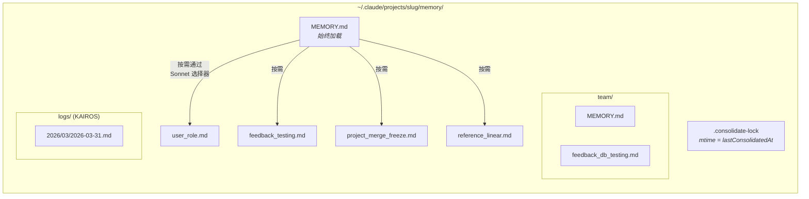
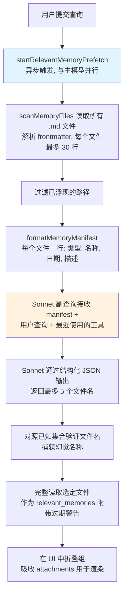
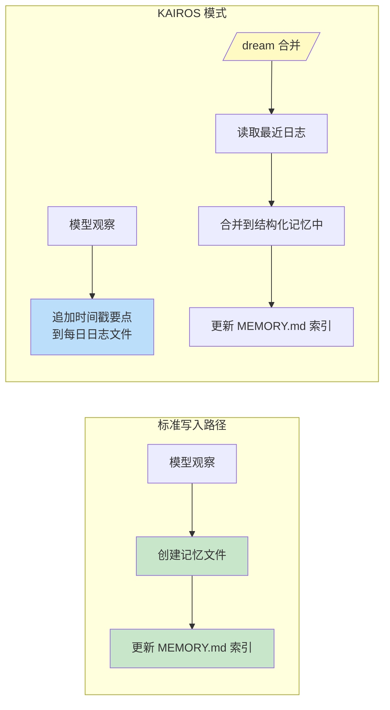

# 第 11 章：记忆 — 跨会话学习

## 无状态的困境

目前为止的每一章都描述了存在于单个会话内的机制。Agent 循环运行、工具执行、子 agent 协调，当进程退出时，所有这一切消失。下一次对话以相同的 system prompt、相同的工具定义、相同的模型开始——对之前发生的事情零知识。

这是无状态架构的基本限制。开发者在周一纠正了模型的测试方法，周二模型犯同样的错误。用户解释他们的角色、项目约束、代码风格偏好，每个新会话都要求他们重新解释。模型不是健忘——它从来不知道。每次对话是一个独立的宇宙。

问题不是理论上的。它以侵蚀信任的具体方式显现。用户说"记住，我们在测试中使用真实数据库实例，不用 mock"——下周模型生成 mocked 测试。用户解释他们是资深工程师不需要初级解释——下次会话以教程级引导开始。没有记忆，每个会话从零开始。Agent 永远是第一天上班的新员工。

行业中标准解决方案是检索增强生成（RAG）：将文档嵌入为向量，存储在向量数据库中，在查询时检索相关块。这对知识库工作良好——文档、FAQ、参考资料。但它在架构上与 agent 实际需要跨会话记住的东西不匹配。Agent 的记忆不是知识库。它是观察的集合：用户是谁、他们纠正了什么、项目当前的约束是什么、在哪里找到东西。这些观察很小、频繁变化、必须人类可编辑。向量数据库解决了错误的问题。

Claude Code 的记忆系统是一个完全不同的赌注：磁盘上的文件、Markdown 格式、LLM 驱动的召回、无基础设施。赌注是存储的简单性加上检索的智能性产生比两者都复杂的系统更好的系统。

设计哲学有塑造整个系统的后果：

- **人类可读。** 想看 Claude Code 记住什么的用户可以打开任何文本编辑器中的 `~/.claude/projects/<slug>/memory/MEMORY.md`。无需特殊工具、无需解密、无需导出命令。
- **人类可编辑。** 过时的记忆可以用 vim 纠正。错误的记忆可以用 `rm` 删除。用户对 agent 的知识拥有完全代理权。
- **可版本控制。** 团队记忆可以提交到 git。记忆变化因为 Markdown 而 diff 干净。
- **零基础设施。** 记忆系统离线工作、无服务器工作、在任何有文件系统的 OS 上工作。没有迁移路径因为没有 schema。
- **可调试。** 当记忆行为意外时，诊断路径是 `ls` 和 `cat`，不是查询日志和数据库检查。

模型使用 `FileWriteTool` 和 `FileEditTool` 读写记忆——它用于编辑源代码的相同工具（第 6 章介绍）。不存在特殊的记忆 API。System prompt 教导模型两步写入协议（创建文件、更新索引），模型以现有能力在新指令下执行它。这是工具重用作为架构原则——记忆系统不是栓在 agent 上的子系统，它是 agent 使用其现有能力的涌现行为。

基于文件的选择在此处有效有更深层原因。对 AI agent 而言，记忆与传统应用中的记忆根本不同。传统应用的数据库持有权威状态——系统数据的真相来源。Agent 的记忆持有*观察*——在某个时间点为真且可能仍然为真或不为真的东西。文件自然地传达这种认识论状态。它们有揭示观察被记录时间的修改时间。它们可以被知道观察是错误的人类读取、编辑和删除。数据库暗示持久性和权威性；Markdown 文件暗示某人写下并可能需要更新的笔记。存储介质传达了数据的性质——这些是工作笔记，不是福音。

### 按项目范围

记忆按 git 仓库根目录而非工作目录界定范围。如果用户在 `src/components/` 中打开终端，另一个在 `tests/` 中，两个会话共享相同的记忆目录。解析逻辑首先找到规范 git 根目录，回退到项目根目录：

基础路径解析首先找到规范 git 根目录，回退到项目根目录。这确保同一仓库的所有 git worktree 共享单一记忆目录。

`findCanonicalGitRoot` 调用确保同一仓库的所有 git worktree 共享单一记忆目录。Git 根目录被 sanitize（斜杠变横杠，通过 `sanitizePath()`）以产生平面目录名：

```
~/.claude/projects/-Users-alex-code-myapp/memory/
```

一个完全填充的记忆目录揭示了系统结构：



命名约定是语义化的：`<type>_<topic>.md`。类型前缀不由代码强制执行但是 prompt 指令的一部分，使得视觉扫描目录和理解记忆图景变得容易。

---

## 四类型分类法

不是一切都值得记住。记忆系统将所有记忆约束为恰好四种类型：

四种类型是：**user**、**feedback**、**project** 和 **reference**。

分类法围绕单一标准设计：**此知识可从当前项目状态推导吗？** 代码模式、架构、文件结构、git 历史——所有这些可以通过阅读代码库重新推导。它们被排除。四种类型捕获无法重新推导的内容。

**User 记忆**记录关于此人的信息：他们的角色、目标、责任、专业水平。一位资深 Go 工程师但对 React 是新手，得到与首次编程者不同的解释。

**Feedback 记忆**捕获关于如何处理工作的指导——纠正和确认。系统显式指示模型记录两者："如果你只保存纠正，你会偏离用户已验证过的方法。"每条 feedback 记忆有特定结构：规则本身，然后是带有原因的 `**Why:**` 行（通常是过去事件），然后是带有触发条件的 `**How to apply:**` 行。

**Project 记忆**记录正在进行的工作上下文——谁在做什么、为什么、何时截止。Prompt 强调将相对日期转换为绝对："周四"变成"2026-03-05"，使记忆在数周后仍可解读。

**Reference 记忆**是书签——指向信息在外部系统中所在位置的指针。Linear 项目 URL、Grafana 仪表板、Slack 频道。这些告诉模型在哪里查找，不是找什么。

### 分类法作为过滤器

四种类型不仅是类别——它们是过滤器。通过定义什么算作记忆，系统隐含地定义什么不算。没有分类法，热切的模型会保存一切：代码模式、架构图、错误消息。全部可从代码库推导。保存它创建一个并行的、可能过时的信息副本，这些信息最好从源头获取。

分类法还防止一种更微妙失败：记忆作为拐杖。如果模型将架构决策保存为记忆，它停止阅读代码库来理解架构。通过排除可推导的信息，系统强制模型保持扎根于代码的当前状态。

排除列表是显式的：代码模式、git 历史、调试解决方案、CLAUDE.md 中的任何东西、短暂的 task 细节。这些排除甚至在用户显式要求保存时也适用。如果用户说"记住这个 PR 列表"，模型被指示推回——"其中什么是*令人惊讶的*或*非显而易见的*？"那个令人惊讶的部分值得保留。原始列表不值得。此指令通过 evals 验证，当添加排除覆盖指令时从 0/2 变为 3/3。

### Frontmatter 作为契约

每个记忆文件使用 YAML frontmatter 带有三个必需字段：

```markdown
---
name: {{memory name}}
description: {{one-line description -- used to decide relevance}}
type: {{user, feedback, project, reference}}
---
```

`description` 是最承重的字段。它是相关性选择器（下面讨论的 Sonnet 副查询）用于决定是否呈现此记忆的东西。模糊的描述如"testing stuff"要么匹配太宽要么完全匹配不上。具体的描述如"集成测试必须命中真实数据库，不用 mock——Q4 被 mock 差异坑过"精确匹配重要的对话。描述是记忆的搜索索引——不是被搜索引擎消费而是被能理解细微差别、上下文和意图的语言模型消费。

Frontmatter 也是扫描系统在召回期间读取的文件的唯一部分。`scanMemoryFiles()` 读取每个文件仅至前 30 行以提取头。正文是私有的直到文件被显式选择并加载。

---

## 写入路径

写入记忆是使用标准文件工具执行的两步过程。

**步骤 1：写入记忆文件。** 模型在记忆目录中创建带有 YAML frontmatter 的 `.md` 文件：

```markdown
---
name: Testing Policy
description: Integration tests must hit real DB, not mocks
type: feedback
---

Don't mock the database in integration tests.

**Why:** We got burned last quarter when mocked tests passed but production
queries hit edge cases the mocks didn't cover.

**How to apply:** Any test file under `__tests__/` that touches database
operations should use the real PGlite instance from test-utils.
```

**步骤 2：更新索引。** 模型向 `MEMORY.md` 添加一行指针：

```markdown
- [Testing Policy](feedback_testing.md) -- integration tests must hit real DB
```

每个条目必须保持约 150 字符以内。索引是目录，不是知识库。

当模型学到修改现有记忆的新信息时，它使用 `FileEditTool` 更新现有文件而非创建重复。系统不在内部版本化记忆——文件在本地文件系统上，用户想要版本化时有 `git`。在 prompt 构建之前，`ensureMemoryDirExists()` 创建记忆目录，prompt 告诉模型目录已存在，避免在 `ls` 和 `mkdir -p` 上浪费轮次。

---

## 召回路径

写入记忆是必要的但不充分。更难的问题是检索：给定用户查询，可能数百个记忆文件中哪些应加载到模型上下文中？加载所有将耗尽 token 预算。加载零个将击败目的。加载错误的将浪费 token 在无关信息上而错过本会改变模型行为的知识。

召回系统在两个层级运作。`MEMORY.md` 索引在会话开始时始终加载到上下文中，提供方向。单个记忆文件通过 LLM 驱动的相关性查询按需浮现，每轮最多选择五个记忆。

### 完整召回流水线



步骤 2 中的异步预取是关键性能决策。当主模型到达召回上下文有用的点时，副查询通常已完成。用户体验不到额外延迟。

### Sonnet 副查询

Manifest 作为副查询发送给 Sonnet 模型。此选择器的 system prompt 是精确的：

选择器的 system prompt 指示其保守：仅包含对当前查询有用的记忆，不确定时跳过，避免为已活跃使用的工具选择 API/用法文档（因为模型已加载那些工具）——但仍浮现关于那些工具的警告、坑和已知问题。

响应使用结构化输出——`{ selected_memories: string[] }`——文件名对照已知集合验证。

这种方法以延迟换精度，权衡分析具指导性。**关键词匹配**快速但无法理解上下文——它不能表达"不要为已活跃使用的工具选择记忆。"**嵌入相似度**处理语义匹配但引入了基础设施（嵌入模型、向量存储、更新流水线）且在否定上挣扎——"不要使用数据库 mock"的嵌入与"使用数据库 mock"非常接近。**Sonnet 副查询**理解语义相关性、推理上下文、处理否定、且需要零基础设施。延迟成本有界（数百毫秒）并隐藏在主模型的初始处理之后。

遥测系统追踪选择率即使没有记忆被选中。0/150 的选择率与 0/3 意味着不同的事——前者表明精度问题，后者表明覆盖问题。

---

## 过期系统

过期系统解决了一个从真实使用中涌现的失败模式。用户报告旧记忆——包含指向此后已更改代码的 file:line 引用——被模型断言为事实。引用使过时的声明听起来*更*权威，而非更少。

解决方案不是过期。旧记忆不被删除——它们可能包含多年有效的机构知识。取而代之，系统附加年龄警告：

过期函数计算记忆的年龄（以天计）。今天或昨天的记忆不获得警告（函数返回空字符串）。所有更旧的获得注入在记忆内容旁边的警告：一条消息声明以天计的年龄，警告代码行为声明或 file:line 引用可能过时，建议对照当前代码验证。

今天或昨天的记忆不获得警告。所有更旧的获得注入在记忆内容旁边的过期警告。人类可读的格式——"今天"、"昨天"、"47 天前"——存在是因为模型不擅长日期算术。原始 ISO 时间戳不像"47 天前"那样触发过期推理。这是关于模型行为的经验观察，通过 evals 验证：行动提示框架"从记忆推荐之前"得分 3/3，而更抽象的"信任你回忆的"得 0/3，正文文本相同。

有一个值得指出的哲学张力。过期系统将记忆视为假设，而非事实。但模型的自然倾向是自信地呈现信息。过期警告正在对抗模型自己的声音——使用其指令遵循能力来覆盖其自信生成倾向。

---

## MEMORY.md 作为始终加载的索引

每次对话以 `MEMORY.md` 在上下文中开始。它不是记忆——它是索引，实际记忆文件的目录。

索引有两个硬上限：

索引有两个硬上限：200 行和 25,000 字节。

200 行上限捕捉正常增长。25KB 字节上限捕捉观察到的失败模式：用户打包长行保持在 200 行以下但消耗巨大的 token 预算。在第 97 百分位，一个只有 197 行的 MEMORY.md 重 197KB。当任一上限触发时，可操作的指导告诉用户修复什么："保持索引条目在一行大约 200 字符以下；将细节移动到主题文件中。"

这种两层架构——轻量始终在线的索引加上重量按需的内容——是使记忆能够扩展的设计。一个有 150 条记忆的项目有消耗大约 3,000 token 的 150 行索引，而非消耗 100,000 token 的 150 个完整文件。

---

## 团队记忆

向共享知识的过渡是自然的。测试策略、部署约定、构建系统中的已知坑——这些需要跨团队共享。

团队记忆是自动记忆目录在 `<autoMemPath>/team/` 的子目录，由 feature flag 门控并需要自动记忆启用。架构嵌套是故意的：禁用自动记忆传递性禁用团队记忆。

### 纵深防御

团队记忆引入了个人记忆没有的攻击面。团队同步的文件来自其他用户，恶意队友可能尝试路径遍历。安全模型使用三层防御。

**第 1 层：输入清理。** `sanitizePathKey()` 函数验证 null 字节、URL 编码遍历（`%2e%2e%2f`）、Unicode 规范化攻击（规范化为 `../` 的全角字符）、反斜杠和绝对路径。

**第 2 层：字符串级路径验证。** 清理后，`path.resolve()` 规范化剩余的 `..` 段，解析后的路径对照团队目录前缀检查（包括尾部分隔符以防止 `team-evil/` 匹配 `team/`）。

**第 3 层：Symlink 解析。** `realpathDeepestExisting()` 解析最深存在祖先上的 symlink，捕获字符串级验证无法检测的攻击。如果 `team/evil` 是指向 `/etc/` 的 symlink，字符串验证看到有效前缀，但 `realpath` 揭示真实目标。

所有验证失败产生 `PathTraversalError`。无部分成功、无回退。Fail closed。

### 范围指导

Prompt 教导模型关于私有 vs 共享记忆。User 记忆始终私有。Reference 记忆通常是团队的。Feedback 记忆默认私有，除非它们代表项目范围的约定。交叉检查指令——"在保存私有 feedback 记忆之前，检查它不与团队 feedback 记忆矛盾"——防止冲突的指导根据哪个记忆先被召回而不可预测地浮现。

---

## KAIROS 模式：追加式每日日志

标准记忆假设离散会话。KAIROS 模式（Claude Code 的 assistant 模式）打破此假设——会话是长期运行的，可能持续数天。两步写入模式无法扩展到持续操作。

解决方案是捕获和合并之间的架构分离：



在 KAIROS 模式下，模型追加到日期命名的日志文件（`<autoMemPath>/logs/YYYY/MM/YYYY-MM-DD.md`）。每个条目是短时间戳要点。模型被指示："不要重写或重组日志"——在捕获期间重组会丢失合并需要的时间顺序信号。

Prompt 中的路径被描述为*模式*而非今天的字面日期。这是一个缓存优化：记忆 prompt 被缓存且不因日期在午夜改变而失效。模型从单独的 `date_change` attachment 推导当前日期。

### /dream 合并

合并以四个阶段运行：**Orient**（列出目录、读取索引、浏览现有文件）、**Gather**（搜索日志、检查漂移的记忆）、**Consolidate**（写入或更新文件、合并而非重复）、**Prune**（更新索引在 200 行以下、移除过时的指针）。强调合并到现有文件而非创建新文件很重要——没有它，记忆目录将随使用线性增长。

### 合并锁

锁文件 `.consolidate-lock` 服务双重目的：其内容是持有者的 PID（互斥），其 mtime *是* `lastConsolidatedAt`（调度状态）。当三个门通过时 auto-dream 触发，最便宜优先评估：自上次合并的小时数超过 24、此后修改的会话数超过 5、无其他进程持有锁。崩溃恢复通过 `process.kill(pid, 0)` 检测死 PID，以一小时过期超时作为防 PID 重用的防御。

---

## 后台提取

主 agent 有主动写入记忆的完整指令。但 agent 是不完美的——而不完美是可预测的。当用户说"记住始终用集成测试"然后立即问"现在修登录 bug"，模型的注意力完全转向 bug。记忆保存指令被处理但可能不执行。

在每次完整查询循环结束时，一个 fork agent——共享父的 prompt cache——分析最近消息并写入主 agent 错过的任何记忆。当主 agent 已在当前轮次范围写入记忆时，提取 agent 跳过该范围。提取 agent 有受限的工具预算：只读工具加上仅对记忆目录路径的写入访问。其 prompt 指示两轮策略：第 1 轮并行读取，第 2 轮并行写入。

交互是合作的，非竞争的。主 agent 的 prompt 始终包含完整保存指令。当主 agent 保存时，后台 agent 推迟。当它没有时，后台 agent 捕捉缺口。这种模式——带有后台安全网的主要路径——使记忆捕获更可靠而不给主交互增加负担。单独哪一个都不够。

---

## 路径解析和安全

自动记忆路径通过优先级链解析：

1. **`CLAUDE_COWORK_MEMORY_PATH_OVERRIDE`** — Cowork 的完整路径覆盖。
2. **settings.json 中的 `autoMemoryDirectory`** — 仅受信任的设置源。项目设置被有意排除。
3. **默认计算的路径** — `~/.claude/projects/<sanitized-git-root>/memory/`。

排除项目设置是安全决策。恶意仓库可以提交带有 `autoMemoryDirectory: "~/.ssh"` 的 `.claude/settings.json`，对记忆文件的权限例外将授予模型对 SSH 密钥的自动写入访问。通过将覆盖限制为策略、flag、本地和用户设置——这些都不能提交到仓库——此攻击向量被关闭。

`isAutoMemPath()` 函数在前缀检查前规范化路径以防止遍历，尾部分隔符约定确保前缀匹配需要目录边界。

### 启用/禁用链

自动记忆是否活跃由 `isAutoMemoryEnabled()` 确定，实现其自己的优先级链：环境变量、bare 模式、无持久存储的 CCR、设置、默认启用。禁用时，prompt 部分被丢弃（所以模型不接收记忆指令）且后台进程停止（extract-memories、auto-dream、团队同步）。两个门必须对齐——仅移除 prompt 不会停止提取 agent，它有自己的 prompt。

---

## Apply This：设计 Agent 记忆

记忆系统的复杂性在行为层——prompt 指令、LLM 驱动的召回、过期管理、后台提取——而非存储基础设施。这种复杂性分布本身就是设计原则。

**文件胜过数据库用于 agent 记忆。** 文件可检查、可编辑和可版本控制。透明性建立信任。当替代方案是用户不能轻松读取的数据库时，文件仅凭信任就赢了。

**约束保存什么，而不仅是如何保存。** 可推导性测试——此知识可以从当前项目状态重新推导吗？——消除了大多数潜在记忆同时保留那些确实重要的。

**使用 LLM 进行召回，而非关键词或嵌入。** LLM 副查询理解上下文、推理对话中已有内容、处理否定、且无需索引维护。延迟成本真实但有界并隐藏在主模型处理之后。

**警告过期，不过期删除。** 机构知识可能多年有效。附加年龄警告让模型将旧记忆视为假设而非事实。人类可读的年龄格式以原始时间戳不会的方式触发正确推理。

**为捕获构建安全网。** 主 agent 会错过记忆。审查最近对话的后台提取 agent 使系统更可靠而不给主交互增加负担。当主 agent 保存时，后台 agent 推迟。

---

Agent 现在可以跨会话学习——积累关于其用户、他们的偏好、项目状态以及他们所做的纠正的知识。记忆系统做出了哲学承诺：agent 与其用户的关系应随时间加深，而非在每次交互上重置。基于文件的实现使该承诺有形——在磁盘上可见、人类可编辑、与代码一起版本控制。Agent 的记忆不是黑盒。它是文件夹中的笔记集合，以模型和人类都能阅读的语言编写。

下一章检查 Claude Code 如何扩展其超出核心的能力：教导模型新行为的 skills 系统，以及让外部代码在超过二十四个生命周期点约束和修改这些行为的 hooks 系统。
