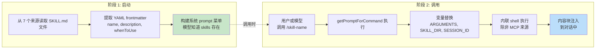
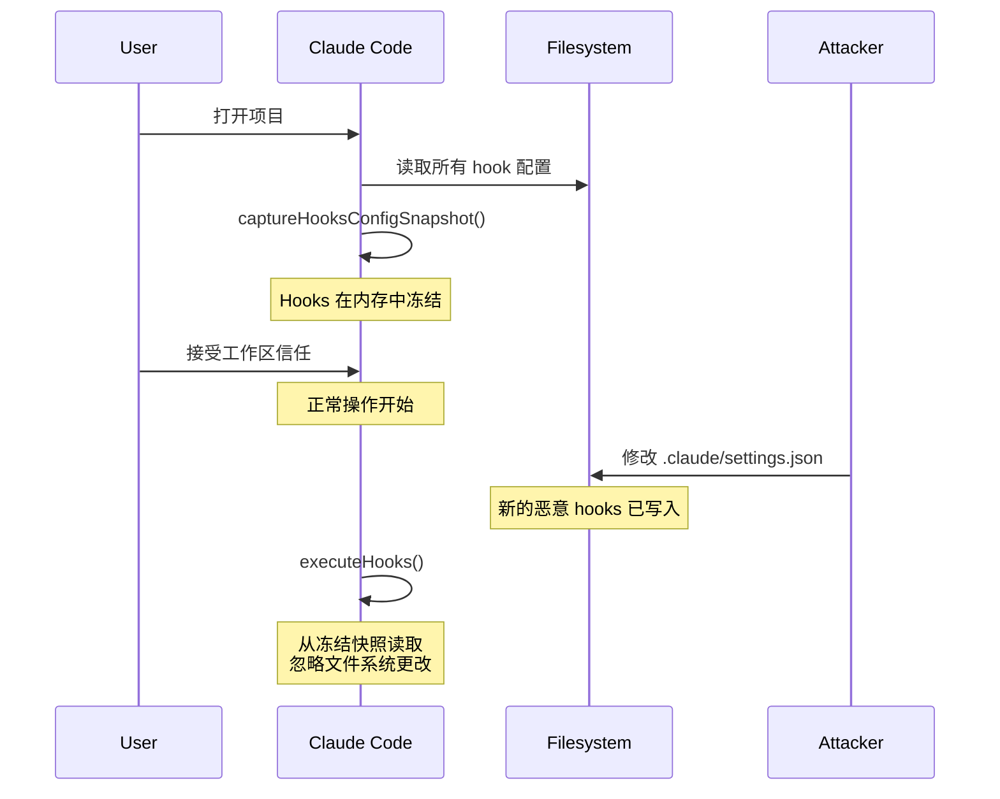
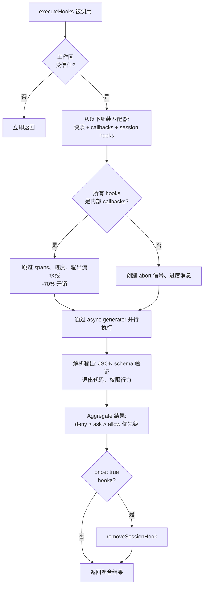

# 第 12 章：可扩展性 — Skills 与 Hooks

## 两种扩展维度

每个可扩展性系统回答两个问题：系统能做什么，以及何时做。大多数框架将两者混为一谈——插件在同一对象中注册能力和生命周期回调，"添加功能"和"拦截功能"之间的边界模糊为单一注册 API。

Claude Code 干净地分离它们。Skills 扩展模型能做什么。它们是变成斜杠命令的 Markdown 文件，在调用时向对话注入新指令。Hooks 扩展事情何时以及如何发生。它们是生命周期拦截器，在会话期间超过二十四个不同点触发，运行可以阻止动作、修改输入、强制继续或静默观察的任意代码。

分离不是偶然。Skills 是内容——它们通过添加 prompt 文本扩展模型的知识和能力。Hooks 是控制流——它们修改执行路径而不改变模型知道什么。Skill 可能教导模型如何运行你团队的部署流程。Hook 可能确保没有部署命令在没有通过测试套件的情况下执行。Skill 添加能力；hook 添加约束。

本章深入覆盖两个系统，然后检查它们相交的地方：skill 声明的 hooks 在 skill 被调用时注册为会话范围的拦截器。

---

## Skills：教导模型新技巧

### 两阶段加载

Skills 系统的核心优化是 frontmatter 在启动时加载，但完整内容仅在调用时加载。



**阶段 1** 读取每个 `SKILL.md` 文件，将 YAML frontmatter 与 markdown 正文分开，提取元数据。Frontmatter 字段成为 system prompt 的一部分，使模型知道 skill 存在。Markdown 正文被捕获在闭包中但不处理。一个有 50 个 skills 的项目支付 50 个简短描述的 token 成本，而非 50 个完整文档。

**阶段 2** 在模型或用户调用 skill 时触发。`getPromptForCommand` 添加基础目录前缀、替换变量（`$ARGUMENTS`、`${CLAUDE_SKILL_DIR}`、`${CLAUDE_SESSION_ID}`）、并执行内联 shell 命令（后引号前缀 `!`）。结果作为内容块返回并注入到对话中。

### 七个优先级来源

Skills 从七个不同来源到达，并行加载并按优先级合并：

| 优先级 | 来源 | 位置 | 备注 |
|--------|------|------|------|
| 1 | 管理（策略） | `<MANAGED_PATH>/.claude/skills/` | 企业控制 |
| 2 | 用户 | `~/.claude/skills/` | 个人，随处可用 |
| 3 | 项目 | `.claude/skills/`（向上遍历到 home） | 版本控制 |
| 4 | 额外目录 | `<add-dir>/.claude/skills/` | 通过 `--add-dir` 标志 |
| 5 | 遗留命令 | `.claude/commands/` | 向后兼容 |
| 6 | 捆绑 | 编译到二进制文件中 | Feature-gated |
| 7 | MCP | MCP 服务器 prompt | 远程，不可信 |

去重使用 `realpath` 解析 symlink 和重叠的父目录。首先看到的来源胜出。`getFileIdentity` 函数通过 `realpath` 解析到规范路径，而非依赖 inode 值，后者在容器/NFS 挂载和 ExFAT 上不可靠。

### Frontmatter 契约

控制 skill 行为的关键 frontmatter 字段：

| YAML 字段 | 用途 |
|-----------|------|
| `name` | 面向用户的显示名称 |
| `description` | 在自动完成和系统 prompt 中显示 |
| `when_to_use` | 供模型发现的详细使用场景 |
| `allowed-tools` | Skill 可以使用哪些工具 |
| `disable-model-invocation` | 阻止自主模型使用 |
| `context` | `'fork'` 作为子 agent 运行 |
| `hooks` | 调用时注册的生命周期 hooks |
| `paths` | 条件激活的 glob 模式 |

`context: 'fork'` 选项以子 agent 运行 skill，拥有自己的上下文窗口，对需要大量工作而不污染主对话 token 预算的 skills 至关重要。`disable-model-invocation` 和 `user-invocable` 字段控制两个不同的访问路径——将两者都设为 true 使 skill 不可见，对仅 hooks 的 skills 有用。

### MCP 安全边界

变量替换后，内联 shell 命令执行。安全边界是绝对的：**MCP skills 从不执行内联 shell 命令。** MCP 服务器是外部系统。如果允许，包含 `` !`rm -rf /` `` 的 MCP prompt 将以用户完整权限执行。系统将 MCP skills 视为仅内容。此信任边界与第 15 章讨论的更广泛 MCP 安全模型相连。

### 动态发现

Skills 不仅在启动时加载。当模型触及文件时，`discoverSkillDirsForPaths` 从每个路径向上遍历寻找 `.claude/skills/` 目录。带有 `paths` frontmatter 的 Skills 存储在 `conditionalSkills` map 中，仅在触及的路径匹配其模式时激活。声明 `paths: "packages/database/**"` 的 skill 保持不可见，直到模型读取或编辑数据库文件——上下文敏感的能力扩展。

---

## Hooks：控制何时发生事情

Hooks 是 Claude Code 在生命周期点拦截和修改行为的机制。主执行引擎超过 4,900 行。系统服务于三个受众：个人开发者（自定义 linting、验证）、团队（版本控制中的共享质量门）和企业（策略管理的合规规则）。

### 真实 Hook：防止提交到 Main

在深入机制之前，这是一个 hook 在实践中的样子。假设你的团队想要防止模型直接提交到 `main` 分支。

**步骤 1：settings.json 配置：**

```json
{
  "hooks": {
    "PreToolUse": [
      {
        "matcher": "Bash",
        "hooks": [
          {
            "type": "command",
            "command": "/path/to/check-not-main.sh",
            "if": "Bash(git commit*)"
          }
        ]
      }
    ]
  }
}
```

**步骤 2：Shell 脚本：**

```bash
#!/bin/bash
BRANCH=$(git rev-parse --abbrev-ref HEAD 2>/dev/null)
if [ "$BRANCH" = "main" ]; then
  echo "Cannot commit directly to main. Create a feature branch first." >&2
  exit 2  # Exit 2 = 阻塞错误
fi
exit 0
```

**步骤 3：模型体验到什么。** 当模型在 `main` 分支上尝试 `git commit` 时，hook 在命令执行前触发。脚本检查分支、写入 stderr、以代码 2 退出。模型看到系统消息："Cannot commit directly to main. Create a feature branch first." 提交永未运行。模型改为创建分支并在那里提交。

`if: "Bash(git commit*)"` 条件意味着脚本仅对 git commit 命令运行——不是每次 Bash 调用。退出代码 2 阻塞；退出代码 0 通过；任何其他退出代码产生非阻塞警告。这是完整协议。

### 四种用户可配置类型

Claude Code 定义了六种 hook 类型——四种用户可配置，两种内部。

**Command hooks** 生成 shell 进程。Hook 输入 JSON 被管道到 stdin；hook 通过退出代码和 stdout/stderr 回传。这是主力类型。

**Prompt hooks** 进行单次 LLM 调用，返回 `{"ok": true}` 或 `{"ok": false, "reason": "..."}`。轻量 AI 驱动验证，无需完整 agent 循环。

**Agent hooks** 运行多轮 agentic 循环（最多 50 轮，`dontAsk` 权限，thinking 禁用）。每个获得自己的会话范围。这是用于"验证测试套件通过并覆盖新功能"的重型机制。

**HTTP hooks** 将 hook 输入 POST 到 URL。启用远程策略服务器和审计日志，无需本地进程生成。

两种内部类型是 **callback hooks**（编程注册，热路径上通过跳过 span 追踪的快路径减少 70% 开销）和 **function hooks**（会话范围的 TypeScript 回调，用于 agent hooks 中的结构化输出强制执行）。

### 五个最重要的生命周期事件

Hook 系统在超过二十四个生命周期点触发。五个主导真实世界使用：

**PreToolUse** — 在每次工具执行前触发。可以阻止、修改输入、自动批准或注入上下文。权限行为遵循严格优先级：deny > ask > allow。质量门的最常见 hook 点。

**PostToolUse** — 在成功执行后触发。可以注入上下文或完全替换 MCP 工具输出。对工具结果的自动反馈有用。

**Stop** — 在 Claude 结束其响应前触发。阻塞 hook 强制继续。这是自动验证循环的机制："你真的完成了吗？"

**SessionStart** — 在会话开始时触发。可以设置环境变量、覆盖第一条用户消息或注册文件监视路径。不能阻塞（hook 不能阻止会话开始）。

**UserPromptSubmit** — 在用户提交 prompt 时触发。可以阻止处理，在模型看到之前启用输入验证或内容过滤。

**参考表——其余事件：**

| 类别 | 事件 |
|------|------|
| 工具生命周期 | PostToolUseFailure, PermissionDenied, PermissionRequest |
| 会话 | SessionEnd (1.5s 超时), Setup |
| 子 agent | SubagentStart, SubagentStop |
| 压缩 | PreCompact, PostCompact |
| 通知 | Notification, Elicitation, ElicitationResult |
| 配置 | ConfigChange, InstructionsLoaded, CwdChanged, FileChanged, TaskCreated, TaskCompleted, TeammateIdle |

阻塞不对称是故意的。代表可恢复决策的事件（工具调用、停止条件）支持阻塞。代表不可撤销事实的事件（会话已开始、API 失败）不支持。

### 退出代码语义

对于 command hooks，退出代码携带特定含义：

| 退出代码 | 含义 | 阻塞？ |
|----------|------|--------|
| 0 | 成功，stdout 如果为 JSON 则解析 | 否 |
| 2 | 阻塞错误，stderr 作为系统消息显示 | 是 |
| 其他 | 非阻塞警告，仅显示给用户 | 否 |

退出代码 2 是有意选择的。退出代码 1 太常见——任何未处理的异常、断言失败或语法错误都产生退出 1。使用退出 2 防止意外强制执行。

### 六个 Hook 来源

| 来源 | 信任级别 | 备注 |
|------|---------|------|
| `userSettings` | 用户 | `~/.claude/settings.json`，最高优先级 |
| `projectSettings` | 项目 | `.claude/settings.json`，版本控制 |
| `localSettings` | 本地 | `.claude/settings.local.json`，gitignored |
| `policySettings` | 企业 | 不能被覆盖 |
| `pluginHook` | 插件 | 优先级 999（最低） |
| `sessionHook` | 会话 | 仅内存，由 skills 注册 |

---

## 快照安全模型

Hooks 执行任意代码。项目的 `.claude/settings.json` 可以定义在每次工具调用前触发的 hooks。如果恶意仓库在用户接受工作区信任对话框后修改其 hooks 会发生什么？

什么都不发生。Hooks 配置在启动时冻结。



`captureHooksConfigSnapshot()` 在启动期间调用一次。从那时起，`executeHooks()` 从快照读取，永不会隐式重新读取设置文件。快照仅通过显式通道更新：`/hooks` 命令或文件监视器检测，两者都通过 `updateHooksConfigSnapshot()` 重建。

策略强制级联：策略设置中的 `disableAllHooks` 清除一切。`allowManagedHooksOnly` 排除用户和项目 hooks。用户可以通过设置 `disableAllHooks` 禁用他们自己的 hooks，但不能禁用企业管理的 hooks。策略层总是胜出。

信任检查本身（`shouldSkipHookDueToTrust()`）在两个漏洞后引入：用户*拒绝*信任对话框时 SessionEnd hooks 执行，以及 SubagentStop hooks 在信任呈现前触发。两者共享相同的根本原因——hooks 在用户未同意工作区代码执行的生命周期状态中触发。修复是 `executeHooks()` 顶部的集中门控。

---

## 执行流



内部 callbacks 的快路径是显著的优化。当所有匹配的 hooks 是内部的（文件访问分析、提交归属），系统跳过 span 追踪、abort 信号创建、进度消息和完整输出处理流水线。大多数 PostToolUse 调用仅命中内部 callbacks。

Hook 输入 JSON 通过惰性 `getJsonInput()` 闭包序列化一次并在所有并行 hooks 中重用。环境注入设置 `CLAUDE_PROJECT_DIR`、`CLAUDE_PLUGIN_ROOT`，对某些事件设置 `CLAUDE_ENV_FILE`，hooks 可以在其中写入环境导出。

---

## 集成：Skills 与 Hooks 的交汇点

当 skill 被调用时，其 frontmatter 声明的 hooks 注册为会话范围的 hooks。`skillRoot` 成为 hook 的 shell 命令的 `CLAUDE_PLUGIN_ROOT`：

```
my-skill/
  SKILL.md          # Skill 内容
  validate.sh       # 由 frontmatter 中声明的 PreToolUse hook 调用
```

Skill 的 frontmatter 声明：

```yaml
hooks:
  PreToolUse:
    - matcher: "Bash"
      hooks:
        - type: command
          command: "${CLAUDE_PLUGIN_ROOT}/validate.sh"
          once: true
```

当用户调用 `/my-skill` 时，skill 内容加载到对话中且 PreToolUse hook 注册。下一个 Bash 工具调用触发 `validate.sh`。因为设置了 `once: true`，hook 在第一次成功执行后移除自己。

对于 agent，frontmatter 中声明的 `Stop` hooks 自动转换为 `SubagentStop` hooks，因为子 agent 触发 `SubagentStop` 而非 `Stop`。没有转换，agent 的停止验证 hook 永不会触发。

### 权限行为优先级

`executePreToolHooks()` 可以阻止（通过 `blockingError`）、自动批准（通过 `permissionBehavior: 'allow'`）、强制询问（通过 `'ask'`）、拒绝（通过 `'deny'`）、修改输入（通过 `updatedInput`）或添加上下文（通过 `additionalContext`）。当多个 hooks 返回不同行为时，deny 总是胜出。这是对安全相关决策的正确默认。

### Stop Hooks：强制继续

当 Stop hook 返回退出代码 2 时，stderr 作为反馈显示给模型且对话继续。这将单次 prompt-response 转变为目标导向的循环。Stop hook 可以说是整个系统中最强大的集成点。

---

## Apply This：设计可扩展性系统

**将内容与控制流分离。** Skills 添加能力；hooks 约束行为。将两者混为一谈使得推理插件做什么与它防止什么变得不可能。

**在信任边界冻结配置。** 快照机制在同意时刻捕获 hooks 且永不隐式重新读取。如果你的系统执行用户提供的代码，这消除了 TOCTOU 攻击。

**对语义信号使用不常见的退出代码。** 退出代码 1 是噪音——每个未处理错误都产生它。退出代码 2 作为阻塞信号防止意外强制执行。选择需要故意意图的信号。

**在 socket 级别验证，而非应用级别。** SSRF 守卫在 DNS 查找时运行，而非作为预检查。这消除了 DNS 重新绑定窗口。当验证网络目的地时，检查必须与连接原子。

**为常见情况进行优化。** 内部 callback 快路径（-70% 开销）识别大多数 hook 调用仅命中内部 callbacks。两阶段 skill 加载识别大多数 skills 在给定会话中永不被调用。每个优化针对实际使用分布。

可扩展性系统反映了对力量与安全之间张力的成熟理解。Skills 给模型新的能力，由 MCP 安全线（第 15 章）限定。Hooks 给外部代码对模型动作的影响力，由快照机制、退出代码语义和策略级联限定。两个系统都不信任对方——而那种相互不信任正是使组合可以安全规模化部署的原因。

下一章转向视觉层：Claude Code 如何以 60fps 渲染响应式终端 UI 并跨五种终端协议处理输入。
