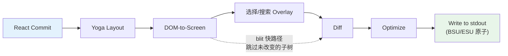

# 第 13 章：终端 UI

## 为什么构建自定义渲染器

终端不是浏览器。没有 DOM、没有 CSS 引擎、没有合成器、没有保留模式的图形流水线。有一个流向 stdout 的字节流和一个来自 stdin 的字节流。这两个流之间的一切——布局、样式、diffing、碰撞检测、滚动、选择——必须从头发明。

Claude Code 需要响应式 UI。它有 prompt 输入、流式 markdown 输出、权限对话框、进度旋转器、可滚动的消息列表、搜索高亮和 vim 模式编辑器。React 是声明这类组件树的明显选择。但 React 需要宿主环境来渲染到其中，而终端不提供。

Ink 是标准答案：一个终端的 React 渲染器，构建在 Yoga 上用于 flexbox 布局。Claude Code 从 Ink 开始，然后 fork 它到无法辨认。原版为每帧每个单元格分配一个 JavaScript 对象——在 200x120 终端上，每 16ms 创建并垃圾回收 24,000 个对象。它在字符串级别 diff，比较 ANSI 编码文本的整行。它没有 blit 优化、无双缓冲、无单元格级脏追踪的概念。对于每秒刷新一次的简单 CLI 仪表板，这没问题。对于以 60fps 流式输出 token 同时用户滚动数百条消息对话的 LLM agent，这是不可能的。

Claude Code 中保留的是一个自定义渲染引擎，与 Ink 共享概念 DNA——React reconciler、Yoga 布局、ANSI 输出——但重新实现了关键路径：紧凑的类型化数组取代对象每单元格、基于池的字符串 interning 取代字符串每帧、带单元格级 diff 的双缓冲渲染，以及将相邻终端写入合并为最小 escape 序列的优化器。

结果在 200 列终端上以 60fps 运行，同时从 Claude 流式接收 token。要理解如何做到，我们需要检查四个层：React 协调的自定义 DOM、将该 DOM 转换为终端输出的渲染流水线、使系统能在数小时会话中存活而不被垃圾回收淹没的池基内存管理，以及将所有联系在一起的组件架构。

---

## 自定义 DOM

React 的 reconciler 需要某个东西来协调。在浏览器中，那是 DOM。在 Claude Code 的终端中，它是一个带有七种元素类型和一种文本节点类型的自定义内存树。

元素类型直接映射到终端渲染概念：

- **`ink-root`** — 文档根，每个 Ink 实例一个
- **`ink-box`** — flexbox 容器，终端的 `
` 等价物
- **`ink-text`** — 带有 Yoga 测量函数的文本节点，用于自动换行
- **`ink-virtual-text`** — 另一个文本节点内的嵌套样式文本
- **`ink-link`** — 超链接，通过 OSC 8 escape 序列渲染
- **`ink-progress`** — 进度指示器
- **`ink-raw-ansi`** — 带有已知尺寸的预渲染 ANSI 内容，用于语法高亮的代码块

每个 `DOMElement` 携带渲染流水线需要的状态：Yoga 布局节点、类 CSS 样式、属性映射、子节点、脏标志、事件处理器（与属性分离以避免不必要重渲染）、命令式滚动状态和调试归属链。

`_eventHandlers` 与 `attributes` 的分离是故意的。在 React 中，handler 标识在每次渲染时改变（除非手动 memoized）。如果 handler 存储为 attributes，每次渲染会标记节点为脏并触发完整重绘。通过分开存储它们，reconciler 可以不脏节点地更新 handler。

`markDirty()` 函数是 DOM 变更和渲染流水线之间的桥梁。当任何节点的内容改变时，`markDirty()` 向上遍历每个祖先，在每个元素上设置 `dirty = true`。这是深层嵌套文本节点中的单个字符变化如何调度整个路径到根的重渲染——但仅该路径。兄弟子树保持干净，可以从上一帧 blit。

`ink-raw-ansi` 元素类型值得特别提及。当代码块已被语法高亮（产生 ANSI escape 序列）时，重新解析这些序列来提取字符和样式将是浪费。相反，预高亮的内容包装在带有确切尺寸的 `ink-raw-ansi` 节点中。渲染流水线将原始 ANSI 内容直接写入输出缓冲区，不分解为单独样式字符。这使语法高亮的代码块在初始高亮遍历后基本上零成本。

`ink-text` 节点的 measure 函数在 Yoga 的布局过程中运行，是同步且阻塞的。它执行自动换行、考虑字形簇边界（不会跨行拆分多码点 emoji）、正确测量 CJK 双宽字符，并从宽度计算中剥离 ANSI escape 代码。所有这些必须在每个节点微秒内完成。

---

## React Fiber 容器

Reconciler 桥使用 `react-reconciler` 创建自定义宿主配置。关键区别：Claude Code 以 `ConcurrentRoot` 模式运行。ConcurrentRoot 启用 React 的并发特性——Suspense 用于惰性加载语法高亮，transitions 用于流式期间的非阻塞状态更新。

宿主配置方法将 React 操作映射到自定义 DOM：`createInstance` 创建 DOM 元素、`createTextInstance` 创建文本节点（仅当在文本上下文内）、`commitUpdate` 通过浅比较 diff 新旧 props 并仅应用改变的、`removeChild` 递归释放 Yoga 节点、`hideInstance`/`unhideInstance` 切换可见性、`resetAfterCommit` 是关键 hook——运行 Yoga 布局然后调度终端绘制。

事件系统镜像浏览器的捕获/冒泡模型。`Dispatcher` 类实现完整事件传播的三个阶段：捕获（根到目标）、在目标、和冒泡（目标到根）。事件类型映射到 React 调度优先级——discrete 用于键盘和点击（最高优先级），continuous 用于滚动和调整大小（可推迟）。

---

## 渲染流水线

每帧经过七个阶段，每个单独计时：

**阶段 1：React 提交和 Yoga 布局。** Reconciler 处理状态更新。Yoga 在一次 pass 中计算整个 flexbox 树，遵循 CSS flexbox 规范。

**阶段 2：DOM-to-screen。** 渲染器深度优先遍历 DOM 树，将字符和样式写入 `Screen` 缓冲区。每个字符成为一个紧凑的单元格。

**阶段 3：Overlay。** 文本选择和搜索高亮在原地修改屏幕缓冲区，在匹配单元格上翻转样式 ID。这污染了缓冲区——由 `prevFrameContaminated` 标志追踪。

**阶段 4：Diff。** 新屏幕与前帧屏幕逐单元格比较。每个单元格是两次整数比较（两个紧凑的 `Int32` 字）。Diff 仅遍历损伤矩形而非全屏。

**阶段 5：Optimize。** 同行的相邻补丁被合并为单一写入。冗余的光标移动被消除。样式过渡通过缓存预序列化。

**阶段 6：Write。** 优化的补丁在单一 `write()` 调用中写入 stdout，包装在同步更新标记（BSU/ESU）中。这消除了支持该协议的终端上的可见撕裂。

每帧通过 `FrameEvent` 对象报告其时序分解。Blit 优化从 `prevScreen` 复制未改变的单元格到当前屏幕。在只有旋转器滴答的典型帧上，blit 覆盖 99% 的屏幕。损伤矩形追踪渲染期间所有写入单元格的边界框——diff 仅检查此矩形内的行。

---

## 双缓冲渲染和帧调度

Ink 类维护两个帧缓冲区：`frontFrame`（当前在终端上显示）和 `backFrame`（正在渲染到）。每次渲染后帧交换。此双缓冲设计消除分配——不是每帧创建新的 `Screen`，渲染器重用后帧的缓冲区。交换是指针赋值。

渲染调度使用 lodash `throttle` 在 16ms（约 60fps），前后沿均启用。Microtask 推迟不是偶然的：`resetAfterCommit` 在 React 的 layout effects 阶段前运行。如果渲染器在此同步运行，会错过 `useLayoutEffect` 中设置的光标声明。Microtask 在 layout effects 之后但在同一事件循环 tick 内运行。

对于滚动操作，单独的 `setTimeout` 在 4ms 提供更快的滚动帧。滚动变更完全绕过 React：`ScrollBox.scrollBy()` 直接变更 DOM 节点属性。调整大小处理是同步的，不 debounce。Alt-screen 管理使用 `useInsertionEffect`——不是 `useLayoutEffect`——以确保 escape 序列在第一渲染帧之前到达终端。

---

## 基于池的内存：为什么 Interning 重要

200 列乘 120 行终端有 24,000 个单元格。如果每个单元格是 JavaScript 对象，那就是每帧 72,000 次字符串分配——加上 24,000 次对象分配。在 60fps 下，就是每秒 576 万次分配。V8 的垃圾回收器能应付，但不是没有以丢帧形式出现的暂停。

Claude Code 用紧凑的类型化数组和三个 interning 池完全消除了这一点。结果：单元格缓冲区零每帧对象分配。

**单元格布局** 使用每个单元格两个 `Int32` 字，存储在连续的 `Int32Array` 中。word0 是 charId（索引到 CharPool），word1 编码 styleId、hyperlinkId 和 width。同一缓冲区上的并行 `BigInt64Array` 视图启用批量操作——清除一行是单一 `fill()` 调用。

**CharPool** 将字符串 interning 为整数 ID。它有一个 ASCII 快路径：128 条目的 `Int32Array` 直接将字符代码映射到池索引，完全避免 `Map` 查找。多字节字符回退到 `Map<string, number>`。索引 0 始终是空格，索引 1 始终是空字符串。

**StylePool** 将 ANSI 样式码数组 interning 为整数 ID。巧妙部分：bit 0 编码样式是否在空格字符上有可见效果。这让渲染器可以通过单一 bitmask 检查跳过不可见空格。池还缓存任意两个样式 ID 之间的预序列化 ANSI 过渡字符串。

**HyperlinkPool** 将 OSC 8 超链接 URI interning。索引 0 表示无超链接。

所有三个池在前帧和后帧间共享——interned ID 跨帧有效，blit 优化可以直接复制紧凑的单元格字而不重新 interning。池每 5 分钟定期重置以防止无界增长。

**CellWidth** 以 2 位分类处理双宽字符：Narrow（标准）、Wide（CJK/emoji 头单元格，占两列）、SpacerTail（宽字符的第二列）和 SpacerHead（软换行继续标记）。额外元数据存在并行数组中：noSelect、softWrap 和 damage。

---

## REPL 组件

REPL（`REPL.tsx`）大约 5,000 行，是代码库中最大的单一组件。它是整个交互体验的编排器。组织为大约九个部分：Imports、Feature-flagged imports、状态管理（广泛的 `useState` 调用涵盖消息、输入模式、pending 权限、对话框、成本阈值、会话状态、工具状态和 agent 状态）、QueryGuard（管理活跃 API 调用生命周期）、消息处理、工具权限流、会话管理、Keybinding 设置和渲染树。

`OffscreenFreeze` 是终端渲染特定的性能优化——当消息滚动到视口上方时，其 React 元素被缓存且其子树被冻结。这防止离屏消息中的计时器基更新触发终端重置。

组件由 React Compiler 全面编译。不是手动的 `useMemo` 和 `useCallback`，编译器使用 slot 数组插入每表达式 memoization，消除了数百个潜在的不必要重新计算。

---

## 选择和搜索高亮

文本选择和搜索高亮作为屏幕缓冲区 overlay 运行，在主渲染之后但在 diff 之前应用。鼠标追踪使用 SGR 1003 模式。丢失释放恢复机制处理用户在终端内开始拖拽、将鼠标移出窗口、然后释放的情况。

搜索高亮有两个并行运行的机制：基于扫描的路径遍历可见单元格，基于位置的路径使用预计算的 `MatchPosition[]`。当前匹配获得黄色高亮，使用堆叠的 ANSI 码（反向 + 黄色前景 + 粗体 + 下划线）。

光标声明解决了一个微妙问题：终端模拟器在物理光标位置渲染 IME 预编辑文本。`useDeclaredCursor` hook 让组件声明每帧后光标应在哪里。屏幕阅读器和放大镜也追踪物理光标。

---

## 流式 Markdown

渲染 LLM 输出是终端 UI 面对的最苛刻任务。Token 每次一个到达，每秒 10-50 个。朴素方法——在每个 token 上重新解析整个消息——在规模下将是灾难性的。

Claude Code 使用三种优化：**Token 缓存**（模块级 LRU 缓存，500 条目，按键为内容哈希）、**快路径检测**（检查前 500 个字符的 markdown 标记，如果没有语法则绕过完整 GFM 解析器）、**惰性语法高亮**（代码块高亮通过 React `Suspense` 加载）。

`StreamingMarkdown` 组件处理内容仍在生成的情况：不完整的代码围栏、部分粗体标记和截断的列表项。当消息完成流式输出时，组件过渡到应用严格语法检查的完整 GFM 解析的静态 `Markdown` 渲染器。

---

## Apply This：高效渲染流式输出

**Interning 一切。** 如果你有一个出现在数千单元格中的值，存储一次并通过整数 ID 引用。整数比较是一个 CPU 指令。字符串比较是一个循环。

**在正确的级别 Diff。** 单元格级 diff 听起来昂贵，但每个单元格是两次整数比较。替代方案——重新渲染整个屏幕并写入 stdout——每帧产生 100KB+ ANSI escape 序列。Diff 通常产生不到 1KB。

**将热路径与 React 分离。** 滚动事件以鼠标输入频率到达。通过直接变更 DOM 节点并通过 microtask 调度渲染，滚动路径保持在 1ms 以下。

**定期清理。** 池每 5 分钟重置，一种应用级别的分代收集策略。

**追踪损伤边界。** `damage` 矩形让 diff 跳过未改变的行。更广泛的教训：渲染系统中的性能不是使任何单一操作快——而是完全消除操作。
