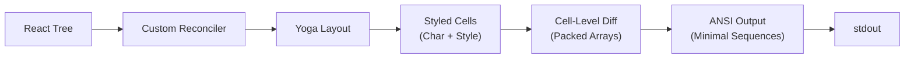

# 第 13 章：终端 UI

## 为什么构建自定义渲染器？

终端不是浏览器。没有 DOM、没有 CSS 引擎、没有合成器、没有保留模式的图形管道。有一个流将字节发送到 stdout，一个流从 stdin 读取字节。这两个流之间的一切——布局、样式、差分、命中测试、滚动、选择——都必须从头发明。

Claude Code 需要一个响应式 UI。它有提示输入、流式 markdown 输出、权限对话框、进度 spinner、可滚动的消息列表、搜索高亮和 vim 模式编辑器。React 是声明这种组件树的明显选择。但 React 需要一个主机环境来渲染，而终端不提供。

Ink 是标准答案：一个适用于终端的 React 渲染器，建立在 Yoga 上实现 flexbox 布局。Claude Code 从 Ink 开始，然后 fork 了它，程度远超辨识度。库存版本在每帧每个单元格分配一个 JavaScript 对象——在 200x120 的终端上，那就是每 16ms 创建并垃圾回收 24,000 个对象。它在字符串级别进行差分，比较整个行的 ANSI 编码文本。它没有 blit 优化的概念，没有双缓冲，没有单元格级别的脏追踪。对于每秒刷新一次的简单 CLI 仪表板，这是可以的。对于以 60fps 流式传输 token 同时用户在包含数百条消息的对话中滚动的 LLM agent，这是不可行的。

Claude Code 中保留的是一个自定义渲染引擎，它共享 Ink 的概念性 DNA——React reconciler、Yoga 布局、ANSI 输出——但重新实现了关键路径：packed typed arrays 替代每单元格一个对象，基于池的字符串 interning 替代每帧一个字符串，双缓冲渲染带单元格级差分，以及一个合并相邻终端写入为最小 escape 序列的优化器。

---

## 渲染管道

管道从 React 组件树开始，流经自定义 reconciler，通过 Yoga 布局产生 styled cells，与前一帧进行差分比较，并生成最小的 ANSI escape 序列集来将其渲染到终端。

### Packed Typed Arrays

渲染器不是使用每单元格一个对象的数组，而是使用紧凑的 typed arrays。每个单元格被编码为几个字节的字符数据和样式引用。一个 200x80 的网格使用 64KB 而不是约 3MB 的 JavaScript 对象开销。内存使用不是主要收益——减少的 GC 压力才是。在 60fps 下，每帧 24,000 次分配是每 16ms 一个完整的 minor GC 周期。Typed arrays 完全避免了这一点。

### Cell-Level Diffing

渲染器比较两个 packed arrays 的逐单元格内容，仅向终端输出更改的单元格。文本稳定时，输出为零字节。流式 token 在附加到行末时输出极少数字节。只有在滚动或完整重绘发生时才处理整个屏幕。

### Pool-Based String Interning

重复样式（颜色、字体粗细）被 intern 到共享池中，而不是为每个单元格创建一个新对象。一个 200x80 的终端可能只有 5 种独特的样式组合，但标准渲染器为每个单元格分配一个新的样式对象。Pool 通过共享引用消除了这种冗余。样式比较是整数相等性检查，而不是对象属性比较。

### Balanced Frame Rate

渲染器不在每个传入 token 上重新绘制。它将更新批处理到 requestAnimationFrame 边界，使流式输出的速率适应终端的实际显示能力。在高分辨率显示器上，这是 60fps。在较慢的终端上，它会更低。重点是使渲染与显示同步，而不是数据源。

---

## 组件树

REPL 组件树反映了系统第 1 章中的架构组织：

- **App 容器**：根组件，管理全局状态和键盘事件
- **消息列表**：对话历史，支持滚动、选择和搜索
- **输入区域**：提示、文本输入、建议、自动完成
- **工具审批对话框**：权限提示及其变体（allow once/always/deny）
- **进度覆盖层**：Spinner、agent 状态指示器、成本摘要
- **上下文组件**：通知、mailbox 指示器、plan mode 横幅

树被渲染到 Ink 的自定义 reconciler，它运行 Yoga flexbox 布局并将 styled cells 转换为 ANSI escape 序列。

---

## 主题和样式

Claude Code 支持主题和自定义样式。颜色通过引用一个名称映射到实际颜色的调色板来指定。暗色和亮色模式使用不同的调色板，在启动时根据系统偏好或用户设置检测。终端背景颜色被检测并用于调整对比度。

---

## Apply This

**Packed arrays 用于频繁比较的数据。** 当每一帧比较数千个单元格时，typed arrays 在内存使用和 GC 压力上胜过对象数组。四个字节每单元格，一个整数比较每单元格。

**仅在改变的地方输出。** Cell-level diffing 将每帧输出从整个屏幕减少到几个更改的单元格。在空闲时带宽使用率为零。仅整个屏幕重绘的成本是昂贵的。

**Intern 重复值。** 当许多对象共享相同属性时，将它们 intern 到共享池中。一个引用比较取代 N 次属性比较。模式在具有有限调色板的终端渲染中特别适用。

**与显示同步，而不是与数据源同步。** 在 requestAnimationFrame 边界批处理更新。使渲染速率适应终端的显示能力。不要比屏幕能显示的更快渲染。

**React 可以在 DOM 之外工作。** 自定义 reconciler + Yoga 布局 + typed arrays = 一个在终端、canvas 或 PDF 中工作的 React，而不改变组件 API。声明式 UI 不限于浏览器。
