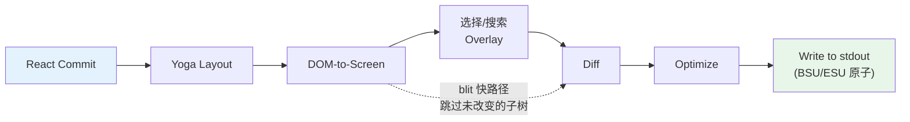
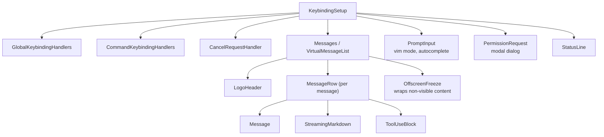

# 第 13 章：终端 UI

## 为什么构建自定义渲染器

终端不是浏览器。没有 DOM、没有 CSS 引擎、没有合成器、没有保留模式的图形流水线。有一个流向 stdout 的字节流和一个来自 stdin 的字节流。这两个流之间的一切——布局、样式、diffing、碰撞检测、滚动、选择——必须从头发明。

Claude Code 需要响应式 UI。它有 prompt 输入、流式 markdown 输出、权限对话框、进度旋转器、可滚动的消息列表、搜索高亮和 vim 模式编辑器。React 是声明这类组件树的明显选择。但 React 需要宿主环境来渲染到其中，而终端不提供。

Ink 是标准答案：一个终端的 React 渲染器，构建在 Yoga 上用于 flexbox 布局。Claude Code 从 Ink 开始，然后 fork 它到无法辨认。原版为每帧每个单元格分配一个 JavaScript 对象——在 200x120 终端上，每 16ms 创建并垃圾回收 24,000 个对象。它在字符串级别 diff，比较 ANSI 编码文本的整行。它没有 blit 优化、无双缓冲、无单元格级脏追踪的概念。对于每秒刷新一次的简单 CLI 仪表板，这没问题。对于以 60fps 流式输出 token 同时用户滚动数百条消息对话的 LLM agent，这是不可能的。

Claude Code 中保留的是一个自定义渲染引擎，与 Ink 共享概念 DNA——React reconciler、Yoga 布局、ANSI 输出——但重新实现了关键路径：紧凑的类型化数组取代对象每单元格、基于池的字符串 interning 取代字符串每帧、带单元格级 diff 的双缓冲渲染，以及将相邻终端写入合并为最小 escape 序列的优化器。

结果在 200 列终端上以 60fps 运行，同时从 Claude 流式接收 token。要理解如何做到，我们需要检查四个层：React 协调的自定义 DOM、将该 DOM 转换为终端输出的渲染流水线、使系统能在数小时会话中存活而不被垃圾回收淹没的池基内存管理，以及将所有联系在一起的组件架构。

---

## 自定义 DOM

React 的 reconciler 需要某个东西来协调。在浏览器中，那是 DOM。在 Claude Code 的终端中，它是一个带有七种元素类型和一种文本节点类型的自定义内存树。

元素类型直接映射到终端渲染概念：

- **`ink-root`** — 文档根，每个 Ink 实例一个
- **`ink-box`** — flexbox 容器，终端的 `<div>` 等价物
- **`ink-text`** — 带有 Yoga 测量函数的文本节点，用于自动换行
- **`ink-virtual-text`** — 另一个文本节点内的嵌套样式文本（在文本上下文内时从 `ink-text` 自动提升）
- **`ink-link`** — 超链接，通过 OSC 8 escape 序列渲染
- **`ink-progress`** — 进度指示器
- **`ink-raw-ansi`** — 带有已知尺寸的预渲染 ANSI 内容，用于语法高亮的代码块

每个 `DOMElement` 携带渲染流水线需要的状态：

```typescript
// 说明性的——实际接口显著扩展
interface DOMElement {
  yogaNode: YogaNode;           // Flexbox 布局节点
  style: Styles;                // 映射到 Yoga 的类 CSS 属性
  attributes: Map<string, DOMNodeAttribute>;
  childNodes: (DOMElement | TextNode)[];
  dirty: boolean;               // 需要重新渲染
  _eventHandlers: EventHandlerMap; // 与 attributes 分开
  scrollTop: number;            // 命令式滚动状态
  pendingScrollDelta: number;
  stickyScroll: boolean;
  debugOwnerChain?: string;     // React 组件栈，用于调试
}
```

`_eventHandlers` 与 `attributes` 的分离是故意的。在 React 中，handler 标识在每次渲染时改变（除非手动 memoized）。如果 handler 存储为 attributes，每次渲染会标记节点为脏并触发完整重绘。通过分开存储它们，reconciler 的 `commitUpdate` 可以不脏节点地更新 handler。

`markDirty()` 函数是 DOM 变更和渲染流水线之间的桥梁。当任何节点的内容改变时，`markDirty()` 向上遍历每个祖先，在每个元素上设置 `dirty = true`，并在叶子文本节点上调用 `yogaNode.markDirty()`。这是深层嵌套文本节点中的单个字符变化如何调度整个路径到根的重渲染——但仅该路径。兄弟子树保持干净，可以从上一帧 blit。

`ink-raw-ansi` 元素类型值得特别提及。当代码块已被语法高亮（产生 ANSI escape 序列）时，重新解析这些序列来提取字符和样式将是浪费。相反，预高亮的内容包装在带有 `rawWidth` 和 `rawHeight` 属性的 `ink-raw-ansi` 节点中，告诉 Yoga 确切尺寸。渲染流水线将原始 ANSI 内容直接写入输出缓冲区，不分解为单独样式字符。这使语法高亮的代码块在初始高亮遍历后基本上零成本——UI 中最昂贵的视觉元素也是最便宜的渲染。

`ink-text` 节点的 measure 函数值得理解，因为它在 Yoga 的布局过程中运行，是同步且阻塞的。函数接收可用宽度，必须返回文本尺寸。它执行自动换行（遵循 `wrap` 样式 prop：`wrap`、`truncate`、`truncate-start`、`truncate-middle`）、考虑字形簇边界（不会跨行拆分多码点 emoji）、正确测量 CJK 双宽字符（每个算 2 列）、并从宽度计算中剥离 ANSI escape 代码（escape 序列视觉宽度为零）。所有这些必须在每个节点微秒内完成，因为带有 50 个可见文本节点的对话意味着每次布局 pass 有 50 个 measure 函数调用。

---

## React Fiber 容器

Reconciler 桥使用 `react-reconciler` 创建自定义宿主配置。这与 React DOM 和 React Native 使用的 API 相同。关键区别：Claude Code 以 `ConcurrentRoot` 模式运行。

```typescript
createContainer(rootNode, ConcurrentRoot, ...)
```

ConcurrentRoot 启用 React 的并发特性——Suspense 用于惰性加载语法高亮，transitions 用于流式期间的非阻塞状态更新。替代方案 `LegacyRoot` 将强制同步渲染并在重量级 markdown 重新解析期间阻塞事件循环。

宿主配置方法将 React 操作映射到自定义 DOM：

- **`createInstance(type, props)`** 通过 `createNode()` 创建 `DOMElement`，应用初始样式和属性，附加事件处理器，并捕获 React 组件所有者链用于调试归属。所有者链存储为 `debugOwnerChain`，由 `CLAUDE_CODE_DEBUG_REPAINTS` 模式用于将全屏重置归因到特定组件

- **`createTextInstance(text)`** 创建 `TextNode`——但仅当我们在文本上下文内。Reconciler 强制原始字符串必须包装在 `<Text>` 中。在文本上下文外尝试创建文本节点会抛出，在协调时而非渲染时捕获一类 bug

- **`commitUpdate(node, type, oldProps, newProps)`** 通过浅比较 diff 新旧 props，然后仅应用改变的。样式、属性和事件处理器各有自己的更新路径。diff 函数如果没有变化返回 `undefined`，完全避免不必要的 DOM 变更

- **`removeChild(parent, child)`** 从树中移除节点，递归释放 Yoga 节点（在 `free()` 前调用 `unsetMeasureFunc()` 以避免访问释放的 WASM 内存），并通知焦点管理器

- **`hideInstance(node)` / `unhideInstance(node)`** 切换 `isHidden` 并在 `Display.None` 和 `Display.Flex` 之间切换 Yoga 节点。这是 React Suspense fallback 过渡的机制

- **`resetAfterCommit(container)`** 是关键 hook：它调用 `rootNode.onComputeLayout()` 运行 Yoga，然后调用 `rootNode.onRender()` 调度终端绘制

Reconciler 追踪每个提交周期的两个性能计数器：Yoga 布局时间（`lastYogaMs`）和总提交时间（`lastCommitMs`）。这些流入 Ink 类报告的 `FrameEvent`，使生产中的性能监控成为可能。

事件系统镜像浏览器的捕获/冒泡模型。`Dispatcher` 类实现完整事件传播的三个阶段：捕获（根到目标）、在目标、和冒泡（目标到根）。事件类型映射到 React 调度优先级——discrete 用于键盘和点击（最高优先级，立即处理），continuous 用于滚动和调整大小（可推迟）。Dispatcher 将所有事件处理包装在 `reconciler.discreteUpdates()` 中用于正确的 React 批处理。

当你在终端中按下一个键，产生的 `KeyboardEvent` 通过自定义 DOM 树分发，从聚焦元素向上冒泡到根，就像键盘事件通过浏览器 DOM 元素冒泡一样。路径上的任何 handler 可以调用 `stopPropagation()` 或 `preventDefault()`，语义与浏览器规范相同。

---

## 渲染流水线

每帧经过七个阶段，每个单独计时：



每个阶段单独计时并在 `FrameEvent.phases` 中报告。这种每阶段仪表化对于诊断性能问题至关重要：当一帧耗时 30ms 时，你需要知道瓶颈是 Yoga 重新测量文本（阶段 2）、渲染器遍历大型脏子树（阶段 3）、还是慢终端的 stdout 背压（阶段 7）。答案决定修复方案。

**阶段 1：React 提交和 Yoga 布局。** Reconciler 处理状态更新并调用 `resetAfterCommit`。这将根节点宽度设置为 `terminalColumns` 并运行 `yogaNode.calculateLayout()`。Yoga 在一次 pass 中计算整个 flexbox 树，遵循 CSS flexbox 规范：它跨所有节点解析 flex-grow、flex-shrink、padding、margin、gap、alignment 和 wrapping。结果——`getComputedWidth()`、`getComputedHeight()`、`getComputedLeft()`、`getComputedTop()`——在每个节点上缓存。对于 `ink-text` 节点，Yoga 在布局期间调用自定义测量函数（`measureTextNode`），通过自动换行和字形测量计算文本尺寸。这是最昂贵的每节点操作：它必须处理 Unicode 字形簇、CJK 双宽字符、emoji 序列和嵌入在文本内容中的 ANSI escape 代码。

**阶段 2：DOM-to-screen。** 渲染器深度优先遍历 DOM 树，将字符和样式写入 `Screen` 缓冲区。每个字符成为一个紧凑的单元格。输出是完整帧：终端上的每个单元格有定义的字符、样式和宽度。

**阶段 3：Overlay。** 文本选择和搜索高亮在原地修改屏幕缓冲区，在匹配单元格上翻转样式 ID。选择应用反向视频来创建熟悉的"高亮文本"外观。搜索高亮应用更激进的视觉处理：当前匹配为反向 + 黄色前景 + 粗体 + 下划线，其他匹配仅反向。这污染了缓冲区——由 `prevFrameContaminated` 标志追踪，以便下一帧知道跳过 blit 快路径。污染是故意的权衡：在原地修改缓冲区避免分配单独的 overlay 缓冲区（在 200x120 终端上节省 48KB），代价是 overlay 清除后的一帧全损伤。

**阶段 4：Diff。** 新屏幕与前帧屏幕逐单元格比较。仅改变的单元格产生输出。比较是每单元格两次整数比较（两个紧凑的 `Int32` 字），diff 遍历损伤矩形而非全屏。在稳态帧上（仅旋转器滴答），这可能产生 24,000 个中的 3 个单元格的补丁。每个补丁是包含光标移动序列和 ANSI 编码单元格内容的 `{ type: 'stdout', content: string }` 对象。

**阶段 5：Optimize。** 同行的相邻补丁被合并为单一写入。冗余的光标移动被消除——如果补丁 N 结束于第 10 列且补丁 N+1 开始于第 11 列，光标已在正确位置，无需移动序列。样式过渡通过 `StylePool.transition()` 缓存预序列化，因此从"bold red"变为"dim green"是单次缓存字符串查找而非 diff-and-serialize 操作。优化器通常相比朴素每单元格输出减少 30-50% 的字节数。

**阶段 6：Write。** 优化的补丁被序列化为 ANSI escape 序列，在单一 `write()` 调用中写入 stdout，包装在支持的终端上的同步更新标记（BSU/ESU）中。BSU（Begin Synchronized Update，`ESC [ ? 2026 h`）告诉终端缓冲所有后续输出，ESU（`ESC [ ? 2026 l`）告诉它刷新。这消除了支持该协议的终端上的可见撕裂——整个帧原子地出现。

每帧通过 `FrameEvent` 对象报告其时序分解：

```typescript
interface FrameEvent {
  durationMs: number;
  phases: {
    renderer: number;    // DOM-to-screen
    diff: number;        // 屏幕比较
    optimize: number;    // 补丁合并
    write: number;       // stdout 写入
    yoga: number;        // 布局计算
  };
  yogaVisited: number;   // 遍历的节点
  yogaMeasured: number;  // 运行了 measure() 的节点
  yogaCacheHits: number; // 带缓存布局的节点
  flickers: FlickerEvent[];  // 全重置归因
}
```

当 `CLAUDE_CODE_DEBUG_REPAINTS` 启用时，全屏重置通过 `findOwnerChainAtRow()` 归因到其源 React 组件。这是 React DevTools "Highlight Updates" 的终端等价物——它显示哪个组件导致整个屏幕重绘，这是渲染流水线中可能发生的最昂贵的事。

Blit 优化值得特别关注。当节点不脏且其位置自上一帧未变（通过节点缓存检查），渲染器直接从 `prevScreen` 复制单元格到当前屏幕，而非重新渲染子树。这使稳态帧极其廉价——在只有旋转器滴答的典型帧上，blit 覆盖 99% 的屏幕，仅有旋转器的 3-4 个单元格从头重新渲染。

Blit 在三种条件下禁用：

1. **`prevFrameContaminated` 为 true** — 选择 overlay 或搜索高亮在原地修改了前帧的屏幕缓冲区，因此这些单元格不能信任为"正确"的先前状态
2. **绝对定位的节点被移除** — 绝对定位意味着节点可能绘制在非兄弟单元格上，这些单元格需要从实际拥有它们的元素重新渲染
3. **布局偏移** — 任何节点的缓存位置与其当前计算位置不同，意味着 blit 会将单元格复制到错误坐标

损伤矩形（`screen.damage`）追踪渲染期间所有写入单元格的边界框。Diff 仅检查此矩形内的行，完全跳过未改变的区域。在 120 行终端上流式消息占据第 80-100 行时，diff 检查 20 行而非 120——6 倍减少比较工作。

---

## 双缓冲渲染和帧调度

Ink 类维护两个帧缓冲区：

```typescript
private frontFrame: Frame;  // 当前在终端上显示
private backFrame: Frame;   // 正在渲染到
```

每个 `Frame` 包含：

- `screen: Screen` — 单元格缓冲区（紧凑的 `Int32Array`）
- `viewport: Size` — 渲染时的终端尺寸
- `cursor: { x, y, visible }` — 停放终端光标的位置
- `scrollHint` — alt-screen 模式的 DECSTBM（滚动区域）优化提示
- `scrollDrainPending` — ScrollBox 是否有剩余滚动增量要处理

每次渲染后，帧交换：`backFrame = frontFrame; frontFrame = newFrame`。旧的前帧成为下一个后帧，为 blit 优化提供 `prevScreen` 和单元格级 diff 的基准。

此双缓冲设计消除分配。不是每帧创建新的 `Screen`，渲染器重用后帧的缓冲区。交换是指针赋值。此模式借鉴自图形编程，其中双缓冲通过确保显示器在渲染器写入另一个时从完整帧读取来防止撕裂。在终端上下文中，撕裂不是问题（BSU/ESU 协议处理）；问题是每 16ms 分配和丢弃包含 48KB+ 类型化数组的 `Screen` 对象的 GC 压力。

渲染调度使用 lodash `throttle` 在 16ms（约 60fps），前后沿均启用：

```typescript
const deferredRender = () => queueMicrotask(this.onRender);
this.scheduleRender = throttle(deferredRender, FRAME_INTERVAL_MS, {
  leading: true,
  trailing: true,
});
```

Microtask 推迟不是偶然的。`resetAfterCommit` 在 React 的 layout effects 阶段前运行。如果渲染器在此同步运行，会错过 `useLayoutEffect` 中设置的光标声明。Microtask 在 layout effects 之后但在同一事件循环 tick 内运行——终端看到单一、一致的帧。

对于滚动操作，单独的 `setTimeout` 在 4ms（FRAME_INTERVAL_MS >> 2）提供更快的滚动帧而不干扰 throttle。滚动变更完全绕过 React：`ScrollBox.scrollBy()` 直接变更 DOM 节点属性、调用 `markDirty()`、并通过 microtask 调度渲染。无 React 状态更新、无协调开销、没有为单次滚轮事件重新渲染整个消息列表。

**调整大小处理**是同步的，不 debounce。当终端调整大小时，`handleResize` 立即更新尺寸以保持布局一致。对于 alt-screen 模式，它重置帧缓冲区并将 `ERASE_SCREEN` 推迟到下一个原子 BSU/ESU 绘制块中，而非立即写入。同步写入擦除将使屏幕空白约 80ms 的渲染时间；将其推迟到原子块中意味着旧内容保持可见直到新帧完全就绪。

**Alt-screen 管理**添加另一层。`AlternateScreen` 组件在挂载时进入 DEC 1049 替代屏幕缓冲区，将高度约束为终端行数。它使用 `useInsertionEffect`——不是 `useLayoutEffect`——以确保 `ENTER_ALT_SCREEN` escape 序列在第一渲染帧之前到达终端。使用 `useLayoutEffect` 将太晚：第一帧将渲染到主屏幕缓冲区，在切换前产生可见闪烁。`useInsertionEffect` 在 layout effects 之前和浏览器（或终端）将绘制之前运行，使过渡无缝。

---

## 基于池的内存：为什么 Interning 重要

200 列乘 120 行终端有 24,000 个单元格。如果每个单元格是带有 `char` 字符串、`style` 字符串和 `hyperlink` 字符串的 JavaScript 对象，那就是每帧 72,000 次字符串分配——加上单元格本身的 24,000 次对象分配。在 60fps 下，就是每秒 576 万次分配。V8 的垃圾回收器能应付，但不是没有以丢帧形式出现的暂停。GC 暂停通常 1-5ms，但不可预测：它们可能在流式 token 更新期间命中，正是在用户观看输出时造成可见卡顿。

Claude Code 用紧凑的类型化数组和三个 interning 池完全消除了这一点。结果：单元格缓冲区零每帧对象分配。唯一的分配在池自身中（摊销的，因为大多数字符和样式在第一帧 interning 并在之后的帧重用）和 diff 产生的补丁字符串中（不可避免，因为 stdout.write 需要字符串或 Buffer 参数）。

**单元格布局** 使用每个单元格两个 `Int32` 字，存储在连续的 `Int32Array` 中：

```
word0: charId        (32 位, 索引到 CharPool)
word1: styleId[31:17] | hyperlinkId[16:2] | width[1:0]
```

同一缓冲区上的并行 `BigInt64Array` 视图启用批量操作——清除一行是 64 位字上的单一 `fill()` 调用，而非清零单独字段。

**CharPool** 将字符串 interning 为整数 ID。它有一个 ASCII 快路径：128 条目的 `Int32Array` 直接将字符代码映射到池索引，完全避免 `Map` 查找。多字节字符（emoji、CJK 表意文字）回退到 `Map<string, number>`。索引 0 始终是空格，索引 1 始终是空字符串。

```typescript
export class CharPool {
  private strings: string[] = [' ', '']
  private ascii: Int32Array = initCharAscii()

  intern(char: string): number {
    if (char.length === 1) {
      const code = char.charCodeAt(0)
      if (code < 128) {
        const cached = this.ascii[code]!
        if (cached !== -1) return cached
        const index = this.strings.length
        this.strings.push(char)
        this.ascii[code] = index
        return index
      }
    }
    // Map fallback for multi-byte characters
    ...
  }
}
```

**StylePool** 将 ANSI 样式码数组 interning 为整数 ID。巧妙部分：每个 ID 的 bit 0 编码样式是否在空格字符上有可见效果（背景色、反向、下划线）。仅前景样式获得偶数 ID；在空格上可见的样式获得奇数 ID。这让渲染器可以通过单一 bitmask 检查跳过不可见空格——`if (!(styleId & 1) && charId === 0) continue`——而不需要查找样式定义。池还缓存任意两个样式 ID 之间的预序列化 ANSI 过渡字符串，因此从"bold red"变为"dim green"是缓存的字符串拼接，不是 diff-and-serialize 操作。

**HyperlinkPool** 将 OSC 8 超链接 URI interning。索引 0 表示无超链接。

所有三个池在前帧和后帧间共享。这是一个关键设计决策。因为池是共享的，interned ID 跨帧有效：blit 优化可以直接从 `prevScreen` 复制紧凑的单元格字到当前屏幕而不重新 interning。Diff 可以将 ID 作为整数比较而不需要字符串查找。如果每个帧有自己的池，blit 将需要为每个复制单元格重新 intern（按旧 ID 查找字符串，然后在新池中 intern 它），这将否定 blit 的大部分性能收益。

池每 5 分钟定期重置以防止长时间会话中的无界增长。迁移 pass 将前帧的活单元格重新 intern 到新池中。

**CellWidth** 以 2 位分类处理双宽字符：

| 值 | 含义 |
|-----|------|
| 0 (Narrow) | 标准单列字符 |
| 1 (Wide) | CJK/emoji 头单元格，占两列 |
| 2 (SpacerTail) | 宽字符的第二列 |
| 3 (SpacerHead) | 软换行继续标记 |

这存储在 `word1` 的低 2 位，使紧凑单元格上的宽度检查免费——常见情况不需要字段提取。

额外的每单元格元数据存在并行数组中而非紧凑单元格内：

- **`noSelect: Uint8Array`** — 每单元格标志，从文本选择中排除内容。用于不应出现在复制文本中的 UI chrome（边框、指示器）
- **`softWrap: Int32Array`** — 每行标记，指示自动换行继续。当用户跨软换行选择文本时，选择逻辑知道不在换行点插入换行符
- **`damage: Rectangle`** — 当前帧中所有写入单元格的边界框。Diff 仅检查此矩形内的行，完全跳过未改变的区域

这些并行数组避免了加宽紧凑单元格格式（这会增加 diff 内循环中的缓存压力），同时提供了选择、复制和优化所需的元数据。

`Screen` 还暴露一个接受尺寸和池引用的 `createScreen()` 工厂。创建屏幕通过 `BigInt64Array` 视图上的 `fill(0n)` 将 `Int32Array` 清零——一次本地调用在微秒内清除整个缓冲区。这在调整大小（需要新帧缓冲区时）和池迁移（旧屏幕的单元格被重新 intern 到新池中时）期间使用。

---

## REPL 组件

REPL（`REPL.tsx`）大约 5,000 行。它是代码库中最大的单一组件，有充分理由：它是整个交互体验的编排器。一切流经它。

组件组织为大约九个部分：

1. **Imports**（~100 行）——引入 bootstrap state、命令、历史、hooks、组件、keybindings、成本追踪、通知、swarm/团队支持、语音集成
2. **Feature-flagged imports** — 通过 `feature()` 守卫配合 `require()` 条件加载语音集成、主动模式、brief 工具和协调器 agent
3. **State management** — 广泛的 `useState` 调用，涵盖消息、输入模式、pending 权限、对话框、成本阈值、会话状态、工具状态和 agent 状态
4. **QueryGuard** — 管理活跃 API 调用生命周期，防止并发请求相互干涉
5. **Message handling** — 处理来自查询循环的传入消息，规范化排序，管理流式状态
6. **Tool permission flow** — 协调工具使用块和 PermissionRequest 对话框之间的权限请求
7. **Session management** — 恢复、切换、导出对话
8. **Keybinding setup** — 接线 keybinding 提供者：`KeybindingSetup`、`GlobalKeybindingHandlers`、`CommandKeybindingHandlers`
9. **Render tree** — 从以上所有组合最终 UI

其渲染树在 fullscreen 模式下组合完整界面：



`OffscreenFreeze` 是终端渲染特定的性能优化。当消息滚动到视口上方时，其 React 元素被缓存且其子树被冻结。这防止离屏消息中的计时器基更新（旋转器、经过时间计数器）触发终端重置。没有它，消息 3 中的旋转指示器将导致全重绘，即使用户正在看消息 47。

组件由 React Compiler 全面编译。不是手动的 `useMemo` 和 `useCallback`，编译器使用 slot 数组插入每表达式 memoization：

```typescript
const $ = _c(14);  // 14 memoization slots
let t0;
if ($[0] !== dep1 || $[1] !== dep2) {
  t0 = expensiveComputation(dep1, dep2);
  $[0] = dep1; $[1] = dep2; $[2] = t0;
} else {
  t0 = $[2];
}
```

此模式出现在代码库中的每个组件中。它提供比 `useMemo`（在 hook 级别 memoize）更细的粒度——渲染函数内的单个表达式获得自己的依赖追踪和缓存。对像 REPL 这样的 5,000 行组件，这每次渲染消除了数百个潜在的不必要重新计算。

---

## 选择和搜索高亮

文本选择和搜索高亮作为屏幕缓冲区 overlay 运行，在主渲染之后但在 diff 之前应用。

**文本选择**仅 alt-screen 模式。Ink 实例持有追踪锚点和焦点、拖拽模式（字符/词/行）和已滚动离开屏幕的捕获行的 `SelectionState`。当用户点击并拖拽时，选择处理器更新这些坐标。在 `onRender` 期间，`applySelectionOverlay` 遍历受影响的行并使用 `StylePool.withSelectionBg()` 在原地修改单元格样式 ID，返回添加了反向视频的新样式 ID。这种对屏幕缓冲区的直接修改是 `prevFrameContaminated` 标志存在的原因——前帧的缓冲区已被 overlay 修改，所以下一帧不能信任它用于 blit 优化，必须做全损伤 diff。

鼠标追踪使用 SGR 1003 模式，报告点击、拖拽和运动以及列/行坐标。`App` 组件实现多次点击检测：双击选择词，三击选择行。检测使用 500ms 超时和 1 单元格位置容差（鼠标可以在点击之间移动一个单元格而不重置多次点击计数器）。超链接点击被此超时有意识地推迟——双击链接选择词而非打开浏览器，匹配用户对文本编辑器的期望行为。

丢失释放恢复机制处理用户在终端内开始拖拽、将鼠标移出窗口、然后释放的情况。终端报告按下和拖拽，但不报告释放（发生在窗口外）。没有恢复，选择将永久卡在拖拽模式。恢复通过检测无按钮按下的鼠标运动事件来工作——如果我们处于拖拽状态并收到无按钮运动事件，我们推断按钮在窗口外被释放并完成选择。

**搜索高亮**有两个并行运行的机制。基于扫描的路径（`applySearchHighlight`）遍历可见单元格寻找查询字符串并应用 SGR 反向样式。基于位置的路径使用来自 `scanElementSubtree()` 的预计算 `MatchPosition[]`，消息相对存储，并在已知偏移处应用带有"当前匹配"黄色高亮，使用堆叠的 ANSI 码（反向 + 黄色前景 + 粗体 + 下划线）。黄色前景与反向结合成为黄色背景——终端在反向活跃时交换 fg/bg。下划线是黄色与现有背景色冲突的主题的后备可见性标记。

**光标声明**解决了一个微妙问题。终端模拟器在物理光标位置渲染 IME（输入法编辑器）预编辑文本。正在组合字符的 CJK 用户需要光标在文本输入的插入符处，而不是终端自然会停放它的屏幕底部。`useDeclaredCursor` hook 让组件声明每帧后光标应在哪里。Ink 类从 `nodeCache` 读取声明节点的位置，将其转换为屏幕坐标，并在 diff 之后发出光标移动序列。屏幕阅读器和放大镜也追踪物理光标，因此此机制对可访问性和 CJK 输入都有益。

在主屏幕模式下，声明的光标位置与 `frame.cursor` 分开追踪（必须保持在内容底部以满足 log-update 的相对移动不变量）。在 alt-screen 模式下，问题更简单：每帧以 `CSI H`（光标 home）开始，因此声明的光标只是在帧末尾发出的绝对位置。

---

## 流式 Markdown

渲染 LLM 输出是终端 UI 面对的最苛刻任务。Token 每次一个到达，每秒 10-50 个，每个都改变可能包含代码块、列表、粗体文本和内联代码的消息内容。朴素方法——在每个 token 上重新解析整个消息——在规模下将是灾难性的。

Claude Code 使用三种优化：

**Token 缓存。** 模块级 LRU 缓存（500 条目）存储按键为内容哈希的 `marked.lexer()` 结果。缓存在虚拟滚动期间的 React 卸载/重挂载周期中存活。当用户滚动回之前可见的消息时，markdown token 从缓存提供而非重新解析。

**快路径检测。** `hasMarkdownSyntax()` 通过单一正则检查前 500 个字符的 markdown 标记。如果没有找到语法，它直接构造单段落 token，绕过完整 GFM 解析器。这在纯文本消息上每次渲染节省约 3ms——当你以每秒 60 帧渲染时这很重要。

**惰性语法高亮。** 代码块高亮通过 React `Suspense` 加载。`MarkdownBody` 组件立即以 `highlight={null}` 作为 fallback 渲染，然后异步解析为 cli-highlight 实例。用户立即看到代码（无样式），然后一两帧后它弹出颜色。

流式情况添加了一个曲折。当 token 从模型到达时，markdown 内容增量增长。在每个 token 上重新解析整个内容在消息过程中将是 O(n²)。快路径检测有帮助——大多数流式内容是纯文本段落，完全绕过解析器——但对于带有代码块和列表的消息，LRU 缓存提供真正的优化。缓存键是内容哈希，因此当 10 个 token 到达且仅最后段落改变时，未改变前缀的缓存解析结果被重用。Markdown 渲染器只重新解析改变的尾部。

`StreamingMarkdown` 组件与静态 `Markdown` 组件不同。它处理内容仍在生成的情况：不完整的代码围栏（没有闭合围栏的 `` ``` ``）、部分粗体标记和截断的列表项。流式变体在解析上更宽容——它不因未闭合语法报错因为闭合语法尚未到达。当消息完成流式输出时，组件过渡到应用严格语法检查的完整 GFM 解析的静态 `Markdown` 渲染器。

对代码块的语法高亮是渲染流水线中最昂贵的每元素操作。100 行代码块可能需要 50-100ms 用 cli-highlight 高亮。加载高亮库本身需要 200-300ms（它捆绑了数十种语言的语法定义）。两种成本都隐藏在 React `Suspense` 之后：代码块立即以纯文本渲染，高亮库异步加载，当它解析时，代码块以颜色重新渲染。用户立即看到代码并片刻后看到颜色——比库加载时 300ms 空白帧好得多的体验。

---

## Apply This：高效渲染流式输出

终端渲染流水线是消除工作的案例研究。三个原则驱动设计：

**Interning 一切。** 如果你有一个出现在数千单元格中的值——样式、字符、URL——存储一次并通过整数 ID 引用。整数比较是一个 CPU 指令。字符串比较是一个循环。当你的内循环在 60fps 下每帧运行 24,000 次时，整数 `===` 和字符串 `===` 之间的差异就是平滑滚动和可见延迟之间的差异。

**在正确的级别 Diff。** 单元格级 diff 听起来昂贵——每帧 24,000 次比较。但每个单元格是两次整数比较（紧凑的字），在稳态帧上，diff 在检查第一单元格后退出大多数行。替代方案——重新渲染整个屏幕并写入 stdout——每帧产生 100KB+ ANSI escape 序列。Diff 通常产生不到 1KB。

**将热路径与 React 分离。** 滚动事件以鼠标输入频率到达（可能每秒数百次）。通过 React 的 reconciler 路由每个——状态更新、协调、提交、布局、渲染——每个事件增加 5-10ms 延迟。通过直接变更 DOM 节点并通过 microtask 调度渲染，滚动路径保持在 1ms 以下。React 仅在最终绘制中参与，它本来就会在那里运行。

这些原则适用于任何流式输出系统，不仅仅是终端。

第四个原则，特定于长时间运行会话：**定期清理。** Claude Code 的池随着新字符和样式被 intern 而单调增长。在数小时会话中，池可能累积数千条目，不再被任何活单元格引用。5 分钟重置周期限定此增长。这是一种分代收集策略，在应用级别应用，因为 JavaScript GC 对池条目的语义活跃度没有可见性。

使用 `Int32Array` 而非普通对象有超越 GC 压力的微妙好处：内存局部性。当 diff 比较 24,000 个单元格时，它遍历连续的类型化数组。现代 CPU 预取顺序内存访问，因此整个屏幕比较在 L1/L2 缓存内运行。对象每单元格的布局将单元格分散在堆上，将每次比较变成缓存未命中。性能差异是可测量的：在 200x120 屏幕上，类型化数组 diff 在 0.5ms 内完成，而等效的基于对象的 diff 需要 3-5ms。

第五原则适用于渲染到固定大小网格的任何系统：**追踪损伤边界。** 每个屏幕上的 `damage` 矩形记录渲染期间写入的单元格的边界框。Diff 查阅此矩形并完全跳过其外的行。当流式消息占据 120 行终端的底部 20 行时，diff 检查 20 行而非 120。与 blit 优化结合，这意味着常见情况——一条消息流式输出而其余对话是静态的——仅触及屏幕缓冲区的一小部分。

更广泛的教训：渲染系统中的性能不是使任何单一操作快。而是完全消除操作。Blit 消除重新渲染。损伤矩形消除 diffing。池共享消除重新 interning。紧凑的单元格消除分配。每个优化移除整个工作类别，它们乘法式堆叠。
