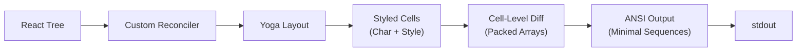

# 第 13 章：终端 UI

## 为什么构建自定义渲染器

终端不是浏览器。没有 DOM、没有 CSS 引擎、没有合成器、没有保留模式的图形管道。有一个流将字节发送到 stdout，一个流从 stdin 读取字节。这两个流之间的一切——布局、样式、差分、命中测试、滚动、选择——都必须从头发明。

Claude Code 需要一个响应式 UI。它有提示输入、流式 markdown 输出、权限对话框、进度 spinner、可滚动的消息列表、搜索高亮和 vim 模式编辑器。React 是声明这种组件树的明显选择。但 React 需要一个主机环境来渲染，而终端不提供。

Ink 是标准答案：一个适用于终端的 React 渲染器，建立在 Yoga 上实现 flexbox 布局。Claude Code 从 Ink 开始，然后 fork 了它，程度远超辨识度。库存版本在每帧每个单元格分配一个 JavaScript 对象——在 200x120 的终端上，那就是每 16ms 创建并垃圾回收 24,000 个对象。它在字符串级别进行差分，比较整个行的 ANSI 编码文本。它没有 blit 优化的概念，没有双缓冲，没有单元格级别的脏追踪。对于每秒刷新一次的简单 CLI 仪表板，这是可以的。对于以 60fps 流式传输 token 的 LLM agent，同时用户在包含数百条消息的对话中滚动，这是不可行的。

Claude Code 中保留的是一个自定义渲染引擎，它共享 Ink 的概念性 DNA——React reconciler、Yoga 布局、ANSI 输出——但重新实现了关键路径：packed typed arrays（紧凑的类型化数组）替代每单元格一个对象，基于池的字符串 interning 替代每帧一个字符串，双缓冲渲染带单元格级差分，以及一个合并相邻终端写入为最小 escape 序列的优化器。

---

## 渲染管道

管道从 React 组件树开始。自定义 reconciler 将 React 元素转换为终端节点。Yoga flexbox 引擎将节点树布局为坐标。样式系统将布局结果转换为 styled cells。差分引擎将新帧与前一帧进行比较。ANSI 序列器输出最小的 escape 代码集。

### Packed Typed Arrays

渲染器不是使用每单元格一个对象的数组，而是使用紧凑的 typed arrays（类型化数组，如 `Uint8Array`）。每个单元格被编码为几个字节的字符数据和样式引用。一个 200x80 的网格使用 64KB 而不是约 3MB 的 JavaScript 对象开销。内存使用不是主要收益——减少的 GC（垃圾回收）压力才是。在 60fps 下，每帧 24,000 次对象分配意味着每 16ms 触发一次完整的 minor GC 周期，导致帧率不稳定。Typed arrays 在 V8 引擎中分配在堆外，不经过 GC，完全避免了这个问题。

> 💡 **译注**：类比一下——方案 A 是每帧 new 24,000 个 JS 对象（画完等 GC 回收），方案 B 是预分配一块固定大小的内存（typed array），每帧只修改里面的数值。方案 B 不仅占 64KB vs 3MB，且无 GC——只改数值，不改结构。终端流式输出本质上就是高频更新这些单元格。

### Cell-Level Diffing

渲染器比较两个 packed arrays 的逐单元格内容，仅向终端输出更改的单元格。文本稳定时，输出为零字节。流式 token 在附加到行末时输出极少数字节。只有在滚动或完整重绘发生时才处理整个屏幕。差分按行优先顺序处理，由内到外优先矩形。

### Pool-Based String Interning

重复的样式（颜色、字体粗细）被 intern 到共享池中，而不是为每个单元格创建一个新对象。一个 200x80 的终端可能只有 5 种独特的样式组合，但标准渲染器为每个单元格分配一个新的样式对象。Pool 通过共享引用消除了这种冗余。样式比较变成整数相等检查，而不是对象属性比较。

### Balanced Frame Rate

渲染器不在每个传入 token 上重新绘制。它将更新批处理到 requestAnimationFrame 边界，使流式输出的速率适应终端的实际显示能力。在高分辨率显示器上，这是 60fps。在较慢的终端上，它会更低。重点是使渲染与显示同步，而不是数据源。

---

## 组件树

REPL 组件树反映了第 1 章中的架构组织：

- **App 容器**：根组件，管理全局状态和键盘事件
- **Header**：面包屑导航、会话信息、成本指示器
- **消息列表**：对话历史，支持滚动、选择和搜索高亮
- **输入区域**：提示、文本输入、建议、自动完成
- **工具审批对话框**：权限提示及其变体
- **进度覆盖层**：Spinner、agent 状态、成本摘要
- **上下文组件**：通知、mailbox 指示器、plan mode 横幅

树被渲染到 Ink 的自定义 reconciler，它运行 Yoga flexbox 布局并将 styled cells 转换为 ANSI escape 序列。每个组件响应状态变化并在布局和渲染阶段之间干净地分离关注点。

---

## 双缓冲

渲染器维护两个缓冲区：一个代表终端上当前显示的内容，一个代表下一帧的内容。差分引擎比较它们。双缓冲防止撕裂：终端在差分完成之前永远不会看到部分写入的帧。它还使单元测试变得简单——你可以断言两个 packed arrays 相等而不生成任何输出。

---

## 主题

Claude Code 支持主题和自定义样式。颜色通过引用一个名称到实际颜色映射的调色板来指定。暗色和亮色模式使用不同的调色板，在启动时根据系统偏好或用户设置检测。终端背景颜色被检测并用于调整对比度，确保文本在透明背景终端中仍然可读。

---

## Apply This

**Packed arrays 用于频繁比较的数据。** 当每一帧比较数千个单元格时，typed arrays 在内存使用和 GC 压力上胜过对象数组。四个字节每单元格，一个整数比较每单元格。构建一个每帧分配零垃圾的渲染管道是可能的。

**只输出改变的内容。** Cell-level diffing 将每帧输出从整个屏幕减少到几个更改的单元格。在空闲时带宽使用率为零。为常见情况（稳定文本、流式追加、少量更改的单元格）优化你的差分器。

**Intern 重复值。** 当许多对象共享相同属性时，将它们 intern 到共享池中。一个引用比较取代 N 次属性比较。样式、颜色和字体粗细对于具有有限调色板的终端渲染是主要候选。

**与显示同步，而不是与数据源同步。** 在 requestAnimationFrame 边界批处理更新。使渲染速率适应显示能力。不要比屏幕能显示的速度更快渲染——浪费的帧把 CPU 时间烧在用户永远看不到的输出上。

**React 可以在 DOM 之外工作。** 自定义 reconciler + Yoga 布局 + typed arrays = 一个在终端、canvas 或 PDF 中工作的 React。声明式 UI 不限于浏览器。模式是通用的；只有输出原语改变。
