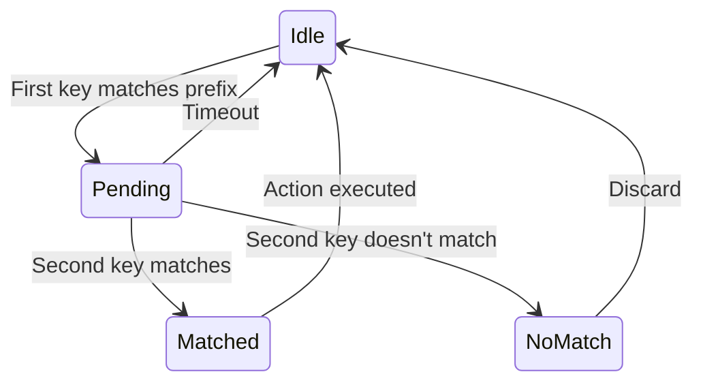

# 第 14 章：输入与交互

## 原始字节，有意义的动作

当你在 Claude Code 中按下 Ctrl+X 然后 Ctrl+K 时，终端发送两个字节序列，间隔可能 200 毫秒。第一个是 `0x18`（ASCII CAN）。第二个是 `0x0B`（ASCII VT）。这两个字节都不携带任何超出"控制字符"的固有含义。输入系统必须识别这两个字节在超时窗口内顺序到达，构成了 chord `ctrl+x ctrl+k`，它映射到动作 `chat:killAgents`，终止所有正在运行的子 agent。

在原始字节和被杀掉的 agent 之间，六个系统被激活：一个 tokenizer 分割 escape 序列，一个 parser 跨五种终端协议分类它们，一个 keybinding resolver 根据上下文特定绑定匹配序列，一个 chord 状态机管理多键序列，一个 handler 执行动作，React 将结果状态更新批处理为单次渲染。

困难不在于这些系统中的任何一个。而在于终端多样性的组合爆炸。iTerm2 发送 Kitty 键盘协议序列。macOS Terminal 发送 legacy VT220 序列。Ghostty over SSH 发送 xterm modifyOtherKeys。tmux 根据其配置可能吃掉、转换或透传其中任何一个。Windows Terminal 在 VT 模式上有自己的怪癖。输入系统必须从所有这些中产生正确的 `ParsedKey` 对象，因为用户不应该需要知道他们的终端使用哪种键盘协议。

本章追踪从原始字节到有意义的动作的路径，跨越整个领域。

---

## 键解析管道

管道从 stdin 读取原始字节并逐步将它们转换为动作。每一层解决一个特定的关注点，将一个问题转化为下一个问题的输入。

```
原始字节 → Tokenizer → ParsedKey → Keybinding Resolver → Chord State Machine → Action → Handler
```

### Tokenizer：分割输入流

stdin 是一个无差别的字节流。按键不是消息——它们是序列中的前缀或内缀字节。Tokenizer 读取这个流并识别完整的键序列何时完成。

```typescript
// Pseudocode — illustrates the tokenization pattern
class KeyTokenizer {
  private buffer: number[] = []

  feed(byte: number): ParsedKey | null {
    this.buffer.push(byte)
    // Try to recognize a complete sequence
    const result = this.tryParse(this.buffer)
    if (result) {
      this.buffer = []
      return result
    }
    return null // More bytes needed
  }
}
```

Tokenizer 是无状态的，除了当前缓冲区。每个完整的序列清空缓冲区并产出 `ParsedKey`。不完整的序列返回 null——调用者等待更多字节。

### Parser：五种协议分类

```typescript
function tryParseSequence(bytes: number[]): { key: string; modifiers: Modifiers } | null {
  // ESC [ ... — CSI sequences (most terminals)
  if (bytes[0] === 0x1b && bytes[1] === 0x5b) {
    return parseCsiSequence(bytes)
  }
  // ESC O ... — SS3 sequences (older terminals, function keys)
  if (bytes[0] === 0x1b && bytes[1] === 0x4f) {
    return parseSs3Sequence(bytes)
  }
  // ESC [ 57399 u — Kitty keyboard protocol
  if (bytes[0] === 0x1b && bytes[1] === 0x5b && hasKittySuffix(bytes)) {
    return parseKittySequence(bytes)
  }
  // Single byte — ASCII control or printable
  if (bytes.length === 1) {
    return parseSingleByte(bytes[0])
  }
  return null // Cannot match any known protocol
}
```

Parser 不"猜测"协议。每种协议有不同的字节模式。CSI 序列以 `ESC [` 开始。SS3 序列以 `ESC O` 开始。Kitty 协议以 `ESC [ n u` 结束。Parser 尝试每种已知模式，直到找到匹配或耗尽可能性。

### 两种模式：CSI 和 SS3

基于转义序列的终端输入使用两个前缀字节：Control Sequence Introducer（CSI，字节 0x9B 或双字节 `ESC [`）和 Single Shift Three（SS3，双字节 `ESC O`）。这两种模式从不同的键族演变而来，至今仍用于不同的目的。CSI 涵盖光标定位、功能键和大多数现代扩展。SS3 出现在传统终端中，用于数字键盘键，以及一些功能键序列。

### Alt/Escape 歧义

终端输入中最难解决的问题之一是 Alt 修饰符和 Escape 键之间的歧义。两者发送 `0x1B`。区别在于时间：按 Escape 后跟一个键在两者之间有一个可感知的停顿；Alt+key 将 Escape 作为前缀，与后续字节之间没有间隔。Tokenizer 使用基于超时的启发式方法：如果 Escape 在一定毫秒内后跟另一个字节，它是修饰符。如果时间更长，它就是 Escape 键。超时是可配置的，默认为 30ms——足够短到感觉即时，足够长到区分有意的 Escape。

修复了特定 bug 的注释散布在 parser 代码中："Windows Terminal 在 VT 模式下发送 `\x1b[27u` 而不是 `\x1b[27~`"、"tmux 在 focus 事件上发送修改后的 CSI 序列"、"Kitty 协议以分号分隔 modifier 标志（与 CSI modifier 编码重复）"。每个注释都是为了响应一个用户报出的终端特定 bug 而添加的。

### ParsedKey：规范表示

```typescript
type ParsedKey = {
  key: string        // 'a', 'enter', 'backspace', 'left', 'f5'
  ctrl: boolean
  alt: boolean
  shift: boolean
  meta: boolean
}
```

在这一点之后，系统的其余部分永远看不到原始字节。它看到的是一个类型化的、规范化的键，所有协议差异都已被吸收。"左箭头"在所有终端中是同一个 `ParsedKey`，无论是表示为 `\x1b[D`、`\x1b[1;3D` 还是 Kitty 等价物。

> 💡 **译注**：为什么会有五种键盘协议？因为终端模拟器没有一个统一的"键盘事件标准"。浏览器有 `KeyboardEvent`，但终端只有字节流。Claude Code 必须在这个最底层处理这些差异——Tokenizer 和 Parser 的作用就是把"哪个终端发了什么字节"这个混乱的问题在边界处解决掉，让系统的其余部分只看到干净的 `ParsedKey`。这就是第 18 章末尾说的"边界吸收混乱，内部保持干净"的经典例子。

---

## Keybinding Resolver：序列到动作

Resolver 维护从 `ParsedKey` 到命名动作的映射。它支持单一按键绑定、顺序 chord 绑定和上下文特定绑定。

### 绑定配置

键绑定存储在 `~/.claude/keybindings.json` 中：

```json
{
  "keybindings": {
    "ctrl+n": "chat:nextItem",
    "ctrl+p": "chat:prevItem",
    "ctrl+k ctrl+f": "chat:formatCode",
    "escape": "chat:escape",
    "ctrl+c": "core:interrupt"
  }
}
```

每个条目声明触发它的键（或键序列）和它调用的命名动作。冲突解决是确定性的：更具体的绑定（chord）胜过更一般的绑定（单一按键），用户绑定胜过默认绑定。

### Chord 状态机



Chord 模式在第一个键匹配 chord 前缀时激活。状态机等待第二个键。如果在超时窗口内到达并匹配，动作执行。如果超时窗口到期，第一个键被视为独立按键。超时可配置，默认为 1000ms。

### 上下文特定绑定

绑定可以通过"上下文"限定，允许相同的按键在不同场景中做不同的事情。Vim 普通模式有自己的绑定表。权限对话框暂时覆盖 escape 处理。输入区域劫持了回车键。Resolver 首先检查特定上下文，回退到全局绑定，未匹配的按键作为文字文本通过。

### 动作常量

所有动作都是简单的字符串常量（`chat:nextItem`、`core:interrupt`、`vim:deleteLine`）。没有动作接口、没有 action creator 函数、没有 action 类型层次结构。一个字符串常量传达解析器和 handler 都需要知道的一切。简单之所以获胜，是因为命名空间字符串常量在不需要框架的情况下给你可发现性和唯一性。

---

## 自动完成

输入区域提供上下文感知的自动完成：文件路径、命令名称、agent 类型、skill 名称。完成引擎将输入文本与全局可用完成注册表进行匹配，该注册表从工具、agent 定义、skill 元数据和文件系统中在启动时填充。结果通过灵活匹配排名：精确匹配在前，前缀匹配在后，子字符串匹配在最后。排名由上下文加权：在 slash 命令之后，命令获得最高优先级。在文件路径位置，文件系统条目优先。

---

## Vim 模式

Claude Code 支持用于文本编辑的 vim 风格模态键绑定。输入区域有三种模式：Normal、Insert、Visual。Vim 模式使用与其他所有内容相同的 `ParsedKey` → Action 管道，但带有一组不同的动作和处理程序。Vim 的动词-宾语语法（`d3w` = "delete 3 words"）被实现为一个小型状态机，跟踪操作符、计数和运动。

---

## Apply This

**在边界处尽早将原始输入规范化为规范形式。** 在边界处解析一次字节 → `ParsedKey`。让后续的所有内容处理干净的类型化动作。Tokenizer 知道协议差异；系统的其余部分不知道。当添加新的终端协议时，只有 Tokenizer 改变。

**Chords 和模式做重活。** 单键绑定对于专业工具是不够的。Chords 将 N 次按键映射到 N² 次动作。模式让相同的物理按键在不同上下文中具有不同的含义。组合让键盘超越物理限制。

**基于超时的 Escape/Alt 解决方案是务实的。** 完美区分 Alt 和 Escape 需要从终端内部发出带外信号，而大多数终端不提供这个信号。超时启发式方法有效率达到 99.9%，当它失败时，用户可以用另一个按键纠正。完美是良好的敌人。

**动作是一个字符串，不是一个接口。** `chat:nextItem` 传达了 resolver 和处理程序都需要知道的一切。没有框架、没有类型、没有依赖。字符串是可调试的：它们出现在日志中、出现在配置文件中、出现在错误消息中。

**自动完成排名不可见但关键。** 当排名正确时，用户甚至不会注意到完成系统存在。当排名错误时——正确的完成出现在第三页——他们感到系统很愚蠢。使提升最常见结果的排名函数比匹配算法本身更难。
