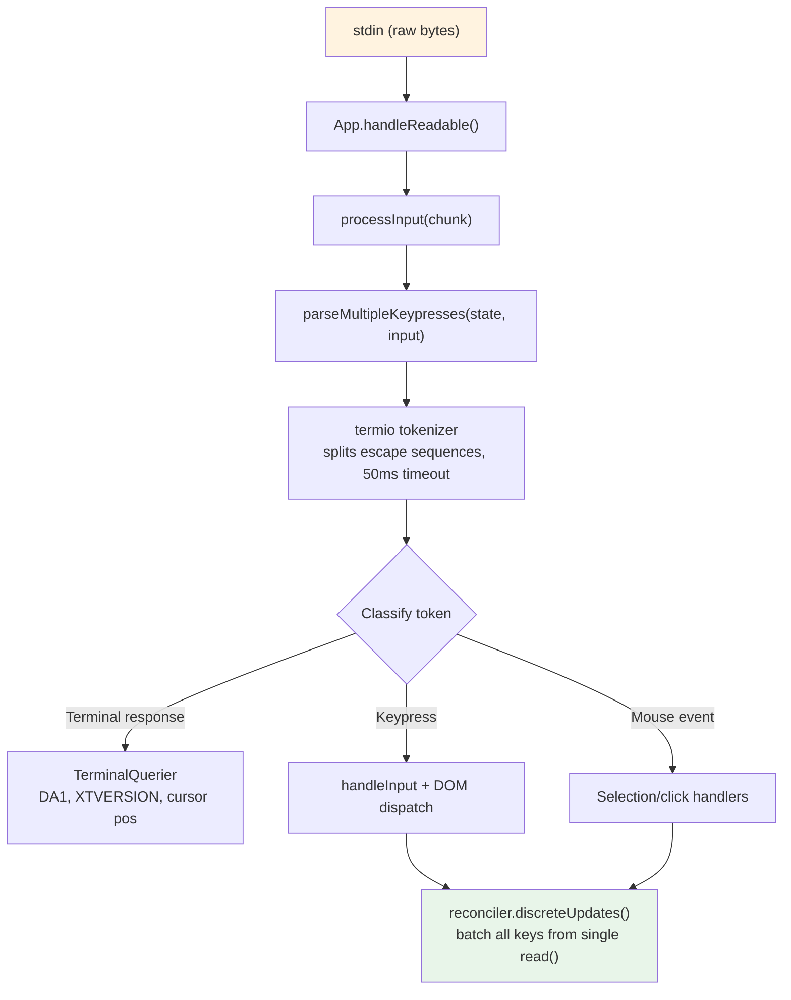

# 第 14 章：输入与交互

## 原始字节，有意义的动作

当你在 Claude Code 中按下 Ctrl+X 然后 Ctrl+K，终端发送两个可能间隔约 200 毫秒的字节序列。第一个是 `0x18`（ASCII CAN）。第二个是 `0x0B`（ASCII VT）。这些字节都不携带超越"控制字符"的内在含义。输入系统必须识别这两个在超时窗口内按序到达的字节构成和弦 `ctrl+x ctrl+k`，映射到动作 `chat:killAgents`，该动作终止所有运行中的子 agent。

在原始字节和被杀死的 agent 之间，六个系统激活：tokenizer 分割 escape 序列，parser 跨五种终端协议分类它们，keybinding resolver 将序列匹配到上下文特定的绑定，chord 状态机管理多键序列，handler 执行动作，React 批处理结果状态更新为单一渲染。

困难不在这些系统中的任何一个。在于终端多样性的组合爆炸。iTerm2 发送 Kitty 键盘协议序列。macOS Terminal 发送遗留 VT220 序列。Ghostty over SSH 发送 xterm modifyOtherKeys。tmux 可能根据其配置吃掉、转换或透传这些。Windows Terminal 有自己的 VT 模式怪癖。输入系统必须从所有中产生正确的 `ParsedKey` 对象，因为用户不应该知道他们的终端使用哪种键盘协议。

设计哲学是带优雅降级的渐进增强。在现代支持 Kitty 键盘协议的终端上，Claude Code 获得完整修饰键检测（Ctrl+Shift+A 与 Ctrl+A 不同）、super 键报告（Cmd 快捷键）和无歧义的键识别。在通过 SSH 的遗留终端上，它回退到最佳可用协议，丢失一些修饰键区分但保持核心功能完好。用户永不会看到关于其终端不受支持的错误消息。

---

## 键解析流水线

输入以字节块在 stdin 上到达。流水线分阶段处理它们：

Tokenizer 是基础。终端输入是混合可打印字符、控制码和多字节 escape 序列且无显式帧的字节流。来自 stdin 的单次 `read()` 可能返回 `\x1b[1;5A`（Ctrl+Up 箭头），也可能在一次 read 中返回 `\x1b` 在下次 read 中返回 `[1;5A`，取决于字节从 PTY 到达的速度。Tokenizer 维护缓冲部分 escape 序列并发出完整 token 的状态机。

不完整序列问题是根本性的。当 tokenizer 看到单独的 `\x1b`，它无法知道这是 Escape 键还是 CSI 序列的开始。它缓冲该字节并启动 50ms 计时器。如果没有延续到达，缓冲区被刷新且 `\x1b` 成为 Escape 键击。但在刷新前，tokenizer 检查 `stdin.readableLength`——如果字节在内核缓冲区中等待，计时器重装而非刷新。对于粘贴操作，超时扩展到 500ms。

来自单次 `read()` 的所有解析键在单一 `reconciler.discreteUpdates()` 调用中处理。这批量处理 React 状态更新，使粘贴 100 个字符产生一次重渲染，而非 100 次。批量处理至关重要：没有它，粘贴中的每个字符将触发完整的协调周期——状态更新、协调、提交、Yoga 布局、渲染、diff、写入。以每周期 5ms 计，100 字符粘贴将耗时 500ms 处理。有批处理，相同粘贴耗时一个 5ms 周期。

### stdin 管理

`App` 组件通过引用计数管理 raw 模式。当任何组件需要 raw 输入时，调用 `setRawMode(true)`，递增计数器。当不再需要时，调用 `setRawMode(false)`，递减。Raw 模式仅在计数器达到零时禁用。这防止了终端应用中的常见 bug：组件 A 启用 raw 模式，组件 B 启用 raw 模式，组件 A 禁用 raw 模式，突然组件 B 的输入因 raw 模式被全局禁用而中断。

当 raw 模式首次启用时，App：停止早期输入捕获、将 stdin 置入 raw 模式、附加 `readable` 监听器用于异步输入处理、启用括号粘贴、启用焦点报告、启用扩展键报告（Kitty 键盘协议 + xterm modifyOtherKeys）。禁用时，所有这些以相反顺序逆转。`onExit` 信号处理器确保即使在意外终止时也发生清理。

---

## 多协议支持

终端在如何编码键盘输入上不一致。Claude Code 的解析器同时处理五种不同协议。

**CSI u（Kitty 键盘协议）** 是现代标准。格式：`ESC [ codepoint [; modifier] u`。码点无歧义地标识键——Escape-the-key 和 Escape-as-sequence-prefix 之间没有歧义。修饰键字将 shift、alt、ctrl 和 super（Cmd）编码为单独位。

**xterm modifyOtherKeys** 是 Kitty 协议未协商时 Ghostty over SSH 等终端的后备。格式：`ESC [ 27 ; modifier ; keycode ~`。注意参数顺序与 CSI u 相反——修饰键在键码之前。启用通过 `CSI > 4 ; 2 m`。

**遗留终端序列** 覆盖其余一切：通过 `ESC O` 和 `ESC [` 序列的功能键、箭头键、数字键盘、Home/End/Insert/Delete。遗留序列的挑战是歧义。`ESC [ 1 ; 2 R` 可能是 Shift+F3 或光标位置报告。解析器通过私有标记检查解决此问题。

**SGR 鼠标事件** 使用格式 `ESC [ < button ; col ; row M/m`。按钮码编码动作：0/1/2 为左/中/右键，64/65 为滚轮上/下。滚轮事件转换为 `ParsedKey` 对象；点击和拖拽成为 `ParsedMouse` 对象。

**括号粘贴** 将粘贴内容包装在 `ESC [200~` 和 `ESC [201~` 标记之间。中间的一切成为带有 `isPasted: true` 的单一 `ParsedKey`。这防止粘贴的代码被解释为命令——当用户粘贴包含 `\x03`（raw 字节中为 Ctrl+C）的代码片段时的关键安全特性。

来自解析器的输出类型形成干净的可辨识联合：`ParsedKey`（带有 name、ctrl/meta/shift/option/super、sequence 和 isPasted）、`ParsedMouse`（带有 button、action、col、row）和 `ParsedResponse`（路由到 TerminalQuerier 的终端响应）。

`kind` 鉴别器确保下游代码显式处理每种输入类型。`isPasted` 标志对安全至关重要——keybinding resolver 对粘贴的键跳过 keybinding 匹配。

修饰键解码遵循 XTerm 约定。stdin-gap 检测器在无输入到达 5 秒后触发终端模式重新断言，处理 tmux 重新附加和笔记本唤醒场景。

### 终端 I/O 层

解析器之下是三结构化的终端 I/O 子系统：`csi.ts`（光标移动、擦除、滚动区域）、`dec.ts`（替代屏幕缓冲区、鼠标追踪模式）、`osc.ts`（剪贴板访问、tmux/screen 多路复用器包装）和 `sgr.ts`（ANSI 样式码系统）。

### 事件系统

`ink/events/` 目录实现浏览器兼容的事件系统，带有七种事件类型，每个携带 `target`、`currentTarget`、`eventPhase`，支持 `stopPropagation()`、`stopImmediatePropagation()` 和 `preventDefault()`。

---

## Keybinding 系统

Keybinding 系统分离三个通常纠缠在一起的关注点：什么键触发什么动作（bindings）、动作触发时发生什么（handlers）、以及哪些绑定现在活跃（contexts）。

### Bindings：声明式配置

默认绑定在 `defaultBindings.ts` 中定义，每个限定在上下文中。平台特定绑定在定义时处理。用户可以覆盖任何绑定。

### Contexts：16 个活动范围

每个上下文代表一组特定绑定适用的交互模式：Global（始终）、Chat（prompt 输入聚焦时）、Autocomplete（补全菜单可见时）、Confirmation（权限对话框显示时）、Scroll、Transcript、HistorySearch、Task、Help、MessageSelector、MessageActions、DiffDialog、Select、Settings、Tabs 和 Footer。

当键到达时，resolver 从当前活跃上下文构建上下文列表，去重保持优先级顺序，并搜索匹配的绑定。最后匹配的绑定胜出。上下文列表在每次击键上重建。

上下文设计处理了一个棘手的交互模式：嵌套模态。当权限对话框在运行中任务期间出现时，`Confirmation` 和 `Task` 上下文都可能活跃。`Confirmation` 上下文优先，所以 `y` 触发"批准"而非任何任务级绑定。

### 保留的快捷键

不是一切都可以重新绑定。系统强制执行三个保留层级：不可重新绑定（`ctrl+c`、`ctrl+d`）、终端保留（`ctrl+z`、`ctrl+\`）和 macOS 保留（`cmd+c`、`cmd+v` 等）。

### 解析流

当键到达时，解析路径是：构建上下文列表 → 调用 `resolveKeyWithChordState` → 匹配时清除任何 pending chord 并调用 handler → chord_started 时保存 pending 击键 → chord_cancelled 时清除 → unbound 时（用户设为 null）停止传播但无 handler → none 时回退到其他处理器。

---

## Chord 支持

`ctrl+x ctrl+k` 绑定是一个 chord：两个组合形成单一动作的击键。Resolver 用状态机管理此。

当键到达时：resolver 将其追加到任何 pending chord 前缀；检查任何绑定的 chord 是否以此前缀开始（如果是，返回 `chord_started`）；如果完整 chord 精确匹配绑定（返回 `match`，清除 pending 状态）；如果 chord 前缀不匹配任何（返回 `chord_cancelled`）。

`ChordInterceptor` 组件在 chord 等待状态期间拦截所有输入。它有 1000ms 超时。

Chord 设计避免了影子 readline 编辑键。没有 chords，杀死 agent 的 keybinding 可能是 `ctrl+k`——但那是 readline 的"杀死到行尾"。通过使用 `ctrl+x` 作为前缀，系统获得不与单键编辑快捷键冲突的绑定命名空间。

---

## Vim 模式

### 状态机

Vim 实现是带有穷举类型检查的纯状态机。类型就是文档：`VimState` 是 `INSERT` 或 `NORMAL`（带有 `CommandState`）。`CommandState` 是带有 12 个变体的可辨识联合：idle、count、operator、operatorCount、operatorFind、operatorTextObj、find、g、operatorG、replace、indent。

TypeScript 的穷举检查确保每个 `switch` 语句处理所有 12 种情况。每个状态精确携带下次过渡所需的数据——不多不少。类型使不可能状态无法表示。

状态图展示了从 idle 到各种状态的过渡：按 `d` 进入 operator 状态；从 operator，按 `w` 执行带 `w` 动作的 delete；按 `d` 再次触发行删除；按 `2` 进入 operatorCount 状态；按 `i` 进入 operatorTextObj 状态。每个中间状态精确携带下次过渡所需的上下文。

### 过渡作为纯函数

`transition()` 函数根据当前状态类型分发到 10 个 handler 函数之一。每个返回 `TransitionResult`，带有可选的 `next`（新状态）和 `execute`（副作用闭包）。副作用被返回，不执行。过渡函数是纯的——给定状态和键，返回下一个状态和可选执行动作的闭包。调用者决定何时运行效果。

### 动作、操作符和文本对象

**动作** 是将键映射到光标位置的纯函数。**操作符** 应用于范围：delete 移除文本并保存到寄存器，change 移除文本并进入插入模式，yank 复制到寄存器。**文本对象** 找到光标周围的边界。

Word 对象（`iw`、`aw`）将文本分段为字形并按 word-character、whitespace 或 punctuation 分类。Quote 对象（`i"`、`a"`）在当前行找到成对引号。Bracket 对象进行深度追踪搜索匹配定界符，正确处理嵌套括号。

### 持久状态和 Dot-Repeat

Vim 模式维护跨命令存活的 `PersistentState`：`lastChange`（用于 dot-repeat）、`lastFind`（用于 ; 和 ,）、`register`（yank 缓冲区）和 `registerIsLinewise`（粘贴行为标志）。每个变更命令将自身记录为 `RecordedChange`。`.` 命令从持久状态重放 `lastChange`。

---

## 虚拟滚动

长会话产生长对话。`VirtualMessageList` 组件通过仅渲染视口中可见的消息加上上下小缓冲区来解决此问题。组件维护每消息高度缓存、用于转录搜索导航的跳转句柄、带热缓存支持的搜索文本提取和粘性 prompt 追踪。

`useVirtualScroll` hook 基于 `scrollTop`、`viewportHeight` 和累积消息高度计算要挂载的消息。`ScrollBox` 组件通过 `useImperativeHandle` 提供命令式 API：`scrollTo`、`scrollBy`、`scrollToElement`、`scrollToBottom` 和 `setClampBounds`。所有滚动变更直接到 DOM 节点属性并通过 microtask 调度渲染，绕过 React 的 reconciler。

---

## Apply This：构建上下文感知的 Keybinding 系统

**将绑定与处理器分离。** 绑定是数据（哪个键映射到哪个动作名称）。处理器是代码（动作触发时发生什么）。将两者分开意味着绑定可以序列化为 JSON 供用户自定义。

**Context 作为一等概念。** 不是一组平面的键映射，定义基于应用状态激活和停用的上下文。当对话框打开时，`Confirmation` 上下文激活且其绑定优先于 `Chat` 绑定。

**Chord 状态作为显式机器。** 多键序列不是单键绑定的特殊情况——它们是需要带有超时和取消语义的状态机的不同种类绑定。

**早期保留，清晰警告。** 在定义时识别不能被重新绑定的键，而非在解析时。当用户尝试绑定 `ctrl+c` 时，在配置加载期间显示错误。

**为终端多样性设计。** 在绑定级别定义平台特定的替代方案，而非处理器级别。每个动作的处理器相同，无论哪个键触发它。

**提供逃生口。** null-action 取消绑定机制小但重要。用户可以通过向 keybindings.json 添加 `{ "ctrl+t": null }` 完全禁用绑定。

Vim 模式实现添加了另一课：**让类型系统强制你的状态机**。12 变体 `CommandState` 联合使在 switch 语句中忘记状态不可能。`TransitionResult` 类型将状态变更与副作用分离，使机器可作为纯函数测试。

更深层教训：在每一层——tokenizer、parser、keybinding resolver、vim 状态机——架构尽可能早地将非结构化输入转换为类型化的、穷举处理的结构。原始字节在解析器边界成为 `ParsedKey`。`ParsedKey` 在 keybinding 边界成为动作名称。动作名称在组件边界成为类型化处理器。每次转换缩小可能状态的空间。到击键到达应用逻辑时，歧义已消失。

---

## 总结：两个系统，一种设计哲学

第 13 和 14 章覆盖了终端接口的两半：输出和输入。尽管关注点不同，两个系统遵循相同的架构原则：Interning 和间接寻址、分层消除工作、纯函数和类型化状态机、跨环境优雅降级。

这些原则适用于任何必须跨多样化运行时环境处理高频输入并产生低延迟输出的系统。终端恰好是一个约束足够尖锐的环境，违反这些原则会产生立即可见的退化——掉帧、吞键击、闪烁。

下一章从 UI 层移动到协议层：Claude Code 如何实现 MCP——让任何外部服务成为一等工具的统一工具协议。
