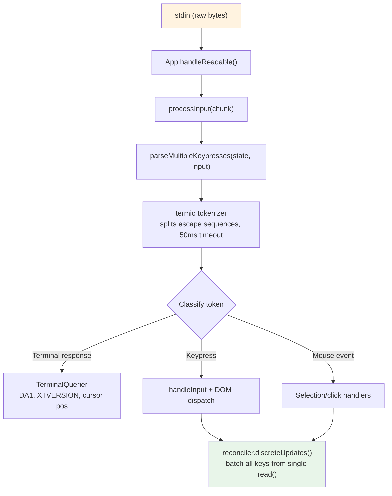
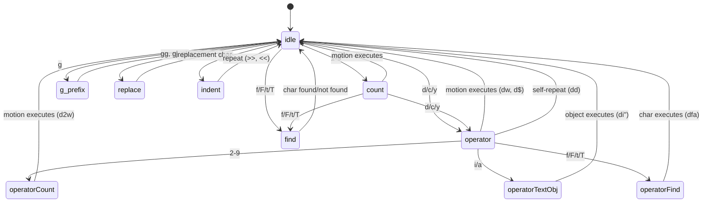

# 第 14 章：输入与交互

## 原始字节，有意义的动作

当你在 Claude Code 中按下 Ctrl+X 然后 Ctrl+K，终端发送两个可能间隔约 200 毫秒的字节序列。第一个是 `0x18`（ASCII CAN）。第二个是 `0x0B`（ASCII VT）。这些字节都不携带超越"控制字符"的内在含义。输入系统必须识别这两个在超时窗口内按序到达的字节构成和弦 `ctrl+x ctrl+k`，映射到动作 `chat:killAgents`，该动作终止所有运行中的子 agent。

在原始字节和被杀死的 agent 之间，六个系统激活：tokenizer 分割 escape 序列，parser 跨五种终端协议分类它们，keybinding resolver 将序列匹配到上下文特定的绑定，chord 状态机管理多键序列，handler 执行动作，React 批处理结果状态更新为单一渲染。

困难不在这些系统中的任何一个。在于终端多样性的组合爆炸。iTerm2 发送 Kitty 键盘协议序列。macOS Terminal 发送遗留 VT220 序列。Ghostty over SSH 发送 xterm modifyOtherKeys。tmux 可能根据其配置吃掉、转换或透传这些。Windows Terminal 有自己的 VT 模式怪癖。输入系统必须从所有中产生正确的 `ParsedKey` 对象，因为用户不应该知道他们的终端使用哪种键盘协议。

本章追踪从原始字节到有意义动作的跨该版图的路径。

设计哲学是带优雅降级的渐进增强。在支持 Kitty 键盘协议的现代终端上，Claude Code 获得完整修饰键检测（Ctrl+Shift+A 与 Ctrl+A 不同）、super 键报告（Cmd 快捷键）和无歧义的键识别。在通过 SSH 的遗留终端上，它回退到最佳可用协议，丢失一些修饰键区分但保持核心功能完好。用户永不会看到关于其终端不受支持的错误消息。他们可能不能用 `ctrl+shift+f` 进行全局搜索，但 `ctrl+r` 用于历史搜索在任何地方都能工作。

---

## 键解析流水线

输入以字节块在 stdin 上到达。流水线分阶段处理它们：



Tokenizer 是基础。终端输入是混合可打印字符、控制码和多字节 escape 序列且无显式帧的字节流。来自 stdin 的单次 `read()` 可能返回 `\x1b[1;5A`（Ctrl+Up 箭头），也可能在一次 read 中返回 `\x1b` 在下次 read 中返回 `[1;5A`，取决于字节从 PTY 到达的速度。Tokenizer 维护缓冲部分 escape 序列并发出完整 token 的状态机。

不完整序列问题是根本性的。当 tokenizer 看到单独的 `\x1b`，它无法知道这是 Escape 键还是 CSI 序列的开始。它缓冲该字节并启动 50ms 计时器。如果没有延续到达，缓冲区被刷新且 `\x1b` 成为 Escape 键击。但在刷新前，tokenizer 检查 `stdin.readableLength`——如果字节在内核缓冲区中等待，计时器重装而非刷新。这处理事件循环被阻塞超过 50ms 且延续字节已缓冲但尚未读取的情况。

对于粘贴操作，超时扩展到 500ms。粘贴的文本可能很大并以多个块到达。

来自单次 `read()` 的所有解析键在单一 `reconciler.discreteUpdates()` 调用中处理。这批量处理 React 状态更新，使粘贴 100 个字符产生一次重渲染，而非 100 次。批量处理至关重要：没有它，粘贴中的每个字符将触发完整的协调周期——状态更新、协调、提交、Yoga 布局、渲染、diff、写入。以每周期 5ms 计，100 字符粘贴将耗时 500ms 处理。有批处理，相同粘贴耗时一个 5ms 周期。

### stdin 管理

`App` 组件通过引用计数管理 raw 模式。当任何组件需要 raw 输入（prompt、对话框、vim 模式）时，调用 `setRawMode(true)`，递增计数器。当不再需要时，调用 `setRawMode(false)`，递减。Raw 模式仅在计数器达到零时禁用。这防止了终端应用中的常见 bug：组件 A 启用 raw 模式，组件 B 启用 raw 模式，组件 A 禁用 raw 模式，突然组件 B 的输入因 raw 模式被全局禁用而中断。

当 raw 模式首次启用时，App：

1. 停止早期输入捕获（在 React 挂载前收集击键的 bootstrap 阶段机制）
2. 将 stdin 置入 raw 模式（无行缓冲、无 echo、无信号处理）
3. 附加 `readable` 监听器用于异步输入处理
4. 启用括号粘贴（以便粘贴的文本可识别）
5. 启用焦点报告（以便应用知道终端窗口何时获得/失去焦点）
6. 启用扩展键报告（Kitty 键盘协议 + xterm modifyOtherKeys）

禁用时，所有这些以相反顺序逆转。仔细排序防止 escape 序列泄漏——在禁用 raw 模式之前禁用扩展键报告确保终端在应用停止解析它们后不会继续发送 Kitty 编码序列。

`onExit` 信号处理器（通过 `signal-exit` 包）确保即使在意外终止时也发生清理。如果进程接收 SIGTERM 或 SIGINT，处理器禁用 raw 模式、恢复终端状态、如果活跃退出替代屏幕、并在进程退出前重新显示光标。没有此清理，崩溃的 Claude Code 会话将使终端处于 raw 模式无光标无 echo——用户需要盲目输入 `reset` 来恢复其终端。

---

## 多协议支持

终端在如何编码键盘输入上不一致。现代终端模拟器如 Kitty 发送带有完整修饰键信息的结构化序列。通过 SSH 的遗留终端发送需要上下文来解释的模糊字节序列。Claude Code 的解析器同时处理五种不同协议，因为用户的终端可能是其中任何一种。

**CSI u（Kitty 键盘协议）** 是现代标准。格式：`ESC [ codepoint [; modifier] u`。示例：`ESC[13;2u` 是 Shift+Enter，`ESC[27u` 是无修饰键的 Escape。码点无歧义地标识键——Escape-the-key 和 Escape-as-sequence-prefix 之间没有歧义。修饰键字将 shift、alt、ctrl 和 super（Cmd）编码为单独位。Claude Code 在启动时通过 `ENABLE_KITTY_KEYBOARD` escape 序列在支持的终端上启用此协议，并在退出时通过 `DISABLE_KITTY_KEYBOARD` 禁用它。协议通过查询/响应握手检测：应用发送 `CSI ? u`，终端响应 `CSI ? flags u`。

**xterm modifyOtherKeys** 是 Kitty 协议未协商时 Ghostty over SSH 等终端的后备。格式：`ESC [ 27 ; modifier ; keycode ~`。注意参数顺序与 CSI u 相反——修饰键在键码之前。这是解析器 bug 的常见来源。协议通过 `CSI > 4 ; 2 m` 启用。

**遗留终端序列** 覆盖其余一切：通过 `ESC O` 和 `ESC [` 序列的功能键、箭头键、数字键盘、Home/End/Insert/Delete，以及 40 年终端演化积累的完整 VT100/VT220/xterm 变体集合。解析器使用两个正则来匹配这些。

遗留序列的挑战是歧义。`ESC [ 1 ; 2 R` 可能是 Shift+F3 或光标位置报告，取决于上下文。解析器通过私有标记检查解决此问题：光标位置报告使用 `CSI ? row ; col R`（带 `?` 私有标记），而修饰功能键使用 `CSI params R`（不带）。此消歧是 Claude Code 请求 DECXCPR（扩展光标位置报告）而非标准 CPR 的原因——扩展形式是无歧义的。

终端识别添加另一层复杂性。启动时，Claude Code 发送 `XTVERSION` 查询（`CSI > 0 q`）来发现终端名称和版本。响应（`DCS > | name ST`）在 SSH 连接中存活——不像 `TERM_PROGRAM`，它是不会通过 SSH 传播的环境变量。

**SGR 鼠标事件** 使用格式 `ESC [ < button ; col ; row M/m`，其中 `M` 是按下，`m` 是释放。按钮码编码动作：0/1/2 为左/中/右键，64/65 为滚轮上/下，32+ 为拖拽。滚轮事件转换为 `ParsedKey` 对象使它们流经 keybinding 系统；点击和拖拽事件成为路由到选择处理器的 `ParsedMouse` 对象。

**括号粘贴** 将粘贴内容包装在 `ESC [200~` 和 `ESC [201~` 标记之间。中间的一切成为带有 `isPasted: true` 的单一 `ParsedKey`，无论粘贴的文本可能包含什么 escape 序列。这防止粘贴的代码被解释为命令——当用户粘贴包含 `\x03`（raw 字节中为 Ctrl+C）的代码片段时的关键安全特性。

来自解析器的输出类型形成干净的可辨识联合：

```typescript
type ParsedKey = {
  kind: 'key';
  name: string;        // 'return', 'escape', 'a', 'f1' 等
  ctrl: boolean; meta: boolean; shift: boolean;
  option: boolean; super: boolean;
  sequence: string;    // 原始 escape 序列，用于调试
  isPasted: boolean;   // 在括号粘贴内
}

type ParsedMouse = {
  kind: 'mouse';
  button: number;      // SGR 按钮码
  action: 'press' | 'release';
  col: number; row: number;  // 1-索引终端坐标
}

type ParsedResponse = {
  kind: 'response';
  response: TerminalResponse;  // 路由到 TerminalQuerier
}
```

`kind` 鉴别器确保下游代码显式处理每种输入类型。键不会意外被当作鼠标事件处理；终端响应不会意外被解释为键击。`ParsedKey` 类型还携带原始 `sequence` 字符串用于调试——当用户报告"按下 Ctrl+Shift+A 没有反应"时，调试日志可以确切显示终端发送了什么字节序列。

`isPasted` 标志对安全至关重要。当括号粘贴启用时，终端将粘贴内容包装在标记序列中。解析器在结果键事件上设置 `isPasted: true`，keybinding resolver 对粘贴的键跳过 keybinding 匹配。没有它，粘贴包含 `\x03` 或 escape 序列的文本将触发应用命令。

解析器还识别终端响应——终端自身响应查询发送的序列。这些包括设备属性（DA1、DA2）、光标位置报告、Kitty 键盘标志响应、XTVERSION 和 DECRPM。这些路由到 `TerminalQuerier` 而非输入处理器。

**修饰键解码**遵循 XTerm 约定：修饰键字是 `1 + (shift ? 1 : 0) + (alt ? 2 : 0) + (ctrl ? 4 : 0) + (super ? 8 : 0)`。`ParsedKey` 中的 `meta` 字段映射到 Alt/Option（第 2 位）。`super` 字段是独立的（第 8 位，macOS 上的 Cmd）。此区分很重要因为 Cmd 快捷键被 OS 保留，不能被终端应用捕获——除非终端使用 Kitty 协议，它报告其他协议静默吞掉的 super 修饰键。

stdin-gap 检测器在无输入到达 5 秒后触发终端模式重新断言。这处理 tmux 重新附加和笔记本唤醒场景，其中终端的键盘模式可能已被多路复用器或 OS 重置。当重新断言触发时，它重新发送 `ENABLE_KITTY_KEYBOARD`、`ENABLE_MODIFY_OTHER_KEYS`、括号粘贴和焦点报告序列。没有它，从 tmux 会话分离并重新附加将静默降级键盘协议为遗留模式，破坏剩余会话的修饰键检测。

### 终端 I/O 层

解析器之下是结构化的终端 I/O 子系统：

- **csi.ts** — CSI（Control Sequence Introducer）序列：光标移动、擦除、滚动区域、括号粘贴启用/禁用、焦点事件启用/禁用、Kitty 键盘协议启用/禁用
- **dec.ts** — DEC 私有模式序列：替代屏幕缓冲区（1049）、鼠标追踪模式（1000/1002/1003）、光标可见性、括号粘贴（2004）、焦点事件（1004）
- **osc.ts** — 操作系统命令：剪贴板访问（OSC 52）、tab 状态、iTerm2 进度指示器、tmux/screen 多路复用器包装（DCS 透传用于需要穿越多路复用器边界的序列）
- **sgr.ts** — Select Graphic Rendition：ANSI 样式码系统（颜色、粗体、斜体、下划线、反向）
- **tokenize.ts** — 用于 escape 序列边界检测的有状态 tokenizer

多路复用器包装值得注意。当 Claude Code 在 tmux 内运行时，某些 escape 序列（如 Kitty 键盘协议协商）必须透传到外部终端。tmux 使用 DCS 透传（`ESC P ... ST`）转发它不理解的序列。`osc.ts` 中的 `wrapForMultiplexer` 函数检测多路复用器环境并适当地包装序列。

### 事件系统

`ink/events/` 目录实现浏览器兼容的事件系统，带有七种事件类型：`KeyboardEvent`、`ClickEvent`、`FocusEvent`、`InputEvent`、`TerminalFocusEvent` 和基础 `TerminalEvent`。每个携带 `target`、`currentTarget`、`eventPhase`，支持 `stopPropagation()`、`stopImmediatePropagation()` 和 `preventDefault()`。

包装 `ParsedKey` 的 `InputEvent` 存在是为了与遗留 `EventEmitter` 路径向后兼容。新组件使用带捕获/冒泡阶段的 DOM 风格键盘事件分发。两条路径从相同的解析键触发，所以它们始终一致——到达 stdin 的键产生恰好一个 `ParsedKey`，它同时生成 `InputEvent`（用于遗留监听器）和 `KeyboardEvent`（用于 DOM 风格分发）。

---

## Keybinding 系统

Keybinding 系统分离三个通常纠缠在一起的关注点：什么键触发什么动作（bindings）、动作触发时发生什么（handlers）、以及哪些绑定现在活跃（contexts）。

### Bindings：声明式配置

默认绑定在 `defaultBindings.ts` 中定义为 `KeybindingBlock` 对象数组，每个限定在上下文中：

```typescript
export const DEFAULT_BINDINGS: KeybindingBlock[] = [
  {
    context: 'Global',
    bindings: {
      'ctrl+c': 'app:interrupt',
      'ctrl+d': 'app:exit',
      'ctrl+l': 'app:redraw',
      'ctrl+r': 'history:search',
    },
  },
  {
    context: 'Chat',
    bindings: {
      'escape': 'chat:cancel',
      'ctrl+x ctrl+k': 'chat:killAgents',
      'enter': 'chat:submit',
      'up': 'history:previous',
      'ctrl+x ctrl+e': 'chat:externalEditor',
    },
  },
  // ... 14 more contexts
]
```

平台特定绑定在定义时处理。图片粘贴在 macOS/Linux 上是 `ctrl+v` 但在 Windows 上是 `alt+v`（`ctrl+v` 是系统粘贴）。模式循环在支持 VT 模式的终端上是 `shift+tab` 但在没有的 Windows Terminal 上是 `meta+m`。Feature-flagged 绑定（快速搜索、语音模式、终端面板）被条件包含。

用户可以通过 `~/.claude/keybindings.json` 覆盖任何绑定。解析器接受修饰键别名（`ctrl`/`control`、`alt`/`opt`/`option`、`cmd`/`command`/`super`/`win`）、键别名（`esc` → `escape`、`return` → `enter`）、和弦记法（空格分隔步骤如 `ctrl+k ctrl+s`）和 null 动作以取消绑定默认键。

### Contexts：16 个活动范围

每个上下文代表一组特定绑定适用的交互模式：

| Context | 何时活跃 |
|---------|---------|
| Global | 始终 |
| Chat | Prompt 输入聚焦时 |
| Autocomplete | 补全菜单可见时 |
| Confirmation | 权限对话框显示时 |
| Scroll | 带可滚动内容的 Alt-screen |
| Transcript | 只读转录查看器 |
| HistorySearch | 反向历史搜索（ctrl+r）|
| Task | 后台 task 运行中 |
| Help | 帮助 overlay 显示时 |
| MessageSelector | 回退对话框 |
| MessageActions | 消息光标导航 |
| DiffDialog | Diff 查看器 |
| Select | 通用选择列表 |
| Settings | 配置面板 |
| Tabs | Tab 导航 |
| Footer | 页脚指示器 |

当键到达时，resolver 从当前活跃上下文（由 React 组件状态确定）构建上下文列表，去重保持优先级顺序，并搜索匹配的绑定。最后匹配的绑定胜出——这就是用户覆盖优先于默认值的方式。上下文列表在每次击键上重建（它是廉价的：最多 16 个字符串的数组拼接和去重），所以上下文变化立即生效，无需任何订阅或监听器机制。

上下文设计处理了一个棘手的交互模式：嵌套模态。当权限对话框在运行中 task 期间出现时，`Confirmation` 和 `Task` 上下文都可能活跃。`Confirmation` 上下文优先（它在组件树中后注册），所以 `y` 触发"批准"而非任何 task 级绑定。当对话框关闭时，`Confirmation` 上下文停用且 `Task` 绑定恢复。此堆叠行为从上下文列表的优先级排序中自然涌现——无需特殊的模态处理代码。

### 保留的快捷键

不是一切都可以重新绑定。系统强制执行三个保留层级：

**不可重新绑定**（硬编码行为）：`ctrl+c`（中断/退出）、`ctrl+d`（退出）、`ctrl+m`（在所有终端中与 Enter 相同——重新绑定它会破坏 Enter）。

**终端保留**（警告）：`ctrl+z`（SIGTSTP）、`ctrl+\`（SIGQUIT）。这些技术上可以绑定，但终端会在应用看到它们之前拦截它们（在大多数配置中）。

**macOS 保留**（错误）：`cmd+c`、`cmd+v`、`cmd+x`、`cmd+q`、`cmd+w`、`cmd+tab`、`cmd+space`。OS 在它们到达终端之前拦截它们。绑定它们将创建永不会触发的快捷键。

### 解析流

当键到达时，解析路径是：

1. 构建上下文列表：组件的注册活跃上下文加 Global，去重并保持优先级
2. 调用 `resolveKeyWithChordState(input, key, contexts)` 对照合并的绑定表
3. `match`：清除任何 pending chord，调用 handler，`stopImmediatePropagation()` 在事件上
4. `chord_started`：保存 pending 击键，停止传播，启动 chord 超时
5. `chord_cancelled`：清除 pending chord，让事件回退
6. `unbound`：清除 chord——这是显式取消绑定（用户将 action 设为 `null`），传播停止但无 handler 运行
7. `none`：回退到其他处理器

---

## Chord 支持

`ctrl+x ctrl+k` 绑定是一个 chord：两个组合形成单一动作的击键。Resolver 用状态机管理此。

当键到达时：

1. Resolver 将其追加到任何 pending chord 前缀
2. 检查任何绑定的 chord 是否以此前缀开始。如果是，返回 `chord_started` 并保存 pending 击键
3. 如果完整 chord 精确匹配绑定，返回 `match` 并清除 pending 状态
4. 如果 chord 前缀不匹配任何，返回 `chord_cancelled`

`ChordInterceptor` 组件在 chord 等待状态期间拦截所有输入。它有 1000ms 超时——如果第二次击键在 1 秒内未到达，chord 被取消且第一次击键被丢弃。`KeybindingContext` 提供 `pendingChordRef` 用于同步访问 pending 状态，避免 React 状态更新延迟可能导致第二次击键在第一次的状态更新完成前被处理。

Chord 设计避免了影子 readline 编辑键。没有 chords，杀死 agent 的 keybinding 可能是 `ctrl+k`——但那是 readline 的"杀死到行尾"，用户在终端文本输入中期望的。通过使用 `ctrl+x` 作为前缀（匹配 readline 自己的 chord 前缀约定），系统获得不与单键编辑快捷键冲突的绑定命名空间。

实现处理了大多数 chord 系统错过的一个边缘情况：当用户按下 `ctrl+x` 但然后输入一个不是任何 chord 部分的字符会发生什么？没有仔细处理，该字符将被吞掉。Claude Code 的 `ChordInterceptor` 在此情况下返回 `chord_cancelled`，导致 pending 输入被丢弃但允许不匹配的字符回退到正常输入处理。

---

## Vim 模式

### 状态机

Vim 实现是带有穷举类型检查的纯状态机。类型就是文档：

```typescript
export type VimState =
  | { mode: 'INSERT'; insertedText: string }
  | { mode: 'NORMAL'; command: CommandState }

export type CommandState =
  | { type: 'idle' }
  | { type: 'count'; digits: string }
  | { type: 'operator'; op: Operator; count: number }
  | { type: 'operatorCount'; op: Operator; count: number; digits: string }
  | { type: 'operatorFind'; op: Operator; count: number; find: FindType }
  | { type: 'operatorTextObj'; op: Operator; count: number; scope: TextObjScope }
  | { type: 'find'; find: FindType; count: number }
  | { type: 'g'; count: number }
  | { type: 'operatorG'; op: Operator; count: number }
  | { type: 'replace'; count: number }
  | { type: 'indent'; dir: '>' | '<'; count: number }
```

这是一个带有 12 个变体的可辨识联合。TypeScript 的穷举检查确保每个在 `CommandState.type` 上的 `switch` 语句处理所有 12 种情况。向联合添加新状态会导致每个不完整 switch 产生编译错误。状态机不能有死状态或缺失过渡——类型系统禁止它。

注意每个状态如何精确携带下次过渡所需的数据。`operator` 状态知道哪个操作符（`op`）和前面的计数。`operatorCount` 状态添加数字累加器（`digits`）。`operatorTextObj` 状态添加范围（`inner` 或 `around`）。没有状态携带它不需要的数据。这不仅是有品味——它防止了整类 bug，其中处理器从先前命令读取过时数据。如果你在 `find` 状态，你有 `FindType` 和 `count`。你没有操作符，因为没有操作符 pending。类型使不可能状态无法表示。

状态图讲述了故事：



### 过渡作为纯函数

`transition()` 函数根据当前状态类型分发到 10 个 handler 函数之一。每个返回 `TransitionResult`：

```typescript
type TransitionResult = {
  next?: CommandState;    // 新状态（省略 = 保持当前）
  execute?: () => void;   // 副作用（省略 = 尚无动作）
}
```

副作用被返回，不执行。过渡函数是纯的——给定状态和键，返回下一个状态和可选执行动作的闭包。调用者决定何时运行效果。这使状态机平凡可测试：喂状态和键，断言返回状态，忽略闭包。这也意味着过渡函数没有对编辑器状态、光标位置或缓冲区内容的依赖。这些细节由闭包在创建时捕获，而非由状态机在过渡时消费。

`fromIdle` 处理器是入口点，覆盖完整 vim 词汇：计数前缀 `1-9`；操作符 `d`/`c`/`y`；查找 `f`/`F`/`t`/`T`；G 前缀 `g`；替换 `r`；缩进 `>`/`<`；简单动作 `h/j/k/l/w/b/e` 等立即执行；立即命令 `x`/`~`/`J`/`p`/`P`/`D`/`C`/`Y`/`.` 等。

### 动作、操作符和文本对象

**动作**是将键映射到光标位置的纯函数。`resolveMotion(key, cursor, count)` 应用动作 `count` 次，如果光标停止移动则短路。

动作按它们如何与操作符交互分类：**Exclusive**（默认——目的地的字符不包含在范围内）、**Inclusive**（`e`/`E`/`$`——包含）和 **Linewise**（`j`/`k`/`G` 等——当与操作符使用时，范围扩展到覆盖完整行）。

**操作符**应用于范围。`delete` 移除文本并保存到寄存器。`change` 移除文本并进入插入模式。`yank` 复制到寄存器。

**文本对象**找到光标周围的边界。Word 对象（`iw`、`aw`、`iW`、`aW`）将文本分段为字形，分类每个为 word-character、whitespace 或 punctuation，并将选择扩展到词边界。Quote 对象（`i"`、`a"` 等）在当前行找到成对引号。Bracket 对象（`ib`/`i(`、`ab`/`a(` 等）进行深度追踪搜索匹配定界符。这对正确嵌套至关重要——在 `foo((bar))` 内的 `d i (` 删除 `bar`，不是 `(bar)`。

### 持久状态和 Dot-Repeat

Vim 模式维护跨命令存活的 `PersistentState`——使 vim 感觉像 vim 的"记忆"：

```typescript
interface PersistentState {
  lastChange: RecordedChange;   // 用于 dot-repeat
  lastFind: { type: FindType; char: string };  // 用于 ; 和 ,
  register: string;             // Yank 缓冲区
  registerIsLinewise: boolean;  // 粘贴行为标志
}
```

每个变更命令将自身记录为 `RecordedChange`——覆盖 insert、operator+motion、operator+textObj 等的可辨识联合。`.` 命令从持久状态重放 `lastChange`，使用记录的计数、操作符和动作在当前光标位置重现完全相同的编辑。

---

## 虚拟滚动

长会话产生长对话。重度调试会话可能生成 200+ 条消息。没有虚拟化，React 将在内存中维护 200+ 组件子树，每个带有自己的状态、effects 和 memoization 缓存。DOM 树将包含数千节点。Yoga 布局将在每帧上访问所有节点。终端将不可用。

`VirtualMessageList` 组件通过仅渲染视口中可见的消息加上上下小缓冲区来解决此问题。在带有数百条消息的对话中，这是挂载 500 个 React 子树（每个带有 markdown 解析、语法高亮和工具使用块）与挂载 15 个的区别。

组件维护：每消息高度缓存（终端列数改变时失效）、用于转录搜索导航的跳转句柄、带热缓存支持的搜索文本提取、粘性 prompt 追踪和消息动作导航。

`useVirtualScroll` hook 基于 `scrollTop`、`viewportHeight` 和累积消息高度计算要挂载的消息。它与 `ScrollBox` 上的滚动夹紧边界维护以防止爆裂 `scrollTo` 调用跑在 React 异步重渲染之前的空白屏幕。

`ScrollBox` 组件本身通过 `useImperativeHandle` 提供命令式 API：`scrollTo`、`scrollBy`（累积到 `pendingScrollDelta`，由渲染器以受限速率排空）、`scrollToElement`、`scrollToBottom`（重新启用粘性滚动模式）和 `setClampBounds`。所有滚动变更直接到 DOM 节点属性并通过 microtask 调度渲染，绕过 React 的 reconciler。`markScrollActivity()` 调用通知后台间隔（旋转器、计时器）跳过其下一个 tick。

---

## Apply This：构建上下文感知的 Keybinding 系统

Claude Code 的 keybinding 架构为任何带模态输入的应用提供了模板。关键洞察：

**将绑定与处理器分离。** 绑定是数据（哪个键映射到哪个动作名称）。处理器是代码（动作触发时发生什么）。将两者分开意味着绑定可以序列化为 JSON 供用户自定义，而处理器保留在拥有相关状态的组件中。

**Context 作为一等概念。** 不是一组平面的键映射，定义基于应用状态激活和停用的上下文。当对话框打开时，`Confirmation` 上下文激活且其绑定优先于 `Chat` 绑定。

**Chord 状态作为显式机器。** 多键序列不是单键绑定的特殊情况——它们是需要带有超时和取消语义的状态机的不同种类绑定。

**早期保留，清晰警告。** 在定义时识别不能被重新绑定的键，而非在解析时。

**为终端多样性设计。** 在绑定级别定义平台特定的替代方案，而非处理器级别。

**提供逃生口。** null-action 取消绑定机制通过允许用户完全禁用绑定来处理与终端多路复用器的冲突。

Vim 模式实现添加了另一课：**让类型系统强制你的状态机**。12 变体 `CommandState` 联合使在 switch 语句中忘记状态不可能。`TransitionResult` 类型将状态变更与副作用分离，使机器可作为纯函数测试。

更深层教训：在每一层——tokenizer、parser、keybinding resolver、vim 状态机——架构尽可能早地将非结构化输入转换为类型化的、穷举处理的结构。原始字节在解析器边界成为 `ParsedKey`。`ParsedKey` 在 keybinding 边界成为动作名称。动作名称在组件边界成为类型化处理器。到击键到达应用逻辑时，歧义已消失。

---

## 总结：两个系统，一种设计哲学

第 13 和 14 章覆盖了终端接口的两半：输出和输入。尽管关注点不同，两个系统遵循相同的架构原则。

**Interning 和间接寻址。** 渲染系统将字符、样式和超链接 interning 到池中，在整个热路径中用整数比较取代字符串比较。输入系统在解析器边界将 escape 序列 interning 到结构化的 `ParsedKey` 对象中，在整个处理器路径中用类型化字段访问取代字节级模式匹配。

**分层消除工作。** 渲染系统堆叠五种优化（脏标志、blit、损伤矩形、单元格级 diff、补丁优化），每种消除一类不必要的计算。输入系统堆叠三种（tokenizer、协议解析器、keybinding resolver），每种消除一类歧义。

**纯函数和类型化状态机。** Vim 模式是带有类型化过渡的纯状态机。Keybinding resolver 是从（键、上下文、chord 状态）到解析结果的纯函数。渲染流水线是从（DOM 树、前一屏幕）到（新屏幕、补丁）的纯函数。副作用发生在边界——写入 stdout、分派到 React——不在核心逻辑中。

**跨环境优雅降级。** 渲染系统适应终端大小、alt-screen 支持和同步更新协议可用性。输入系统适应 Kitty 键盘协议、xterm modifyOtherKeys、遗留 VT 序列和多路复用器透传需求。两个系统都不需要特定终端来运作；两者在更有能力的终端上变得更好。

下一章从 UI 层移动到协议层：Claude Code 如何实现 MCP——让任何外部服务成为一等工具的统一工具协议。
