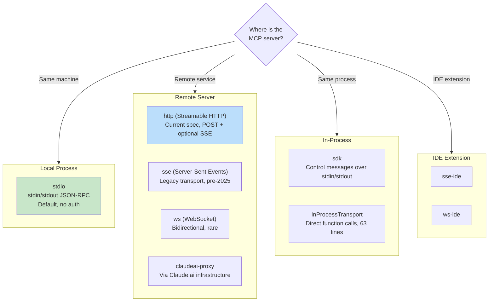
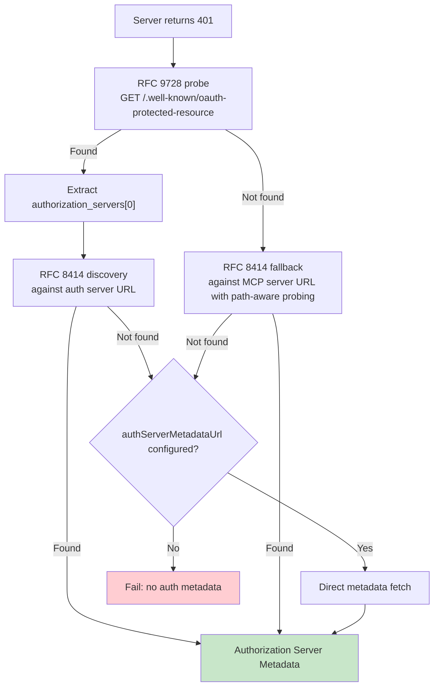

# 第 15 章：MCP — 通用工具协议

## 为什么 MCP 超越 Claude Code 重要

本书中其他所有章节都是关于 Claude Code 的内部机制。本章不同。Model Context Protocol 是任何 agent 都可以实现的开放规范，Claude Code 的 MCP 子系统是存在的最完整的生产客户端之一。如果你正在构建需要调用外部工具的 agent——任何 agent、任何语言、任何模型——本章中的模式直接可转移。

核心命题是直接的：MCP 定义了客户端（agent）和服务器（工具提供者）之间用于工具发现和调用的 JSON-RPC 2.0 协议。客户端发送 `tools/list` 来发现服务器提供什么，然后 `tools/call` 来执行。服务器以名称、描述和输入的 JSON Schema 描述每个工具。这就是整个契约。其他一切——传输选择、认证、配置加载、工具名称规范化——是使干净规范在与现实世界接触后存活的实现工作。

Claude Code 的 MCP 实现横跨四个核心文件：`types.ts`、`client.ts`、`auth.ts` 和 `InProcessTransport.ts`。它们共同支持八种传输类型、七个配置范围、跨两个 RFC 的 OAuth 发现，以及使 MCP 工具与内置工具无法区分的工具包装层——与第 6 章覆盖的相同的 `Tool` 接口。本章遍历每一层。

---

## 八种传输类型

任何 MCP 集成中的第一个设计决策是客户端如何与服务器通信。Claude Code 支持八种传输配置：

三个设计选择值得注意。第一，`stdio` 是默认——当 `type` 被省略时，系统假设本地子进程。这与最早的 MCP 配置向后兼容。第二，fetch 包装器是层叠的：超时包装在 step-up 检测之外，在基础 fetch 之外。每个包装器处理一个关注点。第三，`ws-ide` 分支有 Bun/Node 运行时分离——Bun 的 `WebSocket` 原生接受代理和 TLS 选项，而 Node 需要 `ws` 包。

**何时使用哪个。** 对于本地工具（文件系统、数据库、自定义脚本），`stdio`——无网络、无认证，只是管道。对于远程服务，`http`（Streamable HTTP）是当前规范推荐。`sse` 是遗留但广泛部署。`sdk`、IDE 和 `claudeai-proxy` 类型是其各自生态系统的内部传输。

---

## 配置加载和范围

MCP 服务器配置从七个范围加载，合并并去重：

| 范围 | 来源 | 信任 |
|------|------|------|
| `local` | 工作目录中的 `.mcp.json` | 需要用户批准 |
| `user` | `~/.claude.json` mcpServers 字段 | 用户管理 |
| `project` | 项目级配置 | 共享项目设置 |
| `enterprise` | 管理的企业配置 | 组织预批准 |
| `managed` | 插件提供的服务器 | 自动发现 |
| `claudeai` | Claude.ai web 接口 | 通过 web 预授权 |
| `dynamic` | 运行时注入（SDK） | 编程添加 |

**去重是基于内容的，不是基于名称的。** 两个具有不同名称但相同命令或 URL 的服务器被识别为同一服务器。`getMcpServerSignature()` 函数计算规范键：本地服务器为 `stdio:["command","arg1"]`，远程服务器为 `url:https://example.com/mcp`。

---

## 工具包装：从 MCP 到 Claude Code

当连接成功时，客户端调用 `tools/list`。每个工具定义被转换为 Claude Code 的内部 `Tool` 接口——与内置工具使用的相同接口。包装后，模型无法区分内置工具和 MCP 工具。

包装过程有四个阶段：**名称规范化**（替换无效字符为下划线，全限定名遵循 `mcp__{serverName}__{toolName}`）、**描述截断**（上限 2,048 字符——基于 OpenAPI 的服务器曾被观察到向 `tool.description` 转储 15-60KB，每个工具每次大约 15,000 token）、**Schema 透传**（工具的 `inputSchema` 直接传递给 API）、**注解映射**（`readOnlyHint` 标记工具为并发安全；`destructiveHint` 触发额外权限审查）。

---

## MCP 服务器的 OAuth

远程 MCP 服务器通常需要认证。Claude Code 实现了完整的 OAuth 2.0 + PKCE 流，带有基于 RFC 的发现、跨应用访问和错误正文规范化。

### 发现链

### 跨应用访问（XAA）

当 MCP 服务器配置有 `oauth.xaa: true` 时，系统通过身份提供者进行联邦 token 交换。

### 错误正文规范化

`normalizeOAuthErrorBody()` 函数处理违反规范的 OAuth 服务器。Slack 对错误响应返回 HTTP 200，错误埋在 JSON 正文中。函数窥视 2xx POST 响应正文，将匹配 OAuth 错误模式的响应重写为 HTTP 400。

---

## 进程内传输

不是每个 MCP 服务器都需要是单独的进程。`InProcessTransport` 类使在同一进程中运行 MCP 服务器和客户端成为可能。整个文件 63 行。两个设计决策值得关注：`send()` 通过 `queueMicrotask()` 交付以防止同步请求/响应周期中的栈深度问题；`close()` 级联到 peer，防止半开状态。

---

## 连接管理

每个 MCP 服务器连接存在于五种状态之一：`connected`、`failed`、`needs-auth`（带有 15 分钟 TTL 缓存）、`pending` 或 `disabled`。会话到期检测：MCP 的 Streamable HTTP 传输使用会话 ID。当服务器重启时，请求返回 HTTP 404 并带有 JSON-RPC 错误码 -32001。本地服务器以 3 个一批连接，远程服务器以 20 个一批。

---

## Claude.ai 代理传输

`claudeai-proxy` 传输说明了一个常见的 agent 集成模式：通过中介连接。Claude.ai 订阅者通过 web 接口配置 MCP "连接器"，CLI 通过 Claude.ai 的基础设施路由。

---

## 超时架构

MCP 超时是分层的，每个防范不同的故障模式：

| 层 | 持续时间 | 防范 |
|-----|---------|------|
| 连接 | 30s | 不可达或慢启动的服务器 |
| 每请求 | 60s（每个请求刷新） | 过时超时信号 bug |
| 工具调用 | ~27.8 小时 | 合法长时间操作 |
| Auth | 每个 OAuth 请求 30s | 不可达的 OAuth 服务器 |

---

## Apply This：将 MCP 集成到你自己的 Agent

**从 stdio 开始，后续添加复杂性。** `StdioClientTransport` 处理一切：生成、管道、杀死。一行配置，一个传输类，你就有 MCP 工具了。

**规范化名称和截断描述。** 名称必须匹配 `^[a-zA-Z0-9_-]{1,64}$`。以前缀 `mcp__{serverName}__` 开头以避免冲突。将描述上限设为 2,048 字符。

**惰性处理认证。** 在服务器返回 401 之前不要尝试 OAuth。大多数 stdio 服务器不需要认证。

**对内置服务器使用进程内传输。** `createLinkedTransportPair()` 为你控制的服务器消除子进程开销。

**尊重工具注解并清理输出。** `readOnlyHint` 启用并发执行。清理响应中的恶意 Unicode。

MCP 协议是故意最小化的——两个 JSON-RPC 方法。这些方法和生产部署之间的一切都是工程：八种传输、七个配置范围、两个 OAuth RFC 和超时分层。Claude Code 的实现展示了该工程在规模上的样子。

下一章检查当 agent 延伸到 localhost 之外时发生什么：让 Claude Code 在云容器中运行、从 web 浏览器接受指令、并通过凭证注入代理隧道 API 流量的远程执行协议。
