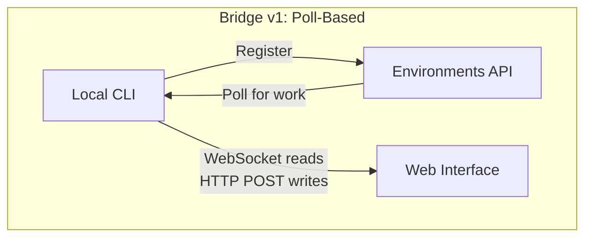
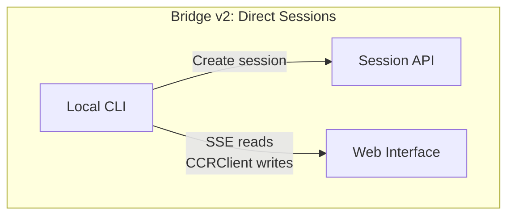
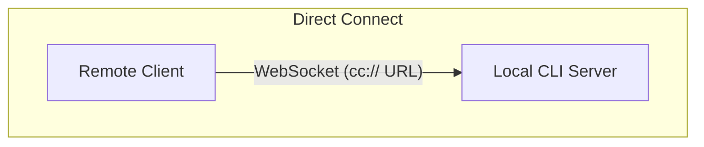
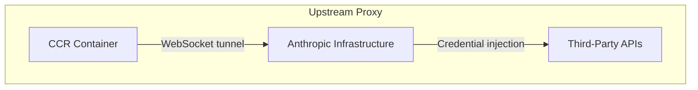

# 第 16 章：远程控制与云端执行

## Agent 的触角伸向 Localhost 之外

目前为止每一章都假设 Claude Code 运行在代码所在的同一台机器上。终端是本地的。文件系统是本地的。模型响应流回拥有键盘和工作目录的进程。

当你想要从浏览器控制 Claude Code、在云容器内运行它、或将其作为 LAN 上的服务暴露时，该假设就打破了。Agent 需要一种方式从 web 浏览器、移动应用或自动化流水线接收指令——将权限提示转发给不在终端前的人，并通过可能以 agent 名义注入凭证或终止 TLS 的基础设施隧道传输其 API 流量。

Claude Code 用四个系统解决此问题，每个处理不同拓扑：

<div class="diagram-grid">









</div>

这些系统共享通用设计哲学：读写是非对称的、重连是自动的、失败优雅降级。

---

## Bridge v1：轮询、分发、生成

v1 桥接是基于环境的远程控制系统。当开发者运行 `claude remote-control` 时，CLI 注册到 Environments API，轮询工作，并为每个会话生成子进程。

注册前运行一系列预检：运行时 feature gate、OAuth token 验证、组织策略检查、死 token 检测（相同过期 token 三次连续失败后的跨进程退避）以及主动 token 刷新，消除了大约 9% 的会在首次尝试时失败的注册。

注册后，桥接进入长轮询循环。工作项作为会话到达（带有包含会话 token、API 基础 URL、MCP 配置和环境变量的 `secret` 字段）或健康检查。桥接将"无工作"日志消息节流到每 100 次空轮询。

每个会话生成通过 stdin/stdout 上的 NDJSON 通信的子 Claude Code 进程。权限请求通过桥接传输流到 web 接口，用户在那里批准或拒绝。往返必须在约 10-14 秒内完成。

---

## Bridge v2：直接会话和 SSE

v2 桥接消除了整个 Environments API 层——无注册、无轮询、无确认、无心跳、无注销。动机：v1 要求服务器在分发工作前知道机器能力。V2 将生命周期折叠为三步：

1. **创建会话**：`POST /v1/code/sessions` 带 OAuth 凭证。
2. **连接桥接**：`POST /v1/code/sessions/{id}/bridge`。返回 `worker_jwt`、`api_base_url` 和 `worker_epoch`。每个 `/bridge` 调用递增 epoch——它 IS 注册。
3. **打开传输**：SSE 用于读取，`CCRClient` 用于写入。

传输抽象（`ReplBridgeTransport`）在通用接口背后统一 v1 和 v2，因此消息处理不需要知道它在跟哪一代说话。

当 SSE 连接因 401 断开时，传输用来自新 `/bridge` 调用的新鲜凭证重建，同时保留序列号游标——无消息丢失。写入路径使用每实例 `getAuthToken` 闭包而非进程范围环境变量，防止 JWT 跨并发会话泄漏。

### FlushGate

一个微妙的排序问题：桥接需要在接受来自 web 接口的实时写入的同时发送对话历史。如果在历史刷新期间到达实时写入，消息可能乱序交付。`FlushGate` 在刷新 POST 期间排队实时写入，并在完成时按序排空。

### Token 刷新和 Epoch 管理

v2 桥接在到期前主动刷新 worker JWT。新 epoch 告诉服务器这是带有新凭证的同一个 worker。Epoch 不匹配（409 响应）被激进处理：两个连接都关闭，异常展开调用者，防止脑裂场景。

---

## 消息路由和 Echo 去重

两个桥接代共享 `handleIngressMessage()` 作为中心路由器：

1. 解析 JSON，规范化控制消息键。
2. 路由 `control_response` 到权限处理器，`control_request` 到请求处理器。
3. 检查 UUID 对照 `recentPostedUUIDs`（echo 去重）和 `recentInboundUUIDs`（重交付去重）。
4. 转发验证过的用户消息。

### BoundedUUIDSet：O(1) 查找，O(capacity) 内存

桥接有 echo 问题——消息可能在读流上 echo 回来或在传输切换期间被交付两次。`BoundedUUIDSet` 是由循环缓冲区支持的 FIFO 有界集合：

```typescript
class BoundedUUIDSet {
  private buffer: string[]
  private set: Set<string>
  private head = 0

  add(uuid: string): void {
    if (this.set.size >= this.capacity) {
      this.set.delete(this.buffer[this.head])
    }
    this.buffer[this.head] = uuid
    this.set.add(uuid)
    this.head = (this.head + 1) % this.capacity
  }

  has(uuid: string): boolean { return this.set.has(uuid) }
}
```

两个实例并行运行，每个容量 2000。通过 Set 的 O(1) 查找，通过循环缓冲区驱逐的 O(capacity) 内存，无计时器或 TTL。未知的控制请求子类型获得错误响应，而非沉默——防止服务器等待永远不会到来的响应。

---

## 非对称设计：持久读取，HTTP POST 写入

CCR 协议使用非对称传输：读取通过持久连接（WebSocket 或 SSE），写入通过 HTTP POST。这反映了通信模式中的根本不对称性。

读取是高频、低延迟、服务器发起的——token 流期间每秒数百条小消息。持久连接是唯一合理的选择。写入是低频、客户端发起的、需要确认——每分钟消息，非每秒。HTTP POST 提供可靠交付、通过 UUID 的幂等性和与负载均衡器的自然集成。

试图在单一 WebSocket 上统一它们创建耦合：如果 WebSocket 在写入期间断开，你需要重试逻辑且必须区分"未发送"和"已发送但确认丢失"。分离通道让每个可以独立优化。

---

## 远程会话管理

`SessionsWebSocket` 管理 CCR WebSocket 连接的客户端侧。其重连策略区分失败类型：

| 失败 | 策略 |
|------|------|
| 4003 (unauthorized) | 立即停止，不重试 |
| 4001 (session not found) | 最多 3 次重试，线性退避（压缩期间瞬态） |
| Other transient | 指数退避，最多 5 次尝试 |

`isSessionsMessage()` 类型守卫接受任何带有字符串 `type` 字段的对象——故意宽松。硬编码白名单会在客户端更新前静默丢弃新消息类型。

---

## Direct Connect：本地服务器

Direct Connect 是最简单的拓扑：Claude Code 作为服务器运行，客户端通过 WebSocket 连接。无云中介、无 OAuth token。

会话有五种状态：`starting`、`running`、`detached`、`stopping`、`stopped`。元数据持久化到 `~/.claude/server-sessions.json` 用于跨服务器重启恢复。`cc://` URL 方案为本地连接提供干净寻址。

---

## Upstream Proxy：容器中的凭证注入

上游代理在 CCR 容器内运行，解决特定问题：将组织凭证注入到来自容器（agent 可能在其中执行不受信任命令）的出站 HTTPS 流量。

设置序列精心排序：

1. 从 `/run/ccr/session_token` 读取会话 token。
2. 通过 Bun FFI 设置 `prctl(PR_SET_DUMPABLE, 0)`——阻止同 UID ptrace 进程堆。没有它，prompt 注入的 `gdb -p $PPID` 可能从内存中抓取 token。
3. 下载上游代理 CA 证书并与系统 CA bundle 拼接。
4. 在临时端口上启动本地 CONNECT-to-WebSocket 中继。
5. 取消链接 token 文件——token 现在仅存在于堆上。
6. 为所有子进程导出环境变量。

每步失败开放：错误禁用代理而非杀死会话。正确的权衡——失败的代理意味着某些集成将不工作，但核心功能保持可用。

### Protobuf 手编码

通过隧道的字节包装在 `UpstreamProxyChunk` protobuf 消息中。Schema 是平凡的——`message UpstreamProxyChunk { bytes data = 1; }`——Claude Code 用十行手编码它而非引入 protobuf 运行时：

```typescript
export function encodeChunk(data: Uint8Array): Uint8Array {
  const varint: number[] = []
  let n = data.length
  while (n > 0x7f) { varint.push((n & 0x7f) | 0x80); n >>>= 7 }
  varint.push(n)
  const out = new Uint8Array(1 + varint.length + data.length)
  out[0] = 0x0a  // field 1, wire type 2
  out.set(varint, 1)
  out.set(data, 1 + varint.length)
  return out
}
```

十行取代完整 protobuf 运行时。单字段消息不证明依赖是合理的——位操作的维护负担远低于供应链风险。

---

## Apply This：设计远程 Agent 执行

**分离读写通道。** 当读取是高频流而写入是低频 RPC 时，统一它们创建不必要的耦合。让每个通道独立失败和恢复。

**限定你的去重内存。** BoundedUUIDSet 模式提供固定内存去重。任何至少一次交付系统都需要有界去重缓冲，而非无界 Set。

**使重连策略与失败信号成比例。** 永久失败不应重试。瞬态失败应带退避重试。模糊失败应带低上限重试。

**在对抗性环境中保持秘密仅在堆上。** 从文件读取 token、禁用 ptrace 并取消链接文件消除了文件系统和内存检查攻击向量。

**对辅助系统失败开放。** 上游代理失败开放因为它提供增强功能（凭证注入），而非核心功能（模型推理）。

远程执行系统编码了更深层原则：agent 的核心循环（第 5 章）应对指令从哪来和结果去哪保持无感知。桥接、Direct Connect 和上游代理是传输层。其上的消息处理、工具执行和权限流无论用户是坐在终端前还是 WebSocket 的另一端都是相同的。

下一章检查另一个运维关注点：性能——Claude Code 如何使每一毫秒和每个 token 在启动、渲染、搜索和 API 成本上都很重要。
