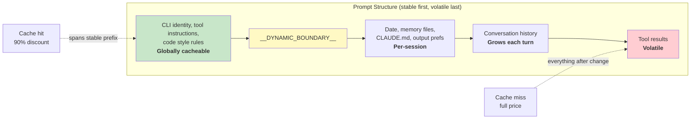

# 第 17 章：性能 — 每毫秒和每个 Token 都很重要

## 高级工程师的工具箱

Agentic 系统中的性能优化不是一个问题。它是五个：

1. **启动延迟** — 从击键到首次有用输出的时间。用户放弃感觉启动慢的工具。
2. **Token 效率** — 上下文窗口中用于有用内容 vs 开销的比例。上下文窗口是最受限的资源。
3. **API 成本** — 每轮次的金额。Prompt caching 可以减少 90%，但仅当系统跨轮次保持缓存稳定性时。
4. **渲染吞吐量** — 流式输出期间的每秒帧数。第 13 章涵盖了渲染架构；本章涵盖保持它快的性能测量和优化。
5. **搜索速度** — 在每次击键时在 270,000 路径代码库中查找文件的时间。

Claude Code 用从明显（memoization）到微妙（用于预过滤模糊搜索的 26 位位图）的技术攻击所有五个。方法论说明：这些不是理论优化。Claude Code 附带 50+ 启动分析检查点，对 100% 内部用户和 0.5% 外部用户采样。以下每个优化都由来自该仪表化的数据驱动，而非直觉。

---

## 在启动时节省毫秒

### 模块级 I/O 并行性

入口点 `main.tsx` 故意违反"模块范围无副作用"：

```typescript
profileCheckpoint('main_tsx_entry');
startMdmRawRead();       // 启动 plutil/reg-query 子进程
startKeychainPrefetch();  // 并行启动两个 macOS keychain 读取
```

两个 macOS keychain 条目否则将花费约 65ms 的顺序同步 spawn。通过在模块级别作为 fire-and-forget promise 启动两者，它们以约 135ms 的模块加载并行执行，期间 CPU 否则是空闲的。

### API 预连接

`apiPreconnect.ts` 在初始化期间向 Anthropic API 发出 `HEAD` 请求，在设置工作中重叠 TCP+TLS 握手（100-200ms）。在交互式模式下，重叠是无界的——连接在用户输入时预热。请求在 `applyExtraCACertsFromConfig()` 和 `configureGlobalAgents()` 之后触发，因此预热的连接使用正确的传输配置。

### 快路径分发和延迟导入

CLI 入口包含专用子命令的早期返回路径——`claude mcp` 永不加载 React REPL，`claude daemon` 永不加载工具系统。重型模块仅在需要时通过动态 `import()` 加载：OpenTelemetry（~400KB + ~700KB gRPC）、事件日志、错误对话框、上游代理。`LazySchema` 将 Zod schema 构建推迟到首次验证，将成本推过启动。

---

## 在上下文窗口中节省 Token

### Slot Reservation：8K 默认，64K 升级

最具影响力的单一优化：

默认输出 slot reservation 为 8,000 token，截断时升级到 64,000。API 为模型的响应预留 `max_output_tokens` 的容量。默认 SDK 值是 32K-64K，但生产数据表明 p99 输出长度是 4,911 token。默认超额预留 8-16 倍，每轮浪费 24,000-59,000 token。Claude Code 上限为 8K，在罕见的截断（<1% 请求）时以 64K 重试。对于 200K 窗口，这是可用上下文的 12-28% 改善——免费。

### 工具结果预算

| 限制 | 值 | 用途 |
|------|-----|------|
| 每工具字符 | 50,000 | 超出时结果持久化到磁盘 |
| 每工具 token | 100,000 | ~400KB 文本上限 |
| 每消息聚合 | 200,000 字符 | 防止 N 个并行工具在一轮中爆掉预算 |

每消息聚合是关键洞察。没有它，"read all files in src/"可以产生 10 次并行读取各返回 40K 字符。

### 上下文窗口大小

默认 200K-token 窗口可通过模型名称上的 `[1m]` 后缀或实验处理扩展到 1M。当使用接近限制时，4 层压缩系统逐步摘要旧内容。Token 计数锚定在 API 的实际 `usage` 字段上，而非客户端估算——解释 prompt caching 信用、thinking token 和服务端转换。

---

## 在 API 调用上节省金钱

### Prompt Cache 架构



Anthropic 的 prompt cache 在精确前缀匹配上运作。如果单个 token 在中间前缀改变，之后的一切都是缓存未命中。Claude Code 构建整个 prompt 使稳定部分在前、易变部分在后。

当 `shouldUseGlobalCacheScope()` 返回 true，动态边界之前的系统 prompt 条目获得 `scope: 'global'`——两个运行相同 Claude Code 版本的用户共享前缀缓存。MCP 工具存在时全局作用域禁用，因为 MCP schema 是每用户的。

### Sticky Latch 字段

五个布尔字段使用"sticky-on"模式——一旦为 true，在会话中保持为 true：

| Latch 字段 | 它防止什么 |
|-------------|-----------|
| `promptCache1hEligible` | 会话中期额度翻转改变缓存 TTL |
| `afkModeHeaderLatched` | Shift+Tab 切换破坏缓存 |
| `fastModeHeaderLatched` | 冷却进入/退出双重破坏缓存 |
| `cacheEditingHeaderLatched` | 会话中期配置切换破坏缓存 |
| `thinkingClearLatched` | 确认缓存未命中后翻转 thinking 模式 |

每个对应一个 header 或参数，如果在会话中期改变，将破坏约 50,000-70,000 token 的缓存 prompt。Latch 牺牲会话中期切换以保护缓存。

### Memoized 会话日期

```typescript
const getSessionStartDate = memoize(getLocalISODate)
```

没有它，日期将在午夜改变，破坏整个缓存前缀。过时的日期是表面问题；缓存破坏重新处理整个对话。

### Section Memoization

System prompt 部分使用两层缓存。大多数内容使用 `systemPromptSection(name, compute)`，缓存直到 `/clear` 或 `/compact`。核选项 `DANGEROUS_uncachedSystemPromptSection(name, compute, reason)` 每轮重新计算——命名约定强制开发者记录为什么破坏缓存是必需的。

---

## 在渲染中节省 CPU

第 13 章深入涵盖渲染架构——紧凑的类型化数组、基于池的 interning、双缓冲和单元格级 diffing。这里我们专注于保持它快的性能测量和自适应行为。

终端渲染器在 60fps 通过 `throttle(deferredRender, FRAME_INTERVAL_MS)` 节流。当终端失焦时，间隔加倍到 30fps。滚动排空帧以四分之一间隔运行以获得最大滚动速度。此自适应节流确保渲染从不消耗超过必要的 CPU。

React Compiler（`react/compiler-runtime`）自动 memoize 整个代码库中的组件渲染。手动 `useMemo` 和 `useCallback` 容易出错；编译器通过构造做到正确。预分配的冻结对象（`Object.freeze()`）消除常见渲染路径值的分配。完整渲染流水线细节见第 13 章。

---

## 在搜索中节省内存和时间

模糊文件搜索在每次击键上运行，搜索 270,000+ 路径。三个优化层将其保持在几毫秒以下。

### 位图预过滤器

每个索引路径获得其包含哪些小写字母的 26 位位图：

```typescript
// 伪代码——展示 26 位位图概念
function buildCharBitmap(filepath: string): number {
  let mask = 0
  for (const ch of filepath.toLowerCase()) {
    const code = ch.charCodeAt(0)
    if (code >= 97 && code <= 122) mask |= 1 << (code - 97)
  }
  return mask  // 每个位代表 a-z 的存在
}
```

搜索时：`if ((charBits[i] & needleBitmap) !== needleBitmap) continue`。任何缺少查询字母的路径立即失败——一次整数比较，无字符串操作。拒绝率：对宽泛查询如"test"约 10%，对带有稀有字母的查询 90%+。成本：每条路径 4 字节，270,000 路径大约 1MB。

### Score-Bound Rejection 和融合 indexOf 扫描

存活的路径在昂贵的边界/camelCase 评分之前面临分数上限检查。如果最佳情况分数不能超过当前 top-K 阈值，路径被跳过。

实际匹配使用 `String.indexOf()` 融合位置发现与 gap/consecutive 加分计算，这在 JSC（Bun）和 V8（Node）中都是 SIMD 加速的。引擎的优化搜索显著快于手动字符循环。

### 带部分可查询性的异步索引

对于大型代码库，`loadFromFileListAsync()` 每约 4ms 工作向事件循环 yield（基于时间，非基于计数——适应机器速度）。它返回两个 promise：`queryable`（首个块上解析，启用即时部分结果）和 `done`（完整索引完成）。用户可以在文件列表可用的 5-10ms 内开始搜索。

Yield 检查使用 `(i & 0xff) === 0xff`——无分支 modulo-256 来摊销 `performance.now()` 的成本。

---

## 记忆相关性副查询

一个优化位于 token 效率和 API 成本的交叉点。如第 11 章所述，记忆系统使用轻量 Sonnet 模型调用——而非主 Opus 模型——来选择包含哪些记忆文件。成本（快模型上 256 最大输出 token）与通过不包含无关记忆文件节省的 token 相比微不足道。一条无关的 2,000-token 记忆在浪费的上下文中比副查询在 API 调用中花费更多。

---

## 推测工具执行

`StreamingToolExecutor` 在工具流式传入时开始执行它们，在完整响应完成之前。只读工具（Glob、Grep、Read）可以并行执行；写入工具需要独占访问。`partitionToolCalls()` 函数将连续安全工具分组为批次：`[Read, Read, Grep, Edit, Read, Read]` 成为三个批次——`[Read, Read, Grep]` 并发、`[Edit]` 串行、`[Read, Read]` 并发。

结果始终以原始工具顺序产出以实现确定性模型推理。兄弟 abort 控制器在 Bash 工具错误时杀死并行子进程，防止资源浪费。

---

## 流式与原始 API

Claude Code 使用原始流式 API 而非 SDK 的 `BetaMessageStream` 助手。该助手对每个 `input_json_delta` 调用 `partialParse()`——工具输入长度上的 O(n²)。Claude Code 累积原始字符串并在块完成时解析一次。

流式 watchdog（`CLAUDE_STREAM_IDLE_TIMEOUT_MS`，默认 90 秒）在无块到达时中止并重试，代理失败时回退到非流式 `messages.create()`。

---

## Apply This：Agentic 系统的性能

**审计你的上下文窗口预算。** 你的 `max_output_tokens` 预留和你的实际 p99 输出长度之间的差距是浪费的上下文。设置紧默认并在截断时升级。

**为缓存稳定性设计。** Prompt 中的每个字段是稳定的或易变的。稳定放在前面，易变放在后面。将稳定前缀的任何会话中期改变视为带有美元成本的 bug。

**并行化启动 I/O。** 模块加载是 CPU 密集的。Keychain 读取和网络握手是 I/O 密集的。在导入之前启动 I/O。

**对搜索使用位图预过滤器。** 在昂贵评分之前以 4 字节每条目拒绝 10-90% 候选者的廉价预过滤器是显著的胜利。

**在重要的地方测量。** Claude Code 有 50+ 启动检查点，100% 内部采样和 0.5% 外部采样。没有测量的性能工作是猜谜。

---

最后观察：大多数这些优化不是算法上复杂的。位图预过滤器、循环缓冲区、memoization、interning——这些是 CS 基础。复杂性在于知道在哪里应用它们。启动分析器告诉你毫秒在哪。API usage 字段告诉你 token 在哪。缓存命中率告诉你钱在哪。先测量，后优化，始终如此。
