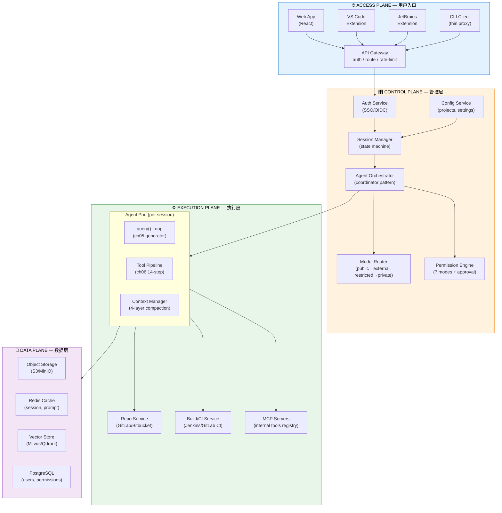

# 云端 Claude Code — 总体架构设计

> 版本：v1.0 | 日期：2026-06-26 | 状态：设计评审中

## 1. 背景与目标

### 1.1 为什么做这个

Claude Code 是当前最成熟的 AI 编程 Agent，但它的设计假设是"单用户、本地终端、一个模型 provider"。企业环境需要的是"多用户、云端部署、多种模型、对接内部系统"。

我们在 [claude-code-universe](https://llwanghong.github.io/claude-code-universe/) 中深入研究了 Claude Code 的 18 章源码架构。这个项目的目标是：**把学到的架构知识应用到企业场景中，设计一个可以实际落地的方案**。

### 1.2 约束条件

| 维度 | 约束 |
|------|------|
| 基础设施 | 自建 K8s + GitLab/Bitbucket + Jenkins/GitLab CI |
| 模型选型 | 混合方案 — 敏感项目用私有模型（数据不出网），一般项目用外部 API |
| 用户交互 | Web + VSCode/JetBrains 插件 + CLI，全部支持 |
| 安全合规 | 企业 SSO、RBAC、审批流、审计日志 |

### 1.3 设计原则

1. **继承而非重造** — Claude Code 中已验证的模式（generator loop、14-step tool pipeline、async sub-agents）直接继承
2. **云端原生** — 每会话独立容器、CoW workspace、弹性伸缩
3. **纵深防御** — 6 层安全，不信任任何一层
4. **渐进上线** — 3 个 Phase 逐步交付，每个 Phase 可独立验证

---

## 2. 总体架构：五层平面



### 层间数据流

### 层间数据流

```
用户请求 → Access (认证/路由) → Control (调度/决策) → Execution (agent 运行)
                                                              ↓
                                   Data (持久化) ←────────────┘
                                                              ↓
用户 ← Access (流式响应) ← Control (聚合) ← Execution (输出) ─┘
```

**关键设计**：每层只与相邻层通信，不跨层调用。Access 不知道 Agent Pod 的存在，Data 不知道用户是谁。

---

## 3. Access Plane — 用户入口层

### 3.1 三种接入方式

| 形态 | 技术栈 | 适用场景 |
|------|--------|---------|
| **Web App** | React 19 + SSE streaming | 非开发角色、code review、轻度使用 |
| **IDE Extension** | VSCode Extension API + JetBrains Plugin SDK | 日常开发主力 |
| **CLI Client** | Thin proxy → cloud WebSocket | 高级用户、脚本化、CI 集成 |

传输层继承 Claude Code ch16 的设计：**reads 走持久连接（SSE/WebSocket），writes 走 HTTP POST**。

原因：streaming token 是高频低延迟的（每秒 10-50 条消息），需要持久连接。用户输入和工具调用是低频的（每分钟几次），HTTP POST 足够。统一到一个 WebSocket 反而增加耦合。

### 3.2 Web 应用核心布局

```mermaid
block-beta
    columns 1
    block:header["Header: [Project Selector ▼] [Session Tabs] [Settings] [👤 User]"]
    end
    columns 2
    block:sidebar["Sidebar\n\nFile Tree\nsrc/\n├─ auth/\n├─ api/\n└─ ...\n\nAgent Status\n🟢 General\n🟡 Explore\n⚪ Verify\n\nMemory Panel"]
    end
    block:main["Main Content\n\nConversation View\n┌──────────────────────────────┐\n│ 🤖 Streaming markdown...    │\n│ ```diff                     │\n│ - old code                  │\n│ + new code                  │\n│ ```                         │\n└──────────────────────────────┘\n\nPermission Dialog\n┌──────────────────────────────┐\n│ 🔐 Run: git push origin?    │\n│ [Allow] [Deny] [Always]     │\n└──────────────────────────────┘\n\nPrompt Input\n> Fix the auth bug @src/auth/login.ts\n[📎 Attach] [/ Commands] [Send ⏎]"]
    end
```

关键功能：
- **文件树**：浏览仓库结构，点击 @mention 直接引用文件到对话
- **Diff 视图**：工具编辑的变更以 side-by-side diff 显示（monaco-editor）
- **权限对话框**：危险操作弹出确认，继承 ch06 的 7 种权限模式
- **工具状态**：实时显示运行中的工具（spinner + 进度）
- **会话 Tabs**：多个会话并行切换

### 3.3 API Gateway

```
                    ┌──────────────────┐
WebSocket/SSE ─────▶│                  │
HTTP POST     ─────▶│   API Gateway    │
                     │                  │
                     │ - JWT 验证       │
                     │ - OAuth2 Token   │
                     │ - Session 亲和   │
                     │ - 限流 (QPS/user)│
                     │ - 审计日志记录   │
                     │ - 请求路由       │
                     └────────┬─────────┘
                              │
              ┌───────────────┼───────────────┐
              ▼               ▼               ▼
        Control Plane    Execution       Data Plane
```

---

## 4. Control Plane — 管控层

### 4.1 Auth Service（认证服务）

```
┌──────────┐     ┌─────────────────┐     ┌─────────────┐
│  SSO/    │────▶│  Auth Service   │────▶│  Session    │
│  OIDC    │     │                 │     │  Manager    │
│  (Okta/  │     │ ┌─────────────┐ │     └─────────────┘
│   LDAP)  │     │ │ JWT Issue   │ │
└──────────┘     │ │ (access+ref │ │
                 │ │  resh)      │ │
                 │ └─────────────┘ │
                 │ ┌─────────────┐ │
                 │ │ RBAC Resolve│ │
                 │ │ - Admin     │ │
                 │ │ - TeamLead  │ │
                 │ │ - Developer │ │
                 │ │ - Viewer    │ │
                 │ └─────────────┘ │
                 └─────────────────┘
```

JWT claims 包含：
```json
{
  "sub": "user-123",
  "email": "dev@company.com",
  "teams": ["platform", "payments"],
  "role": "developer",
  "projects": ["project-a", "project-b"],
  "permissions": ["code:read", "code:write", "deploy:staging"]
}
```

### 4.2 Session Manager（会话管理）

```
Session 状态机：

     ┌──────────┐
     │   Idle   │ ← 用户打开但未发送消息
     └────┬─────┘
          │ 用户发送消息
          ▼
     ┌──────────┐
     │  Active  │ ← Agent 正在运行
     └────┬─────┘
          │
    ┌─────┴─────┐
    ▼           ▼
┌────────┐ ┌──────────┐
│Paused  │ │Compacting│ ← 上下文压缩中
└───┬────┘ └────┬─────┘
    │           │ 压缩完成
    ▼           ▼
┌────────┐ ┌──────────┐
│Resumed │ │Completed │
└────────┘ └──────────┘
```

**持久化策略**：
- 对话历史 → Object Storage（JSONL 格式，继承 ch08 sidechain 转录）
- 活跃状态 → Redis（TTL 24h，热数据快速访问）
- Memory 索引 → Object Storage（Markdown，继承 ch11）

### 4.3 Agent Orchestrator（Agent 编排器）

```
用户请求进来
     │
     ▼
┌─────────────┐
│ 意图识别     │ ← 小模型判断：单步任务？多步任务？
│ (Haiku/小模  │
│  型快分类)   │
└──────┬──────┘
       │
  ┌────┴────┐
  ▼         ▼
单 Agent   多 Agent
直接执行   Coordinator 模式
           │
     ┌─────┴─────┐
     ▼           ▼
  Worker 1    Worker 2  ...
  (Pod)       (Pod)
     │           │
     └─────┬─────┘
           ▼
      Coordinator 汇总结果

Worker Pool 管理：
- 最大并发：按项目配额限制
- 生命周期：create → active → done → cleanup
- 资源回收：Agent Pod 销毁 + Workspace Volume 清理
- 超时保护：单 Worker 最长执行 10min
```

### 4.4 Model Router（模型路由器）

```
请求 → 检查 project.securityLevel
         │
    ┌────┴────┐
    ▼         ▼
public/internal   restricted
    │               │
    ▼               ▼
┌────────────┐  ┌──────────┐
│ 外部 API   │  │ 私有模型  │
│ Anthropic  │  │ DeepSeek  │
│ (能力最强) │  │ /LLaMA    │
│            │  │ (GPU 推理)│
└─────┬──────┘  └─────┬─────┘
      │               │
      └───────┬───────┘
              ▼
    ┌─────────────────┐
    │ Prompt 增强层    │ ← 所有请求都经过
    │ - 公司编码规范   │
    │ - 安全策略注入   │
    │ - 项目上下文     │
    └─────────────────┘
```

路由规则：
- `public` → 外部 API（开源项目，无敏感数据）
- `internal` → 外部 API + 数据脱敏（公司内部但非机密）
- `restricted` → 私有模型（核心业务代码，数据不出集群）
- Fallback：外部 API 不可用时自动切到私有模型

### 4.5 Permission Engine（权限引擎）

继承 Claude Code ch06 的 7 种权限模式，增加企业维度：

```
权限决策链：
                              拒绝
1. PreToolUse Hook ────────────────────▶ 阻止执行
       │ 通过
       ▼
2. 规则匹配（三层规则）
   ├─ 平台级 (安全团队强制)── alwaysDeny → 阻止执行
   ├─ 团队级 (组织统一配置)
   └─ 项目级 (.claude/rules.yaml)
       │ 通过
       ▼
3. 工具特定检查 (checkPermissions)
       │ 通过
       ▼
4. 模式默认值 (7 modes: default/acceptEdits/plan/
   dontAsk/bypassPermissions/auto/bubble)
       │ 需要用户确认
       ▼
5. 交互式提示 (Web/IDE 对话框)
       │ 需要审批
       ▼
6. 审批流 (Jira/飞书审批 → TL批准 → 执行)
```

**审批流**：对 `DeployTool`、`DBTool(write)`、`K8sTool` 等高风险操作，自动创建审批 ticket。

---

## 5. Execution Plane — 执行层

### 5.1 Agent Runtime 容器设计

```
┌──────────────────────────────────────────┐
│        Agent Pod: agent-{uuid}            │
│                                           │
│  ┌────────────────────────────────────┐  │
│  │  query() Loop (继承 ch05)          │  │
│  │  async function* query(params) {   │  │
│  │    let state = initState(params)   │  │
│  │    while (true) {                  │  │
│  │      // 4-layer context compaction │  │
│  │      // Model streaming            │  │
│  │      // Tool execution             │  │
│  │      // Check terminal states      │  │
│  │    }                               │  │
│  │  }                                 │  │
│  └────────────────────────────────────┘  │
│  ┌────────────────────────────────────┐  │
│  │  Tool Pipeline (继承 ch06)         │  │
│  │  14 steps: Lookup → Validate →     │  │
│  │  Permissions → Execute → Budget    │  │
│  └────────────────────────────────────┘  │
│  ┌────────────────────────────────────┐  │
│  │  Context Manager (继承 ch05)       │  │
│  │  Layer 0: ToolResultBudget         │  │
│  │  Layer 1: SnipCompact              │  │
│  │  Layer 2: Microcompact             │  │
│  │  Layer 3: ContextCollapse          │  │
│  │  Layer 4: AutoCompact (circuit)    │  │
│  └────────────────────────────────────┘  │
│                                           │
│  ┌──────────┐ ┌──────────┐ ┌──────────┐  │
│  │ Repo     │ │ Shell    │ │ MCP      │  │
│  │ Workspace│ │ Sandbox  │ │ Bridge   │  │
│  │(CoW      │ │(gVisor/  │ │(internal │  │
│  │overlay)  │ │Firecrack)│ │tools)    │  │
│  └──────────┘ └──────────┘ └──────────┘  │
└──────────────────────────────────────────┘
```

**关键设计决策**：每会话一个 Pod，不是共享进程。理由：
- 安全隔离：一个会话的 shell 命令不会影响另一个
- 资源独立：CPU/内存限额按 Pod 执行
- 故障隔离：一个 Pod crash 不影响其他用户
- 可观测：每个 Pod 独立日志/metrics

代价是启动延迟（2-5s），通过 Warm Pool 预热解决。

### 5.2 Repository Workspace 管理

```
              ┌──────────────────┐
              │   Repo Cache      │ ← bare repos on SSD
              │   /data/repos/    │
              │   myapp.git       │
              │   platform.git    │
              └────────┬─────────┘
                       │ git clone --shared --reference
          ┌────────────┼────────────────┐
          ▼            ▼                ▼
    ┌──────────┐ ┌──────────┐    ┌──────────┐
    │ Agent 1  │ │ Agent 2  │    │ Agent 3  │
    │ Workspace│ │ Workspace│    │ Workspace│
    │ /ws/uuid/│ │ /ws/uuid/│    │ /ws/uuid/│
    │          │ │          │    │          │
    │ 使用 CoW │ │ 使用 CoW │    │ 使用 CoW │
    │ overlayfs│ │ overlayfs│    │ overlayfs│
    └──────────┘ └──────────┘    └──────────┘
```

### 5.3 工具系统

继承 Claude Code ch06 的 Tool 接口，扩展云端工具：

```typescript
// 继承 ch06 的 Tool 接口
interface CloudTool<I, O, P> extends Tool<I, O, P> {
  // 云端扩展
  requiredPermission?: 'read' | 'write' | 'admin'
  requiresApproval?: boolean            // 是否需要审批
  approvalTicketType?: 'jira' | 'feishu' // 审批系统
  sandboxRequired?: boolean             // 是否必须沙箱内执行
  maxExecutionTime?: number             // 超时（ms）
  allowedEnvironments?: string[]        // 允许的目标环境
}

// 示例：DeployTool
const DeployTool: CloudTool = buildTool({
  name: 'Deploy',
  description: 'Trigger deployment to target environment',
  inputSchema: z.object({
    environment: z.enum(['staging', 'production']),
    version: z.string(),
  }),
  requiredPermission: 'admin',
  requiresApproval: true,            // ← 需要审批
  approvalTicketType: 'jira',
  sandboxRequired: true,
  maxExecutionTime: 600_000,         // 10min
  async call(input) {
    // 调用 Jenkins/GitLab CI API
  }
})
```

### 5.4 Shell Sandbox

```yaml
# Agent Pod 安全上下文
securityContext:
  runAsNonRoot: true
  readOnlyRootFilesystem: true     # 根文件系统只读
  allowPrivilegeEscalation: false

# 网络策略
networkPolicy:
  egress:
    - to: [internal-registry.com]  # 仅允许内网
    - to: [api.anthropic.com]      # 外部 API（仅 public/internal）
  ingress: []                      # 不允许入站

# 资源限制
resources:
  limits:
    cpu: "2"
    memory: "4Gi"
    ephemeral-storage: "10Gi"
  requests:
    cpu: "500m"
    memory: "1Gi"

# 超时
commandTimeout: 300  # 单个命令最长 5min
sessionTimeout: 3600 # 会话最长 1h
```

---

## 6. Data Plane — 数据层

### 6.1 存储选型

| 数据类型 | 存储 | 理由 |
|---------|------|------|
| 对话历史 | MinIO/S3 (JSONL) | ch08 sidechain 模式，追加写、不可变 |
| Memory 文件 | MinIO/S3 (Markdown) | ch11 模式，透明、人类可读 |
| 会话状态 | Redis | 热数据，TTL 24h |
| 代码索引 | Milvus/Qdrant | 向量搜索，语义匹配 |
| 用户/权限 | PostgreSQL | 结构化查询、ACID |
| Audit Log | ClickHouse | 时序数据、高写入吞吐 |
| Prompt Cache | Redis | KV 缓存，低延迟 |

### 6.2 代码智能 RAG

```
Git Push → Webhook → 代码索引器
                       │
                       ├─ tree-sitter AST 解析
                       ├─ 符号提取（函数/类/接口）
                       ├─ 依赖图构建
                       └─ Embedding 生成（BGE/CodeBERT）
                            │
                            ▼
                       Vector Store
                            │
Agent 查询时：              │
  1. 关键词搜索（ch17 位图预过滤器，4 字节/文件）
  2. 语义搜索（Vector Store，找到"认证相关代码"）
  3. AST 上下文（依赖图，理解调用链）
  4. 结果融合 → 注入 agent context
```

---

## 7. 集成层

### 7.1 代码仓库 — Git Service 抽象层

```typescript
interface GitService {
  clone(url: string, ref?: string): Promise<Workspace>
  fetch(ws: Workspace): Promise<void>
  checkout(ws: Workspace, ref: string): Promise<void>
  diff(ws: Workspace): Promise<DiffResult>
  createBranch(ws: Workspace, name: string): Promise<void>
  createPR(ws: Workspace, title: string, body: string): Promise<PR>
  search(query: string): Promise<SearchResult[]>
}

class GitLabService implements GitService { /* ... */ }
class BitbucketService implements GitService { /* ... */ }
```

### 7.2 CI/CD — Build Service 抽象层

```typescript
interface BuildService {
  triggerBuild(project: string, branch: string): Promise<Build>
  getBuildLog(buildId: string): AsyncGenerator<string>
  getBuildStatus(buildId: string): Promise<BuildStatus>
  triggerDeploy(env: string, version: string): Promise<Deployment>
  getDeployStatus(deployId: string): Promise<DeployStatus>
}
```

### 7.3 MCP 内部工具注册中心

```
┌─────────────────────────────────────────┐
│        MCP Server Registry               │
│                                          │
│  已注册的内部 MCP 服务：                  │
│  ┌──────────────────────────────────┐   │
│  │ mysql-mcp      → 数据库查询(只读) │   │
│  │ redis-mcp      → 缓存操作        │   │
│  │ k8s-mcp        → K8s 操作(审批)  │   │
│  │ jira-mcp       → Ticket 管理     │   │
│  │ confluence-mcp → 文档搜索        │   │
│  │ sentry-mcp     → 错误追踪        │   │
│  │ grafana-mcp    → 监控查询        │   │
│  │ custom-*       → 团队自定义      │   │
│  └──────────────────────────────────┘   │
│                                          │
│  安全模型（继承 ch15）：                  │
│  - stdio/http/sse transport             │
│  - OAuth/PKC E 认证                     │
│  - 按团队/项目的工具可见性               │
│  - 工具级限流                            │
└─────────────────────────────────────────┘
```

---

## 8. 安全架构

### 8.1 纵深防御 6 层

```
Layer 1: Network
  ├─ K8s NetworkPolicy — Pod 间最小权限通信
  ├─ Ingress — 仅 API Gateway 对外暴露
  └─ Egress — 白名单：内网服务 + 外部 API 域名

Layer 2: Authentication
  ├─ SSO/OIDC + MFA
  ├─ Service Account（服务间通信）
  └─ API Key（CI/CD 集成）

Layer 3: Authorization
  ├─ RBAC：Admin / TeamLead / Developer / Viewer
  ├─ Project-level ACL
  └─ Tool-level permission

Layer 4: Isolation
  ├─ Agent Pod 独立容器
  ├─ gVisor/Firecracker 沙箱
  ├─ CoW workspace overlay
  └─ 临时分支（不污染主分支）

Layer 5: Data
  ├─ Vault/SealedSecrets — 密钥管理
  ├─ Encryption at rest — 所有存储加密
  └─ PII 脱敏 — 审计日志中脱敏

Layer 6: Audit
  ├─ 所有 API 调用 → ClickHouse
  ├─ 所有工具执行 → Object Storage
  └─ 所有模型调用 → 成本追踪
```

### 8.2 数据流向与安全边界

```
                      ┌──────────────┐
                      │  外部 LLM API │  ← 仅 public/internal 项目
                      │  (Anthropic)  │    数据经脱敏后发送
                      └──────┬───────┘
                             │
┌──────────┐    ┌─────────────▼──────────────┐
│ 用户      │    │        API Gateway         │
│ (Browser/ ├───▶│    (auth + audit + route)  │
│  IDE/CLI) │    └─────────────┬──────────────┘
└──────────┘                   │
                    ┌──────────▼──────────┐
                    │   Agent Runtime     │
                    │   ┌──────────────┐  │
                    │   │ 私有模型 (GPU)│  │ ← restricted 项目
                    │   │ 数据不出集群  │  │
                    │   └──────────────┘  │
                    │   ┌──────────────┐  │
                    │   │ 代码仓库      │  │ ← 内网
                    │   │ CI/CD 系统    │  │
                    │   └──────────────┘  │
                    └─────────────────────┘
```

---

## 9. 部署拓扑

### 9.1 K8s 集群布局

```
┌─────────────────────────────────────────────────────┐
│                  K8s Cluster                         │
│                                                      │
│  ┌──────────────────┐  ┌──────────────────┐         │
│  │ Control Plane    │  │ GPU Node Pool    │         │
│  │ (Deployment x3)  │  │                  │         │
│  │                  │  │ - vLLM / TGI     │         │
│  │ - API Gateway    │  │ - DeepSeek       │         │
│  │ - Auth Service   │  │ - LLaMA          │         │
│  │ - Session Mgr    │  └──────────────────┘         │
│  │ - Orchestrator   │                                │
│  │ - Model Router   │  ┌──────────────────┐         │
│  │ - Config Svc     │  │ Data Services    │         │
│  └──────────────────┘  │                  │         │
│                         │ - PostgreSQL     │         │
│  ┌──────────────────┐  │ - Redis Cluster  │         │
│  │ Agent Node Pool  │  │ - MinIO / S3     │         │
│  │ (弹性伸缩)        │  │ - Milvus/Qdrant  │         │
│  │                  │  └──────────────────┘         │
│  │ - Agent Pod x N  │                                │
│  │ - gVisor 沙箱    │  ┌──────────────────┐         │
│  │ - Workspace Vol  │  │ Repo Cache Pool  │         │
│  └──────────────────┘  │ (bare repos SSD) │         │
│                         └──────────────────┘         │
└─────────────────────────────────────────────────────┘
```

### 9.2 Warm Pool 弹性伸缩

```
请求流程：

  User Request
       │
       ▼
  ┌─────────┐   无空闲 Pod    ┌──────────┐
  │ 查找空闲 │──────────────▶│ 创建新 Pod │
  │ Agent   │                │ (~2-5s)   │
  └────┬────┘                └────┬─────┘
       │ (找到了)                  │
       ▼                          ▼
  ┌─────────┐              ┌──────────┐
  │ 复用 Pod │              │ Clone    │
  │ (热启动  │              │ Repo     │
  │  <1s)   │              │ (~5-30s) │
  └─────────┘              └────┬─────┘
                                ▼
                         ┌──────────┐
                         │ Agent    │
                         │ Running  │
                         └──────────┘

伸缩策略：
  - 最小 warm pool：5 pods（热启动 <1s）
  - 最大 Pod 数：按团队配额（默认 20/team）
  - 空闲超时：10min → 销毁
  - GPU pods：独立 node pool + 独立伸缩策略
```

---

## 10. 与 Claude Code 源码的映射

这个架构的每个关键模块都能回溯到源码研究中的对应章节：

| 云端模块 | 对应章节 | 继承的设计模式 |
|---------|---------|---------------|
| Agent Loop | ch05 | `async function* query()` + 10 终端状态 + 7 继续状态 |
| Tool Pipeline | ch06 | 14 步执行流水线 + 7 种权限模式 + 结果预算 |
| Concurrent Execution | ch07 | `partitionToolCalls()` 贪心分区 + 推测执行 |
| Sub-agents | ch08 | `runAgent()` 15 步生命周期 + 6 种内置类型 |
| Fork & Cache | ch09 | 逐字节相同前缀 + placeholder 结果 + 递归防护 |
| Coordination | ch10 | Task 状态机 + Coordinator 模式 + Swarm |
| Memory | ch11 | 4 类型分类法 + 文件基存储 + LLM 副查询召回 |
| Extensibility | ch12 | Skills 2 阶段加载 + Hooks 快照安全模型 |
| MCP | ch15 | 8 种 Transport + OAuth 发现 + 工具包装 |
| Remote Control | ch16 | 非对称读写 + BoundedUUIDSet + 自动恢复 |
| Performance | ch17 | 26 位位图预过滤器 + Slot Reservation + Sticky Latch |

---

## 11. 实施路线图

### Phase 1：核心可用（2-3 个月）

```
目标：一个用户可以登录 Web，选一个 Git 仓库，跟 Agent 对话

需要实现：
├── API Gateway + Auth (SSO/OIDC + JWT)
├── Agent Runtime — 单 session 单 Pod
│   ├── query() loop（继承 ch05）
│   ├── 基础工具：Read/Write/Edit/Grep/Bash
│   └── 沙箱：Docker 容器隔离
├── Git Service — clone + workspace
├── Session Manager — 基础状态持久化（Redis）
├── Web App — 基础对话界面
└── 外部 API 接入（Anthropic）
```

### Phase 2：生产就绪（2-3 个月）

```
目标：多用户可用，有安全控制，IDE 插件可用

需要实现：
├── Agent Orchestrator — 多 Agent + Coordinator 模式
├── Shell Sandbox 升级（gVisor/Firecracker）
├── 权限系统完整版（7 模式 + 审批流）
├── Memory 系统（4 层，继承 ch11）
├── 私有模型接入（GPU Node Pool + vLLM）
├── IDE Extensions（VSCode + JetBrains）
└── 可观测性（Prometheus + Jaeger + ClickHouse）
```

### Phase 3：生态完善（2-3 个月）

```
目标：内部工具生态接入，团队协作

需要实现：
├── MCP 内部工具注册中心
├── CI/CD 集成（Jenkins/GitLab CI）
├── 代码智能 RAG（Vector Store + tree-sitter）
├── CLI 客户端
├── 成本追踪 + 预算管理（继承 ch03）
├── 会话协作（多用户加入同一 session）
└── 合规审计（SOC2/ISO27001 准备）
```

---

## 12. 关键决策记录

| 决策 | 选择 | 替代方案 | 选择理由 |
|------|------|---------|---------|
| Agent 隔离 | 每会话一 Pod | 共享进程池 | 安全隔离最强，故障不传播 |
| Workspace | CoW overlay + 临时分支 | 直接 clone | 多 agent 共享 bare repo，修改隔离 |
| 模型路由 | 项目敏感级别 | 统一私有模型 | 平衡安全与能力，非敏感项目能用更强模型 |
| Memory 存储 | Object Storage Markdown | 数据库 | 透明、可编辑、可版本控制（继承 ch11） |
| 消息传输 | WebSocket/SSE read + HTTP write | 纯 WebSocket | 继承 ch16 设计，读写解耦 |
| 沙箱 | gVisor/Firecracker | Docker only | 额外内核级隔离，防止容器逃逸 |
| 权限模型 | ch06 7 模式 + 审批流 | 自建 RBAC | 继承成熟设计，减少设计风险 |
